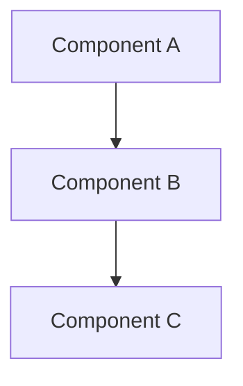
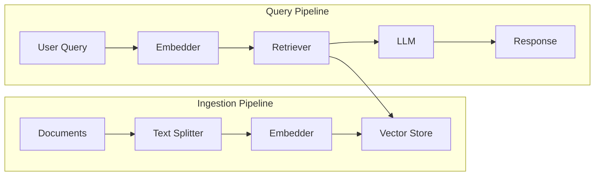

# Write Guide

This skill guides you through writing a comprehensive guide for Beluga AI following "The Teacher" documentation persona.

## Prerequisites

- Topic to document
- Working code examples
- Understanding of target audience

## Persona: "The Teacher"

**Characteristics**:
- Patient, structured, thorough
- Explains *why*, not just *how*
- Builds complexity gradually
- Uses real-world production examples

## Steps

### 1. Define Guide Scope

```markdown
## Guide Planning

**Title**: [Guide title]

**Target Audience**:
- [ ] New to Beluga AI
- [ ] Experienced Go developers
- [ ] Production deployments

**Prerequisites**:
1. [What reader should know]
2. [What should be installed]

**Learning Objectives**:
1. [What reader will learn]
2. [What reader will be able to do]

**Estimated Time**: [X minutes/hours]
```

### 2. Structure the Guide

Use this template:

```markdown
# [Guide Title]

## Overview

[1-2 paragraphs explaining what this guide covers and why it matters]

## Why [Topic]?

[Production context - why is this important in real applications?]

### Use Cases
- [Use case 1]
- [Use case 2]

## Prerequisites

Before starting, ensure you have:
- Go 1.24+
- [Other requirements]

## Architecture

[High-level explanation with Mermaid diagram]



## Getting Started

### Step 1: [First Step]

[Explanation of what we're doing and why]

```go
// Complete, working code
package main

import (
    "context"
    "github.com/lookatitude/beluga-ai/pkg/example"
)

func main() {
    // Create component with explanation
    component := example.NewComponent(
        example.WithTimeout(30 * time.Second),
    )
    // ...
}
```

> [!TIP]
> [Pro tip about this step]

### Step 2: [Second Step]

[Continue building complexity]

## Advanced Configuration

### [Advanced Topic 1]

[Detailed explanation with code]

### [Advanced Topic 2]

[Detailed explanation with code]

## Production Considerations

### Performance
- [Consideration 1]
- [Consideration 2]

### Monitoring
[How to monitor this in production]

### Error Handling
[Production error handling patterns]

## Comparison: [Alternative Approaches]

| Approach | Use Case | Pros | Cons |
|----------|----------|------|------|
| [A] | [When] | [+] | [-] |
| [B] | [When] | [+] | [-] |

## Troubleshooting

### Common Issues

#### [Issue 1]
**Symptom**: [What you see]
**Cause**: [Why it happens]
**Solution**: [How to fix]

## Next Steps

- [Link to related guide]
- [Link to API reference]
- [Link to examples]

## Summary

[Key takeaways from this guide]
```

### 3. Write Content

#### Opening Section

```markdown
# Building RAG Pipelines with Beluga AI

## Overview

Retrieval-Augmented Generation (RAG) combines the power of large language models
with your organization's knowledge base. This guide walks you through building
production-ready RAG pipelines using Beluga AI's retriever and vector store
components.

By the end of this guide, you'll understand how to:
- Index documents into a vector store
- Configure retrievers for optimal performance
- Chain retrieval with LLM generation
- Monitor and optimize your RAG pipeline

## Why RAG?

Large language models have impressive capabilities, but they can't access your
private data or stay current with rapidly changing information. RAG solves this
by retrieving relevant context at query time, then using it to inform the LLM's
response.

In production environments, RAG enables:
- **Customer support bots** that reference product documentation
- **Internal assistants** that search company wikis
- **Research tools** that query domain-specific literature
```

#### Code Examples

Always include complete, working code:

```go
package main

import (
    "context"
    "log"

    "github.com/lookatitude/beluga-ai/pkg/embeddings"
    "github.com/lookatitude/beluga-ai/pkg/retrievers"
    "github.com/lookatitude/beluga-ai/pkg/vectorstores"
)

func main() {
    ctx := context.Background()

    // Step 1: Create embedding provider
    // We use OpenAI embeddings for high-quality semantic search
    embedder, err := embeddings.NewProvider(ctx, "openai", embeddings.Config{
        Model: "text-embedding-3-small",
    })
    if err != nil {
        log.Fatalf("Failed to create embedder: %v", err)
    }

    // Step 2: Create vector store
    // PgVector provides persistent storage with PostgreSQL
    store, err := vectorstores.NewProvider(ctx, "pgvector", vectorstores.Config{
        ConnectionString: "postgres://localhost/vectors",
        Dimensions:       1536, // Must match embedding model
    })
    if err != nil {
        log.Fatalf("Failed to create vector store: %v", err)
    }

    // Step 3: Create retriever
    // Configure for production: top 5 results, minimum similarity 0.7
    retriever := retrievers.NewVectorStoreRetriever(
        store,
        retrievers.WithTopK(5),
        retrievers.WithMinSimilarity(0.7),
    )

    // Use the retriever...
}
```

#### Pro Tips (GitHub Alerts)

```markdown
> [!TIP]
> For production deployments, always set a minimum similarity threshold to
> avoid returning irrelevant results. A value of 0.7 is a good starting point.

> [!NOTE]
> The embedding dimensions must match your embedding model. OpenAI's
> text-embedding-3-small produces 1536-dimensional vectors.

> [!IMPORTANT]
> Always validate your PostgreSQL connection string in production. Use
> environment variables, never hardcode credentials.

> [!WARNING]
> Large batch indexing operations can exhaust memory. Use streaming indexing
> for documents larger than 10MB.

> [!CAUTION]
> Never expose your vector store connection string in client-side code.
```

### 4. Add Diagrams

Use Mermaid for architecture:

```markdown

```

### 5. Review Checklist

Before publishing:

- [ ] Title is descriptive and searchable
- [ ] Overview explains value proposition
- [ ] "Why" section provides production context
- [ ] Prerequisites are complete and accurate
- [ ] Code examples compile and run
- [ ] Each step has explanation of *why*
- [ ] Pro tips use correct alert syntax
- [ ] Mermaid diagrams render correctly
- [ ] Comparison table for alternatives
- [ ] Troubleshooting section covers common issues
- [ ] Next steps link to related content
- [ ] Summary captures key takeaways

## Output

A comprehensive guide with:
- Production-focused context
- Step-by-step instructions with explanations
- Complete, tested code examples
- Architecture diagrams
- Pro tips and warnings
- Troubleshooting section
- Links to related content
