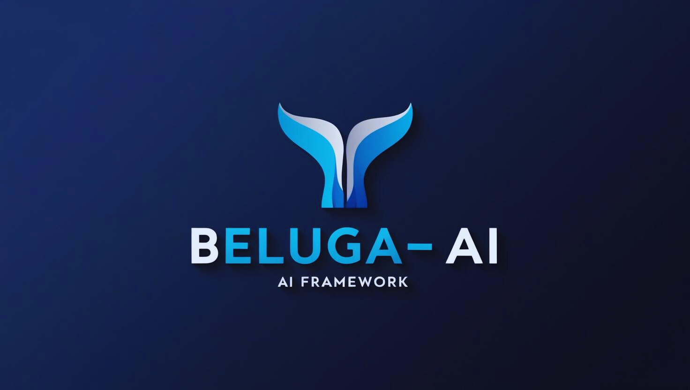

<p align="center">
  
</p>

<h1 align="center">Beluga AI</h1>

<p align="center">
  <strong>The Go-native framework for building production AI agents.</strong>
</p>

<p align="center">
  <a href="https://pkg.go.dev/github.com/lookatitude/beluga-ai/v2"></a>
  <a href="https://goreportcard.com/report/github.com/lookatitude/beluga-ai/v2"></a>
  
  <a href="LICENSE"></a>
  
  
</p>

<p align="center">
  <a href="https://beluga-ai.org">Website</a> &middot;
  <a href="https://beluga-ai.org/docs">Documentation</a> &middot;
  <a href="docs/architecture/01-overview.md">Architecture</a> &middot;
  <a href="#contributing">Contribute</a>
</p>

<br>

## What is Beluga AI?

Beluga AI is a **Go-native framework** for building, deploying, and operating agentic AI systems. It ships every building block a real production agent needs — LLM abstraction, tool calling, multi-agent orchestration, memory, RAG, voice, guards, durable workflows, evaluation, and observability — organised behind a small set of **consistent extension patterns** so the whole framework is learnable in an afternoon.

Beluga distills production patterns from **Google ADK**, **OpenAI Agents SDK**, **LangGraph**, **ByteDance Eino**, **MemGPT**, and **LiveKit** into idiomatic Go 1.23+ code. Streams are `iter.Seq2[Event[T], error]` — no channels, no callbacks, no hidden goroutines. Every pluggable component follows the same contract: **interface → registry → middleware → hooks**.

> Zero-config imports, zero runtime reflection, zero `interface{}` in public APIs, and zero external deps in `core/` and `schema/` beyond stdlib + OpenTelemetry.

<br>

## Why Beluga?

- **Go-native, end-to-end.** You don't drop into Python for the "agent brain" and Go for the server. One language, one binary, one deploy.
- **Production first.** OTel GenAI spans at every boundary. Circuit breakers, hedging, rate limits, and cost accounting are middleware — not roadmap items.
- **Uniform extension model.** Learn one pattern (`Register` → `New` → wrap with `ApplyMiddleware` → compose `Hooks`) and every package is immediately approachable.
- **Streaming you can reason about.** `iter.Seq2[Event[T], error]` composes like any other Go iterator. Cancellation propagates through `context.Context` — no leaked goroutines, ever.
- **No magic.** No reflection-based registration, no YAML provider lists, no hidden globals. Imports do what they say; `init()` registers providers; `go vet` catches the layering rule.
- **Batteries without lock-in.** Use one capability or all of them. `core/` compiles without a single cloud SDK on your `GOPATH`.

<br>

## Key Features

<table>
<tr><td width="50%" valign="top">

### LLM Abstraction
Unified `ChatModel` interface across [**22 LLM providers**](docs/reference/providers.md) — OpenAI, Anthropic, Google Gemini, AWS Bedrock, Azure OpenAI, Ollama, Groq, Mistral, DeepSeek, xAI, Cohere, Together, Fireworks, OpenRouter, Perplexity, Qwen, Cerebras, SambaNova, HuggingFace, LiteLLM, and more. Smart routing, structured output, context-window management, prompt cache optimisation.

### Agent Framework
Pluggable reasoning via the `Planner` interface: **ReAct**, **Reflexion**, **Self-Discover**, **Tree-of-Thought**, **Graph-of-Thought**, **LATS**, **MindMap**, and **Mixture of Agents** — all shipped, all swappable, all behind the same 4-method interface.

### Code-as-Action Agents (CodeAct) <sup>[planned](docs/feature-status.md)</sup>
Agents that generate and execute code as their primary action — strictly sandboxed, deterministic, and composable with the standard `Planner` + `Executor` loop. The right tool when "call tool X with args Y" is too coarse.

### Tool System
Wrap any Go function as a tool with **automatic JSON Schema** generation from struct tags. First-class MCP client. Parallel DAG execution for independent calls. Built-in tools for HTTP, SQL, shell, filesystem, GitHub, and arXiv, each with allowlist enforcement.

### Computer Use & Browser Automation <sup>[planned](docs/feature-status.md)</sup>
Native **Computer Use** tools for agents that drive real browsers: click, type, scroll, screenshot, navigate, key-press — all behind allowlisted hosts and capability checks. Works with both screenshot-based models (Anthropic Computer Use) and structured-action backends.

### Multi-Agent Orchestration
Five first-class patterns — **Supervisor**, **Handoff**, **Scatter-Gather**, **Pipeline**, **Blackboard** — plus DAG workflows and conditional routing. Teams *are* agents (recursive composition), and handoffs appear as auto-generated `transfer_to_{name}` tools.

### RAG Pipeline
**Hybrid search** (vector + BM25 + RRF fusion) by default. Advanced retrieval: **CRAG**, **Adaptive RAG**, **HyDE**, **SEAL-RAG**, **GraphRAG**. 12+ vector stores, 8+ embedding providers, contextual-retrieval ingestion with automatic chunking and enrichment.

### Voice AI
Frame-based pipeline in three modes — **cascading** (STT → LLM → TTS), **speech-to-speech** (OpenAI Realtime, Gemini Live, Amazon Nova), and hybrid. Silero VAD, semantic turn detection, sub-800 ms end-to-end target.

</td><td width="50%" valign="top">

### Memory
**MemGPT three-tier model**: *Core* (always in context, self-editable), *Recall* (searchable conversation history), *Archival* (vector + graph long-term knowledge). Hybrid store for ~90% token savings versus naive context-stuffing.

### Protocol Interop
**MCP** server and client (Streamable HTTP). **A2A** server and client (protobuf + gRPC) with `AgentCard` discovery at `/.well-known/agent.json`. REST/SSE/WebSocket/gRPC adapters for Gin, Fiber, Echo, Chi, and Connect-Go.

### Safety & Guards
Three-stage guard pipeline: **Input → Output → Tool**. Prompt-injection detection, PII redaction, content moderation, Spotlighting for untrusted content isolation, capability-based sandboxing with default-deny. Providers for Lakera, NeMo Guardrails, LLM Guard, Guardrails AI, Azure AI Content Safety.

### Durable Execution
Built-in workflow engine separating deterministic orchestration from non-deterministic activities (LLM calls, tool invocations). **Survives crashes, rate limits, and human-in-the-loop pauses.** Temporal and NATS providers ship in the box.

### Evaluation
CI/CD-integrated evaluation runner with built-in metrics (faithfulness, relevance, hallucination, toxicity, latency, cost) and Ragas/Braintrust/DeepEval providers. A dedicated **LLM-as-Judge** sub-package with rubric-based scoring and batch evaluation is <sup>[planned](docs/feature-status.md)</sup>.

### Resilience
Circuit breakers, hedged requests, adaptive retry with jitter, provider-aware rate limiting (RPM, TPM, concurrent) — all composable as middleware on any `ChatModel`, `Tool`, or `Retriever`.

### Observability
**OpenTelemetry GenAI** semantic conventions baked into every boundary via a `WithTracing()` middleware shipped by every extensible package. Traces, metrics, structured slog. Adapters for Langfuse and Arize Phoenix.

### CLI & Scaffolding (`beluga`) <sup>[planned](docs/feature-status.md)</sup>
One-command project scaffolding, provider tests, and development helpers. `beluga new my-agent`, `beluga test llm openai`, `beluga run ./agent.yaml` — ergonomic bootstrap for new contributors. Not yet merged to `main`; see [PR #234](https://github.com/lookatitude/beluga-ai/pull/234).

### Agent Playground <sup>[planned](docs/feature-status.md)</sup>
A built-in **chat UI** and playground for inspecting agents live — tool calls, planner traces, memory state, and token usage without wiring your own frontend. Not yet merged to `main`; see [PR #232](https://github.com/lookatitude/beluga-ai/pull/232).

</td></tr>
</table>

**Plus:** generics-based configuration with hot-reload (file, Consul, etcd, K8s) · RBAC/ABAC/capability-based auth with multi-tenant context scoping · HITL approval policies with Slack/email/webhook dispatch · prompt management and versioning with cache-aware templating.

<br>

## Quick Start

```go
package main

import (
    "context"
    "fmt"
    "os"

    "github.com/lookatitude/beluga-ai/v2/agent"
    "github.com/lookatitude/beluga-ai/v2/config"
    "github.com/lookatitude/beluga-ai/v2/llm"
    "github.com/lookatitude/beluga-ai/v2/tool"

    _ "github.com/lookatitude/beluga-ai/v2/llm/providers/openai"
)

func main() {
    ctx := context.Background()

    // 1. Create an LLM — providers self-register via init()
    model, err := llm.New("openai", config.ProviderConfig{
        Provider: "openai",
        APIKey:   os.Getenv("OPENAI_API_KEY"),
        Model:    "gpt-4o",
    })
    if err != nil {
        panic(err)
    }

    // 2. Define a tool from a typed Go function — schema is auto-generated
    type WeatherInput struct {
        City string `json:"city" description:"City name" required:"true"`
    }
    weather := tool.NewFuncTool("get_weather", "Get current weather",
        func(ctx context.Context, in WeatherInput) (*tool.Result, error) {
            return tool.TextResult(fmt.Sprintf("72°F and sunny in %s", in.City)), nil
        },
    )

    // 3. Compose an agent
    a := agent.New("assistant",
        agent.WithLLM(model),
        agent.WithTools([]tool.Tool{weather}),
        agent.WithPersona(agent.Persona{
            Role: "Helpful weather assistant",
            Goal: "Provide accurate weather information",
        }),
    )

    // 4a. Collect-style: Invoke() waits for the full response
    result, err := a.Invoke(ctx, "What's the weather in San Francisco?")
    if err != nil {
        panic(err)
    }
    fmt.Println(result)

    // 4b. Stream-style: iter.Seq2 event stream — the canonical API
    for event, err := range a.Stream(ctx, "What's the weather in Tokyo?") {
        if err != nil {
            fmt.Fprintf(os.Stderr, "error: %v\n", err)
            break
        }
        switch event.Type {
        case agent.EventText:
            fmt.Print(event.Text)
        case agent.EventToolCall:
            fmt.Printf("\n[calling %s]\n", event.ToolCall.Name)
        }
    }
    fmt.Println()
}
```

> **Coming soon:** a `beluga` CLI is planned ([PR #234](https://github.com/lookatitude/beluga-ai/pull/234)) that will provide `beluga new`, `beluga test`, and `beluga run` commands. It is not yet available on `main`.

<br>

## Installation

```bash
go get github.com/lookatitude/beluga-ai/v2@latest
```

Import only the providers you need — they self-register via `init()`:

```go
import (
    _ "github.com/lookatitude/beluga-ai/v2/llm/providers/openai"
    _ "github.com/lookatitude/beluga-ai/v2/llm/providers/anthropic"
    _ "github.com/lookatitude/beluga-ai/v2/llm/providers/gemini"
    _ "github.com/lookatitude/beluga-ai/v2/rag/embedding/providers/openai"
    _ "github.com/lookatitude/beluga-ai/v2/rag/vectorstore/providers/pgvector"
)
```

Then instantiate via the registry:

```go
model, err    := llm.New("openai", cfg)
embedder, err := embedding.New("openai", cfg)
store, err    := vectorstore.New("pgvector", cfg)
```

<br>

## Architecture

Beluga is organised in **seven layers**. Data flows downward through typed event streams; each layer depends only on the layers below it — a rule enforced by `/arch-validate` and by `go vet`.

```
  Layer 7 — Application             User code · CLIs · API servers · K8s CRDs
  Layer 6 — Agent runtime           Runner → Agent → Executor (Plan · Act · Observe · Replan)
  Layer 5 — Orchestration           Supervisor · Handoff · Scatter-Gather · Pipeline · Blackboard
  Layer 4 — Protocol gateway        MCP · A2A · REST/SSE · gRPC · WebSocket
  Layer 3 — Capability              LLM · Tool · Memory · RAG · Voice · Guard · Prompt · Eval · Cache · HITL
  Layer 2 — Cross-cutting           Resilience · Auth · Audit · Cost · State · Sandbox · Workflow
  Layer 1 — Foundation              core · schema · config · o11y
```

Full explanation, with diagrams and the dependency graph, lives in [`docs/architecture/`](docs/architecture/README.md) — start at [01 — Overview](docs/architecture/01-overview.md).

### The Extension Pattern

Every extensible package follows the same four-ring contract — learn it once, apply it everywhere:

```go
// Ring 1: Interface (small, focused, ≤ 4 methods)
type ChatModel interface { /* ... */ }

// Ring 2: Registry — Register() in init(), New() at runtime
llm.Register("openai", factory)
model, err := llm.New("openai", cfg)

// Ring 3: Middleware — func(T) T, applied outside-in
model = llm.ApplyMiddleware(model,
    llm.WithRetry(3),
    llm.WithRateLimit(rpm, tpm),
    llm.WithTracing(),        // OTel GenAI spans, shipped by every package
    llm.WithCache(cache),
)

// Ring 4: Hooks — fine-grained lifecycle callbacks, nil-safe
model.SetHooks(llm.ComposeHooks(auditHooks, costHooks, guardrailHooks))
```

### Package Map

<details>
<summary><strong>Full Package Map</strong></summary>

```
beluga-ai/
├── core/             Foundation: Stream, Runnable, Lifecycle, Errors, Tenant
├── schema/           Shared types: Message, ContentPart, Tool, Document, Session
├── config/           Configuration: Load[T], Validate, hot-reload (file/Consul/etcd/K8s)
├── o11y/             Observability: OTel GenAI conventions, slog, adapters
├── llm/              ChatModel, routing, structured output, context manager
│   └── providers/    openai, anthropic, gemini, bedrock, azure, ollama, groq,
│                     mistral, deepseek, xai, cohere, together, fireworks, …
├── tool/             Tool, FuncTool, MCP client, registry, middleware, hooks
│   ├── sandbox/      Capability-based tool sandboxing
│   ├── computeruse/  Browser and computer-use tools [planned — PR #218]
│   └── learning/     Tool-use telemetry and feedback loops
├── memory/           3-tier MemGPT model + graph store
│   └── stores/       inmemory, redis, postgres, sqlite, neo4j, memgraph
├── rag/
│   ├── embedding/    Embedder interface + providers
│   ├── vectorstore/  12+ providers (pgvector, pinecone, weaviate, qdrant, …)
│   ├── retriever/    Hybrid, CRAG, HyDE, Adaptive, SEAL-RAG, GraphRAG, ensemble
│   ├── loader/       PDF, HTML, web, CSV, JSON, docx, Confluence, Notion
│   └── splitter/     Recursive + markdown splitters
├── agent/            BaseAgent, Planner (ReAct, ToT, GoT, LATS, MoA, MindMap, …)
│   ├── codeact/      Code-as-Action agents (CodeAct pattern) [planned — PR #243]
│   ├── cognitive/    Cognitive architectures [experimental]
│   ├── metacognitive/ Self-reflective planners [experimental]
│   ├── evolving/     Self-modifying agents [experimental]
│   ├── speculative/  Speculative decoding for agents [experimental]
│   ├── plancache/    Plan-level caching
│   └── workflow/     SequentialAgent, ParallelAgent, LoopAgent
├── voice/
│   ├── stt/          Deepgram, AssemblyAI, Whisper, ElevenLabs, Groq, Gladia
│   ├── tts/          ElevenLabs, Cartesia, OpenAI, PlayHT, Groq, Fish, LMNT
│   ├── s2s/          OpenAI Realtime, Gemini Live, Amazon Nova
│   └── transport/    WebSocket, LiveKit, Daily
├── orchestration/    Supervisor, Handoff, Scatter-Gather, Pipeline, Blackboard, Router
├── workflow/         Durable execution engine + Temporal, NATS providers
├── protocol/         MCP server/client, A2A server/client, REST
├── guard/            Input → Output → Tool guard pipeline (Lakera, NeMo, LLM Guard, …)
├── resilience/       Circuit breaker, hedge, retry, rate limit
├── cache/            Exact, semantic, prompt caches
├── hitl/             Confidence-based approval, Slack/email/webhook dispatch
├── auth/             RBAC, ABAC, capability-based, OPA integration
├── eval/
│   ├── metrics/      Faithfulness, relevance, hallucination, toxicity, cost, latency
│   ├── judge/        LLM-as-Judge with rubrics and consistency checks
│   ├── trajectory/   Trajectory evaluation
│   ├── simulation/   Simulated user interactions
│   ├── redteam/      Adversarial evaluation
│   └── providers/    Ragas, Braintrust, DeepEval
├── state/            Shared agent state with Watch
├── prompt/           Prompt management and versioning
├── server/           HTTP adapters: Gin, Fiber, Echo, Chi, gRPC, Connect-Go
├── cmd/beluga/       `beluga` CLI — scaffold, test providers, run playground [planned — PR #234]
├── website/          Documentation site + Agent Playground UI [planned — PR #232]
└── internal/         syncutil, jsonutil, testutil (mocks for every interface)
```

</details>

<br>

## Documentation

Full documentation, tutorials, and API reference live at **[beluga-ai.org](https://beluga-ai.org/docs)**.

| Resource | Description |
|---|---|
| **[Getting Started](https://beluga-ai.org/docs/getting-started)** | Installation, quick start, first agent |
| **[Guides](https://beluga-ai.org/docs/guides)** | LLM providers, agents, tools, RAG, voice, memory, orchestration |
| **[Cookbooks](https://beluga-ai.org/docs/cookbooks)** | Multi-agent customer service, RAG pipeline, voice assistant |
| **[Architecture](docs/architecture/README.md)** | 18 deep-dive documents — design decisions, extensibility patterns, data flows |
| **[Patterns](docs/patterns/README.md)** | The 8 reusable patterns every Beluga package uses |
| **[Reference](docs/reference/providers.md)** | Providers catalog, configuration surface, glossary |

<br>

## Contributing

**We want to build Beluga with you.** The codebase is big but navigable — every package uses the same four-ring extension pattern, every interface is ≤ 4 methods, every package has a `doc.go`, and every public API has a test alongside it.

### Great first contributions

- **Add a provider.** Implement a new LLM, embedding, vector store, STT/TTS, or guard provider. [Provider Template](docs/patterns/provider-template.md) walks through it end-to-end — you'll only touch one subdirectory.
- **Write a cookbook.** Real-world end-to-end examples help other users more than anything. See [`docs/guides/`](docs/guides/) for the house style.
- **Ship a built-in tool.** New entries under `tool/builtin/` (calendar, drive, browser, database — pick your itch).
- **Expand the eval suite.** New metrics in `eval/metrics/` or new judges in `eval/judge/`.
- **Improve docs.** If something confused you, a PR fixing the wording is a high-value contribution.

### Ground rules

1. **Every change gets a branch and a PR.** Never commit directly to `main`.
2. **Red/Green TDD.** Failing test first, then the implementation.
3. **Pre-commit gate** (run before every commit, not just push):
   ```bash
   go build ./...
   go vet ./...
   go test -race ./...
   go mod tidy && git diff --exit-code go.mod go.sum
   gofmt -l .
   golangci-lint run ./...
   gosec -quiet ./...
   govulncheck ./...
   ```
4. **Follow the layering rule.** Layer N imports only from Layers 1…N−1. `go vet` and [`/arch-validate`](.claude/commands/arch-validate.md) enforce it.
5. **OpenTelemetry GenAI spans at every boundary.** The `WithTracing()` middleware pattern is non-optional — see [DOC-14](docs/architecture/14-observability.md).
6. **No `interface{}` in public APIs.** Use generics.

Full contributor guide: [`CLAUDE.md`](CLAUDE.md) (AI-agent and human contributors alike) and [`.claude/rules/`](.claude/rules/).

### Development setup

```bash
git clone https://github.com/lookatitude/beluga-ai.git
cd beluga-ai
go mod download
go test -race ./...           # should be fully green
```

### Community

- **Discussions:** [GitHub Discussions](https://github.com/lookatitude/beluga-ai/discussions) — ideas, Q&A, show-and-tell
- **Issues:** [GitHub Issues](https://github.com/lookatitude/beluga-ai/issues) — bugs and concrete feature requests
- **Security:** see [SECURITY.md](SECURITY.md) for responsible disclosure

<br>

## License

Released under the [MIT License](LICENSE).

<br>

---

<p align="center">
  <sub>Built in the open. Powered by Go. Star the repo if Beluga is useful to you — it helps others find it.</sub>
</p>

<p align="center">
  <a href="https://sonarcloud.io/summary/new_code?id=lookatitude_beluga-ai">
    
  </a>
</p>
