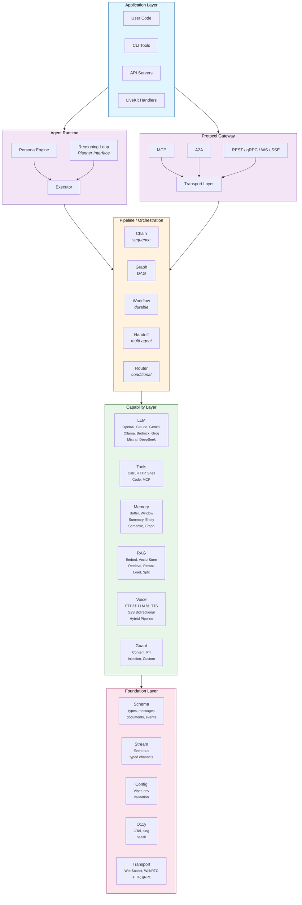
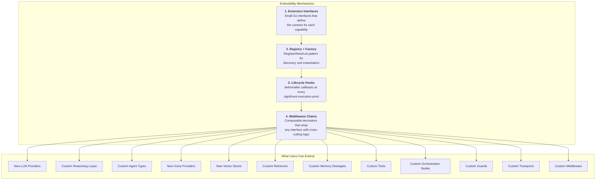
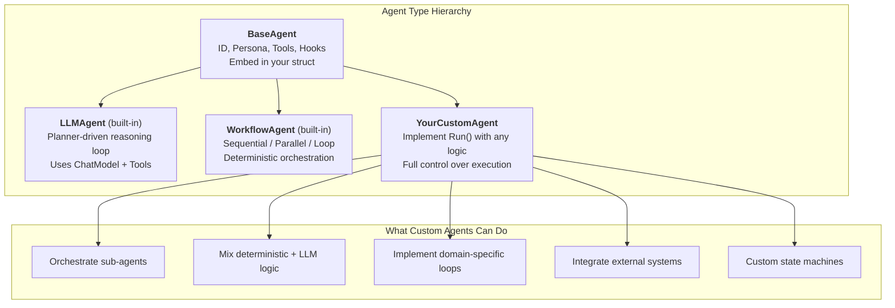
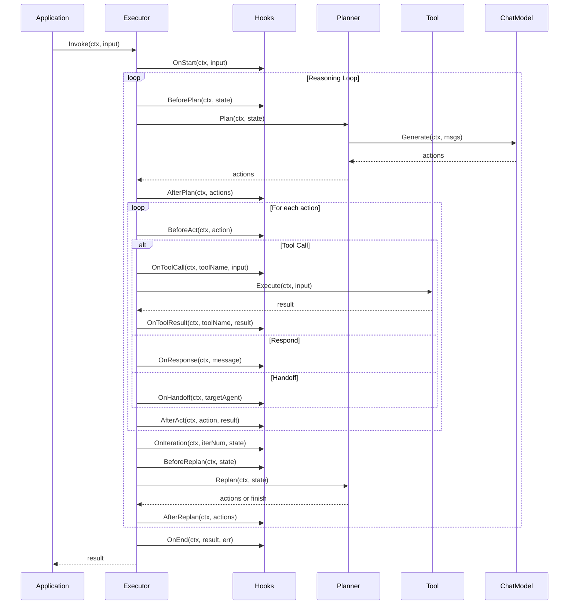
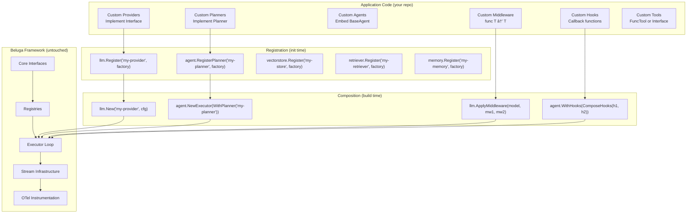

# Beluga AI v2 — Architecture Redesign

## Executive Summary

This document proposes a ground-up redesign of the Beluga AI framework, informed by the latest advances in agentic AI (A2A protocol, MCP, bidirectional streaming, multimodal agents) and production patterns from LiveKit, Google ADK, LangGraph, and CrewAI. The redesign prioritises **composability**, **streaming-first design**, **protocol interoperability**, and **idiomatic Go**.

---

## 1. Design Principles

| # | Principle | Rationale |
|---|-----------|-----------|
| 1 | **Streaming-first** | Every component is a stream processor. Request/response is a degenerate case of streaming. |
| 2 | **Composition over inheritance** | Small interfaces composed via embedding. No deep hierarchies. |
| 3 | **Extensible by default** | Every package exposes extension interfaces, a registry, and lifecycle hooks. New providers, reasoning strategies, and agent types are added from application code — zero framework changes required. The framework is a host; everything else is a plugin. |
| 4 | **Protocol-native** | First-class MCP (tool access) and A2A (agent collaboration) support. |
| 5 | **Modality-agnostic** | Text, audio, video, and structured data flow through the same pipeline abstractions. |
| 6 | **Minimal core, rich ecosystem** | Core defines contracts; providers are pluggable packages imported by the user. |
| 7 | **Observable by default** | OpenTelemetry traces/metrics/logs baked into every boundary. |
| 8 | **Context-driven** | `context.Context` carries cancellation, tracing, session, and auth throughout. |

---

## 2. High-Level Architecture



---

## 3. Module / Package Layout

```
beluga-ai/
├── go.mod
│
├── core/                    # Foundation — zero external deps beyond stdlib + otel
│   ├── stream.go            # Event[T], Stream[T], Fan-in/Fan-out, Pipe()
│   ├── runnable.go          # Runnable interface (Invoke, Stream, Batch)
│   ├── context.go           # Session context, cancel propagation
│   ├── errors.go            # Typed error codes, Is/As helpers
│   └── option.go            # Functional options helpers
│
├── schema/                  # Shared types — no business logic
│   ├── message.go           # Message interface, HumanMsg, AIMsg, SystemMsg, ToolMsg
│   ├── content.go           # ContentPart: Text, Image, Audio, Video, File
│   ├── tool.go              # ToolCall, ToolResult, ToolDefinition
│   ├── document.go          # Document with metadata
│   ├── event.go             # AgentEvent, StreamEvent, LifecycleEvent
│   └── session.go           # Session, Turn, ConversationState
│
├── config/                  # Configuration loading
│   ├── config.go            # Load, Validate, env + file + struct tags
│   └── provider.go          # ProviderConfig base type
│
├── o11y/                    # Observability (replaces "monitoring")
│   ├── tracer.go            # OTel tracer wrapper
│   ├── meter.go             # OTel meter wrapper
│   ├── logger.go            # Structured logging (slog)
│   └── health.go            # Health checks
│
├── llm/                     # LLM abstraction
│   ├── llm.go               # ChatModel interface
│   ├── options.go           # GenerateOptions (temp, max_tokens, tools, etc.)
│   ├── registry.go          # Register(), New(), List() — provider registry
│   ├── hooks.go             # LLM-level hooks (BeforeGenerate, AfterGenerate, etc.)
│   ├── middleware.go         # Retry, rate-limit, cache, logging middleware
│   └── providers/
│       ├── openai/           # OpenAI + Azure OpenAI
│       ├── anthropic/        # Claude models
│       ├── google/           # Gemini + Vertex AI
│       ├── ollama/           # Local models
│       ├── bedrock/          # AWS Bedrock
│       └── groq/             # Fast inference
│
├── tool/                    # Tool system
│   ├── tool.go              # Tool interface: Name, Description, Schema, Execute
│   ├── functool.go          # NewFuncTool() — wrap any Go function as a Tool
│   ├── registry.go          # ToolRegistry: Add, Get, List, Remove
│   ├── hooks.go             # Tool hooks (BeforeExecute, AfterExecute, OnError)
│   ├── mcp.go               # MCP client — discovers & wraps MCP servers as Tools
│   ├── builtin/              # Calculator, HTTP, Shell, Code execution
│   └── middleware.go         # Auth, rate-limit, timeout wrappers
│
├── memory/                  # Conversation & knowledge memory
│   ├── memory.go            # Memory interface: Save, Load, Search, Clear
│   ├── registry.go          # Register(), New(), List()
│   ├── store.go             # MessageStore interface (backend abstraction)
│   ├── hooks.go             # Memory hooks (BeforeSave, AfterLoad, etc.)
│   ├── middleware.go         # Memory middleware (trace, cache, etc.)
│   ├── buffer.go            # Full-history buffer
│   ├── window.go            # Sliding window (last N turns)
│   ├── summary.go           # LLM-summarised history
│   ├── entity.go            # Entity extraction & tracking
│   ├── semantic.go          # Vector-backed semantic memory
│   ├── composite.go         # CompositeMemory: Working + Episodic + Semantic
│   └── stores/
│       ├── inmemory/
│       ├── redis/
│       ├── postgres/
│       └── sqlite/
│
├── rag/                     # RAG pipeline
│   ├── embedding/
│   │   ├── embedder.go      # Embedder interface
│   │   ├── registry.go      # Register(), New(), List()
│   │   ├── hooks.go         # BeforeEmbed, AfterEmbed
│   │   └── providers/
│   │       ├── openai/
│   │       ├── google/
│   │       ├── ollama/
│   │       └── cohere/
│   ├── vectorstore/
│   │   ├── store.go          # VectorStore interface: Add, Search, Delete
│   │   ├── registry.go       # Register(), New(), List()
│   │   ├── hooks.go          # BeforeAdd, AfterSearch
│   │   └── providers/
│   │       ├── inmemory/
│   │       ├── pgvector/
│   │       ├── qdrant/
│   │       ├── pinecone/
│   │       └── chroma/
│   ├── retriever/
│   │   ├── retriever.go      # Retriever interface
│   │   ├── registry.go       # Register(), New(), List()
│   │   ├── hooks.go          # BeforeRetrieve, AfterRetrieve, OnRerank
│   │   ├── middleware.go     # Retriever middleware (cache, trace, etc.)
│   │   ├── vector.go         # VectorStoreRetriever
│   │   ├── multiquery.go     # Multi-query expansion
│   │   ├── rerank.go         # Re-ranking retriever
│   │   └── ensemble.go       # Ensemble retriever
│   ├── loader/
│   │   ├── loader.go         # DocumentLoader interface
│   │   ├── directory.go
│   │   ├── text.go
│   │   └── pdf.go
│   └── splitter/
│       ├── splitter.go       # TextSplitter interface
│       ├── recursive.go
│       └── markdown.go
│
├── agent/                   # Agent runtime
│   ├── agent.go             # Agent interface + BaseAgent embeddable struct
│   ├── base.go              # BaseAgent: ID, Persona, Tools, Children, Card
│   ├── persona.go           # Role, Goal, Backstory (RGB framework)
│   ├── executor.go          # Reasoning loop: delegates to Planner
│   ├── planner.go           # Planner interface + PlannerState + Action types
│   ├── registry.go          # RegisterPlanner(), NewPlanner(), ListPlanners()
│   ├── hooks.go             # Hooks struct + ComposeHooks()
│   ├── middleware.go        # Agent middleware (retry, trace, etc.)
│   ├── react.go             # ReAct planner implementation
│   ├── planexecute.go       # Plan-and-Execute planner implementation
│   ├── reflection.go        # Reflection planner implementation
│   ├── structured.go        # Structured-output agent
│   ├── conversational.go    # Optimised for multi-turn chat
│   ├── handoff.go           # Agent-to-agent handoff within a session
│   ├── card.go              # A2A AgentCard (capability advertisement)
│   └── workflow/             # Built-in workflow agents
│       ├── sequential.go    # SequentialAgent
│       ├── parallel.go      # ParallelAgent
│       └── loop.go          # LoopAgent
│
├── voice/                   # Voice / multimodal pipeline
│   ├── pipeline.go          # VoicePipeline: STT → LLM → TTS (cascading)
│   ├── session.go           # VoiceSession: manages audio state & turns
│   ├── vad.go               # VAD interface
│   ├── stt/
│   │   ├── stt.go           # STT interface (streaming)
│   │   └── providers/
│   │       ├── deepgram/
│   │       ├── assemblyai/
│   │       └── whisper/
│   ├── tts/
│   │   ├── tts.go           # TTS interface (streaming)
│   │   └── providers/
│   │       ├── elevenlabs/
│   │       ├── cartesia/
│   │       └── openai/
│   ├── s2s/
│   │   ├── s2s.go           # S2S interface (bidirectional)
│   │   └── providers/
│   │       ├── openai_realtime/
│   │       ├── gemini_live/
│   │       └── nova/
│   └── transport/
│       ├── transport.go      # AudioTransport interface
│       ├── websocket.go
│       └── livekit.go        # LiveKit room integration
│
├── orchestration/           # Workflow composition
│   ├── node.go              # Node interface (extension point for custom steps)
│   ├── hooks.go             # BeforeStep, AfterStep, OnBranch
│   ├── chain.go             # Sequential pipeline
│   ├── graph.go             # DAG with conditional edges
│   ├── router.go            # Conditional routing (LLM or rule-based)
│   ├── parallel.go          # Fan-out / fan-in
│   ├── workflow.go          # Durable, resumable workflow
│   └── supervisor.go        # Multi-agent supervisor pattern
│
├── protocol/                # External protocol support
│   ├── mcp/
│   │   ├── server.go        # Expose tools as MCP server
│   │   └── client.go        # Connect to MCP servers
│   ├── a2a/
│   │   ├── server.go        # Expose agent as A2A remote agent
│   │   ├── client.go        # Call remote A2A agents
│   │   └── card.go          # AgentCard JSON generation
│   └── rest/
│       └── server.go        # REST/SSE API for agents
│
├── guard/                   # Safety & guardrails
│   ├── guard.go             # Guard interface: Check(input) → (ok, reason)
│   ├── registry.go          # Register(), New(), List()
│   ├── content.go           # Content moderation
│   ├── pii.go               # PII detection
│   └── injection.go         # Prompt injection detection
│
├── server/                  # HTTP framework integration
│   ├── adapter.go           # ServerAdapter interface
│   ├── registry.go          # Register(), New(), List()
│   ├── handler.go           # Standard http.Handler adapter
│   ├── sse.go               # SSE streaming helper
│   └── adapters/
│       ├── gin/             # Gin integration
│       ├── fiber/           # Fiber integration
│       ├── echo/            # Echo integration
│       ├── chi/             # Chi integration
│       └── grpc/            # gRPC service definitions
│
└── internal/                # Shared internal utilities
    ├── syncutil/             # sync primitives, worker pools
    ├── jsonutil/             # JSON schema generation from Go types
    └── testutil/             # Mock providers for every interface, test helpers
        ├── mockllm/          # Mock ChatModel
        ├── mocktool/         # Mock Tool
        ├── mockmemory/       # Mock Memory + MessageStore
        ├── mockembedder/     # Mock Embedder
        ├── mockstore/        # Mock VectorStore
        └── helpers.go        # Assertion helpers, stream builders
```

---

## 4. Core Interfaces

### 4.1 The Event Stream (replaces channel-based streaming)

Everything flows as typed events through a unified `Stream` abstraction. This replaces the v1 pattern of `<-chan any` with type safety and back-pressure.

```go
// core/stream.go

// Event is the unit of data flowing through the system.
// T is the payload type (schema.Message, schema.ContentPart, []byte, etc.)
type Event[T any] struct {
    Type    EventType
    Payload T
    Err     error
    Meta    map[string]any // trace ID, latency, token usage, etc.
}

type EventType string

const (
    EventData     EventType = "data"
    EventToolCall EventType = "tool_call"
    EventToolResult EventType = "tool_result"
    EventDone     EventType = "done"
    EventError    EventType = "error"
)

// Stream is a pull-based iterator over events.
type Stream[T any] interface {
    // Next blocks until the next event is available.
    // Returns false when the stream is exhausted or context is cancelled.
    Next(ctx context.Context) bool
    // Event returns the current event. Only valid after Next() returns true.
    Event() Event[T]
    // Close releases resources. Safe to call multiple times.
    Close() error
}
```

### 4.2 Runnable (execution contract)

```go
// core/runnable.go

// Runnable is the universal execution interface.
// Input and Output are kept as `any` at this level;
// concrete types use type-safe wrappers.
type Runnable interface {
    Invoke(ctx context.Context, input any, opts ...Option) (any, error)
    Stream(ctx context.Context, input any, opts ...Option) (Stream[any], error)
}

// Pipe composes two Runnables sequentially.
func Pipe(a, b Runnable) Runnable { ... }

// Parallel fans out to multiple Runnables and collects results.
func Parallel(runnables ...Runnable) Runnable { ... }
```

### 4.3 ChatModel (LLM interface)

```go
// llm/llm.go

type ChatModel interface {
    // Generate returns a complete response.
    Generate(ctx context.Context, msgs []schema.Message, opts ...GenerateOption) (*schema.AIMessage, error)

    // Stream returns a stream of content chunks + tool calls.
    Stream(ctx context.Context, msgs []schema.Message, opts ...GenerateOption) (core.Stream[schema.StreamChunk], error)

    // BindTools returns a new ChatModel with tools available for function calling.
    BindTools(tools []tool.Tool) ChatModel

    // ModelID returns the provider/model identifier.
    ModelID() string
}
```

### 4.4 Tool

```go
// tool/tool.go

type Tool interface {
    Name() string
    Description() string
    // InputSchema returns the JSON Schema for the tool's input.
    InputSchema() map[string]any
    // Execute runs the tool. Input is the parsed JSON arguments.
    Execute(ctx context.Context, input map[string]any) (*ToolResult, error)
}

type ToolResult struct {
    Content []schema.ContentPart // text, image, audio, etc.
    Err     error
}
```

### 4.5 Memory

```go
// memory/memory.go

type Memory interface {
    // Save persists a conversation turn.
    Save(ctx context.Context, input schema.Message, output schema.Message) error
    // Load returns memory-augmented context for the next turn.
    Load(ctx context.Context, query string) ([]schema.Message, error)
    // Search finds relevant past interactions (semantic).
    Search(ctx context.Context, query string, k int) ([]schema.Document, error)
    // Clear wipes memory for a session.
    Clear(ctx context.Context) error
}
```

### 4.6 Agent

```go
// agent/agent.go

// Agent is the interface all agents implement. Custom agents embed BaseAgent
// to get identity, hooks, and protocol support, then implement Invoke/Stream.
type Agent interface {
    core.Runnable

    // ID returns the unique agent identifier.
    ID() string
    // Persona returns the agent's role/goal/backstory.
    Persona() Persona
    // Tools returns the agent's available tools.
    Tools() []tool.Tool
    // Children returns sub-agents in the hierarchy.
    Children() []Agent
    // Card returns an A2A-compatible AgentCard.
    Card() a2a.AgentCard
}

// BaseAgent provides the common foundation for all agent types.
// Users embed it in custom agents. See §9.4 for full custom agent examples.
type BaseAgent struct {
    id       string
    persona  Persona
    tools    []tool.Tool
    hooks    Hooks
    children []Agent
}

// Persona defines the agent's identity using the RGB framework.
type Persona struct {
    Role      string   // "Senior Go Engineer"
    Goal      string   // "Review PRs for security issues"
    Backstory string   // "You are paranoid about injection attacks..."
    Traits    []string // additional behavioural hints
}

// Planner defines a pluggable reasoning strategy.
// See §9.3 for the full interface, built-in implementations, and custom examples.
type Planner interface {
    Plan(ctx context.Context, state PlannerState) ([]Action, error)
    Replan(ctx context.Context, state PlannerState) ([]Action, error)
}
```

---

## 5. Key Design Decisions

### 5.1 Streaming-First, Not Streaming-Added

**v1 problem**: Streaming was bolted on via `<-chan any`. Tool calling during streams was fragile.

**v2 approach**: The `Stream[T]` type is the primary return from every layer. `Invoke()` is implemented as "stream, collect, return last." This means tool calls arrive as events mid-stream, and the executor can process them without breaking the stream.

```
User Audio ──► STT Stream ──► LLM Stream ──► [ToolCall Event] ──► Tool Execute ──► [ToolResult Event] ──► LLM continues ──► TTS Stream ──► Audio out
```

### 5.2 Bidirectional Voice Pipeline

Two modes, composable:

**Cascading** (STT → LLM → TTS):
```go
pipe := voice.NewPipeline(
    voice.WithSTT(deepgram.New(cfg)),
    voice.WithLLM(openai.New(cfg)),
    voice.WithTTS(cartesia.New(cfg)),
    voice.WithVAD(silero.New()),
)
```

**S2S** (native audio-in/audio-out):
```go
session := voice.NewS2SSession(
    openai_realtime.New(cfg),
    voice.WithTools(myTools),
)
```

**Hybrid** (S2S for conversation, cascade for tool-heavy turns):
```go
pipe := voice.NewHybridPipeline(
    voice.WithS2S(openai_realtime.New(cfg)),     // default path
    voice.WithCascade(stt, llm, tts),            // fallback for complex tool use
    voice.WithSwitchPolicy(voice.OnToolOverload), // when to switch
)
```

### 5.3 LiveKit Integration

LiveKit is treated as a **transport**, not a framework dependency. The `voice/transport/livekit.go` adapter bridges LiveKit rooms to Beluga's `AudioTransport` interface:

```go
// voice/transport/livekit.go

type LiveKitTransport struct {
    room *lksdk.Room
}

func (t *LiveKitTransport) AudioIn() core.Stream[[]byte]  { ... }
func (t *LiveKitTransport) AudioOut() io.Writer            { ... }
func (t *LiveKitTransport) VideoIn() core.Stream[[]byte]   { ... }

// Usage
transport := livekit.NewTransport(roomURL, token)
pipe := voice.NewPipeline(
    voice.WithTransport(transport),
    voice.WithSTT(deepgram.New(cfg)),
    voice.WithLLM(openai.New(cfg)),
    voice.WithTTS(cartesia.New(cfg)),
)
pipe.Run(ctx)
```

### 5.4 MCP as First-Class Tool Source

MCP servers are discovered and wrapped as native `tool.Tool` instances:

```go
// tool/mcp.go

// FromMCP connects to an MCP server and returns all its tools.
func FromMCP(ctx context.Context, serverURL string, opts ...MCPOption) ([]Tool, error)

// Usage
mcpTools, _ := tool.FromMCP(ctx, "npx @modelcontextprotocol/server-filesystem")
agent := agent.New(
    agent.WithPersona(persona),
    agent.WithLLM(llm),
    agent.WithTools(append(myTools, mcpTools...)),
)
```

### 5.5 A2A for Multi-Agent Collaboration

Agents can be exposed as A2A servers and discovered as remote agents:

```go
// Expose agent as A2A server
a2aServer := a2a.NewServer(myAgent, a2a.WithPort(8080))
go a2aServer.Serve(ctx)

// Use remote agent as a tool/sub-agent
remoteAgent := a2a.NewRemoteAgent("https://agent.example.com/.well-known/agent.json")
supervisor := orchestration.NewSupervisor(
    orchestration.WithAgents(localAgent, remoteAgent),
    orchestration.WithStrategy(orchestration.DelegateBySKill),
)
result, _ := supervisor.Invoke(ctx, task)
```

### 5.6 Memory Architecture

Three tiers matching human cognition:

| Tier | Implementation | Scope | Persistence |
|------|---------------|-------|-------------|
| **Working** (short-term) | `memory.Buffer` / `memory.Window` | Current conversation turns | Session-scoped |
| **Episodic** (medium-term) | `memory.Summary` + `memory.Entity` | Key facts, entities, decisions | Cross-session |
| **Semantic** (long-term) | `memory.Semantic` backed by vector store | Knowledge base, past interactions | Permanent |

```go
mem := memory.NewComposite(
    memory.WithWorking(memory.NewWindow(20)),          // last 20 messages
    memory.WithEpisodic(memory.NewEntity(llm, store)), // entity tracking
    memory.WithSemantic(memory.NewSemantic(vectorstore, embedder)),
)
agent := agent.New(
    agent.WithMemory(mem),
    // ...
)
```

### 5.7 Multimodal Content Model

Messages carry typed content parts, not just strings:

```go
// schema/content.go

type ContentPart interface {
    PartType() ContentType
}

type ContentType string
const (
    ContentText  ContentType = "text"
    ContentImage ContentType = "image"
    ContentAudio ContentType = "audio"
    ContentVideo ContentType = "video"
    ContentFile  ContentType = "file"
)

type TextPart struct { Text string }
type ImagePart struct { Data []byte; MimeType string; URL string }
type AudioPart struct { Data []byte; Format AudioFormat; SampleRate int }
type VideoPart struct { Data []byte; MimeType string; URL string }

// Messages use []ContentPart instead of string
type HumanMessage struct {
    Parts    []ContentPart
    Metadata map[string]any
}
```

---

## 6. Agent Reasoning Patterns

The executor supports **pluggable reasoning strategies** via the `Planner` interface (see §9.3 for the full interface and custom implementation guide). Each strategy is a registered plugin — switch strategies by changing a single string, or write your own.

### 6.1 ReAct (default)
```
Think → Act → Observe → (repeat or finish)
```
Best for: General-purpose tasks, tool-heavy workflows, most common use cases.

### 6.2 Plan-and-Execute
```
Plan all steps → Execute each → Re-plan if needed
```
Best for: Multi-step tasks where upfront planning improves quality. Can use a stronger LLM for planning and a cheaper one for execution.

### 6.3 Reflection
```
Generate → Evaluate → Critique → Regenerate
```
Best for: Quality-sensitive tasks (writing, code review, analysis). Uses a separate evaluator LLM.

### 6.4 Router (conditional dispatch)
```
Classify input → Route to specialist agent → Return result
```
Best for: Multi-domain assistants where different domains need different tools/prompts.

### 6.5 Supervisor (multi-agent)
```
Supervisor receives task → Delegates to workers → Aggregates results
```
Best for: Complex tasks requiring multiple specialists to collaborate.

### 6.6 Custom (user-defined)
```
Implement the Planner interface → Register → Use
```
Best for: Domain-specific reasoning (e.g., Tree-of-Thought, Monte Carlo Tree Search, Constitutional AI self-critique, domain-specific state machines). See §9.3 for a full example.

```go
executor := agent.NewExecutor(
    agent.WithPlanner("react", agent.PlannerConfig{LLM: llm}),
    // OR: "plan-execute", "reflection", "router", "supervisor"
    // OR: "your-custom-planner" (registered via agent.RegisterPlanner)
    agent.WithMaxIterations(15),
    agent.WithTimeout(2 * time.Minute),
    agent.WithHooks(myHooks), // lifecycle hooks (see §9.5)
)
```

---

## 7. Orchestration Patterns

### Chain (sequential)
```go
chain := orchestration.Chain(step1, step2, step3)
result, _ := chain.Invoke(ctx, input)
```

### Graph (DAG with conditions)
```go
g := orchestration.NewGraph()
g.AddNode("classify", classifyAgent)
g.AddNode("technical", techAgent)
g.AddNode("billing", billingAgent)
g.AddEdge("classify", "technical", orchestration.When(isTechnical))
g.AddEdge("classify", "billing", orchestration.When(isBilling))
g.SetEntry("classify")
result, _ := g.Invoke(ctx, input)
```

### Supervisor (multi-agent with handoff)
```go
supervisor := orchestration.NewSupervisor(
    orchestration.WithAgents(researcher, writer, reviewer),
    orchestration.WithLLM(routerLLM), // decides which agent handles each step
)
```

### Parallel (fan-out/fan-in)
```go
p := orchestration.Parallel(agent1, agent2, agent3)
results, _ := p.Invoke(ctx, input) // returns []any
```

---

## 8. Provider Registration

All providers use `init()` auto-registration via a shared registry pattern:

```go
// llm/providers/openai/openai.go
package openai

import "github.com/lookatitude/beluga-ai/llm"

func init() {
    llm.Register("openai", func(cfg llm.ProviderConfig) (llm.ChatModel, error) {
        return New(cfg)
    })
}
```

Usage in application code:
```go
import (
    _ "github.com/lookatitude/beluga-ai/llm/providers/openai"    // registers via init()
    _ "github.com/lookatitude/beluga-ai/llm/providers/anthropic"
)

model, err := llm.New("openai", llm.ProviderConfig{
    APIKey: os.Getenv("OPENAI_API_KEY"),
    Model:  "gpt-4o",
})
```

This pattern is applied uniformly across: `llm`, `rag/embedding`, `rag/vectorstore`, `voice/stt`, `voice/tts`, `voice/s2s`, `memory/stores`.

---

## 9. Extensibility Architecture

Extensibility is a first-class architectural concern, not an afterthought. Beluga v2 follows a **host + plugin** model: the framework defines extension contracts (interfaces) and lifecycle hooks at every package boundary. Users extend behavior from their own application code — no framework forking, monkey-patching, or pull requests required.

The extensibility system is built on four interlocking mechanisms:



### 9.1 The Universal Extension Contract

Every extensible package follows the same structure. This consistency means learning one extension pattern teaches you all of them.

```
<package>/
├── <interface>.go      # The extension contract (Go interface)
├── registry.go         # Register(), New(), List()
├── hooks.go            # Lifecycle hook types
├── middleware.go        # Middleware type + Apply()
└── providers/           # Built-in implementations
    ├── <provider_a>/
    └── <provider_b>/
```

**The four components of every extensible package:**

```go
// 1. EXTENSION INTERFACE — the contract users implement
// Kept deliberately small (1-3 methods). Larger surfaces are composed.
type ChatModel interface {
    Generate(ctx context.Context, msgs []schema.Message, opts ...GenerateOption) (*schema.AIMessage, error)
    Stream(ctx context.Context, msgs []schema.Message, opts ...GenerateOption) (core.Stream[schema.StreamChunk], error)
    BindTools(tools []tool.Tool) ChatModel
    ModelID() string
}

// 2. REGISTRY + FACTORY — discovery and instantiation
type Factory func(cfg ProviderConfig) (ChatModel, error)

var registry = make(map[string]Factory)

func Register(name string, f Factory) { registry[name] = f }
func New(name string, cfg ProviderConfig) (ChatModel, error) {
    f, ok := registry[name]
    if !ok { return nil, fmt.Errorf("llm: unknown provider %q (registered: %v)", name, List()) }
    return f(cfg)
}
func List() []string { /* returns sorted keys */ }

// 3. LIFECYCLE HOOKS — fine-grained interception
type Hooks struct {
    BeforeGenerate func(ctx context.Context, msgs []schema.Message) (context.Context, []schema.Message, error)
    AfterGenerate  func(ctx context.Context, resp *schema.AIMessage, err error) (*schema.AIMessage, error)
    OnStream       func(ctx context.Context, event core.Event[schema.StreamChunk]) core.Event[schema.StreamChunk]
    OnError        func(ctx context.Context, err error) error
}

// 4. MIDDLEWARE — composable decorators
type Middleware func(ChatModel) ChatModel

func ApplyMiddleware(model ChatModel, mws ...Middleware) ChatModel {
    for i := len(mws) - 1; i >= 0; i-- {
        model = mws[i](model)
    }
    return model
}
```

### 9.2 Extension Points — Complete Map

Every package in the framework exposes at least one extension interface. The table below is the definitive map of what can be extended and how.

| Package | Extension Interface | What It Does | Registry Key | Hooks Available |
|---------|-------------------|--------------|--------------|-----------------|
| `llm/` | `ChatModel` | LLM inference (generate + stream) | `"openai"`, `"anthropic"`, ... | BeforeGenerate, AfterGenerate, OnStream, OnToolCall, OnError |
| `tool/` | `Tool` | Execute a named capability | Name-based (ToolRegistry) | BeforeExecute, AfterExecute, OnError |
| `agent/` | `Planner` | Reasoning loop strategy | `"react"`, `"plan-execute"`, ... | BeforePlan, AfterPlan, BeforeAct, AfterAct, BeforeObserve, AfterObserve, OnIteration, OnFinish |
| `agent/` | `Agent` (BaseAgent) | Custom agent with full control | Agent ID registry | OnStart, OnTool, OnHandoff, OnError, OnEnd |
| `memory/` | `Memory` | Conversation memory strategy | `"buffer"`, `"window"`, ... | BeforeSave, AfterSave, BeforeLoad, AfterLoad |
| `memory/stores/` | `MessageStore` | Persistence backend | `"inmemory"`, `"redis"`, ... | — |
| `rag/embedding/` | `Embedder` | Text → vector | `"openai"`, `"google"`, ... | BeforeEmbed, AfterEmbed |
| `rag/vectorstore/` | `VectorStore` | Vector storage + search | `"pgvector"`, `"qdrant"`, ... | BeforeAdd, AfterSearch |
| `rag/retriever/` | `Retriever` | Document retrieval strategy | `"vector"`, `"multiquery"`, ... | BeforeRetrieve, AfterRetrieve, OnRerank |
| `rag/loader/` | `DocumentLoader` | Ingest documents | `"text"`, `"pdf"`, ... | — |
| `rag/splitter/` | `TextSplitter` | Chunk documents | `"recursive"`, `"markdown"`, ... | — |
| `voice/stt/` | `STT` | Speech → text (streaming) | `"deepgram"`, `"assemblyai"`, ... | OnTranscript, OnUtterance |
| `voice/tts/` | `TTS` | Text → speech (streaming) | `"elevenlabs"`, `"cartesia"`, ... | BeforeSynthesize, OnAudioChunk |
| `voice/s2s/` | `S2S` | Speech ↔ speech (bidirectional) | `"openai_realtime"`, ... | OnTurn, OnInterrupt |
| `voice/` | `VAD` | Voice activity detection | `"silero"`, `"webrtc"`, ... | OnSpeechStart, OnSpeechEnd |
| `voice/transport/` | `AudioTransport` | Audio I/O channel | `"websocket"`, `"livekit"`, ... | — |
| `orchestration/` | `Node` | Custom orchestration step | — | BeforeStep, AfterStep |
| `guard/` | `Guard` | Safety check | `"content"`, `"pii"`, ... | — |
| `server/` | `ServerAdapter` | HTTP framework bridge | `"gin"`, `"fiber"`, ... | — |

### 9.3 Custom Reasoning Loops (Planner Interface)

The agent's reasoning strategy is the most critical extension point. The `Planner` interface decouples "how the agent thinks" from "what the agent can do."

```mermaid
graph LR
    subgraph "Agent Executor (framework)"
        A[Receive Input] --> B{Planner.Plan}
        B --> C[Execute Actions]
        C --> D[Collect Observations]
        D --> E{Planner.Replan}
        E -->|continue| C
        E -->|finish| F[Return Result]
    end

    subgraph "Pluggable Planners (user-extensible)"
        P1[ReAct<br/>Think→Act→Observe]
        P2[Plan-and-Execute<br/>Full plan → steps]
        P3[Reflection<br/>Generate→Critique→Refine]
        P4[Tree-of-Thought<br/>Branch→Evaluate→Prune]
        P5[Your Custom Planner<br/>Any reasoning strategy]
    end

    P1 & P2 & P3 & P4 & P5 -.->|implements| B
```



**The Planner interface:**

```go
// agent/planner.go

// Planner defines a reasoning strategy.
// The executor calls Plan() once, then Replan() after each observation,
// until the planner returns a FinishAction.
type Planner interface {
    // Plan generates the initial action(s) from the input and context.
    Plan(ctx context.Context, state PlannerState) ([]Action, error)

    // Replan adjusts the plan after observing tool results.
    // Returning a FinishAction signals the loop should terminate.
    Replan(ctx context.Context, state PlannerState) ([]Action, error)
}

// PlannerState is everything the planner needs to decide what to do next.
type PlannerState struct {
    Input        string               // original user input
    Messages     []schema.Message     // full conversation context
    Tools        []tool.Tool          // available tools
    Observations []Observation        // results from executed actions
    Iteration    int                  // current loop iteration
    Metadata     map[string]any       // planner-specific state (plan steps, scores, etc.)
}

// Action is what the planner wants the executor to do.
type Action struct {
    Type      ActionType
    ToolCall  *schema.ToolCall  // for ActionTypeTool
    Message   *schema.AIMessage // for ActionTypeRespond
    Metadata  map[string]any    // planner-specific (e.g., "thought", "plan_step")
}

type ActionType string
const (
    ActionTypeTool    ActionType = "tool"       // execute a tool
    ActionTypeRespond ActionType = "respond"    // emit a response to the stream
    ActionTypeFinish  ActionType = "finish"     // terminate the reasoning loop
    ActionTypeHandoff ActionType = "handoff"    // transfer to another agent
)

// Observation is the result of executing an action.
type Observation struct {
    Action  Action
    Result  *tool.ToolResult
    Error   error
    Latency time.Duration
}
```

**Built-in planners with their registration:**

```go
// agent/react.go
func init() {
    RegisterPlanner("react", func(cfg PlannerConfig) (Planner, error) {
        return NewReActPlanner(cfg), nil
    })
}

// agent/planexecute.go
func init() {
    RegisterPlanner("plan-execute", func(cfg PlannerConfig) (Planner, error) {
        return NewPlanAndExecutePlanner(cfg), nil
    })
}

// agent/reflection.go
func init() {
    RegisterPlanner("reflection", func(cfg PlannerConfig) (Planner, error) {
        return NewReflectionPlanner(cfg), nil
    })
}
```

**Implementing a custom reasoning loop from application code:**

```go
// myapp/planners/tree_of_thought.go
package planners

import "github.com/lookatitude/beluga-ai/agent"

// TreeOfThoughtPlanner generates multiple reasoning branches,
// evaluates them, prunes weak ones, and continues the strongest.
type TreeOfThoughtPlanner struct {
    llm        llm.ChatModel
    branches   int
    evaluator  llm.ChatModel
    maxDepth   int
}

func (p *TreeOfThoughtPlanner) Plan(ctx context.Context, state agent.PlannerState) ([]agent.Action, error) {
    // 1. Generate N candidate reasoning branches
    branches := p.generateBranches(ctx, state, p.branches)
    // 2. Score each branch using the evaluator LLM
    scored := p.evaluateBranches(ctx, branches)
    // 3. Select the highest-scoring branch's first action
    best := selectBest(scored)
    state.Metadata["branches"] = scored       // preserve for Replan
    state.Metadata["active_branch"] = best.ID
    return best.Actions, nil
}

func (p *TreeOfThoughtPlanner) Replan(ctx context.Context, state agent.PlannerState) ([]agent.Action, error) {
    // Continue the active branch, or prune and switch
    // ...
}

// Register at init time — framework discovers it automatically
func init() {
    agent.RegisterPlanner("tree-of-thought", func(cfg agent.PlannerConfig) (agent.Planner, error) {
        return &TreeOfThoughtPlanner{
            llm:       cfg.LLM,
            branches:  cfg.GetIntOr("branches", 3),
            evaluator: cfg.GetLLMOr("evaluator", cfg.LLM),
            maxDepth:  cfg.GetIntOr("max_depth", 5),
        }, nil
    })
}
```

**Using it:**

```go
import _ "myapp/planners" // registers tree-of-thought via init()

executor := agent.NewExecutor(
    agent.WithPlanner("tree-of-thought", agent.PlannerConfig{
        LLM: myLLM,
        Extra: map[string]any{"branches": 5, "max_depth": 3},
    }),
    agent.WithMaxIterations(20),
    agent.WithHooks(agent.Hooks{
        OnIteration: func(ctx context.Context, iter int, state agent.PlannerState) {
            log.Info("iteration", "n", iter, "branch", state.Metadata["active_branch"])
        },
    }),
)
```

### 9.4 Custom Agent Types (BaseAgent Pattern)

Beyond custom reasoning loops, users may need entirely custom agent types with bespoke orchestration logic — like Google ADK's `BaseAgent`. Beluga v2 supports this via a composable `BaseAgent` struct.



**The BaseAgent embeddable struct:**

```go
// agent/base.go

// BaseAgent provides the common foundation for all agent types.
// Users embed it in their custom agents to get identity, tools, hooks,
// and protocol compatibility (A2A, MCP) for free.
type BaseAgent struct {
    id       string
    persona  Persona
    tools    []tool.Tool
    hooks    Hooks
    children []Agent   // sub-agents for hierarchy
    metadata map[string]any
}

// Agent is the interface all agents implement.
type Agent interface {
    core.Runnable

    ID() string
    Persona() Persona
    Tools() []tool.Tool
    Card() a2a.AgentCard
    Children() []Agent
}

// BaseAgent provides default implementations for everything except Run.
func (b *BaseAgent) ID() string            { return b.id }
func (b *BaseAgent) Persona() Persona      { return b.persona }
func (b *BaseAgent) Tools() []tool.Tool    { return b.tools }
func (b *BaseAgent) Children() []Agent     { return b.children }
func (b *BaseAgent) Card() a2a.AgentCard   { return buildCard(b) }
```

**Implementing a custom agent:**

```go
// myapp/agents/research_pipeline.go
package agents

import "github.com/lookatitude/beluga-ai/agent"

// ResearchPipelineAgent implements a custom multi-phase research workflow:
// 1. Parallel: gather sources from multiple search engines
// 2. Sequential: extract claims, cross-reference, score credibility
// 3. Conditional: if credibility < threshold, expand sources and retry
// 4. Final: synthesize into a structured report
type ResearchPipelineAgent struct {
    agent.BaseAgent // embed for free identity, hooks, protocol support

    searchers   []Agent   // parallel search agents
    extractor   Agent     // claim extraction agent
    verifier    Agent     // cross-referencing agent
    synthesizer Agent     // report generation agent
    llm         llm.ChatModel
    minCredibility float64
}

func (r *ResearchPipelineAgent) Invoke(ctx context.Context, input any, opts ...core.Option) (any, error) {
    query := input.(string)

    // Fire lifecycle hook
    if r.Hooks().OnStart != nil {
        r.Hooks().OnStart(ctx, query)
    }

    // Phase 1: Parallel source gathering
    var sources []schema.Document
    results := make(chan []schema.Document, len(r.searchers))
    for _, s := range r.searchers {
        go func(s Agent) {
            res, _ := s.Invoke(ctx, query)
            results <- res.([]schema.Document)
        }(s)
    }
    for range r.searchers {
        sources = append(sources, <-results...)
    }

    // Phase 2: Extract and verify
    claims, _ := r.extractor.Invoke(ctx, sources)
    verified, _ := r.verifier.Invoke(ctx, claims)

    // Phase 3: Conditional retry
    credibility := verified.(VerifiedClaims).Score
    if credibility < r.minCredibility {
        // Expand search and retry (custom logic)
        expanded, _ := r.expandSearch(ctx, query, sources)
        sources = append(sources, expanded...)
        claims, _ = r.extractor.Invoke(ctx, sources)
        verified, _ = r.verifier.Invoke(ctx, claims)
    }

    // Phase 4: Synthesize
    report, err := r.synthesizer.Invoke(ctx, verified)

    if r.Hooks().OnEnd != nil {
        r.Hooks().OnEnd(ctx, report, err)
    }
    return report, err
}

func (r *ResearchPipelineAgent) Stream(ctx context.Context, input any, opts ...core.Option) (core.Stream[any], error) {
    // Streaming version — emit events as each phase completes
    // ...
}
```

### 9.5 Lifecycle Hooks System

Hooks provide fine-grained interception at every significant point in an execution path. Unlike middleware (which wraps the entire call), hooks fire at specific moments and receive rich context.



**The complete hooks interface:**

```go
// agent/hooks.go

// Hooks defines all lifecycle interception points for an agent.
// All fields are optional — nil hooks are simply skipped.
type Hooks struct {
    // Agent lifecycle
    OnStart    func(ctx context.Context, input any) error
    OnEnd      func(ctx context.Context, result any, err error)
    OnError    func(ctx context.Context, err error) error // return nil to swallow

    // Reasoning loop
    BeforePlan    func(ctx context.Context, state PlannerState) (PlannerState, error)
    AfterPlan     func(ctx context.Context, actions []Action) ([]Action, error)
    BeforeReplan  func(ctx context.Context, state PlannerState) (PlannerState, error)
    AfterReplan   func(ctx context.Context, actions []Action) ([]Action, error)
    OnIteration   func(ctx context.Context, iteration int, state PlannerState)

    // Action execution
    BeforeAct   func(ctx context.Context, action Action) (Action, error)
    AfterAct    func(ctx context.Context, action Action, result *Observation) (*Observation, error)

    // Tool calls
    OnToolCall   func(ctx context.Context, name string, input map[string]any) (map[string]any, error)
    OnToolResult func(ctx context.Context, name string, result *tool.ToolResult) (*tool.ToolResult, error)

    // Agent delegation
    OnHandoff  func(ctx context.Context, from, to string) error

    // LLM interaction (within the planner)
    BeforeGenerate func(ctx context.Context, msgs []schema.Message) ([]schema.Message, error)
    AfterGenerate  func(ctx context.Context, resp *schema.AIMessage) (*schema.AIMessage, error)
}

// Compose merges multiple Hooks into a chain. Hooks are called in order;
// each hook receives the (possibly modified) output of the previous one.
func ComposeHooks(hooks ...Hooks) Hooks { ... }
```

**Practical hook usage examples:**

```go
// Audit logging hook
auditHook := agent.Hooks{
    OnToolCall: func(ctx context.Context, name string, input map[string]any) (map[string]any, error) {
        auditLog.Write(ctx, "tool_call", name, input)
        return input, nil // pass through unmodified
    },
    OnEnd: func(ctx context.Context, result any, err error) {
        auditLog.Write(ctx, "agent_complete", result, err)
    },
}

// Cost tracking hook
costHook := agent.Hooks{
    AfterGenerate: func(ctx context.Context, resp *schema.AIMessage) (*schema.AIMessage, error) {
        tokens := resp.Usage.InputTokens + resp.Usage.OutputTokens
        costTracker.Add(ctx, resp.ModelID, tokens)
        return resp, nil
    },
}

// Guardrail hook — block dangerous tool calls
guardrailHook := agent.Hooks{
    OnToolCall: func(ctx context.Context, name string, input map[string]any) (map[string]any, error) {
        if name == "shell_exec" && !isAllowedCommand(input["command"].(string)) {
            return nil, fmt.Errorf("blocked: command %q not in allowlist", input["command"])
        }
        return input, nil
    },
}

// Compose them all
executor := agent.NewExecutor(
    agent.WithPlanner("react", cfg),
    agent.WithHooks(agent.ComposeHooks(auditHook, costHook, guardrailHook)),
)
```

### 9.6 Middleware Chains

While hooks intercept at specific lifecycle points, middleware wraps the entire interface — ideal for cross-cutting concerns like retries, rate limiting, caching, and observability.

**Every extensible interface supports middleware:**

```go
// Pattern: type Middleware func(T) T — wraps and returns the same interface

// llm/middleware.go
type Middleware func(ChatModel) ChatModel

// tool/middleware.go  
type Middleware func(Tool) Tool

// rag/retriever/middleware.go
type Middleware func(Retriever) Retriever

// memory/middleware.go
type Middleware func(Memory) Memory

// agent/middleware.go
type Middleware func(Agent) Agent
```

**Writing custom middleware from application code:**

```go
// myapp/middleware/token_budget.go
package middleware

import "github.com/lookatitude/beluga-ai/llm"

// WithTokenBudget enforces a per-session token budget.
// Once the budget is exhausted, all subsequent calls return an error.
func WithTokenBudget(maxTokens int) llm.Middleware {
    return func(next llm.ChatModel) llm.ChatModel {
        return &tokenBudgetModel{
            inner:     next,
            remaining: maxTokens,
        }
    }
}

type tokenBudgetModel struct {
    inner     llm.ChatModel
    remaining int
    mu        sync.Mutex
}

func (m *tokenBudgetModel) Generate(ctx context.Context, msgs []schema.Message, opts ...llm.GenerateOption) (*schema.AIMessage, error) {
    m.mu.Lock()
    if m.remaining <= 0 {
        m.mu.Unlock()
        return nil, fmt.Errorf("token budget exhausted")
    }
    m.mu.Unlock()

    resp, err := m.inner.Generate(ctx, msgs, opts...)
    if err == nil {
        m.mu.Lock()
        m.remaining -= resp.Usage.TotalTokens
        m.mu.Unlock()
    }
    return resp, err
}

func (m *tokenBudgetModel) Stream(ctx context.Context, msgs []schema.Message, opts ...llm.GenerateOption) (core.Stream[schema.StreamChunk], error) {
    // Similar budget tracking on the streaming path
    return m.inner.Stream(ctx, msgs, opts...)
}

func (m *tokenBudgetModel) BindTools(tools []tool.Tool) llm.ChatModel {
    return &tokenBudgetModel{inner: m.inner.BindTools(tools), remaining: m.remaining}
}
func (m *tokenBudgetModel) ModelID() string { return m.inner.ModelID() }
```

### 9.7 Extending Every Package — Examples

Each package can be extended identically. Here is a condensed example for each major package to demonstrate the consistency.

**Custom LLM Provider:**
```go
// myapp/providers/fireworks/fireworks.go
package fireworks

import "github.com/lookatitude/beluga-ai/llm"

type FireworksModel struct { /* ... */ }

func (f *FireworksModel) Generate(ctx context.Context, msgs []schema.Message, opts ...llm.GenerateOption) (*schema.AIMessage, error) { /* ... */ }
func (f *FireworksModel) Stream(ctx context.Context, msgs []schema.Message, opts ...llm.GenerateOption) (core.Stream[schema.StreamChunk], error) { /* ... */ }
func (f *FireworksModel) BindTools(tools []tool.Tool) llm.ChatModel { /* ... */ }
func (f *FireworksModel) ModelID() string { return "fireworks/" + f.model }

func init() {
    llm.Register("fireworks", func(cfg llm.ProviderConfig) (llm.ChatModel, error) {
        return &FireworksModel{apiKey: cfg.APIKey, model: cfg.Model}, nil
    })
}
```

**Custom Tool (from any Go function):**
```go
// Two ways to create tools:

// 1. Wrap any Go function (automatic JSON Schema from struct tags)
type WeatherInput struct {
    City    string `json:"city" description:"City name" required:"true"`
    Units   string `json:"units" description:"celsius or fahrenheit" default:"celsius"`
}

weatherTool := tool.NewFuncTool("get_weather", "Get current weather", func(ctx context.Context, input WeatherInput) (*tool.ToolResult, error) {
    // call weather API...
    return tool.TextResult(fmt.Sprintf("72°F in %s", input.City)), nil
})

// 2. Implement the interface directly (full control)
type DatabaseQueryTool struct { db *sql.DB }
func (d *DatabaseQueryTool) Name() string        { return "query_db" }
func (d *DatabaseQueryTool) Description() string  { return "Execute read-only SQL queries" }
func (d *DatabaseQueryTool) InputSchema() map[string]any { /* JSON Schema */ }
func (d *DatabaseQueryTool) Execute(ctx context.Context, input map[string]any) (*tool.ToolResult, error) { /* ... */ }
```

**Custom Vector Store:**
```go
// myapp/providers/milvus/milvus.go
package milvus

import "github.com/lookatitude/beluga-ai/rag/vectorstore"

type MilvusStore struct { /* ... */ }

func (m *MilvusStore) Add(ctx context.Context, docs []schema.Document, embeddings [][]float32) error { /* ... */ }
func (m *MilvusStore) Search(ctx context.Context, query []float32, k int, opts ...vectorstore.SearchOption) ([]schema.Document, error) { /* ... */ }
func (m *MilvusStore) Delete(ctx context.Context, ids []string) error { /* ... */ }

func init() {
    vectorstore.Register("milvus", func(cfg vectorstore.ProviderConfig) (vectorstore.VectorStore, error) {
        return &MilvusStore{/* ... */}, nil
    })
}
```

**Custom Memory Strategy:**
```go
// myapp/memory/graph_memory.go — a knowledge-graph-backed memory
package memory

import "github.com/lookatitude/beluga-ai/memory"

type GraphMemory struct {
    graph  neo4j.Driver
    llm    llm.ChatModel // for entity extraction
}

func (g *GraphMemory) Save(ctx context.Context, input, output schema.Message) error {
    // Extract entities and relationships via LLM, persist to Neo4j
}
func (g *GraphMemory) Load(ctx context.Context, query string) ([]schema.Message, error) {
    // Query graph for relevant context
}
func (g *GraphMemory) Search(ctx context.Context, query string, k int) ([]schema.Document, error) {
    // Graph traversal + vector similarity hybrid search
}
func (g *GraphMemory) Clear(ctx context.Context) error { /* ... */ }

func init() {
    memory.Register("graph", func(cfg memory.Config) (memory.Memory, error) {
        return &GraphMemory{/* ... */}, nil
    })
}
```

**Custom Retriever Strategy:**
```go
// myapp/retrievers/hyde.go — Hypothetical Document Embedding retriever
package retrievers

import "github.com/lookatitude/beluga-ai/rag/retriever"

type HyDERetriever struct {
    llm       llm.ChatModel      // generates hypothetical docs
    embedder  embedding.Embedder
    store     vectorstore.VectorStore
    inner     retriever.Retriever // fallback retriever
}

func (h *HyDERetriever) Retrieve(ctx context.Context, query string, opts ...retriever.Option) ([]schema.Document, error) {
    // 1. Generate hypothetical answer using LLM
    hypoDoc, _ := h.llm.Generate(ctx, []schema.Message{
        schema.SystemMessage("Generate a hypothetical document that answers this query"),
        schema.HumanMessage(query),
    })
    // 2. Embed the hypothetical doc
    vec, _ := h.embedder.Embed(ctx, hypoDoc.Text())
    // 3. Search vector store with the hypothetical embedding
    return h.store.Search(ctx, vec, 10)
}

func init() {
    retriever.Register("hyde", func(cfg retriever.Config) (retriever.Retriever, error) {
        return &HyDERetriever{/* ... */}, nil
    })
}
```

**Custom Orchestration Node:**
```go
// myapp/nodes/approval_gate.go — human-in-the-loop approval
package nodes

import "github.com/lookatitude/beluga-ai/orchestration"

type ApprovalGate struct {
    notifier NotificationService
    timeout  time.Duration
}

func (a *ApprovalGate) Invoke(ctx context.Context, input any, opts ...core.Option) (any, error) {
    // Send notification and wait for human approval
    approval := a.notifier.RequestApproval(ctx, input, a.timeout)
    if !approval.Approved {
        return nil, fmt.Errorf("rejected by %s: %s", approval.Reviewer, approval.Reason)
    }
    return input, nil // pass through to next node
}

func (a *ApprovalGate) Stream(ctx context.Context, input any, opts ...core.Option) (core.Stream[any], error) {
    // Emit status events while waiting for approval
}
```

### 9.8 Extensibility Flow Diagram



### 9.9 Design Guarantees

The extensibility architecture provides the following guarantees:

| Guarantee | How It's Enforced |
|-----------|-------------------|
| **Zero framework changes** | All registration happens via `Register()` + `init()`. No config files to edit, no core code to modify. |
| **Compile-time safety** | Extension interfaces are Go interfaces — the compiler catches missing methods. |
| **Runtime discovery** | `List()` on any registry returns all registered implementations. Useful for CLI tooling and validation. |
| **Middleware composability** | Middleware is `func(T) T` — stack any number without ordering issues. Applied outside-in. |
| **Hook composability** | `ComposeHooks()` chains multiple hook sets. Each hook in the chain receives the output of the previous. |
| **Observable extensions** | All registry operations emit OTel events. Custom providers automatically inherit the middleware/hook observability stack. |
| **Testable extensions** | `internal/testutil/` provides mock implementations of every interface for unit testing custom providers. |
| **Hot-swappable** (where safe) | Middleware and hooks can be changed at runtime. Provider registrations are immutable after init. |

---

## 10. Observability

Every package boundary is instrumented:

```go
// Automatic span creation on every Invoke/Stream
ctx, span := o11y.StartSpan(ctx, "agent.invoke", o11y.Attrs{
    "agent.id":    a.ID(),
    "agent.model": a.llm.ModelID(),
})
defer span.End()

// Metrics
o11y.Counter(ctx, "llm.tokens.input", inputTokens)
o11y.Counter(ctx, "llm.tokens.output", outputTokens)
o11y.Histogram(ctx, "llm.latency.ms", latencyMs)

// Structured logging
o11y.Info(ctx, "tool executed",
    "tool", toolName,
    "duration_ms", dur,
    "success", err == nil,
)
```

---

## 11. Middleware / Interceptors

Cross-cutting concerns are handled via middleware wrapping (see §9.6 for the pattern and custom middleware guide). Every extensible interface supports the `func(T) T` middleware signature.

**Built-in middleware across all packages:**

| Package | Middleware | What It Does |
|---------|-----------|--------------|
| `llm/` | `WithRetry(n, backoff)` | Exponential backoff retry on transient errors |
| `llm/` | `WithRateLimit(rps)` | Token-bucket rate limiter |
| `llm/` | `WithCache(cache, ttl)` | Semantic cache (hash messages → cached response) |
| `llm/` | `WithLogging(logger)` | Structured log of every generate/stream call |
| `llm/` | `WithMetrics(meter)` | OTel metrics (tokens, latency, errors) |
| `llm/` | `WithGuardrail(guard)` | Input/output safety checking |
| `llm/` | `WithFallback(models...)` | Try models in order on failure |
| `tool/` | `WithTimeout(duration)` | Per-tool execution timeout |
| `tool/` | `WithAuth(creds)` | Inject credentials before execution |
| `tool/` | `WithRateLimit(rps)` | Per-tool rate limiter |
| `agent/` | `WithTracing()` | Auto-create OTel spans per agent call |
| `memory/` | `WithTTL(duration)` | Auto-expire memory entries |
| `rag/retriever/` | `WithCache(cache, ttl)` | Cache retrieval results |

```go
// Compose middleware (applies outside-in: guardrail → logging → retry → model)
model := llm.New("openai", cfg)
model = llm.ApplyMiddleware(model,
    llm.WithRetry(3, time.Second),
    llm.WithRateLimit(50),
    llm.WithLogging(logger),
    llm.WithGuardrail(guard.NewContentFilter()),
    llm.WithFallback(fallbackModel),
)
```

---

## 12. Configuration

Unified config with struct tags, defaults, and validation:

```go
type AppConfig struct {
    LLM    llm.ProviderConfig    `yaml:"llm" validate:"required"`
    Memory memory.Config          `yaml:"memory"`
    Voice  voice.Config           `yaml:"voice"`
    Agent  agent.Config           `yaml:"agent"`
    O11y   o11y.Config            `yaml:"observability"`
}

// Load from file, env vars, or programmatic
cfg, err := config.Load[AppConfig]("config.yaml")

// Environment variables override (BELUGA_LLM_API_KEY, etc.)
// Struct tag validation via go-playground/validator
```

---

## 13. Error Handling

Typed errors with codes and unwrap support:

```go
// core/errors.go

type Error struct {
    Op      string    // "llm.generate", "tool.execute", etc.
    Code    ErrorCode
    Message string
    Err     error     // wrapped cause
}

type ErrorCode string
const (
    ErrRateLimit     ErrorCode = "rate_limit"
    ErrAuth          ErrorCode = "auth_error"
    ErrTimeout       ErrorCode = "timeout"
    ErrInvalidInput  ErrorCode = "invalid_input"
    ErrToolFailed    ErrorCode = "tool_failed"
    ErrProviderDown  ErrorCode = "provider_unavailable"
)

func (e *Error) Error() string { ... }
func (e *Error) Unwrap() error { return e.Err }
func (e *Error) Is(target error) bool { ... }

// Helper
func IsRetryable(err error) bool {
    var e *Error
    if errors.As(err, &e) {
        return e.Code == ErrRateLimit || e.Code == ErrTimeout || e.Code == ErrProviderDown
    }
    return false
}
```

---

## 14. Data Flow Examples

### 14.1 Text Chat Agent

```
User Input
    │
    â–¼
Memory.Load() → [context messages]
    │
    â–¼
LLM.Stream(systemPrompt + memory + userInput)
    │
    ├── [TextChunk] → accumulate response
    ├── [ToolCall]  → Tool.Execute() → [ToolResult] → feed back to LLM
    └── [Done]      → Memory.Save(input, response) → return to user
```

### 14.2 Voice Agent (Cascading)

```
Microphone → LiveKit Room → AudioTransport.AudioIn()
    │
    â–¼
VAD (detect speech start/end)
    │
    â–¼
STT.Stream(audioChunks) → text transcript
    │
    â–¼
LLM.Stream(messages + transcript)
    │
    ├── [ToolCall] → execute → feed result back
    └── [TextChunk] → TTS.Stream(text) → audio chunks
                                            │
                                            â–¼
                              AudioTransport.AudioOut() → LiveKit → Speaker
```

### 14.3 Multi-Agent Research Pipeline

```
User: "Compare AWS and GCP pricing for GPU instances"
    │
    â–¼
Supervisor (router LLM)
    │
    ├── Delegate to ResearcherAgent("AWS GPU pricing")
    │       └── Tools: WebSearch, Calculator
    │       └── Returns: structured findings
    │
    ├── Delegate to ResearcherAgent("GCP GPU pricing")
    │       └── Tools: WebSearch, Calculator
    │       └── Returns: structured findings
    │
    └── Delegate to WriterAgent(findings1, findings2)
            └── Returns: formatted comparison report
    │
    â–¼
User receives comparison report
```

---

## 15. Migration Path from v1

| v1 Package | v2 Package | Key Changes |
|-----------|-----------|-------------|
| `pkg/schema` | `schema/` | Add `ContentPart` for multimodal, `StreamChunk` type |
| `pkg/core` | `core/` | Replace `<-chan any` with `Stream[T]` |
| `pkg/llms` + `pkg/chatmodels` | `llm/` | Merge into single package, middleware pattern |
| `pkg/agents` | `agent/` | Add `Persona`, pluggable planners, A2A card |
| `pkg/memory` | `memory/` | Add entity memory, composite memory, store backends |
| `pkg/vectorstores` | `rag/vectorstore/` | Move under `rag/` umbrella |
| `pkg/embeddings` | `rag/embedding/` | Move under `rag/` umbrella |
| `pkg/retrievers` | `rag/retriever/` | Add multi-query, rerank |
| `pkg/orchestration` | `orchestration/` | Add supervisor, router, parallel |
| `pkg/voice/*` | `voice/` | Restructure: pipeline, session, transport |
| `pkg/monitoring` | `o11y/` | Rename, simplify API |
| `pkg/server` | `protocol/rest/` | Add MCP server, A2A server |
| `pkg/config` | `config/` | Generics-based `Load[T]()` |

---

## 16. Implementation Priority

### Phase 1: Core + LLM + Tool + Agent (Weeks 1-4)
- `core/`, `schema/`, `config/`, `o11y/`
- `llm/` with OpenAI + Anthropic providers
- `tool/` with MCP client
- `agent/` with ReAct executor
- `memory/` with buffer + window

### Phase 2: RAG + Voice (Weeks 5-8)
- `rag/` complete pipeline (embedding, vectorstore, retriever, loader, splitter)
- `voice/` cascading pipeline (STT + TTS)
- `voice/s2s/` with OpenAI Realtime
- `voice/transport/` WebSocket + LiveKit

### Phase 3: Orchestration + Protocols (Weeks 9-12)
- `orchestration/` chain, graph, supervisor
- `protocol/mcp/` server (expose tools)
- `protocol/a2a/` server + client
- `protocol/rest/` with SSE streaming
- `guard/` safety layer

### Phase 4: Ecosystem (Weeks 13-16)
- Additional LLM providers (Google, Ollama, Groq, Bedrock)
- Additional vector stores (Qdrant, Pinecone, Chroma)
- Additional voice providers (Deepgram, ElevenLabs, Cartesia)
- `memory/stores/` Redis, Postgres
- Advanced retrievers, entity memory, durable workflows
