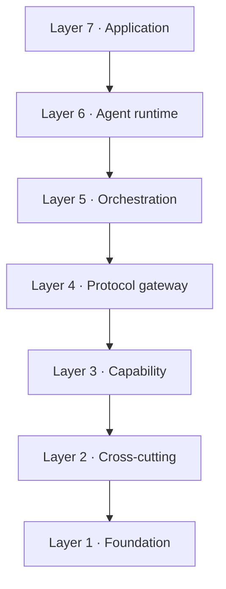
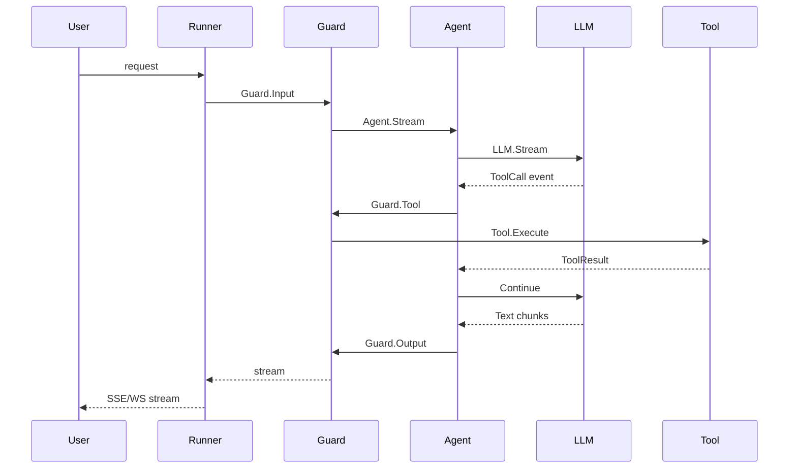
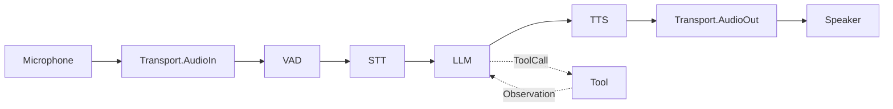
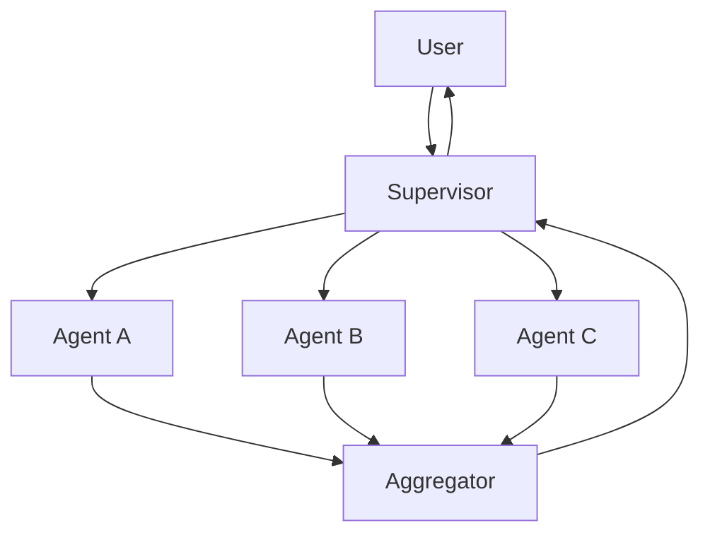

# DOC-01: Architecture Overview — The 7-Layer Model

**Audience:** Framework evaluators, new contributors, architects deciding whether to adopt.
**Prerequisites:** None. This is the root document.
**Related:** [02 — Core Primitives](./02-core-primitives.md), [03 — Extensibility Patterns](./03-extensibility-patterns.md), [18 — Package Dependency Map](./18-package-dependency-map.md).

## Overview

Beluga AI v2 is a Go-native agentic AI framework organised as seven layers. Layer N depends only on layers 1…N−1. Data flows down the stack via typed event streams. There is no hidden global state, no runtime reflection, and no framework magic — every extension point is an explicit interface registered in an explicit registry.

This document is the master map. Read it, and every other architecture doc will tell you where it fits.

## The stack


A text rendering for non-SVG contexts:

```
┌──────────────────────────────────────────────────────────────────────┐
│  Layer 7 — Application                                                │
│  User code · CLI tools · API servers · LiveKit handlers · K8s CRDs    │
├──────────────────────────────────────────────────────────────────────┤
│  Layer 6 — Agent runtime                                              │
│  Runner → Agent → Executor (Plan → Act → Observe → Replan)            │
│  Persona · Tools · Planner (7 strategies) · Team (5 patterns)         │
├──────────────────────────────────────────────────────────────────────┤
│  Layer 5 — Orchestration                                              │
│  Supervisor · Handoff · Scatter-Gather · Pipeline · Blackboard · Router│
├──────────────────────────────────────────────────────────────────────┤
│  Layer 4 — Protocol gateway                                           │
│  MCP · A2A · REST/SSE · gRPC · WebSocket · Server framework           │
├──────────────────────────────────────────────────────────────────────┤
│  Layer 3 — Capability layer                                           │
│  LLM · Tools · Memory · RAG · Voice · Guard · Prompt · Eval · Cache   │
├──────────────────────────────────────────────────────────────────────┤
│  Layer 2 — Cross-cutting concerns                                     │
│  Resilience · Auth · Audit · Cost · State · Sandbox · Workflow        │
├──────────────────────────────────────────────────────────────────────┤
│  Layer 1 — Foundation                                                 │
│  core · schema · config · o11y                                        │
└──────────────────────────────────────────────────────────────────────┘
```



Only downward arrows exist. If you find an upward import, it's a bug. [DOC-18](./18-package-dependency-map.md) makes this rule explicit with a full directed graph.

## What each layer does

### Layer 1 — Foundation

Zero external dependencies beyond the Go stdlib and OpenTelemetry. Contains:

- **`core`** — `Stream[T]`, `Event[T]`, `Runnable`, `core.Error` with `ErrorCode`, context helpers. See [`.wiki/patterns/error-handling.md`](../../.wiki/patterns/error-handling.md).
- **`schema`** — wire types: `Message`, `ContentPart`, `Tool`, `Document`, `Session`.
- **`config`** — generic `Load[T]`, validation, hot-reload.
- **`o11y`** — OTel GenAI conventions (`gen_ai.*` attributes), span wrappers, slog adapters. See [`.wiki/patterns/otel-instrumentation.md`](../../.wiki/patterns/otel-instrumentation.md).

**Rule:** Nothing in Layer 1 imports anything above it.

### Layer 2 — Cross-cutting concerns

Concerns that apply uniformly across the capability layer: circuit breakers, rate limits, RBAC, audit logging, cost tracking, agent state, sandboxing, durable workflows. They wrap Layer 3 capabilities via middleware — see [DOC-03](./03-extensibility-patterns.md) for the composition model.

### Layer 3 — Capability layer

The heart of the framework. Ten packages, each following the same four extension mechanisms (interface → registry → hooks → middleware):

| Package | What it provides |
|---|---|
| `llm` | Chat/completion models, routing, structured output, context management |
| `tool` | Native tools, MCP client, registry, middleware, hooks |
| `memory` | 3-tier memory (working/recall/archival) + graph store |
| `rag` | Ingestion, embedding, hybrid retrieval (BM25+vector+RRF), reranking |
| `voice` | Frame-based STT/TTS/S2S pipelines |
| `guard` | 3-stage safety pipeline (Input → Output → Tool) |
| `prompt` | Versioning, cache-optimised prompt building |
| `eval` | Metrics and evaluation runners |
| `cache` | Exact, semantic, and prompt caches |
| `hitl` | Human-in-the-loop approval gates |

Every capability package is **pluggable**: if you don't like the default LLM router, implement the interface and `Register()` your own.

### Layer 4 — Protocol gateway

Where Beluga meets the outside world. A single `Runner` (Layer 6) can expose its agent over any combination of:

- **MCP** — Model Context Protocol for tool/resource/prompt exposure, Streamable HTTP.
- **A2A** — Agent-to-Agent, with `AgentCard` discovery at `/.well-known/agent.json`.
- **REST/SSE** — plain HTTP + Server-Sent Events for streaming.
- **gRPC** — protobuf contracts for low-latency inter-service calls.
- **WebSocket** — bidirectional for voice and collaborative use cases.

See [DOC-12](./12-protocol-layer.md).

### Layer 5 — Orchestration

Five built-in patterns for multi-agent coordination, each an implementation of the `OrchestrationPattern` interface:

- **Supervisor** — central coordinator delegates to specialists.
- **Handoff** — agent A transfers control to agent B via a tool.
- **Scatter-Gather** — fan out to N agents in parallel, aggregate.
- **Pipeline** — linear sequence, each stage consumes the prior stage's output.
- **Blackboard** — agents communicate only through shared state.

Teams **are** agents (they implement the same `Agent` interface), so a team-of-teams is just recursive composition. See [DOC-07](./07-orchestration-patterns.md).

### Layer 6 — Agent runtime

The core execution engine:

- **`Runner`** — deployment boundary. Owns sessions, plugins, guards, metrics. See [DOC-08](./08-runner-and-lifecycle.md).
- **`Agent`** — persona + tools + planner + memory + hooks. See [DOC-05](./05-agent-anatomy.md).
- **`Executor`** — runs the Plan → Act → Observe → Replan loop, emits events. See [DOC-04](./04-data-flow.md).
- **`Planner`** — decides the next action. Seven strategies from ReAct to LATS. See [DOC-06](./06-reasoning-strategies.md).
- **`Team`** — composes multiple agents via an orchestration pattern.

Hooks fire at every lifecycle point. Handoffs appear as auto-generated `transfer_to_{name}` tools.

### Layer 7 — Application

Your code. A CLI. An HTTP server. A LiveKit voice handler. A Kubernetes operator loading `Agent` CRDs. This layer *uses* Beluga; Beluga never reaches back up.

The framework ships one reference Layer 7 application: the `beluga` CLI at [`cmd/beluga/`](../../cmd/beluga/). It is a cobra-based command-line tool with six subcommands — `version`, `providers`, `init`, `dev`, `test`, `deploy` — installable via `go install github.com/lookatitude/beluga-ai/v2/cmd/beluga@latest`. Release binaries for Linux, macOS, and Windows are attached to each GitHub release with a sha256 `checksums.txt`. The CLI is the canonical example of how to build a Layer 7 application: it composes Layer 3 providers (llm, rag/embedding, rag/vectorstore, memory) via blank imports in [`cmd/beluga/providers/providers.go`](../../cmd/beluga/providers/providers.go) and reads the framework version via the leaf package at [`cmd/beluga/internal/version`](../../cmd/beluga/internal/version/version.go). See [DOC-Reference: CLI](../reference/cli.md) for full command documentation.

## How data flows

Three canonical flows:

### Text chat



### Voice agent



See [DOC-11](./11-voice-pipeline.md).

### Multi-agent scatter-gather



See [DOC-07](./07-orchestration-patterns.md).

## The four design principles

### 1. Streaming first

`Invoke()` is a convenience wrapper around `Stream()` + collect. The primary path is a type-safe `iter.Seq2[Event[T], error]` — see [`core/stream.go`](../../.wiki/patterns/streaming.md) for the canonical `Stream[T]` definition. Channels never appear in public APIs.

**Why:** streaming matches how LLMs actually emit tokens, avoids goroutine leaks that plague channel-based designs, and composes cleanly via `Pipe`, `Parallel`, and `Merge`.

### 2. Composition over inheritance

`LLMAgent`, `SequentialAgent`, and your `CustomAgent` all *embed* `BaseAgent` to inherit identity, persona, and card serialisation. They implement `Stream()` themselves. There is no class hierarchy.

**Why:** Go's embedding is explicit, free of the surprises of virtual dispatch, and lets `Runnable` be a first-class unit of composition ([DOC-02](./02-core-primitives.md)).

### 3. Minimal core, rich ecosystem

`core/` and `schema/` have **zero** external dependencies beyond the Go stdlib and OpenTelemetry. Providers live in `*/providers/` subdirectories and pull their own SDKs. You can import `core` and build a toy agent without touching a single cloud SDK.

**Why:** keeps the critical path auditable, makes dependency updates targeted (a breaking change in the OpenAI SDK never destabilises `memory/`), and enables embedded/edge use cases.

### 4. Production-ready by default

Every extensible package ships with `WithTracing()` middleware that emits OTel GenAI spans at package boundaries ([DOC-14](./14-observability.md)). Circuit breakers, retry, and rate limiting are middleware on the same `func(T) T` signature as any other wrapper — no special infrastructure required ([DOC-15](./15-resilience.md)). The `workflow/` package provides crash-durable execution via a Temporal-compatible backend so agent runs survive process restarts without application-level checkpointing ([DOC-16](./16-durable-workflows.md)).

**Why:** observability, resilience, and durability are default concerns for any agent running in a multi-tenant or long-running context. Requiring users to bolt these on after the fact produces inconsistent coverage. Shipping them as opt-in middleware on every interface keeps the path from prototype to production a configuration change, not an architectural one.

## The universal package shape

Every pluggable package looks like this:

```
<package>/
├── <interface>.go      # The interface — 1 to 4 methods
├── registry.go         # Register / New / List
├── hooks.go            # Optional func fields, ComposeHooks
├── middleware.go       # type Middleware func(T) T, ApplyMiddleware
├── errors.go           # Package-specific error codes
├── <package>_test.go   # Table-driven tests
└── providers/          # Concrete implementations
    └── <provider>/
        └── <provider>.go  # Registers in init()
```

`llm/`, `tool/`, `memory/`, `rag/vectorstore/`, `rag/embedding/`, `rag/retriever/`, `voice/*`, `guard/`, `workflow/`, `server/`, `cache/`, `auth/`, `state/` all follow this template. Learn it once, apply it 13 times. See [DOC-03](./03-extensibility-patterns.md) for the full rationale.

## Where to go next

- You're evaluating the framework → [DOC-02](./02-core-primitives.md) then [DOC-05](./05-agent-anatomy.md).
- You're building an agent → [First Agent guide](../guides/first-agent.md).
- You're extending the framework → [DOC-03](./03-extensibility-patterns.md) then [Provider Template](../patterns/provider-template.md).
- You're operating the framework → [DOC-14](./14-observability.md) then [DOC-17](./17-deployment-modes.md).

## Common mistakes

- **Importing upward.** If your code in `core/` needs to know about `llm/`, restructure — the dependency belongs in `llm/` as a consumer of `core/`, not the reverse.
- **Treating `Invoke()` as the primary API.** `Invoke()` is a helper; the real contract is `Stream()`. Middleware and hooks are wired to the stream path.
- **Bypassing the registry.** Don't hand-construct providers with `&openai.Provider{...}` in production code. Use `llm.New("openai", cfg)` so middleware, hooks, and metrics attach correctly.

## Related reading

- [02 — Core Primitives](./02-core-primitives.md) — `Stream`, `Event`, `Runnable`, context helpers.
- [03 — Extensibility Patterns](./03-extensibility-patterns.md) — the 4 mechanisms.
- [04 — Data Flow](./04-data-flow.md) — complete request lifecycle.
- [18 — Package Dependency Map](./18-package-dependency-map.md) — enforces the layering rule.
- [`.wiki/architecture/invariants.md`](../../.wiki/architecture/invariants.md) — the ten invariants with source references.
