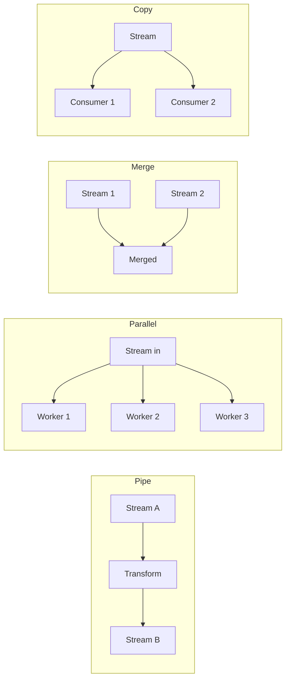
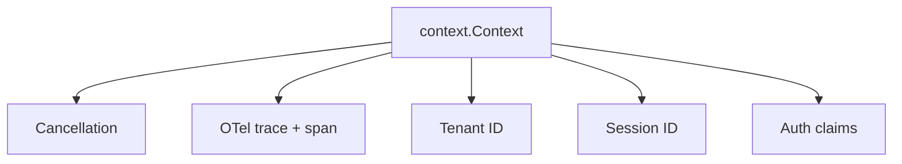

# DOC-02: Core Primitives

**Audience:** Everyone who writes code against Beluga.
**Prerequisites:** None (but [01 — Overview](./01-overview.md) gives you the context).
**Related:** [03 — Extensibility Patterns](./03-extensibility-patterns.md), [04 — Data Flow](./04-data-flow.md), [`.wiki/patterns/streaming.md`](../../.wiki/patterns/streaming.md), [`.wiki/patterns/error-handling.md`](../../.wiki/patterns/error-handling.md).

## Overview

Four primitives underpin every package in Beluga: `Event[T]`, `Stream[T]`, `Runnable`, and the context helpers (`WithTenant`, `WithSession`, etc.). Understand these four and you understand the framework's contract.

## Event[T] — the unit of data flow

Every emission from a streaming component is an `Event`. It carries a payload, optional error, and metadata.

```go
// core/event.go — conceptual shape (see current source for exact definition)
type EventType int

const (
    EventData      EventType = iota // payload chunk
    EventToolCall                    // LLM asked to call a tool
    EventToolResult                  // tool returned
    EventDone                        // stream terminated normally
    EventError                       // stream terminated with error
)

type Event[T any] struct {
    Type    EventType
    Payload T
    Err     error
    Meta    map[string]any
}
```

### Why one type for the whole stream

You could have separate stream types (`MessageStream`, `ErrorStream`, `ToolCallStream`) and tag-dispatch at the call site, but that forces every consumer to build N parallel goroutines. `Event[T]` keeps it linear: one `for ev, err := range stream` covers all cases.

### Why `Meta map[string]any`

The metadata map carries per-event information that isn't part of the payload: trace/span IDs, provider-specific annotations, timing, cost hints. `any` is acceptable here because `Meta` is observational — nothing in the critical path depends on its contents. The core type system stays strict (`Event[T]` is generic) while the metadata stays flexible.

## Stream[T] — the transport

`Stream[T]` wraps an `iter.Seq2[int, T]` so range-over-func works naturally:

```go
// canonical example from .wiki/patterns/streaming.md → core/stream.go:49-56
type Stream[T any] struct {
    name   string
    chunks iter.Seq2[int, T]
}

func (s *Stream[T]) Range(yield func(int, T) bool) {
    for idx, chunk := range s.chunks {
        if !yield(idx, chunk) {
            break
        }
    }
}
```

### Consumer pattern

```go
for idx, ev := range stream.Range {
    if ev.Err != nil {
        return ev.Err
    }
    // handle ev.Payload
}
```

The `yield` protocol guarantees backpressure: if the consumer returns `false`, the producer sees it on the next iteration and cleans up. No goroutine leaks.

### Stream operations

Four core operations compose streams:



- **Pipe (A → B)** — apply a transformation function to every event.
- **Parallel** — fan a single stream out to N workers, aggregate results.
- **Merge** — fan N streams in to one (round-robin or priority).
- **Copy** — broadcast one stream to multiple consumers.

Each operation respects cancellation: if the upstream context is cancelled, the pipeline shuts down cleanly. See [`core/stream.go:73-90`](../../.wiki/patterns/streaming.md) for the `MapStream` variation.

### Why `iter.Seq2` over channels

| Channels | `iter.Seq2` |
|---|---|
| Leak goroutines if the consumer returns early | `yield → false` propagates cancellation eagerly |
| Cannot compose without extra goroutines per stage | Composition is a single function call |
| No generic form until Go 1.21 workarounds | First-class generic since Go 1.23 |
| `select` required for multi-stream coordination | Natural `for … range` syntax |

Beluga requires Go 1.23+ specifically for `iter.Seq2`. Channels still exist inside packages as synchronisation primitives, but **they do not cross public API boundaries.**

### Error semantics

A stream can emit `Event{Err: err, Type: EventError}` and still continue (recoverable errors like "one tool call failed, keep planning"), or emit once and terminate. The convention: treat any `ev.Err != nil` as advisory; the stream is done only when `range` returns.

## Runnable — the composable unit

Every component that participates in a pipeline implements `Runnable`:

```go
// core/runnable.go — conceptual shape
type Runnable interface {
    Invoke(ctx context.Context, input any) (any, error)
    Stream(ctx context.Context, input any) (*Stream[Event[any]], error)
}
```

### Why `any` at the base level

Type-safe wrappers live at the consumer layer: `ChatModel`, `Retriever`, `Tool` are `Runnable`-shaped but with concrete types. The `Runnable` base exists so you can `Pipe(model, retriever, tool)` without inventing a new composition type per combination.

### Runnable ⇒ composable

```go
// pseudo — the real Pipe signature uses generics
chain := core.Pipe(
    retriever,   // Runnable → returns documents
    promptBuild, // Runnable → prompts with retrieved context
    llm,         // Runnable → streams chat response
)
stream, err := chain.Stream(ctx, userQuery)
```

Agents, teams, planners, tools — everything that moves data implements `Runnable` so it plugs into this composition.

### `Invoke` vs `Stream`

`Invoke` is the synchronous convenience form: it calls `Stream` internally, collects all events, and returns the final payload. Middleware and hooks are wired to `Stream`; `Invoke` delegates.

**Rule:** never implement `Invoke` without implementing `Stream`. `Stream` is the contract.

## Context — the invisible argument

`context.Context` is the first parameter of every public function and it carries four things:



### Cancellation

If the caller aborts, every downstream call — the LLM request, the vector store query, the tool invocation — sees `ctx.Done()` fire and exits cleanly. Every producer respects this.

### OTel trace + span

OTel's `tracer.Start(ctx, "llm.generate")` returns a new context with a child span attached. Downstream code reads the span from the context; `SpanFromContext(ctx)` gives you the current span without manual threading.

### Tenant / session / auth

Multi-tenancy and per-session state are carried via `context.Context` helpers:

```go
// conceptual — see core/context.go
ctx = core.WithTenant(ctx, "acme")
ctx = core.WithSession(ctx, sessionID)
ctx = core.WithAuth(ctx, claims)

// downstream:
tenant := core.GetTenant(ctx) // "acme"
```

These helpers use typed context keys (an unexported struct-typed constant) to avoid collisions with other packages.

**Never store `ctx` in a struct field.** Pass it per call. Contexts represent a request-scoped lifetime; stashing them in a struct breaks cancellation and tenant isolation.

## Why these four and not more

Beluga's core primitives are deliberately small. Adding a fifth (a `Message`, a `Document`, a `Tool`) is easy — and every capability package does — but the *foundation* stays lean. The four primitives described here are what every other layer composes against.

If you can read a function signature and answer "what `Stream[T]` does it return, what `Event` type carries its payload, what does it do with the `context.Context`?", you have enough to reason about it without reading the source.

## Common mistakes

- **Storing `ctx` in a struct.** Breaks cancellation. Pass it per call.
- **Implementing `Invoke` without `Stream`.** Middleware attaches to `Stream`; consumers that use `Invoke` get the wrong behaviour.
- **Using channels in a public return type.** Use `*Stream[T]`. Channels live *inside* your implementation if you need them; they don't cross the API boundary.
- **Ignoring `yield → false`.** Producers must check the return of `yield` and stop the pipeline. Otherwise you're leaking work.

## Related reading

- [03 — Extensibility Patterns](./03-extensibility-patterns.md) — how middleware and hooks layer on top of `Runnable`.
- [04 — Data Flow](./04-data-flow.md) — `Event` and `Stream` across a real request.
- [`patterns/streaming-iter-seq2.md`](../patterns/streaming-iter-seq2.md) — the pattern doc with extended examples.
- [`patterns/error-handling.md`](../patterns/error-handling.md) — `core.Error` + `ErrorCode` contract.
- [`patterns/context-propagation.md`](../patterns/context-propagation.md) — tenant / session / auth details.
- [`.wiki/patterns/streaming.md`](../../.wiki/patterns/streaming.md) — canonical code references.
