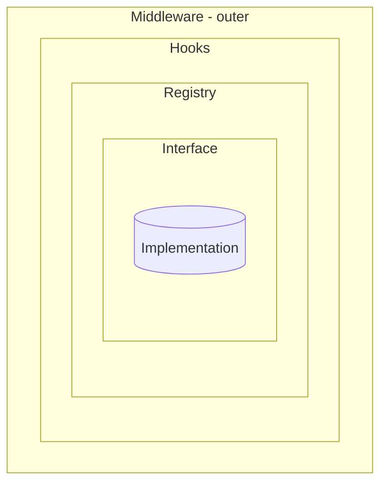
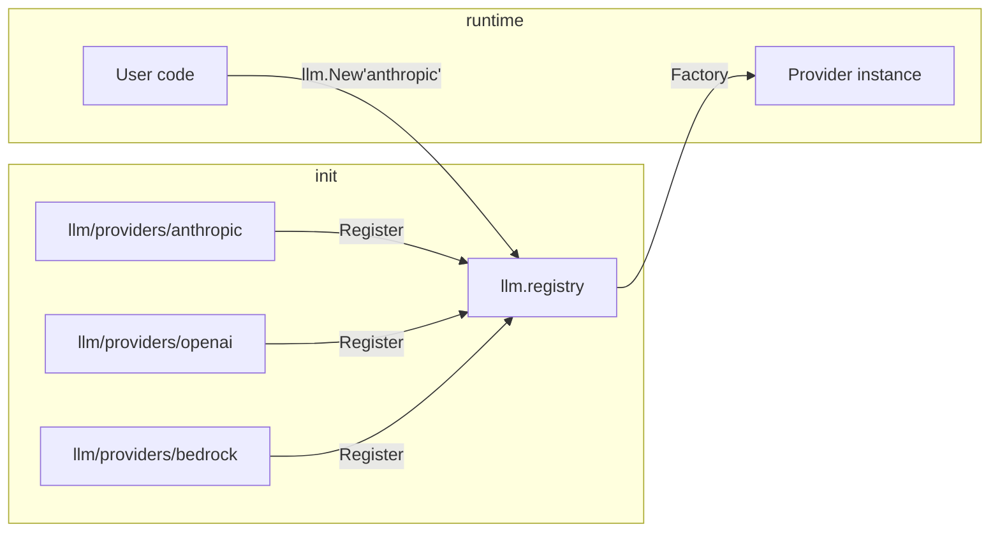
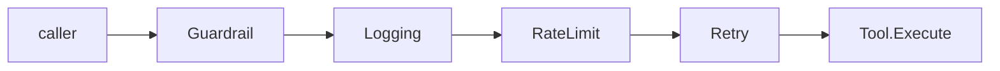
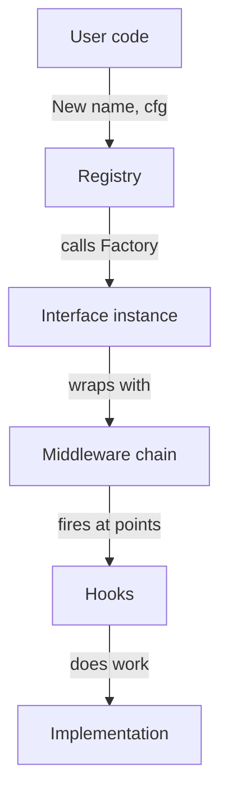

# DOC-03: Extensibility Patterns — The Four Mechanisms

**Audience:** Anyone extending Beluga. If you're implementing a provider, writing middleware, or adding a hook, start here.
**Prerequisites:** [02 — Core Primitives](./02-core-primitives.md).
**Related:** [05 — Agent Anatomy](./05-agent-anatomy.md), [Registry + Factory](../patterns/registry-factory.md), [Middleware Chain](../patterns/middleware-chain.md), [Hooks Lifecycle](../patterns/hooks-lifecycle.md).

## Overview

Every extensible package in Beluga uses the same four mechanisms:

1. **Interface** — the compile-time contract (≤4 methods).
2. **Registry** — runtime discovery. `Register` / `New` / `List`.
3. **Hooks** — interception at lifecycle points. Optional, nil-safe, composable.
4. **Middleware** — cross-cutting wrapping. `func(T) T`, applied outside-in.

Learn these four. They apply to `llm`, `tool`, `memory`, `rag/embedding`, `rag/vectorstore`, `rag/retriever`, `voice/*`, `guard`, `workflow`, `server`, `cache`, `auth`, and `state` — identically. Once you understand the shape, every package is learnable in minutes.

## The four concentric rings



- **Interface** is the inner contract: what methods exist.
- **Registry** turns names into instances at runtime.
- **Hooks** fire at specific lifecycle points.
- **Middleware** wraps the whole call from the outside.

## Ring 1 — Interface

Small interfaces (≤4 methods) composed as needed. Example from `tool/tool.go`:

```go
type Tool interface {
    Name() string
    Description() string
    InputSchema() map[string]any
    Execute(ctx context.Context, input map[string]any) (*Result, error)
}
```

Four methods. No more. Larger capability surfaces compose via embedding:

```go
type StreamingTool interface {
    Tool
    Stream(ctx context.Context, input map[string]any) (*core.Stream[Event[Result]], error)
}
```

### Why ≤4 methods

- Smaller interfaces are easier to implement, which encourages third-party providers.
- Smaller interfaces are easier to mock in tests.
- Bigger capability is expressed via interface *composition*, not a God interface.

Every implementation includes a compile-time assertion:

```go
var _ Tool = (*HTTPFetchTool)(nil)
```

## Ring 2 — Registry

A registry lets the framework discover implementations at runtime without import cycles.

Canonical example (adapted from `llm/registry.go:20-44`):

```go
// llm/registry.go
var (
    mu        sync.RWMutex
    providers = make(map[string]Factory)
)

type Factory func(cfg Config) (Provider, error)

func Register(name string, factory Factory) error {
    mu.Lock()
    defer mu.Unlock()
    if _, exists := providers[name]; exists {
        return fmt.Errorf("provider %q already registered", name)
    }
    providers[name] = factory
    return nil
}

func New(name string, cfg Config) (Provider, error) {
    mu.RLock()
    defer mu.RUnlock()
    factory, ok := providers[name]
    if !ok {
        return nil, fmt.Errorf("provider %q not found", name)
    }
    return factory(cfg)
}

func List() []string { /* … */ }
```

Providers register themselves in `init()`:

```go
// llm/providers/anthropic/anthropic.go:19-21
func init() {
    if err := llm.Register("anthropic", newFactory()); err != nil {
        panic(err)
    }
}
```



### Why this, not config files

Before `init()`-based registration, every framework had a YAML or TOML "providers list" that shipped alongside the library and had to be updated by hand. Go's `init()` + import graph lets registration happen transparently: you import `_ "github.com/lookatitude/beluga-ai/llm/providers/anthropic"` and the provider is available. No config, no runtime errors from typos in names.

See [Provider Registration pattern](../patterns/registry-factory.md) and [`.wiki/patterns/provider-registration.md`](../../.wiki/patterns/provider-registration.md).

## Ring 3 — Hooks

Hooks are optional function fields on a struct. `nil` means "skip this hook". `ComposeHooks(h1, h2, h3)` combines multiple hook sets into one that invokes each in order.

Canonical example (adapted from `tool/hooks.go:11-44`):

```go
type Hooks struct {
    BeforeExecute func(ctx context.Context, toolName string, input map[string]any) error
    AfterExecute  func(ctx context.Context, toolName string, result *Result, err error)
    OnError       func(ctx context.Context, toolName string, err error) error
}

func ComposeHooks(hooks ...Hooks) Hooks {
    h := append([]Hooks{}, hooks...)
    return Hooks{
        BeforeExecute: /* compose BeforeExecute hooks in order; stop on first error */,
        AfterExecute:  /* compose AfterExecute hooks in order unconditionally */,
        OnError:       /* compose OnError hooks in order; first non-nil return wins */,
    }
}
```

### When to use hooks

Hooks intercept **specific lifecycle points**:

- `BeforeExecute` — before the operation begins. Returning an error aborts execution.
- `AfterExecute` — after the operation completes (success or failure). Receives the result and any error.
- `OnError` — when the operation fails. Can suppress or replace the error.

They are fine-grained. If you need to record the exact moment a planner chose a specific tool, use a hook.

### Hooks vs middleware

| Question | Answer |
|---|---|
| Is this cross-cutting (retry, logging, rate-limit, guardrails)? | **Middleware.** |
| Is this lifecycle-specific (before plan, after tool call)? | **Hooks.** |
| Is this discovery/instantiation? | **Registry.** |
| Is this the contract itself? | **Interface.** |

A rule of thumb: middleware *wraps the whole call*; hooks *fire at specific moments inside the call*.

## Ring 4 — Middleware

Middleware is a function `func(T) T` that wraps an implementation and returns a new one with the same interface but augmented behaviour.

Canonical example (adapted from `tool/middleware.go:13-22`):

```go
type Middleware func(Tool) Tool

func ApplyMiddleware(tool Tool, mws ...Middleware) Tool {
    result := tool
    for i := len(mws) - 1; i >= 0; i-- {
        result = mws[i](result)
    }
    return result
}
```

Concrete middleware (retry):

```go
func WithRetry(max int) Middleware {
    return func(inner Tool) Tool {
        return &retryTool{inner: inner, max: max}
    }
}

func (r *retryTool) Execute(ctx context.Context, input map[string]any) (*Result, error) {
    for attempt := 0; attempt <= r.max; attempt++ {
        out, err := r.inner.Execute(ctx, input)
        if err == nil || !core.IsRetryable(err) {
            return out, err
        }
        // backoff with context check …
    }
    return nil, lastErr
}
```

### Application order: outside-in



Call `ApplyMiddleware(tool, guardrail, logging, ratelimit, retry)` and the first argument in the slice wraps the outside. Read left-to-right → "guardrail wraps logging wraps ratelimit wraps retry wraps tool".

### Why `func(T) T`

It's the simplest possible signature. No factory interfaces, no builders, no dependency injection frameworks. Just "give me a thing, get back a wrapped thing". It composes trivially (composition is function application) and it's obvious what order things happen in.

See [Middleware Chain pattern](../patterns/middleware-chain.md).

### `WithTracing()` — the canonical framework-wide middleware

One Ring 4 middleware is now provided by every extensible package: `WithTracing()`. It wraps the package interface with OTel GenAI spans named `<pkg>.<method>` using the typed `o11y.Attr*` constants. Seventeen packages (`agent`, `auth`, `hitl`, `llm`, `llm/routing`, `memory`, `orchestration`, `prompt`, `rag/embedding`, `rag/retriever`, `rag/splitter`, `rag/vectorstore`, `server`, `state`, `tool`, `voice/s2s`, `workflow`) all follow the same template rooted in [`memory/tracing.go`](../../memory/tracing.go). Adding `WithTracing()` to a new extensible package is mandatory, not optional. See [DOC-14 — Observability](./14-observability.md) for the template, span-naming rules, and opt-in pattern.

## How the four rings compose



1. **Interface** defines what an extension must implement.
2. **Registry** is how the user's code finds that extension at runtime.
3. **Middleware** wraps the instance before handing it to the caller.
4. **Hooks** fire inside the wrapped call at lifecycle points.

A complete wire-up looks like this:

```go
// import the provider for its init() side-effect
import _ "github.com/lookatitude/beluga-ai/llm/providers/anthropic"

func buildModel() (llm.Model, error) {
    // Ring 2 — registry lookup
    base, err := llm.New("anthropic", llm.Config{ /* … */ })
    if err != nil {
        return nil, err
    }

    // Ring 4 — middleware
    wrapped := llm.ApplyMiddleware(base,
        llm.WithGuardrails(guardPipeline),
        llm.WithLogging(logger),
        llm.WithRateLimit(rpm, tpm),
        llm.WithRetry(3),
    )

    // Ring 3 — hooks
    wrapped.SetHooks(llm.ComposeHooks(
        auditHooks,
        costHooks,
    ))

    return wrapped, nil
}
```

## Common mistakes

- **Using middleware for lifecycle interception.** If you need to fire at a specific moment ("when the planner chooses a tool"), use a hook. Middleware sees only the outer call.
- **Using hooks for cross-cutting concerns.** Retry, rate limit, logging — all apply uniformly to every call, so they're middleware. Adding retry logic to a `BeforeExecute` hook fights the design.
- **Registering outside `init()`.** The registry is append-only at startup. Dynamic registration post-`main()` is a race condition.
- **Non-nil-safe hooks.** Always check `if h.BeforeExecute != nil` before invoking. `ComposeHooks` does this for you; hand-rolled code often forgets.
- **Forgetting the compile-time check.** `var _ Interface = (*Impl)(nil)` catches interface-drift at compile time. Add it to every implementation.

## Related reading

- [`patterns/registry-factory.md`](../patterns/registry-factory.md) — the registry pattern with a full example.
- [`patterns/middleware-chain.md`](../patterns/middleware-chain.md) — composition, ordering, and edge cases.
- [`patterns/hooks-lifecycle.md`](../patterns/hooks-lifecycle.md) — nil-safety and when to use hooks.
- [`patterns/provider-template.md`](../patterns/provider-template.md) — building a new provider end-to-end.
- [`.wiki/patterns/provider-registration.md`](../../.wiki/patterns/provider-registration.md), [`middleware.md`](../../.wiki/patterns/middleware.md), [`hooks.md`](../../.wiki/patterns/hooks.md) — canonical code pointers.
