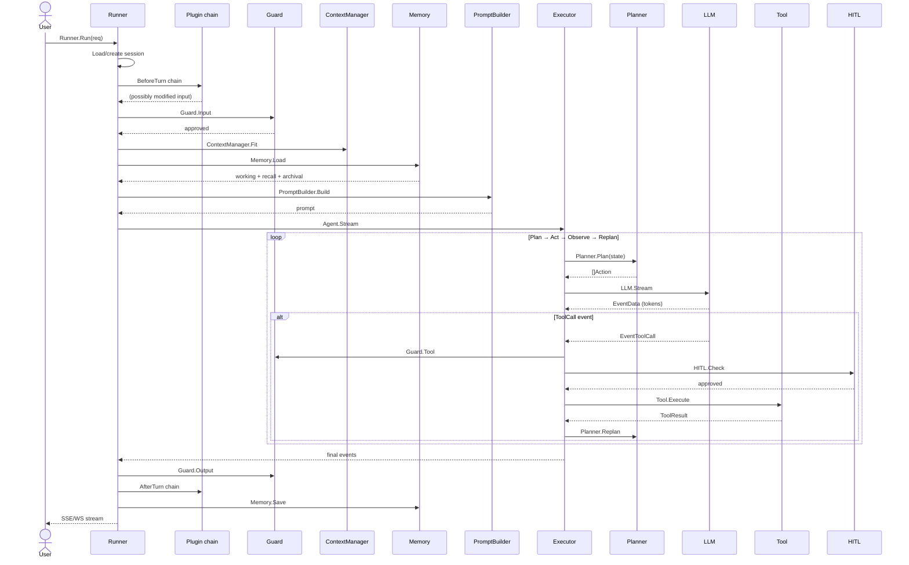
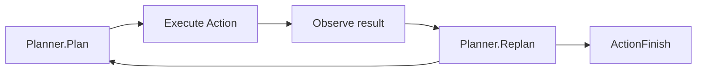
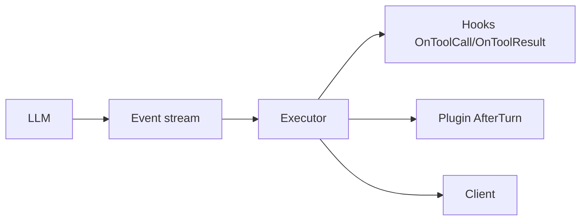
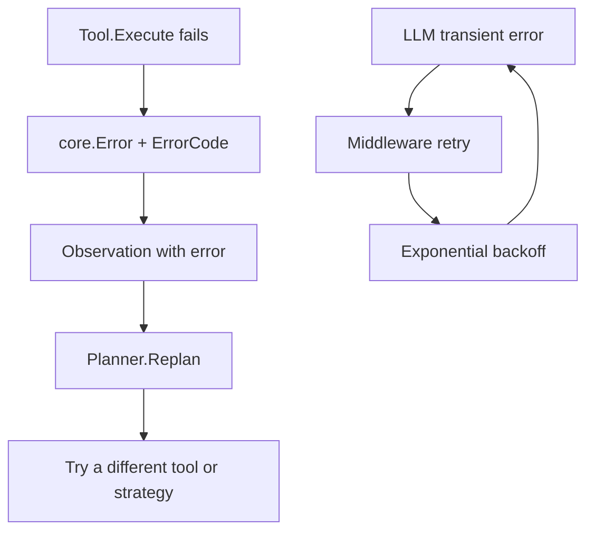
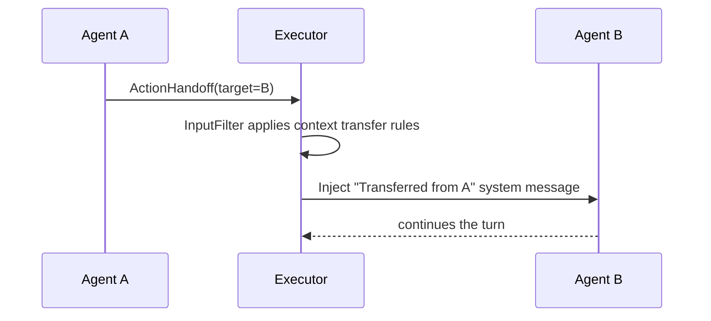

# DOC-04: Data Flow — Request Lifecycle

**Audience:** Anyone debugging an agent, writing a plugin, or adding a hook.
**Prerequisites:** [01 — Overview](./01-overview.md), [02 — Core Primitives](./02-core-primitives.md), [03 — Extensibility Patterns](./03-extensibility-patterns.md).
**Related:** [05 — Agent Anatomy](./05-agent-anatomy.md), [08 — Runner and Lifecycle](./08-runner-and-lifecycle.md), [13 — Security Model](./13-security-model.md).

## Overview

A single request travels through every layer of Beluga. This document traces exactly which component handles it at each step, which events are emitted, and where control transfers.

## The complete text chat lifecycle

## The seven steps

### 1. Runner.Run — entry point

The runner is the deployment boundary ([DOC-08](./08-runner-and-lifecycle.md)). It:

- Loads or creates the session from `SessionService`.
- Runs the **plugin `BeforeTurn` chain** (audit, cost budget check, tracing start).
- Hands off to `Guard.Input` for the first safety stage.

Plugins are runner-level (one Beluga deployment's cross-cutting concerns), distinct from hooks (agent-specific lifecycle points).

### 2. Guard.Input — first safety stage

Input guards run before the model sees anything:

- Prompt injection detection (spotlighting).
- Input validation (schema enforcement).
- Per-tenant rate checks.
- PII redaction if configured.

If a guard returns `Decision.Block`, the turn aborts with an `ErrGuardBlocked` error before any LLM tokens are spent. See [DOC-13](./13-security-model.md).

### 3. ContextManager.Fit + Memory.Load

`ContextManager.Fit` budgets the working message window to stay under the model's token limit. `Memory.Load` fetches relevant context from the three tiers:

- **Working memory** — recent messages (buffer or window).
- **Recall memory** — summaries and entities from prior sessions.
- **Archival memory** — semantic vector matches from long-term storage.

See [DOC-09](./09-memory-architecture.md) for tier details.

### 4. PromptBuilder.Build

Cache-optimised: static content (system prompt, tool definitions) first, dynamic content (memory, user input) last. This maximises prompt-cache hit rate on providers that support it. See [`reference/providers.md`](../reference/providers.md) for cache-aware provider behaviour.

### 5. Executor loop — Plan → Act → Observe → Replan

The agent's central control structure:

Each iteration:

1. **Plan** — `Planner.Plan(ctx, state)` returns `[]Action`. Actions can be `ActionTool`, `ActionRespond`, `ActionFinish`, `ActionHandoff`.
2. **Act** — the executor dispatches the action.
3. **Observe** — the result is recorded as an `Observation`.
4. **Replan** — the planner sees the new observation and decides the next step.

On **ActionTool**, three sub-steps fire:

1. **Guard.Tool** — capability check + schema validate.
2. **HITL.Check** — if `risk_level == high`, pause and wait for human approval.
3. **Hooks.OnToolCall** → **Tool.Execute** → **Hooks.OnToolResult**.

On **ActionHandoff**, the executor transfers control to another agent via the auto-generated `transfer_to_{name}` tool — see [DOC-07](./07-orchestration-patterns.md).

### 6. Guard.Output — final safety stage

After the loop finishes:

- Content moderation.
- PII redaction on the response.
- Schema enforcement if the caller declared an output schema.

If an output guard blocks, the runner returns an error instead of the model's output.

### 7. Plugin AfterTurn, Memory.Save, session persist

- **Plugin `AfterTurn` chain** — audit record, cost log, tracing end.
- **Memory.Save** — write the conversation turn to working memory; extract entities; index the turn for semantic recall.
- **Session persist** — the `SessionService` writes the updated state.
- **Stream to client** — the collected events flow out via whichever protocol the runner is serving (SSE, WebSocket, gRPC).

## Event propagation

Five `EventType`s flow from the LLM outward:

- `EventData` — text chunk. Streams to the client in real time.
- `EventToolCall` — the model wants a tool. Triggers guards + HITL.
- `EventToolResult` — observation from the tool. Fed back to the planner.
- `EventDone` — normal termination.
- `EventError` — terminal error.

Hooks see `EventToolCall` and `EventToolResult`. Plugins see the full turn. The client receives `EventData` + `EventDone` (and `EventError` on failure) unless configured to see intermediate events.

## Error propagation

Two error paths coexist:

1. **Application errors** — a tool fails, the LLM hallucinates a bad schema, the retrieval returns nothing. These become `Observation`s and feed back to the planner. The agent can recover.
2. **Infrastructure errors** — network blip, rate limit, 503. These fire at the middleware level. `core.IsRetryable(err)` is true → retry middleware transparently retries. The planner never sees them.

See [`patterns/error-handling.md`](../patterns/error-handling.md) and [`.wiki/patterns/error-handling.md`](../../.wiki/patterns/error-handling.md).

## Handoff flow

Handoffs are just tools with auto-generated signatures. `transfer_to_agent_b` is a regular function-call the LLM picks like any other tool. See [DOC-07](./07-orchestration-patterns.md).

## Why the executor loop is central

The Plan → Act → Observe → Replan loop is the single control structure that makes an agent an *agent* instead of a one-shot LLM caller. Everything else — memory, tools, handoffs, guards — is either an input to `Plan` or a consequence of `Act`.

Hooks exist because the loop itself is a good place to intercept specific moments. Plugins exist because the runner frames the loop with session and safety concerns that span the whole turn.

## Common mistakes

- **Running tool calls without `Guard.Tool`.** The three-stage pipeline (Input → Tool → Output) is only effective if all three stages run. See [DOC-13](./13-security-model.md).
- **Expecting events to be hookable in `Invoke`.** `Invoke` collects and returns the final result; hooks fire during `Stream`. Use `Stream` if you need interception.
- **Mutating observations in hooks.** Hooks observe; they don't transform. If you need to modify data, use middleware or a plugin.
- **Skipping `Memory.Save`.** The executor will run fine without it, but subsequent turns won't see the prior one. Always call it unless the session is intentionally stateless.

## Related reading

- [05 — Agent Anatomy](./05-agent-anatomy.md) — structure of the thing running the loop.
- [06 — Reasoning Strategies](./06-reasoning-strategies.md) — what `Planner.Plan` actually does.
- [08 — Runner and Lifecycle](./08-runner-and-lifecycle.md) — runner's role across turns.
- [13 — Security Model](./13-security-model.md) — the full 3-stage guard pipeline.
- [14 — Observability](./14-observability.md) — span hierarchy produced by the flow above.
