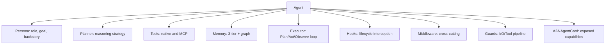
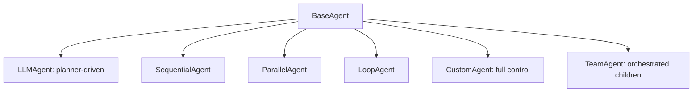
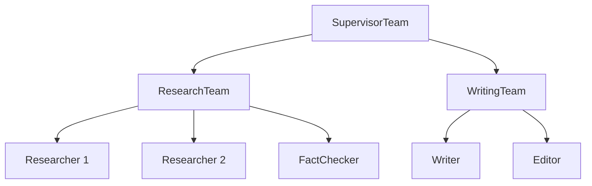

# DOC-05: Agent Anatomy

**Audience:** Anyone building or extending an agent.
**Prerequisites:** [02 — Core Primitives](./02-core-primitives.md), [03 — Extensibility Patterns](./03-extensibility-patterns.md).
**Related:** [06 — Reasoning Strategies](./06-reasoning-strategies.md), [07 — Orchestration Patterns](./07-orchestration-patterns.md), [08 — Runner and Lifecycle](./08-runner-and-lifecycle.md).

## Overview

An agent is the atomic unit of behaviour in Beluga. It has a persona, a set of tools, a planner, memory, hooks, and middleware. It implements the `Agent` interface (which itself embeds `Runnable`), so agents compose with every streaming primitive. Teams implement the same interface, which is how recursive composition works.

## What's inside an agent



### Required

- **Persona** — role, goal, backstory, optional traits. Maps to the system prompt.
- **Planner** — decides the next action. 7 strategies ship, a `RegisterPlanner()` hook lets you add more. See [DOC-06](./06-reasoning-strategies.md).
- **Executor** — runs the Plan → Act → Observe → Replan loop. See [DOC-04](./04-data-flow.md).

### Optional

- **Tools** — native tools, MCP-backed tools, or remote tools via `transfer_to_{agent}` handoffs.
- **Memory** — if absent, the agent is stateless per turn.
- **Hooks** — `BeforePlan`, `OnToolCall`, `OnToolResult`, `OnError`, etc.
- **Middleware** — retry, rate limit, logging, guardrails.
- **Guards** — per-agent safety pipeline (stacks with the runner's global guards).

## BaseAgent embedding

```go
// agent/base.go — conceptual
type BaseAgent struct {
    id       string
    persona  Persona
    tools    []Tool
    hooks    Hooks
    card     AgentCard
    children []Agent
}

func (b *BaseAgent) ID() string          { return b.id }
func (b *BaseAgent) Persona() Persona    { return b.persona }
func (b *BaseAgent) Tools() []Tool       { return b.tools }
func (b *BaseAgent) Card() AgentCard     { return b.card }
func (b *BaseAgent) Children() []Agent   { return b.children }
```

Every concrete agent embeds `BaseAgent` and implements `Invoke` + `Stream`:

```go
type LLMAgent struct {
    BaseAgent
    llm     llm.Model
    memory  memory.Memory
    planner Planner
    exec    Executor
}

func (a *LLMAgent) Stream(ctx context.Context, input any) (*core.Stream[core.Event[any]], error) {
    return a.exec.Run(ctx, a, input)
}
```

### Why composition over inheritance

Go doesn't have classical inheritance, and that's a feature. Embedding `BaseAgent`:

- Makes the "inherited" methods explicit (`BaseAgent` fields are visible in the concrete struct).
- Allows `LLMAgent` to *replace* any method by defining it directly — no `virtual`/`override` indirection.
- Keeps method dispatch static. No surprises at call sites.
- Lets the same `BaseAgent` be embedded in a `TeamAgent`, a `WorkflowAgent`, or a `CustomAgent` without any hierarchy.

## Agent types



### LLMAgent

The default. A planner drives the Plan/Act/Observe loop. Use for tasks where the model decides what to do next.

### SequentialAgent / ParallelAgent / LoopAgent

Deterministic workflow agents. `SequentialAgent` runs its children in order. `ParallelAgent` fans out. `LoopAgent` repeats until a condition is met. These are workflows disguised as agents — useful when you want agent-shaped composition without LLM reasoning.

### CustomAgent

You implement `Stream` yourself. Full control. Use when none of the above patterns fit.

### TeamAgent

A team is an agent. Its `Stream` method delegates to an orchestration pattern ([DOC-07](./07-orchestration-patterns.md)) to coordinate its children.

## Persona model

```go
type Persona struct {
    Role      string  // "Research assistant"
    Goal      string  // "Find and summarise relevant papers"
    Backstory string  // "You have a PhD in …"
    Traits    []string // ["cautious", "cites sources"]
}
```

At prompt-build time, the persona is rendered into the system prompt. Providers that support prompt caching see the persona in the static (cacheable) prefix.

## The A2A AgentCard

Every agent exposes an `AgentCard` at `/.well-known/agent.json`. It describes:

- Agent name, version, description.
- Input/output schemas.
- Capabilities (which tools, which protocols it supports).
- Endpoint URLs for REST, A2A, MCP.

This is how one Beluga agent discovers another on the network. See [DOC-12](./12-protocol-layer.md).

## Teams are agents (recursive composition)



`SupervisorTeam`, `ResearchTeam`, and `WritingTeam` are all `TeamAgent` instances — which implement `Agent`. So `SupervisorTeam` can contain `ResearchTeam` as a child the same way it contains `Researcher 1`. Infinite depth, uniform interface.

**Why this matters:** there is no "root team" vs "leaf agent" distinction. Any agent can be a member of any team. You can refactor a single agent into a sub-team without changing its callers.

## Handoffs are tools

When agent A has agent B in its `Handoffs` list, Beluga auto-generates a tool named `transfer_to_agent_b`. The LLM picks it via normal function-calling. The executor handles the transfer:

1. Emit `ActionHandoff{Target: B}`.
2. Apply `InputFilter` to control what context passes to B.
3. Start B's turn with a `"Transferred from A"` system message.

**Why handoffs are tools:** the LLM already knows how to pick tools. Adding a new "handoff" mechanism would require separate prompt engineering for every model. Treating them as tools reuses everything.

## Why agents implement Runnable

Because agents implement `Runnable`, they participate in:

- `core.Pipe(retriever, agent)` — a retriever feeds an agent.
- `core.Parallel(agentA, agentB)` — two agents run on the same input in parallel.
- Middleware chains — `ApplyMiddleware(agent, logging, retry)`.

Agents are values, not special-cased framework types. That's the whole point of the design.

## Common mistakes

- **Forgetting to embed `BaseAgent`.** Your custom agent needs to satisfy the full `Agent` interface. Embedding `BaseAgent` is the shortcut.
- **Hand-rolling handoffs with direct calls.** Don't. Use the `Handoffs` field and let Beluga generate the `transfer_to_*` tool.
- **Treating the planner and the LLM as the same thing.** The planner *decides*; the LLM *generates*. One planner can call the LLM zero or many times per iteration.
- **Storing state in agent fields instead of session/memory.** Agents should be stateless — state lives in the session. Otherwise two concurrent requests share state and race.

## Related reading

- [06 — Reasoning Strategies](./06-reasoning-strategies.md) — how `Planner.Plan` actually works.
- [07 — Orchestration Patterns](./07-orchestration-patterns.md) — how teams coordinate.
- [08 — Runner and Lifecycle](./08-runner-and-lifecycle.md) — how agents get hosted.
- [09 — Memory Architecture](./09-memory-architecture.md) — how memory threads through agents.
- [`patterns/hooks-lifecycle.md`](../patterns/hooks-lifecycle.md) — when to use hooks vs middleware for agents.
