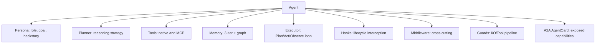
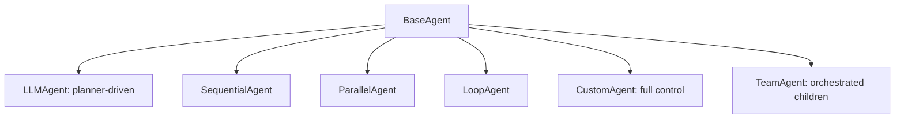
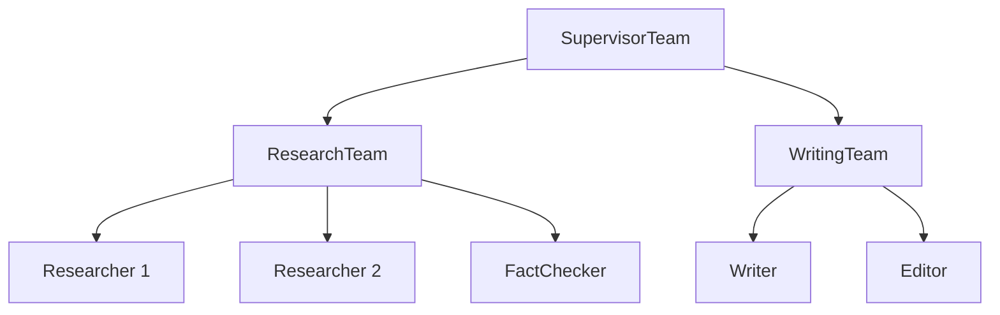

# DOC-05: Agent Anatomy

**Audience:** Anyone building or extending an agent.
**Prerequisites:** [02 — Core Primitives](./02-core-primitives.md), [03 — Extensibility Patterns](./03-extensibility-patterns.md).
**Related:** [06 — Reasoning Strategies](./06-reasoning-strategies.md), [07 — Orchestration Patterns](./07-orchestration-patterns.md), [08 — Runner and Lifecycle](./08-runner-and-lifecycle.md).

## Overview

An agent is the atomic unit of behaviour in Beluga. It has a persona, a set of tools, a planner, memory, hooks, and middleware. It implements the `Agent` interface (which itself embeds `Runnable`), so agents compose with every streaming primitive. Teams implement the same interface, which is how recursive composition works.

## What's inside an agent



### Required

- **Persona** — role, goal, backstory, optional traits. Maps to the system prompt.
- **Planner** — decides the next action. 8 strategies ship, a `RegisterPlanner()` hook lets you add more. See [DOC-06](./06-reasoning-strategies.md).
- **Executor** — runs the Plan → Act → Observe → Replan loop. See [DOC-04](./04-data-flow.md).

### Optional

- **Tools** — native tools, MCP-backed tools, or remote tools via `transfer_to_{agent}` handoffs.
- **Memory** — if absent, the agent is stateless per turn.
- **Hooks** — `BeforePlan`, `OnToolCall`, `OnToolResult`, `OnError`, etc.
- **Middleware** — retry, rate limit, logging, guardrails.
- **Guards** — per-agent safety pipeline (stacks with the runner's global guards).

## BaseAgent embedding

```go
// agent/base.go — conceptual
type BaseAgent struct {
    id       string
    persona  Persona
    tools    []Tool
    hooks    Hooks
    card     AgentCard
    children []Agent
}

func (b *BaseAgent) ID() string          { return b.id }
func (b *BaseAgent) Persona() Persona    { return b.persona }
func (b *BaseAgent) Tools() []Tool       { return b.tools }
func (b *BaseAgent) Card() AgentCard     { return b.card }
func (b *BaseAgent) Children() []Agent   { return b.children }
```

Every concrete agent embeds `BaseAgent` and implements `Invoke` + `Stream`:

```go
type LLMAgent struct {
    BaseAgent
    llm     llm.Model
    memory  memory.Memory
    planner Planner
    exec    Executor
}

func (a *LLMAgent) Stream(ctx context.Context, input any) (*core.Stream[core.Event[any]], error) {
    return a.exec.Run(ctx, a, input)
}
```

### Why composition over inheritance

Go doesn't have classical inheritance, and that's a feature. Embedding `BaseAgent`:

- Makes the "inherited" methods explicit (`BaseAgent` fields are visible in the concrete struct).
- Allows `LLMAgent` to *replace* any method by defining it directly — no `virtual`/`override` indirection.
- Keeps method dispatch static. No surprises at call sites.
- Lets the same `BaseAgent` be embedded in a `TeamAgent`, a `WorkflowAgent`, or a `CustomAgent` without any hierarchy.

## Agent types



### LLMAgent

The default. A planner drives the Plan/Act/Observe loop. Use for tasks where the model decides what to do next.

### SequentialAgent / ParallelAgent / LoopAgent

Deterministic workflow agents. `SequentialAgent` runs its children in order. `ParallelAgent` fans out. `LoopAgent` repeats until a condition is met. These are workflows disguised as agents — useful when you want agent-shaped composition without LLM reasoning.

### CustomAgent

You implement `Stream` yourself. Full control. Use when none of the above patterns fit.

### TeamAgent

A team is an agent. Its `Stream` method delegates to an orchestration pattern ([DOC-07](./07-orchestration-patterns.md)) to coordinate its children.

## Persona model

```go
type Persona struct {
    Role      string  // "Research assistant"
    Goal      string  // "Find and summarise relevant papers"
    Backstory string  // "You have a PhD in …"
    Traits    []string // ["cautious", "cites sources"]
}
```

At prompt-build time, the persona is rendered into the system prompt. Providers that support prompt caching see the persona in the static (cacheable) prefix.

## The A2A AgentCard

Every agent exposes an `AgentCard` at `/.well-known/agent.json`. It describes:

- Agent name, version, description.
- Input/output schemas.
- Capabilities (which tools, which protocols it supports).
- Endpoint URLs for REST, A2A, MCP.

This is how one Beluga agent discovers another on the network. See [DOC-12](./12-protocol-layer.md).

## Teams are agents (recursive composition)



`SupervisorTeam`, `ResearchTeam`, and `WritingTeam` are all `TeamAgent` instances — which implement `Agent`. So `SupervisorTeam` can contain `ResearchTeam` as a child the same way it contains `Researcher 1`. Infinite depth, uniform interface.

**Why this matters:** there is no "root team" vs "leaf agent" distinction. Any agent can be a member of any team. You can refactor a single agent into a sub-team without changing its callers.

## Handoffs are tools

When agent A has agent B in its `Handoffs` list, Beluga auto-generates a tool named `transfer_to_agent_b`. The LLM picks it via normal function-calling. The executor handles the transfer:

1. Emit `ActionHandoff{Target: B}`.
2. Apply `InputFilter` to control what context passes to B.
3. Start B's turn with a `"Transferred from A"` system message.

**Why handoffs are tools:** the LLM already knows how to pick tools. Adding a new "handoff" mechanism would require separate prompt engineering for every model. Treating them as tools reuses everything.

## Why agents implement Runnable

Because agents implement `Runnable`, they participate in:

- `core.Pipe(retriever, agent)` — a retriever feeds an agent.
- `core.Parallel(agentA, agentB)` — two agents run on the same input in parallel.
- Middleware chains — `ApplyMiddleware(agent, logging, retry)`.

Agents are values, not special-cased framework types. That's the whole point of the design.

## Advanced Agent Architectures [experimental]

The sub-packages below extend the base agent model with specialised runtime behaviours. They are shipped in the same module but isolated in their own packages so you can import only what you need. All are production-usable but their APIs may evolve between minor versions.

### agent/cognitive — Dual-Process Routing

`agent/cognitive` implements dual-process theory (Kahneman's System 1 / System 2). A `DualProcessAgent` wraps two ordinary `agent.Agent` instances and routes each request to the faster S1 agent or the more deliberate S2 agent based on a `ComplexityScorer`.

**Key interface** (`agent/cognitive/types.go:57-60`):

```go
type ComplexityScorer interface {
    Score(ctx context.Context, input string) (ComplexityScore, error)
}
```

`ComplexityScore` carries a `ComplexityLevel` (`Simple`, `Moderate`, `Complex`) and a `Confidence` float in `[0.0, 1.0]`. The built-in `HeuristicScorer` registers itself under `"heuristic"` via `RegisterScorer`. Supply your own with `WithScorer(s)`.

**Invoke vs Stream behaviour** (`agent/cognitive/agent.go:124-190` and `194-254`): `Invoke` uses a *cascading* strategy — S1 runs first, and if the score is `Moderate` with confidence below the threshold (default 0.7), execution escalates to S2. `Stream` pre-classifies before streaming so it never buffers a full S1 response before deciding. Both paths are symmetric: `Complex` inputs always route directly to S2.

**Hook into BaseAgent:** `DualProcessAgent` implements `agent.Agent` directly (compile-time check at `agent/cognitive/agent.go:31`). Attach it to a `Runner` exactly like any other agent. Use `Hooks` (`agent/cognitive/types.go:65-76`) to observe `OnRouted`, `OnEscalated`, and `OnCompleted` events, and `RoutingMetrics` (`agent/cognitive/metrics.go:11`) to track aggregate S1/S2 counts and escalation rates.

**When to use:** you have a cheap, fast agent (e.g., small local model) that handles the majority of queries, and an expensive, accurate agent for the minority that require deeper reasoning. Cognitive routing reduces cost proportionally to your S1 hit rate.

```go
import (
    "context"
    "github.com/lookatitude/beluga-ai/v2/agent/cognitive"
)

a, err := cognitive.New("router", fastAgent, deepAgent,
    cognitive.WithThreshold(0.75),
    cognitive.WithCognitiveHooks(cognitive.Hooks{
        OnRouted: func(ctx context.Context, input string, level cognitive.ComplexityLevel, target string) {
            // observe routing decisions
        },
    }),
)
if err != nil {
    return err
}
```

### agent/metacognitive — Cross-Session Learning

`agent/metacognitive` enables an agent to build a persistent self-model from execution experience. After each turn, a `Plugin` extracts heuristics from success and failure signals, updates per-task-type `CapabilityScore` values using an exponential moving average, and persists everything via a `SelfModelStore`. Before the next turn, relevant heuristics are retrieved and injected into the user message as context.

**Key interface** (`agent/metacognitive/store.go:13-24`):

```go
type SelfModelStore interface {
    Load(ctx context.Context, agentID string) (*SelfModel, error)
    Save(ctx context.Context, model *SelfModel) error
    SearchHeuristics(ctx context.Context, agentID, query string, k int) ([]Heuristic, error)
}
```

**Component breakdown:**

- `Monitor` (`agent/metacognitive/monitor.go:15`) — attaches to `agent.Hooks` (`OnStart`, `AfterAct`, `OnEnd`, `OnError`, `OnToolCall`, `OnToolResult`) to collect `MonitoringSignals` per turn.
- `HeuristicExtractor` (`agent/metacognitive/extractor.go:15`) — derives `Heuristic` records from signals. `SimpleExtractor` uses rule-based patterns; replace with an LLM-backed extractor for richer heuristics.
- `Plugin` (`agent/metacognitive/plugin.go:31`) — implements `runtime.Plugin`. Its `BeforeTurn` loads and injects heuristics; its `AfterTurn` extracts and saves new ones.
- `InMemoryStore` (`agent/metacognitive/store.go:31`) — thread-safe in-process store for development. Implement `SelfModelStore` to persist across restarts.

**Hook into BaseAgent:** attach `plugin.Monitor().Hooks()` to the agent, then register the `Plugin` with the `Runner` via `runner.AddPlugin(plugin)`. The runner calls `BeforeTurn`/`AfterTurn` around each session turn automatically.

**When to use:** the agent handles recurring task types and you want it to improve without human intervention — for example, a customer-support agent that learns which tool sequences resolve certain query categories most efficiently.

### agent/evolving — Self-Improvement Loop

`agent/evolving` wraps any `agent.Agent` with a background learning loop. After every N interactions (`WithLearnEveryN`, default 10), a goroutine runs the `ExperienceDistiller` over buffered interactions, then passes the resulting `Experience` records to a `MetaOptimizer` for improvement suggestions.

**Key interfaces** (`agent/evolving/evolving.go:17-27`):

```go
type MetaOptimizer interface {
    Optimize(ctx context.Context, experiences []Experience) ([]Suggestion, error)
}

type ExperienceDistiller interface {
    Distill(ctx context.Context, interactions []Interaction) ([]Experience, error)
}
```

Built-in implementations — `SimpleDistiller` (success rate and average latency) and `FrequencyOptimizer` (frequency-based suggestions) — provide a working baseline. The `Suggestion` type carries a `Type` (`"prompt_update"`, `"tool_addition"`, etc.), `Priority`, and `Confidence` that your application can consume to drive offline improvements.

**Hook into BaseAgent:** `EvolvingAgent` implements `agent.Agent` (compile-time check at `agent/evolving/evolving.go:134`). Wrap your agent with `evolving.New(inner, opts...)`. The `Experiences()` and `Suggestions()` methods surface the latest analysis. Learning goroutines run with `context.WithoutCancel(ctx)` so they outlive the triggering request but still carry trace and tenant values.

**When to use:** long-running production agents where you want automated detection of reliability or performance regressions. Couple with an alerting system that reads `Suggestions()` and pages on high-priority items.

### agent/speculative — Speculative Execution

`agent/speculative` runs a cheap `Predictor` and the ground-truth `agent.Agent` in parallel. If the predictor finishes first with sufficient confidence and passes validation, the predicted result is returned immediately — similar to speculative execution in CPU pipelines. The ground-truth result is used otherwise.

**Key interfaces** (`agent/speculative/predictor.go:13-15` and `agent/speculative/validator.go:10-13`):

```go
type Predictor interface {
    Predict(ctx context.Context, input string) (prediction string, confidence float64, err error)
}

type Validator interface {
    Validate(ctx context.Context, prediction, groundTruth string) (valid bool, err error)
}
```

`LightModelPredictor` uses any `llm.ChatModel` as a cheap drafting model; confidence is estimated from response length. `ExactValidator` checks case-normalised string equality; `SemanticValidator` uses cosine similarity of term-frequency vectors with a configurable threshold.

**Hook into BaseAgent:** `SpeculativeExecutor` implements `agent.Agent` (compile-time check at `agent/speculative/executor.go:14`). Construct with `speculative.NewSpeculativeExecutor(groundTruthAgent, opts...)` and use it anywhere a normal agent is expected. For streaming, supply `WithFastAgent` — when predictor confidence is high, the fast agent's stream is used directly.

**When to use:** your ground-truth agent is expensive (e.g., LATS or MoA) and many inputs have predictable answers that a lighter model can supply. Measure the hit rate via `SpeculativeExecutor.Metrics()` before relying on this in production.

### agent/plancache — Plan-Level Caching

`agent/plancache` caches successful action sequences at the planner level. When the same (or similar) input recurs, `CachedPlanner` returns the cached plan without calling the inner planner. Plans that require frequent replanning are evicted automatically.

See [DOC-06 — Reasoning Strategies: Plan-Level Caching](./06-reasoning-strategies.md#agentplancache--plan-level-caching-experimental) for full integration details. The key types are:

- `Store` (`agent/plancache/store.go:7`) — persistence interface: `Save`, `Get`, `List`, `Delete`.
- `Matcher` (`agent/plancache/matcher.go:8`) — similarity scoring interface.
- `Template` (`agent/plancache/template.go:12`) — a cached plan with `SuccessCount`, `DeviationCount`, and `DeviationRatio()`.
- `CachedPlanner` (`agent/plancache/cached_planner.go:16`) — wraps any `agent.Planner`.

**When to use:** agents that solve recurring, structurally similar tasks — ticket routing, document classification, data extraction — where re-running the planner on every input is wasteful.

## Common mistakes

- **Forgetting to embed `BaseAgent`.** Your custom agent needs to satisfy the full `Agent` interface. Embedding `BaseAgent` is the shortcut.
- **Hand-rolling handoffs with direct calls.** Don't. Use the `Handoffs` field and let Beluga generate the `transfer_to_*` tool.
- **Treating the planner and the LLM as the same thing.** The planner *decides*; the LLM *generates*. One planner can call the LLM zero or many times per iteration.
- **Storing state in agent fields instead of session/memory.** Agents should be stateless — state lives in the session. Otherwise two concurrent requests share state and race.
- **Sharing a metacognitive store across unrelated agents.** `SelfModelStore` uses `agentID` as the namespace key. Two agents with the same ID share heuristics — use distinct IDs.
- **Using speculative execution without measuring hit rate.** A low hit rate means you're paying for two agents and getting one. Set a baseline with `Metrics().HitRate()` before deploying.

## Related reading

- [06 — Reasoning Strategies](./06-reasoning-strategies.md) — how `Planner.Plan` actually works, and how `plancache` and `speculative` optimize it.
- [07 — Orchestration Patterns](./07-orchestration-patterns.md) — how teams coordinate.
- [08 — Runner and Lifecycle](./08-runner-and-lifecycle.md) — how agents get hosted.
- [09 — Memory Architecture](./09-memory-architecture.md) — how memory threads through agents.
- [`patterns/hooks-lifecycle.md`](../patterns/hooks-lifecycle.md) — when to use hooks vs middleware for agents.
