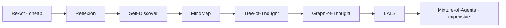
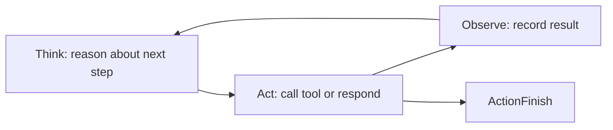
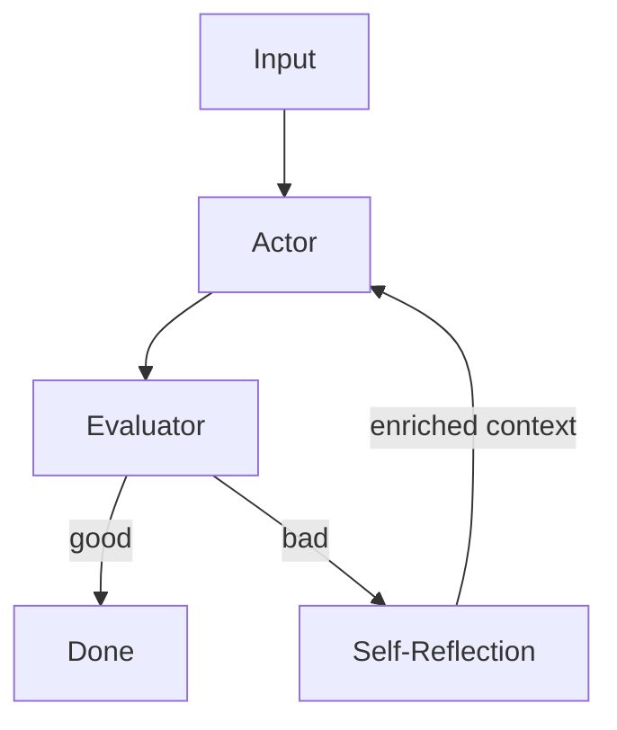
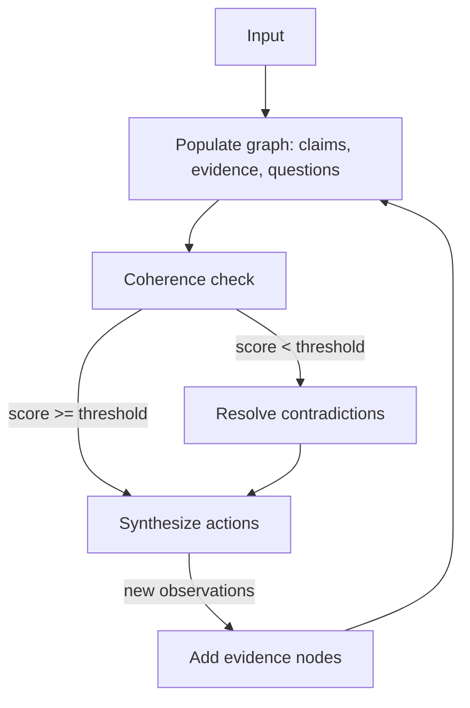
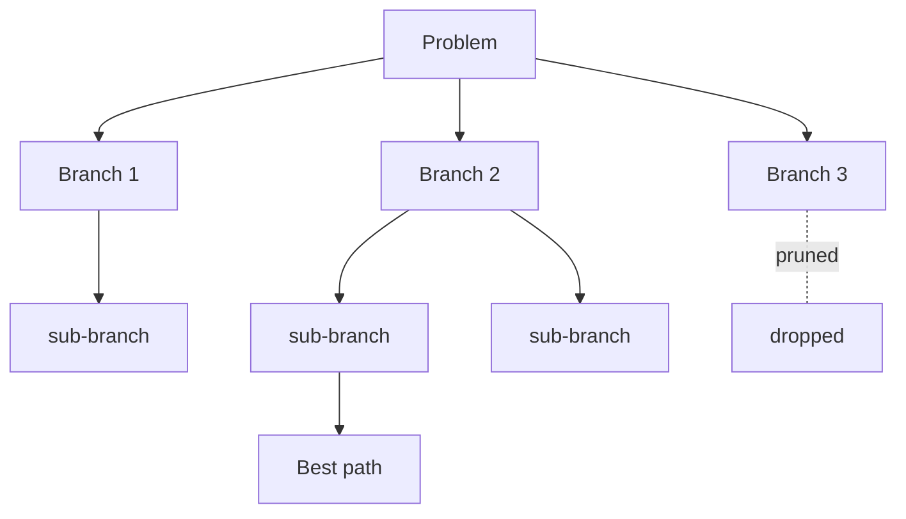
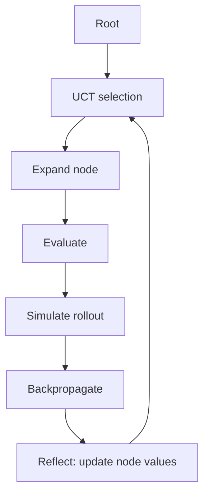
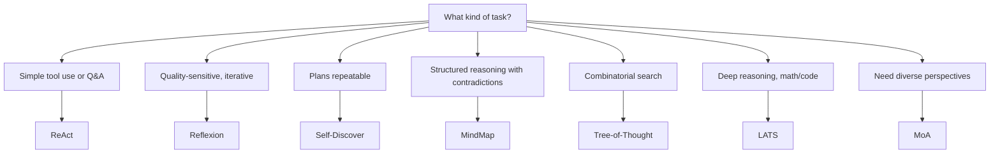
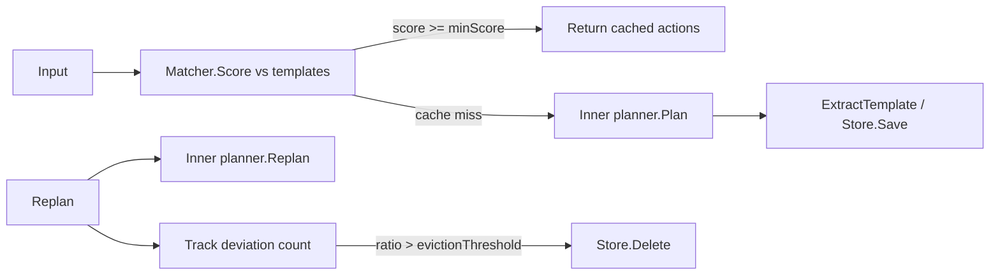
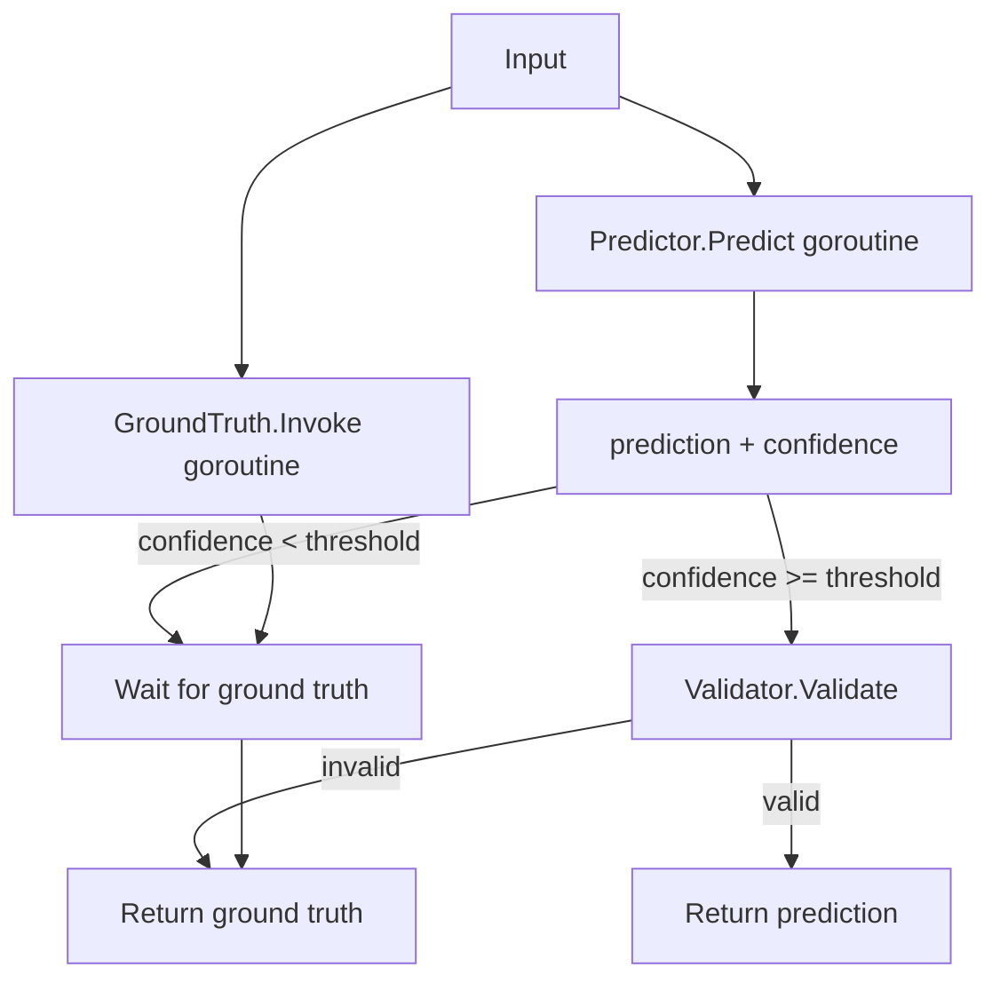

# DOC-06: Reasoning Strategies

**Audience:** Anyone choosing a planner or implementing a new one.
**Prerequisites:** [05 — Agent Anatomy](./05-agent-anatomy.md).
**Related:** [04 — Data Flow](./04-data-flow.md), [Custom Planner guide](../guides/custom-planner.md).

## Overview

A planner decides *what an agent does next*. Beluga ships eight reasoning strategies that trade off cost against quality. Pick the cheapest one that gives acceptable results for your task — upgrading is a one-line change because every planner implements the same `Planner` interface. Run `agent.ListPlanners()` at runtime to see what is registered in your build.

## The eight strategies, cheapest to most expensive



| Strategy | LLM calls/turn | Best for |
|---|---|---|
| ReAct | 1 | Simple tool use, general tasks |
| Reflexion | 2-3 | Quality-sensitive, iterative improvement |
| Self-Discover | 2 | Cost-sensitive planning, reusable plans |
| MindMap | 2-4 | Structured reasoning with contradiction detection |
| Tree-of-Thought | 5-20 | Combinatorial search, puzzles |
| Graph-of-Thought | 5-20 | Reasoning with cycles and merging |
| LATS | 20-100 | Deep reasoning, math proofs, code synthesis |
| Mixture-of-Agents | 10-50 | Diverse perspectives, final ensemble |

### ReAct — Think → Act → Observe



The default. The model outputs a thought, an action, observes the result, and repeats. One LLM call per iteration. Works for 80% of use cases.

### Reflexion — Actor + Evaluator + Self-Reflection



Three roles, all played by the same LLM with different prompts. The actor produces a solution, the evaluator grades it, and self-reflection generates notes that feed back into the next actor attempt. Good for tasks where you can detect poor output but not prevent it.

### Self-Discover

The model first composes a task-specific reasoning plan ("decompose → find evidence → synthesise"), then executes it. The plan is cached and reused for similar inputs. Cheaper than full Tree-of-Thought, more structured than ReAct.

### MindMap — Structured Reasoning Graph

`MindMapPlanner` constructs a typed reasoning graph — claims, evidence, questions, and conclusions connected by support, contradiction, derivation, and refinement edges — before synthesising actions. At each iteration it adds nodes from the LLM's structured output, then runs coherence checking. When the coherence score falls below the configured threshold, the planner asks the LLM to resolve contradictions before synthesising.



**Source:** `agent/mindmap.go:55-130` — `MindMapPlanner` struct, `Plan`, and `Replan`.

The graph is reset on each `Plan` call and updated incrementally on each `Replan` call. `PlannerState.Metadata` is not used for graph persistence — the graph lives in the planner struct across the Plan/Replan lifecycle of one agent loop. This means `MindMapPlanner` is stateful within a single agent turn but stateless across sessions.

`WithMaxNodes(n)` caps total nodes per iteration (default 20). `WithCoherenceThreshold(t)` sets the minimum acceptable coherence score (default 0.5). The planner auto-registers as `"mindmap"` in `init()` (`agent/mindmap.go:17`).

### Tree-of-Thought



Expand multiple branches, evaluate each as "sure/maybe/impossible", prune bad branches, continue down the best. BFS or DFS. Useful for puzzles, games, combinatorial optimisation.

### Graph-of-Thought

Like ToT, but the reasoning graph can merge branches and cycle. Used when partial solutions can be combined.

### LATS — Language Agent Tree Search



Six operations: selection (UCT), expansion, evaluation, simulation, backpropagation, reflection. Parallelisable — each branch can run in its own goroutine. Best for very deep or hard-to-verify tasks where exploration is worth the token cost.

### Mixture-of-Agents (MoA)

Run N diverse agents (different planners, different models) in parallel. Aggregate their outputs with a meta-agent. Expensive but produces more robust answers than any single run.

## The Planner interface

```go
// agent/planner.go — conceptual
type Planner interface {
    Plan(ctx context.Context, state PlannerState) ([]Action, error)
    Replan(ctx context.Context, state PlannerState, obs Observation) ([]Action, error)
}

type PlannerState struct {
    Input        string
    Messages     []schema.Message
    Tools        []Tool
    Observations []Observation
    Iteration    int
    Metadata     map[string]any // planner-specific state
}

type Action interface {
    isAction()
}

type ActionTool struct {
    Tool  string
    Input map[string]any
}
type ActionRespond struct { Text string }
type ActionFinish   struct { Output any }
type ActionHandoff  struct { Target string }
```

### Why `Planner` is separate from `Agent`

Decoupling "how it thinks" from "what it can do". One agent can swap planners without touching its tools, memory, or persona. One planner can drive many different agents.

### Why `PlannerState.Metadata map[string]any`

Planner-specific state. ToT stores the branch tree. LATS stores node values. Self-Discover stores the cached plan. The executor doesn't care about the contents — it just passes `Metadata` back to the planner on each `Replan` call.

## Registering a custom planner

```go
package myplanner

import (
    "github.com/lookatitude/beluga-ai/v2/agent"
)

func init() {
    agent.RegisterPlanner("beam-search", func(cfg agent.PlannerConfig) (agent.Planner, error) {
        return &BeamSearchPlanner{
            width: cfg.Get("width", 5).(int),
            depth: cfg.Get("depth", 10).(int),
        }, nil
    })
}
```

Same registry pattern as [DOC-03](./03-extensibility-patterns.md). Import for side-effects and it's available.

## Selecting a strategy



Start with ReAct. Upgrade only when you have a measurable quality gap and a budget for more tokens. Never pick LATS for a use case that ReAct handles — the cost difference is 20-100x.

## agent/plancache — Plan-Level Caching [experimental]

`agent/plancache` is a strategy-agnostic optimisation layer that caches the action sequences produced by any planner. It wraps the planner; callers see the same `agent.Planner` interface.



**Key interfaces:**

- `Store` (`agent/plancache/store.go:7-23`) — `Save`, `Get`, `List`, `Delete`. `InMemoryStore` ships for testing; implement `Store` for Redis- or Postgres-backed persistence.
- `Matcher` (`agent/plancache/matcher.go:8-12`) — returns a `[0.0, 1.0]` similarity score for `(input, template)` pairs. The default keyword matcher registers as `"keyword"`.
- `Template` (`agent/plancache/template.go:12-43`) — captures the input, keyword fingerprint, action sequence, success/deviation counts, and a `DeviationRatio()` method used for eviction.

**Wiring a cached planner** (simplest path via `plancache.WrapPlanner`, `agent/plancache/integration.go:17`):

```go
import (
    "context"
    "github.com/lookatitude/beluga-ai/v2/agent/plancache"
)

cached, err := plancache.WrapPlanner(myPlanner,
    plancache.WithMinScore(0.7),
    plancache.WithMaxTemplates(50),
    plancache.WithEvictionThreshold(0.4),
    plancache.WithHooks(plancache.Hooks{
        OnCacheHit: func(ctx context.Context, tmpl *plancache.Template, score float64) {
            // observe cache hits
        },
        OnTemplateEvicted: func(ctx context.Context, tmpl *plancache.Template) {
            // observe evictions
        },
    }),
)
if err != nil {
    return err
}
```

**Eviction:** every `Replan` call increments `Template.DeviationCount`. When `DeviationRatio()` exceeds `evictionThreshold` (default 0.5), the template is deleted. Plans that required frequent replanning are not served from cache.

**Namespace isolation:** `CachedPlanner` derives the agent namespace from `state.Metadata["agent_id"]` (`agent/plancache/cached_planner.go:224`). If this key is absent, all planners fall into the `"default"` namespace and may share templates. Set `state.Metadata["agent_id"]` explicitly when multiple planners share a store.

**When to use:** tasks that recur structurally — ticket triage, document routing, data extraction pipelines — where the same tool sequence applies to most inputs. `plancache` is transparent to the planner it wraps and compatible with every strategy.

## agent/speculative — Speculative Execution [experimental]

`agent/speculative` runs a cheap `Predictor` and the full ground-truth agent in parallel. If the predictor's result is validated before the ground-truth finishes, it is returned with a measurable latency speedup — similar to speculative execution in CPU pipelines.



**Key interfaces** (`agent/speculative/predictor.go:13-15`, `agent/speculative/validator.go:10-13`):

```go
type Predictor interface {
    Predict(ctx context.Context, input string) (prediction string, confidence float64, err error)
}

type Validator interface {
    Validate(ctx context.Context, prediction, groundTruth string) (valid bool, err error)
}
```

Built-in implementations:

- `LightModelPredictor` (`agent/speculative/predictor.go:21`) — uses any `llm.ChatModel`. Confidence is estimated from response length (shorter = higher confidence, per heuristic at `agent/speculative/predictor.go:54`).
- `ExactValidator` — case-normalised exact match.
- `SemanticValidator` — cosine similarity of TF vectors with a configurable threshold.

**Metrics** (`agent/speculative/metrics.go`) track `HitRate()`, total speedup, and wasted tokens from mispredictions. Instrument these before setting the confidence threshold in production.

**Streaming path:** when `WithFastAgent` is configured and predictor confidence exceeds the threshold, the fast agent's stream is used directly (`agent/speculative/executor.go:253-316`). Without `WithFastAgent`, streaming always falls back to the ground-truth agent.

**When to use:** the ground-truth agent is expensive (e.g., LATS or MoA) and a large fraction of inputs have predictable answers a lighter model can supply. A hit rate below roughly 40% typically means the speedup is outweighed by the wasted predictor tokens.

## Common mistakes

- **Comparing planners without a benchmark.** "Reflexion is better" is meaningless without a task suite. Use `eval/` to measure before you upgrade.
- **Forgetting that planners use the same LLM.** If your LLM is rate-limited, switching to LATS makes the problem worse, not better.
- **Using MoA with identical agents.** The point of ensemble is *diversity*. Running the same agent 5 times gets you no new information.
- **Mutating `PlannerState.Metadata` in the executor.** That's the planner's private storage. The executor round-trips it untouched.
- **Using `plancache` without setting `state.Metadata["agent_id"]`.** Missing agent IDs put all planners in the same `"default"` namespace and templates bleed across unrelated agents.
- **Deploying speculative execution without measuring hit rate.** A low hit rate means every request pays predictor cost with no benefit. Always baseline `Metrics().HitRate()` in a shadow-run before routing real traffic.
- **Treating MindMap as a drop-in for Tree-of-Thought.** MindMap builds a typed knowledge graph and is better for reasoning problems with known contradictions. ToT explores a search tree and is better for combinatorial problems with a reachable goal state.

## Related reading

- [04 — Data Flow](./04-data-flow.md) — how the executor calls the planner.
- [05 — Agent Anatomy](./05-agent-anatomy.md) — where the planner lives inside an agent, and the experimental agent architectures.
- [Custom Planner guide](../guides/custom-planner.md) — end-to-end example of implementing one.
