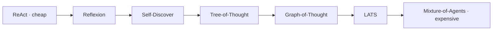
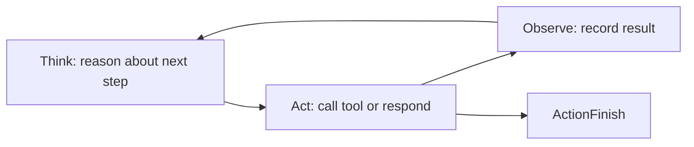
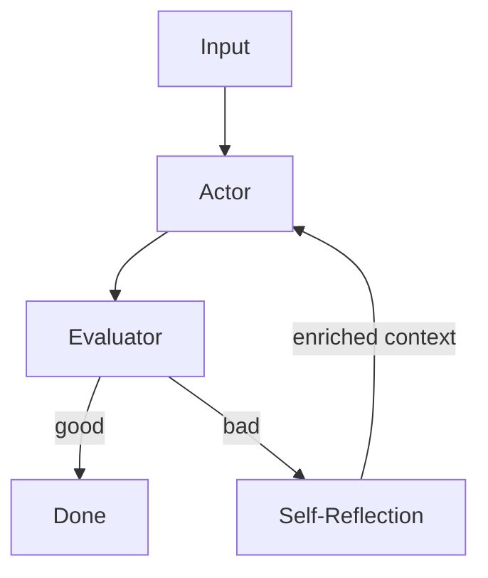
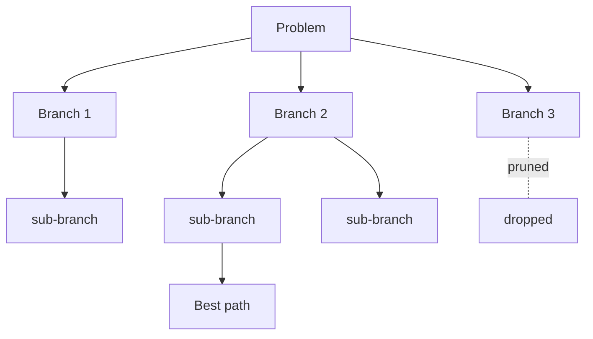
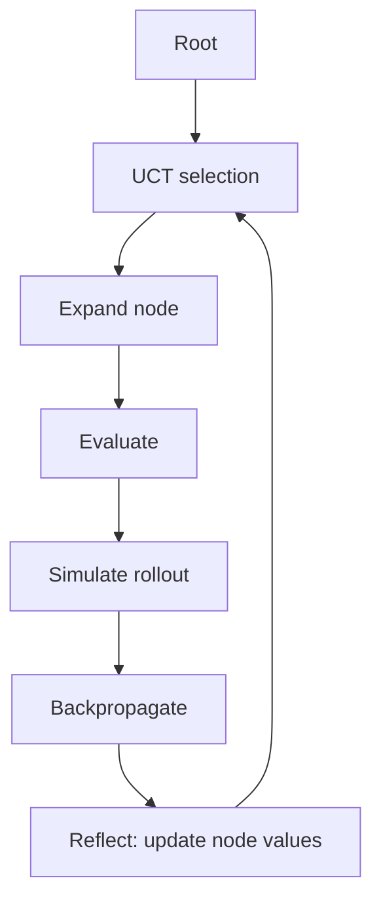
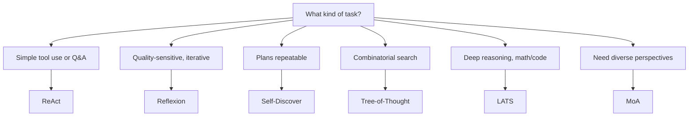

# DOC-06: Reasoning Strategies

**Audience:** Anyone choosing a planner or implementing a new one.
**Prerequisites:** [05 — Agent Anatomy](./05-agent-anatomy.md).
**Related:** [04 — Data Flow](./04-data-flow.md), [Custom Planner guide](../guides/custom-planner.md).

## Overview

A planner decides *what an agent does next*. Beluga ships seven reasoning strategies that trade off cost against quality. Pick the cheapest one that gives acceptable results for your task — upgrading is a one-line change because every planner implements the same `Planner` interface.

**Status note:** some of the advanced strategies below (LATS, MoA) are on the roadmap but may not be fully implemented yet. Check `agent/planners/` for the current list and use `planner.List()` at runtime to see what's registered.

## The seven strategies, cheapest to most expensive



| Strategy | LLM calls/turn | Best for |
|---|---|---|
| ReAct | 1 | Simple tool use, general tasks |
| Reflexion | 2-3 | Quality-sensitive, iterative improvement |
| Self-Discover | 2 | Cost-sensitive planning, reusable plans |
| Tree-of-Thought | 5-20 | Combinatorial search, puzzles |
| Graph-of-Thought | 5-20 | Reasoning with cycles and merging |
| LATS | 20-100 | Deep reasoning, math proofs, code synthesis |
| Mixture-of-Agents | 10-50 | Diverse perspectives, final ensemble |

### ReAct — Think → Act → Observe



The default. The model outputs a thought, an action, observes the result, and repeats. One LLM call per iteration. Works for 80% of use cases.

### Reflexion — Actor + Evaluator + Self-Reflection



Three roles, all played by the same LLM with different prompts. The actor produces a solution, the evaluator grades it, and self-reflection generates notes that feed back into the next actor attempt. Good for tasks where you can detect poor output but not prevent it.

### Self-Discover

The model first composes a task-specific reasoning plan ("decompose → find evidence → synthesise"), then executes it. The plan is cached and reused for similar inputs. Cheaper than full Tree-of-Thought, more structured than ReAct.

### Tree-of-Thought



Expand multiple branches, evaluate each as "sure/maybe/impossible", prune bad branches, continue down the best. BFS or DFS. Useful for puzzles, games, combinatorial optimisation.

### Graph-of-Thought

Like ToT, but the reasoning graph can merge branches and cycle. Used when partial solutions can be combined.

### LATS — Language Agent Tree Search



Six operations: selection (UCT), expansion, evaluation, simulation, backpropagation, reflection. Parallelisable — each branch can run in its own goroutine. Best for very deep or hard-to-verify tasks where exploration is worth the token cost.

### Mixture-of-Agents (MoA)

Run N diverse agents (different planners, different models) in parallel. Aggregate their outputs with a meta-agent. Expensive but produces more robust answers than any single run.

## The Planner interface

```go
// agent/planner.go — conceptual
type Planner interface {
    Plan(ctx context.Context, state PlannerState) ([]Action, error)
    Replan(ctx context.Context, state PlannerState, obs Observation) ([]Action, error)
}

type PlannerState struct {
    Input        string
    Messages     []schema.Message
    Tools        []Tool
    Observations []Observation
    Iteration    int
    Metadata     map[string]any // planner-specific state
}

type Action interface {
    isAction()
}

type ActionTool struct {
    Tool  string
    Input map[string]any
}
type ActionRespond struct { Text string }
type ActionFinish   struct { Output any }
type ActionHandoff  struct { Target string }
```

### Why `Planner` is separate from `Agent`

Decoupling "how it thinks" from "what it can do". One agent can swap planners without touching its tools, memory, or persona. One planner can drive many different agents.

### Why `PlannerState.Metadata map[string]any`

Planner-specific state. ToT stores the branch tree. LATS stores node values. Self-Discover stores the cached plan. The executor doesn't care about the contents — it just passes `Metadata` back to the planner on each `Replan` call.

## Registering a custom planner

```go
package myplanner

import (
    "github.com/lookatitude/beluga-ai/agent"
)

func init() {
    agent.RegisterPlanner("beam-search", func(cfg agent.PlannerConfig) (agent.Planner, error) {
        return &BeamSearchPlanner{
            width: cfg.Get("width", 5).(int),
            depth: cfg.Get("depth", 10).(int),
        }, nil
    })
}
```

Same registry pattern as [DOC-03](./03-extensibility-patterns.md). Import for side-effects and it's available.

## Selecting a strategy



Start with ReAct. Upgrade only when you have a measurable quality gap and a budget for more tokens. Never pick LATS for a use case that ReAct handles — the cost difference is 20-100×.

## Common mistakes

- **Comparing planners without a benchmark.** "Reflexion is better" is meaningless without a task suite. Use `eval/` to measure before you upgrade.
- **Forgetting that planners use the same LLM.** If your LLM is rate-limited, switching to LATS makes the problem worse, not better.
- **Using MoA with identical agents.** The point of ensemble is *diversity*. Running the same agent 5 times gets you no new information.
- **Mutating `PlannerState.Metadata` in the executor.** That's the planner's private storage. The executor round-trips it untouched.

## Related reading

- [04 — Data Flow](./04-data-flow.md) — how the executor calls the planner.
- [05 — Agent Anatomy](./05-agent-anatomy.md) — where the planner lives inside an agent.
- [Custom Planner guide](../guides/custom-planner.md) — end-to-end example of implementing one.
