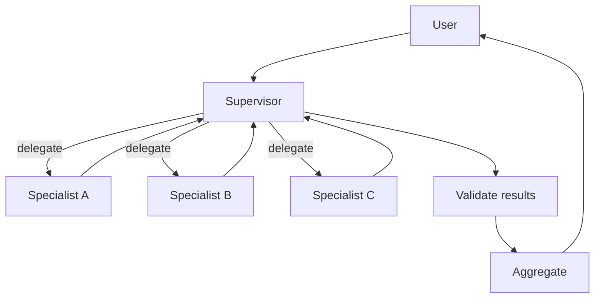
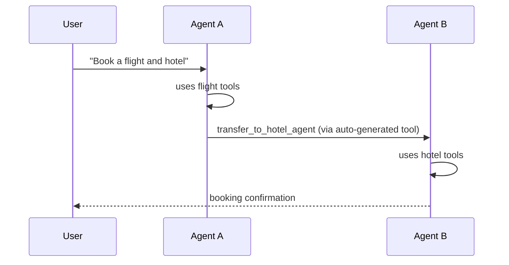
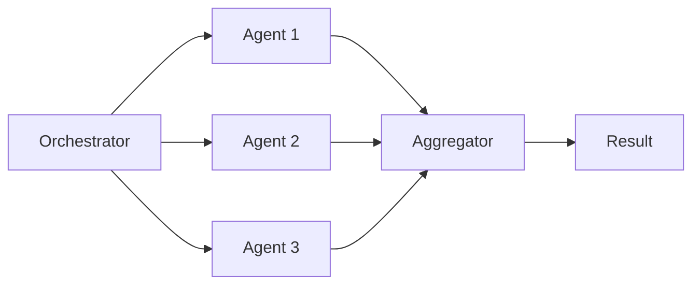
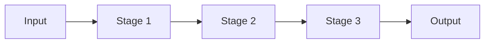
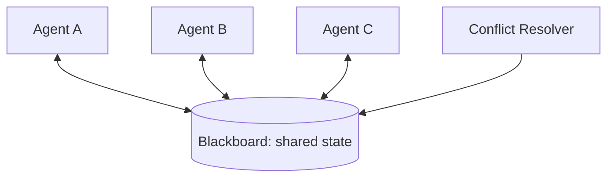
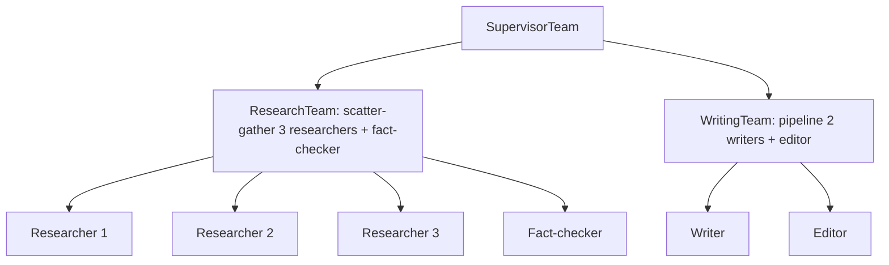
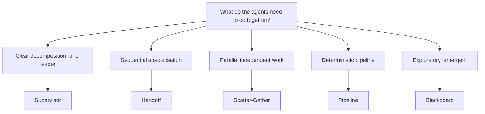

# DOC-07: Orchestration Patterns

**Audience:** Anyone building multi-agent systems.
**Prerequisites:** [05 — Agent Anatomy](./05-agent-anatomy.md).
**Related:** [04 — Data Flow](./04-data-flow.md), [Multi-Agent Team guide](../guides/multi-agent-team.md).

## Overview

Five orchestration patterns ship as implementations of the `OrchestrationPattern` interface. Each one is a way for multiple agents to coordinate. Because teams are themselves agents, patterns compose recursively.

## Pattern comparison

| Pattern | Coordination | Communication | Best for |
|---|---|---|---|
| **Supervisor** | Centralised | Supervisor ↔ specialist | Clear task decomposition |
| **Handoff** | Sequential | Direct transfer | Conversational specialisation |
| **Scatter-Gather** | Parallel fan-out | Independent branches | Map-reduce style tasks |
| **Pipeline** | Linear | Stage → stage | Transformations in order |
| **Blackboard** | Shared state | Read/write blackboard | Emergent collaboration |

## 1. Supervisor



A central coordinator decomposes the task, delegates to specialists, validates their results, and aggregates. Good when one agent has planning smarts and the others have narrow expertise.

## 2. Handoff



Agent A decides it can't handle the rest of the task and hands off to agent B. Control transfers via the auto-generated `transfer_to_*` tool. An `InputFilter` rewrites the context that B sees (so B doesn't inherit A's irrelevant reasoning).

**Why handoff is a tool:** the LLM already knows how to pick tools. No new mechanism required. See [DOC-05](./05-agent-anatomy.md#handoffs-are-tools).

## 3. Scatter-Gather



Fan the same input out to N agents in parallel (each in its own goroutine), collect results through a channel, aggregate. The aggregator is itself an agent — it can vote, average, or synthesise a combined answer.

Use for: map-reduce tasks, ensemble voting, coverage-oriented search.

## 4. Pipeline



Linear sequence. Stage N's output is stage N+1's input. Stages can be mixed (one LLM agent, one retrieval-only agent, one tool-only agent).

Use for: deterministic transformations, ETL-style workflows, explicit multi-step processes.

## 5. Blackboard



Agents communicate only through shared state (a "blackboard"). Each agent reads what it's interested in, writes its contributions, and the conflict resolver handles contradictions. Termination occurs on consensus or a fixed iteration budget.

Use for: brainstorming, exploratory research, emergent collaboration where the decomposition isn't known in advance.

## Recursive composition

Because teams *are* agents, a team can be a member of a bigger team:



`ResearchTeam` and `WritingTeam` are `TeamAgent` instances. `SupervisorTeam` treats them as regular specialists — it doesn't know or care that they're composite.

**Refactorability:** if `Researcher 1` later needs to itself become a sub-team, you swap it out with zero changes to `SupervisorTeam`.

## The OrchestrationPattern interface

```go
// orchestration/pattern.go — conceptual
type OrchestrationPattern interface {
    Name() string
    Run(ctx context.Context, team Team, input any) (*core.Stream[core.Event[any]], error)
}

// teams use their assigned pattern
type TeamAgent struct {
    BaseAgent
    pattern  OrchestrationPattern
    members  []Agent
    bus      EventBus
}
```

Implementations register via `orchestration.RegisterPattern()`. Custom patterns are first-class — you can ship a research team that uses a novel coordination strategy and other teams can embed it.

## Event bus

Teams share an optional `EventBus` for async messages that aren't direct tool calls. Useful for:

- **Progress updates** — "Agent A finished phase 1".
- **Coordination signals** — "Agent B can start; A's results are ready".
- **Debugging streams** — observe all agent activity in one place.

```go
// events flow through the bus without blocking the executor
bus.Publish(ctx, "research.phase1.done", payload)
```

The bus is async and non-blocking. An agent doesn't block waiting for subscribers.

## Selecting a pattern



Start with Supervisor or Handoff. Scatter-Gather when independence is genuine (not when agents secretly need each other's outputs). Pipeline when the stages are truly linear. Blackboard rarely — it's powerful but hard to debug.

## Common mistakes

- **Blackboard for tasks that could be a pipeline.** Blackboard is non-deterministic. If a pipeline works, use the pipeline.
- **Handoff without an `InputFilter`.** Agent B inherits agent A's entire context by default — including irrelevant reasoning. Filter aggressively.
- **Treating scatter-gather as "a team of one".** If you scatter to a single agent, you don't have scatter-gather; you have a single agent wrapped in ceremony.
- **Direct coupling between team members.** Members should communicate through the pattern (supervisor mediation, event bus) — not by importing each other's types.

## Related reading

- [05 — Agent Anatomy](./05-agent-anatomy.md) — teams are agents.
- [04 — Data Flow](./04-data-flow.md) — how events flow through a team's executor.
- [Multi-Agent Team guide](../guides/multi-agent-team.md) — a complete example.
