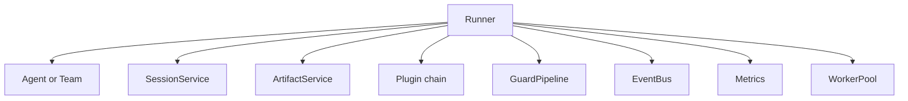
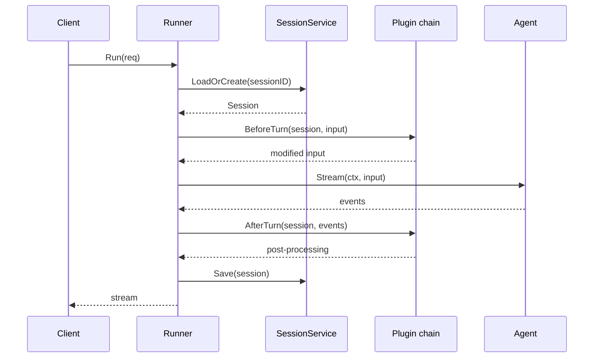
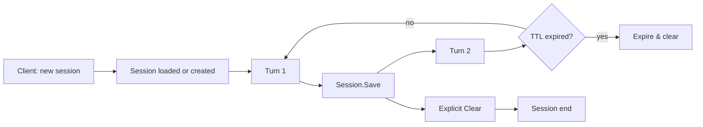
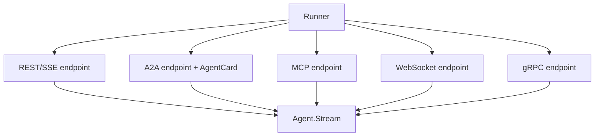
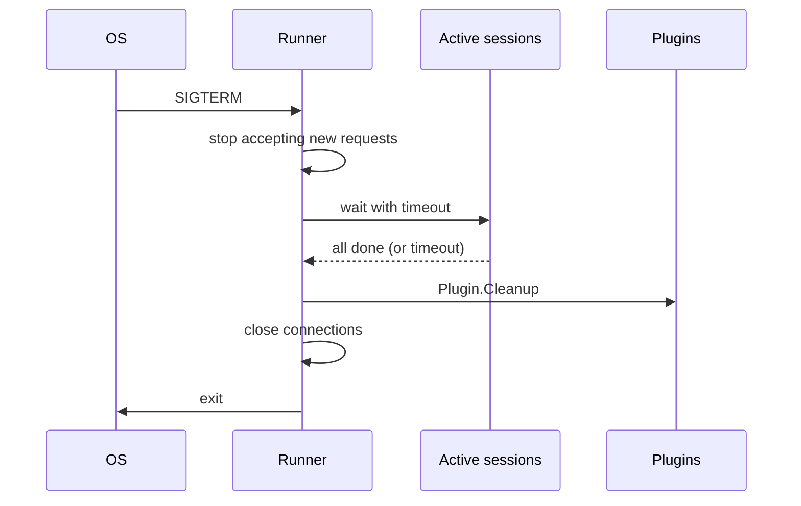

# DOC-08: Runner and Lifecycle Management

**Audience:** Anyone deploying or operating a Beluga agent.
**Prerequisites:** [05 — Agent Anatomy](./05-agent-anatomy.md).
**Related:** [04 — Data Flow](./04-data-flow.md), [12 — Protocol Layer](./12-protocol-layer.md), [17 — Deployment Modes](./17-deployment-modes.md).

## Overview

The **Runner** is Beluga's deployment boundary. An `Agent` describes behaviour; a `Runner` gives that agent a session store, plugins, guards, metrics, and a network interface. One agent can be wrapped by many runners; one runner hosts exactly one agent (or team — which is an agent).

## Runner composition



- **Agent/Team** — the behaviour being hosted.
- **SessionService** — persists per-session state (`inmemory`, `redis`, `postgres`, `sqlite`).
- **ArtifactService** — stores large outputs (files, images, audio) referenced by sessions.
- **Plugin chain** — runner-level interception, `BeforeTurn` and `AfterTurn`.
- **GuardPipeline** — the 3-stage input/tool/output safety check.
- **EventBus** — for team-internal async messaging.
- **Metrics** — OTel counters/histograms per turn.
- **WorkerPool** — bounded concurrency for tool calls and sub-agent invocations.

## Turn execution



## Plugins vs hooks

Two interception layers — this is the confusion everyone hits:

| Hook | Plugin |
|---|---|
| Agent-level | Runner-level |
| Fires at lifecycle moments (`BeforePlan`, `OnToolCall`) | Fires at turn boundaries (`BeforeTurn`, `AfterTurn`) |
| See specific events | See the full turn |
| Added via `Agent.SetHooks(…)` | Added via `runner.Use(plugin)` |

**Use a hook** when the concern is about *what the agent is doing* (intercept a specific tool call, log a planner decision).

**Use a plugin** when the concern is about *the turn as a whole* (record an audit row, charge the tenant's cost budget, start an OTel trace).

## Plugin chain

```go
// runtime/plugin.go — conceptual
type Plugin interface {
    Name() string
    BeforeTurn(ctx context.Context, session *Session, input any) (any, error)
    AfterTurn(ctx context.Context, session *Session, events []Event) error
}
```

Plugins execute in order. Each `BeforeTurn` can modify the input for the next plugin. Each `AfterTurn` sees the full event list.

Built-in plugins:
- **audit** — records request/response for compliance.
- **cost** — checks budget, tallies token/cost per turn.
- **tracing** — creates the root OTel span.
- **metrics** — increments turn counters and histograms.

## Session lifecycle



A session holds:

- **Messages** — conversation history (what the client and agent exchanged).
- **Metadata** — session-scoped key/value for plugins and hooks.
- **Artifacts** — references to large content stored in `ArtifactService`.
- **TTL** — optional expiry.

Sessions are **opaque to the agent**. The agent sees messages, not the session object. This lets you swap `SessionService` implementations (`inmemory` → `redis` → `postgres`) without changing agent code.

## Runner.Serve — protocol exposure

One runner exposes its agent over multiple protocols simultaneously:



All protocols route to the same `Agent.Stream` call internally. You configure them via functional options:

```go
r := runtime.NewRunner(agent,
    runtime.WithSessionService(redisSessions),
    runtime.WithPlugin(auditPlugin),
    runtime.WithPlugin(costPlugin),
    runtime.WithGuards(guardPipeline),
    runtime.WithRESTEndpoint("/api/chat"),
    runtime.WithA2A("/.well-known/agent.json"),
    runtime.WithMCPEndpoint("/mcp"),
)
if err := r.Serve(ctx, ":8080"); err != nil {
    log.Fatal(err)
}
```

See [DOC-12](./12-protocol-layer.md) for protocol details.

## Graceful shutdown



`Runner.Serve` listens for `SIGTERM`/`SIGINT`. On shutdown:

1. Stop accepting new requests (listener closes).
2. Wait for active sessions to finish (with a configurable drain timeout).
3. Call `Cleanup` on each plugin (flush audit logs, close DB connections).
4. Close all network connections.
5. Exit cleanly.

This is the only way to guarantee no half-written audit records, no leaked database connections, no dropped events.

## Why Runner is separate from Agent

- **Agent** defines behaviour. It's a value you can unit-test with no network.
- **Runner** manages the hosting. It owns sessions, plugins, network, lifecycle.

This separation means you can run the same agent in-process (test), wrapped in a Runner (production), inside a Kubernetes operator (orchestrated), or inside a Temporal worker (durable). See [DOC-17](./17-deployment-modes.md).

## Common mistakes

- **Putting cross-cutting concerns in agent hooks instead of plugins.** Audit and cost apply to every turn uniformly — they're runner-level.
- **Forgetting to drain on shutdown.** If your deployment doesn't handle `SIGTERM`, Kubernetes will `SIGKILL` you after 30 seconds and you'll drop in-flight turns.
- **Holding the session in memory across runners.** Use `redis` or `postgres` session services if you have more than one runner instance.
- **Calling `Agent.Stream` without a Runner in production.** You'll get no guards, no audit, no cost tracking. Fine for tests, disastrous in production.

## Related reading

- [04 — Data Flow](./04-data-flow.md) — what happens inside `Agent.Stream`.
- [12 — Protocol Layer](./12-protocol-layer.md) — how the runner exposes protocols.
- [17 — Deployment Modes](./17-deployment-modes.md) — the four ways to run a Runner.
- [Deploy on Docker](../guides/deploy-docker.md) — a concrete example.
