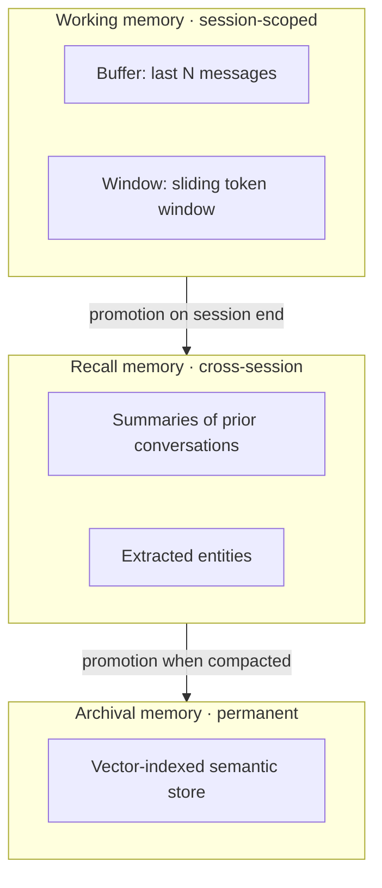
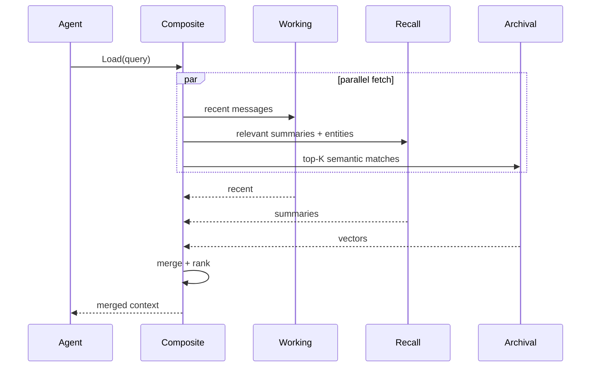
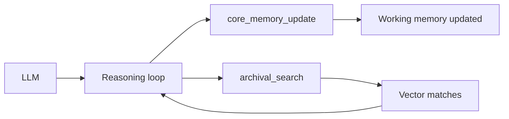
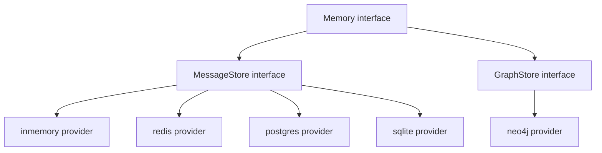

# DOC-09: Memory Architecture

**Audience:** Anyone whose agent needs to remember things between turns or sessions.
**Prerequisites:** [03 — Extensibility Patterns](./03-extensibility-patterns.md), [05 — Agent Anatomy](./05-agent-anatomy.md).
**Related:** [10 — RAG Pipeline](./10-rag-pipeline.md), [`patterns/provider-template.md`](../patterns/provider-template.md).

## Overview

Beluga models memory in three tiers plus an optional graph layer, following the MemGPT design. Each tier has different latency, capacity, and persistence characteristics. The `Composite` memory implementation merges all tiers on every load, and the agent is given memory-management tools so it can curate its own memory actively.

## The three tiers



### Working memory

Session-scoped. Holds the most recent N messages (or the last K tokens worth). Lowest latency, smallest capacity. Forgotten when the session TTL expires.

Two variants:

- **Buffer** — last N messages verbatim.
- **Window** — last K tokens, with older messages elided or summarised.

### Recall memory

Cross-session. Stores summaries of prior conversations, extracted entities, and topic indexes. Medium latency, moderate capacity. Survives session expiry.

Used for: "what did I discuss with this user last week?"

### Archival memory

Permanent. Vector-indexed semantic store keyed by embedding similarity. Highest latency, effectively unlimited capacity. Never forgotten.

Used for: "have I seen anything relevant to this query, ever?"

## Composite memory on load



The composite memory fetches from all three tiers in parallel, merges the results (deduplicating, ranking by relevance), and returns a single combined context. The agent sees one list, not three.

## Self-editable memory (the MemGPT pattern)

Instead of relying on automatic memory management, Beluga injects memory tools so the agent can update its own memory during reasoning:

```
core_memory_update(section, content)       # edit working memory
recall_search(query)                       # search recall
archival_search(query)                     # search archival
archival_insert(content)                   # add to archival
```



The agent treats memory like any other tool. It can decide "this fact is important, pin it to working memory" or "I don't remember — search archival first". This active management is why MemGPT produces coherent long-term conversations.

## Graph memory

Separate from the three tiers: a graph store (entity → relation → entity). During `Memory.Save`:

1. The LLM extracts entities from the turn ("Alice", "Zurich", "meeting").
2. Extracts relations ("Alice is_at Zurich", "Alice has_meeting at 3pm").
3. Writes them to the graph store.

During `Memory.Load`:

1. Extract entities from the current query.
2. Traverse the graph to find connected entities.
3. Return the connected subgraph as additional context.

Use when: relationships between concepts matter more than semantic similarity. Typical for assistants that manage schedules, people, or inventory.

## Store backend architecture



A `Memory` implementation can swap its underlying `MessageStore` without changing its logic. This lets you develop on `inmemory`, deploy on `redis`, and migrate to `postgres` without touching agent code.

Same registry pattern as [DOC-03](./03-extensibility-patterns.md):

```go
import _ "github.com/lookatitude/beluga-ai/memory/stores/redis"

store, _ := memory.NewMessageStore("redis", memory.Config{Addr: "redis:6379"})
mem := memory.NewComposite(store, vectorStore, graphStore)
```

## Why three tiers, not one

A single vector store for everything doesn't work. The cost/latency profile of vector search is wrong for "what did the user just say?" — you'd do a vector query to retrieve the previous turn, which is absurd.

Three tiers match how human cognition handles memory:

| Tier | Human analogue | Beluga implementation |
|---|---|---|
| Working | Short-term, chat-style | Last N messages |
| Recall | Episodic, "I remember that" | Summaries, entities |
| Archival | Semantic, "I know that" | Vector-indexed corpus |

Each has the right latency for its use case. The composite layer hides the complexity.

## Why memory tools are auto-injected

The agent manages its own memory. A human who stops making notes on a long task forgets things; the model is no different. By giving the agent `core_memory_update`, `recall_search`, and `archival_search`, the planner can include "update my notes" as part of its next action. Passive memory management (framework decides what to save) loses fidelity; active (agent decides) doesn't.

## Common mistakes

- **Vector-searching for conversation history.** Use working memory for recent turns. Vectors are for "have I ever seen this before" queries.
- **Saving everything to archival immediately.** Archival grows forever — be selective. Use recall as a curator's pass before promotion.
- **Ignoring entity extraction.** If your use case has graph structure (people, places, events), the graph tier is the difference between a chatbot and an assistant.
- **Sharing one `MessageStore` across tenants.** Multi-tenant isolation lives at the `core.WithTenant(ctx)` level, and every store must honour it.

## Advanced memory systems

Six sub-packages extend the 3-tier model with specialised capabilities. They live under `memory/` and are imported independently. Each stands alone: you can use any combination without pulling in the others.

### `memory/associative` — Zettelkasten-style note graph

Associative memory stores content as `schema.Note` records with bidirectional links. When a note is added, the package runs a five-step pipeline: LLM enrichment (keywords, tags, summary) → embedding → storage → link discovery (cosine similarity, up to `k` neighbors) → optional retroactive refinement of linked notes. The result is a graph where each note is semantically connected to related notes.

The primary type is `AssociativeMemory`, which implements `memory.Memory` ([`memory/associative/associative.go:19`](../../memory/associative/associative.go)) so it can slot into a `Composite` as the archival tier or stand alone. Storage is abstracted behind `NoteStore` ([`memory/associative/store.go:17`](../../memory/associative/store.go)):

```go
// memory/associative/store.go:17-39
type NoteStore interface {
    Add(ctx context.Context, note *schema.Note) error
    Get(ctx context.Context, id string) (*schema.Note, error)
    Update(ctx context.Context, note *schema.Note) error
    Delete(ctx context.Context, id string) error
    Search(ctx context.Context, queryVec []float32, k int) ([]*schema.Note, error)
    List(ctx context.Context) ([]*schema.Note, error)
}
```

`InMemoryNoteStore` ships for development. Production deployments swap it with any `NoteStore` implementation via `WithStore(store)`.

Integration with the 3-tier model: `AssociativeMemory.Save` converts output message text into a note; `Load` does a semantic search over notes and returns them as `schema.AIMessage` values. This makes it a drop-in replacement for the archival tier — cross-session knowledge is retrievable by similarity rather than by exact match.

### `memory/consolidation` — background memory housekeeping

The consolidation package runs a background `Worker` that periodically evaluates stored memory records and decides whether to keep, compress, or prune each one. Without consolidation, recall and archival tiers grow unbounded and retrieval quality degrades as stale or redundant records crowd out relevant ones.

`Worker` implements `core.Lifecycle` ([`memory/consolidation/worker.go:85`](../../memory/consolidation/worker.go)) and runs its loop in a background goroutine until `Stop` is called:

```go
// memory/consolidation/worker.go:73-85
type Worker struct { /* … */ }
var _ core.Lifecycle = (*Worker)(nil)

func NewWorker(store ConsolidationStore, opts ...Option) *Worker
func (w *Worker) Start(ctx context.Context) error
func (w *Worker) Stop(ctx context.Context) error
func (w *Worker) Health() core.HealthStatus
```

Each cycle calls `ConsolidationPolicy.Evaluate` ([`memory/consolidation/policy.go:10`](../../memory/consolidation/policy.go)) to score records. `ThresholdPolicy` uses a composite utility score with four dimensions: recency (exponential half-life decay), importance, relevance, and emotional salience. Records below the prune threshold are deleted; those in the compression band are summarised by a `Compressor`. `CycleMetrics` are delivered to an `OnCycleComplete` hook after each run.

Integration with the 3-tier model: wire a `ConsolidationStore` adapter around your recall or archival `MessageStore`. The worker operates on any store that satisfies `ConsolidationStore` ([`memory/consolidation/store.go:14`](../../memory/consolidation/store.go)) — it never touches the `memory.Memory` interface directly, which keeps consolidation decoupled from the memory tier it manages.

### `memory/procedural` — skill-based procedural memory

Procedural memory is the fourth memory tier in the MemGPT design, storing "how-to" knowledge as `schema.Skill` records. An agent can save skills it has learned (e.g. "how to escalate a support ticket") and retrieve them by semantic similarity during planning.

The primary type is `ProceduralMemory` ([`memory/procedural/procedural.go:19`](../../memory/procedural/procedural.go)):

```go
// memory/procedural/procedural.go:27-43
func New(emb embedding.Embedder, vs vectorstore.VectorStore, opts ...Option) (*ProceduralMemory, error)

func (p *ProceduralMemory) SaveSkill(ctx context.Context, skill *schema.Skill) error
func (p *ProceduralMemory) SearchSkills(ctx context.Context, query string, k int) ([]*schema.Skill, error)
func (p *ProceduralMemory) UpdateSkill(ctx context.Context, skill *schema.Skill) error
func (p *ProceduralMemory) DeleteSkill(ctx context.Context, id string) error
func (p *ProceduralMemory) GetSkill(ctx context.Context, id string) (*schema.Skill, error)
```

Skills are embedded for search over their name, description, triggers, and steps. `SearchSkills` filters by a minimum confidence threshold (configurable via `WithMinConfidence`) so low-confidence skills accumulated during exploration are not surfaced. `UpdateSkill` increments the version, re-embeds the skill, and performs a delete-then-add in the vector store to keep the index consistent.

Integration with the 3-tier model: `ProceduralMemory` is not a `memory.Memory` implementation — it is an orthogonal tier addressed directly. The agent's planner retrieves relevant skills at reasoning time via `SearchSkills("escalate support ticket", 3)` and injects them into the system prompt or uses them to prime tool selection.

### `memory/rl` — reinforcement-learning memory management

The RL package implements the Memory-R1 action space for training agents to manage their own memory more effectively. Instead of hard-coded rules for what to add or update, a learned `MemoryPolicy` can be trained via trajectories.

The core interface is `MemoryPolicy` ([`memory/rl/policy.go:11`](../../memory/rl/policy.go)):

```go
// memory/rl/policy.go:11-15
type MemoryPolicy interface {
    Decide(ctx context.Context, features PolicyFeatures) (MemoryAction, float64, error)
}
```

The four discrete actions are `ActionAdd`, `ActionUpdate`, `ActionDelete`, and `ActionNoop` ([`memory/rl/action.go:10`](../../memory/rl/action.go)). `HeuristicPolicy` ships as a rule-based baseline: it adds novel content (similarity below threshold), updates highly similar existing entries, and deletes low-utility entries when the store exceeds a size limit.

`TrajectoryCollector` ([`memory/rl/collector.go:16`](../../memory/rl/collector.go)) records `Step` sequences into `Episode` values. Once an episode ends, `Export()` serialises the full trajectory as JSON for offline training. `RewardFunc` ([`memory/rl/reward.go:12`](../../memory/rl/reward.go)) assigns per-step rewards from an episode outcome; `SimpleReward` uses binary success/failure.

Integration with the 3-tier model: the RL package wraps whichever tier an agent writes to. Before saving to recall or archival, call `policy.Decide(ctx, features)` to determine whether to add, update, skip, or delete. The policy's decision replaces the unconditional write in the 3-tier flow.

### `memory/shared` — multi-agent shared memory

Shared memory provides a keyed fragment store with access-control lists, versioning, conflict resolution, provenance tracking, and a real-time watch API. It solves the coordination problem for multi-agent teams: agents need to exchange state without coupling directly to each other.

The primary type is `SharedMemory` ([`memory/shared/shared.go:46`](../../memory/shared/shared.go)) backed by `SharedStore` ([`memory/shared/store.go:13`](../../memory/shared/store.go)):

```go
// memory/shared/shared.go (selected methods)
func (sm *SharedMemory) Write(ctx context.Context, frag *Fragment) error
func (sm *SharedMemory) Read(ctx context.Context, key string, agentID string) (*Fragment, error)
func (sm *SharedMemory) List(ctx context.Context, scope Scope, agentID string) ([]*Fragment, error)
func (sm *SharedMemory) Watch(ctx context.Context, key string) iter.Seq2[FragmentChange, error]
func (sm *SharedMemory) Grant(ctx context.Context, key, grantor, agentID string, perm Permission) error
func (sm *SharedMemory) Revoke(ctx context.Context, key, revoker, agentID string, perm Permission) error
```

Every fragment carries a `Scope` (`private`, `team`, `global`), per-key reader/writer ACLs, a conflict policy (`AppendOnly`, `LastWriteWins`, `RejectOnConflict`), and a `Provenance` record (SHA-256 content hash chain). `Watch` returns an `iter.Seq2[FragmentChange, error]` stream, consistent with the framework's streaming conventions.

Integration with the 3-tier model: shared memory is orthogonal to the per-agent tiers. A team's supervisor can write a shared summary fragment after each turn; specialist agents watch that key and react to changes without needing direct message channels.

### `memory/temporal` — bi-temporal knowledge graph

Temporal memory wraps a `TemporalGraphStore` to provide a `memory.Memory`-compatible interface with point-in-time query capability. Every entity and relation is stored with a valid-time dimension so the graph can be queried as it existed at any historical moment — essential for agents that must reason about what was true at a past point in time, not just what is true now.

`TemporalMemory` implements `memory.Memory` ([`memory/temporal/temporal.go:299`](../../memory/temporal/temporal.go)) and extends it with two additional methods:

```go
// memory/temporal/temporal.go (selected methods)
func (tm *TemporalMemory) Save(ctx context.Context, input, output schema.Message) error
func (tm *TemporalMemory) Load(ctx context.Context, query string) ([]schema.Message, error)
func (tm *TemporalMemory) LoadAt(ctx context.Context, query string, validTime time.Time) ([]schema.Message, error)
func (tm *TemporalMemory) ResolveConflicts(ctx context.Context, newRelation *memory.Relation) ([]memory.Relation, error)
func (tm *TemporalMemory) Store() memory.TemporalGraphStore
```

`Save` records each conversation turn as a pair of `message` entities connected by a `responds_to` relation. `LoadAt` delegates to `TemporalGraphStore.QueryAsOf`, which each backend implements to filter by valid time. `ResolveConflicts` runs a pluggable `ConflictResolver` that invalidates relations that contradict the incoming fact, propagating the invalidation to the store.

Integration with the 3-tier model: `TemporalMemory` replaces or augments the graph store tier. Where the basic graph store extracts entities and relations without time-awareness, temporal memory makes every stored fact queryable by the moment it became valid — useful for long-lived assistants managing schedules, contracts, or compliance facts that change over time.

## Wire types for advanced memory

Two `schema` types serve as the data contracts for the associative and procedural tiers. They are defined in Layer 1 (`schema/`) and carry no dependencies above `stdlib`.

### `schema.Note` — unit of associative memory

Defined at [`schema/note.go:9`](../../schema/note.go). A `Note` is a Zettelkasten-style knowledge unit:

| Field | Type | Purpose |
|---|---|---|
| `ID` | `string` | Unique identifier (UUID). |
| `Content` | `string` | Raw text content of the note. |
| `Keywords` | `[]string` | Semantically extracted key terms. |
| `Tags` | `[]string` | Categorical labels for filtering. |
| `Description` | `string` | LLM-generated concise summary. |
| `Embedding` | `[]float32` | Vector representation for similarity search. |
| `Links` | `[]string` | IDs of related notes (bidirectional). |
| `CreatedAt`, `UpdatedAt` | `time.Time` | Lifecycle timestamps. |
| `Metadata` | `map[string]any` | Arbitrary key-value pairs. |

Notes flow through `AssociativeMemory.AddNote` which enriches and links them before storage.

### `schema.Skill` — unit of procedural memory

Defined at [`schema/skill.go:11`](../../schema/skill.go). A `Skill` is a structured description of a reusable procedure — not executable code, but a structured "how-to" an agent can reference during planning:

| Field | Type | Purpose |
|---|---|---|
| `ID` | `string` | Unique identifier. |
| `Name` | `string` | Short human-readable name. |
| `Description` | `string` | What the skill accomplishes. |
| `Steps` | `[]string` | Ordered procedure steps. |
| `Triggers` | `[]string` | Conditions or queries that should activate this skill. |
| `Tags` | `[]string` | Categorical labels. |
| `Version` | `int` | Monotonically increasing, incremented on `UpdateSkill`. |
| `Confidence` | `float64` | Reliability score in [0, 1] based on usage outcomes. |
| `Dependencies` | `[]string` | IDs of skills this skill depends on. |
| `AgentID` | `string` | Owning agent. |
| `UsageCount` | `int` | Retrieval counter. |
| `CreatedAt`, `UpdatedAt` | `time.Time` | Lifecycle timestamps. |

Skills flow through `ProceduralMemory.SaveSkill` which embeds `Name + Description + Triggers + Steps` for semantic retrieval.

## Related reading

- [10 — RAG Pipeline](./10-rag-pipeline.md) — archival memory uses the same retrieval pipeline.
- [04 — Data Flow](./04-data-flow.md) — where `Memory.Load` and `Memory.Save` fire in a turn.
- [`patterns/provider-template.md`](../patterns/provider-template.md) — implementing a new store backend.
