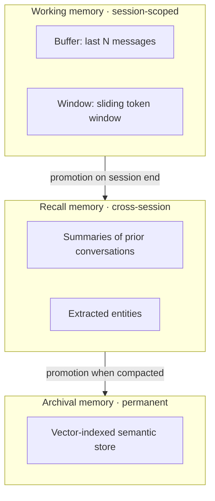
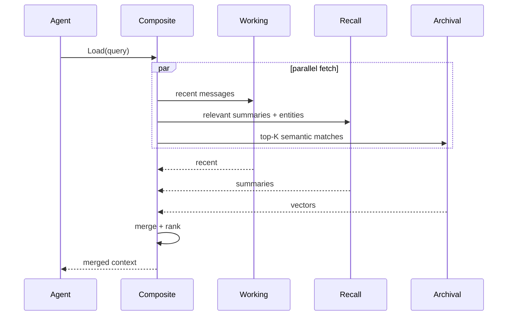
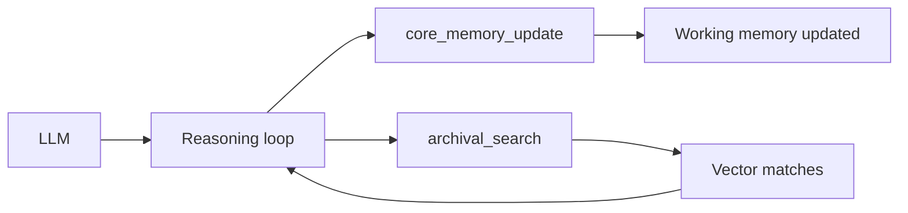
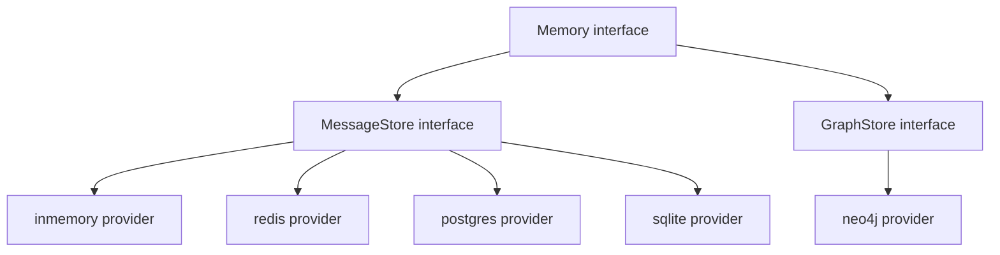

# DOC-09: Memory Architecture

**Audience:** Anyone whose agent needs to remember things between turns or sessions.
**Prerequisites:** [03 — Extensibility Patterns](./03-extensibility-patterns.md), [05 — Agent Anatomy](./05-agent-anatomy.md).
**Related:** [10 — RAG Pipeline](./10-rag-pipeline.md), [`patterns/provider-template.md`](../patterns/provider-template.md).

## Overview

Beluga models memory in three tiers plus an optional graph layer, following the MemGPT design. Each tier has different latency, capacity, and persistence characteristics. The `Composite` memory implementation merges all tiers on every load, and the agent is given memory-management tools so it can curate its own memory actively.

## The three tiers



### Working memory

Session-scoped. Holds the most recent N messages (or the last K tokens worth). Lowest latency, smallest capacity. Forgotten when the session TTL expires.

Two variants:

- **Buffer** — last N messages verbatim.
- **Window** — last K tokens, with older messages elided or summarised.

### Recall memory

Cross-session. Stores summaries of prior conversations, extracted entities, and topic indexes. Medium latency, moderate capacity. Survives session expiry.

Used for: "what did I discuss with this user last week?"

### Archival memory

Permanent. Vector-indexed semantic store keyed by embedding similarity. Highest latency, effectively unlimited capacity. Never forgotten.

Used for: "have I seen anything relevant to this query, ever?"

## Composite memory on load



The composite memory fetches from all three tiers in parallel, merges the results (deduplicating, ranking by relevance), and returns a single combined context. The agent sees one list, not three.

## Self-editable memory (the MemGPT pattern)

Instead of relying on automatic memory management, Beluga injects memory tools so the agent can update its own memory during reasoning:

```
core_memory_update(section, content)       # edit working memory
recall_search(query)                       # search recall
archival_search(query)                     # search archival
archival_insert(content)                   # add to archival
```



The agent treats memory like any other tool. It can decide "this fact is important, pin it to working memory" or "I don't remember — search archival first". This active management is why MemGPT produces coherent long-term conversations.

## Graph memory

Separate from the three tiers: a graph store (entity → relation → entity). During `Memory.Save`:

1. The LLM extracts entities from the turn ("Alice", "Zurich", "meeting").
2. Extracts relations ("Alice is_at Zurich", "Alice has_meeting at 3pm").
3. Writes them to the graph store.

During `Memory.Load`:

1. Extract entities from the current query.
2. Traverse the graph to find connected entities.
3. Return the connected subgraph as additional context.

Use when: relationships between concepts matter more than semantic similarity. Typical for assistants that manage schedules, people, or inventory.

## Store backend architecture



A `Memory` implementation can swap its underlying `MessageStore` without changing its logic. This lets you develop on `inmemory`, deploy on `redis`, and migrate to `postgres` without touching agent code.

Same registry pattern as [DOC-03](./03-extensibility-patterns.md):

```go
import _ "github.com/lookatitude/beluga-ai/memory/stores/redis"

store, _ := memory.NewMessageStore("redis", memory.Config{Addr: "redis:6379"})
mem := memory.NewComposite(store, vectorStore, graphStore)
```

## Why three tiers, not one

A single vector store for everything doesn't work. The cost/latency profile of vector search is wrong for "what did the user just say?" — you'd do a vector query to retrieve the previous turn, which is absurd.

Three tiers match how human cognition handles memory:

| Tier | Human analogue | Beluga implementation |
|---|---|---|
| Working | Short-term, chat-style | Last N messages |
| Recall | Episodic, "I remember that" | Summaries, entities |
| Archival | Semantic, "I know that" | Vector-indexed corpus |

Each has the right latency for its use case. The composite layer hides the complexity.

## Why memory tools are auto-injected

The agent manages its own memory. A human who stops making notes on a long task forgets things; the model is no different. By giving the agent `core_memory_update`, `recall_search`, and `archival_search`, the planner can include "update my notes" as part of its next action. Passive memory management (framework decides what to save) loses fidelity; active (agent decides) doesn't.

## Common mistakes

- **Vector-searching for conversation history.** Use working memory for recent turns. Vectors are for "have I ever seen this before" queries.
- **Saving everything to archival immediately.** Archival grows forever — be selective. Use recall as a curator's pass before promotion.
- **Ignoring entity extraction.** If your use case has graph structure (people, places, events), the graph tier is the difference between a chatbot and an assistant.
- **Sharing one `MessageStore` across tenants.** Multi-tenant isolation lives at the `core.WithTenant(ctx)` level, and every store must honour it.

## Related reading

- [10 — RAG Pipeline](./10-rag-pipeline.md) — archival memory uses the same retrieval pipeline.
- [04 — Data Flow](./04-data-flow.md) — where `Memory.Load` and `Memory.Save` fire in a turn.
- [`patterns/provider-template.md`](../patterns/provider-template.md) — implementing a new store backend.
