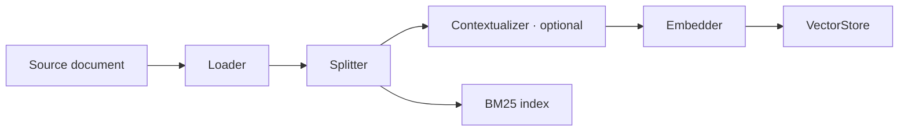
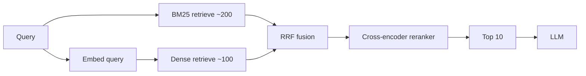
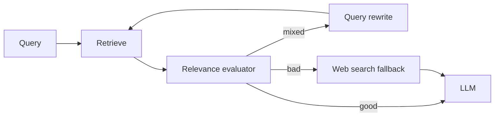
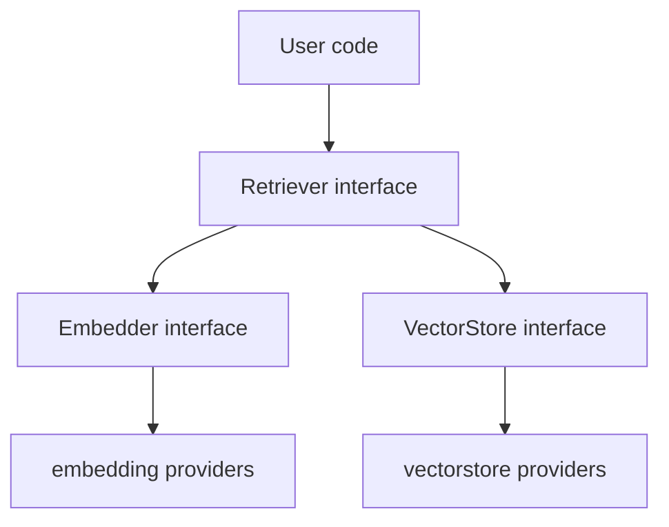

# DOC-10: RAG Pipeline

**Audience:** Anyone building a retrieval-augmented agent.
**Prerequisites:** [03 — Extensibility Patterns](./03-extensibility-patterns.md).
**Related:** [09 — Memory Architecture](./09-memory-architecture.md), [`patterns/registry-factory.md`](../patterns/registry-factory.md).

## Overview

Beluga's RAG pipeline has two halves: **ingestion** (turn documents into indexed chunks) and **retrieval** (find relevant chunks for a query). The default is **hybrid search** — BM25 + dense vectors fused with Reciprocal Rank Fusion — because it outperforms either alone on almost every benchmark.

## Ingestion



Four registered components:

- **Loader** — reads from the source (PDF, HTML, markdown, S3, etc.) and emits `Document`s.
- **Splitter** — divides documents into chunks (token count, sentence boundaries, semantic splits).
- **Contextualizer** (optional) — prepends each chunk with a brief context summary (anthropic's "contextual retrieval" trick: "This chunk is from section X about Y: <chunk>"). Happens at ingestion time so it's embedded.
- **Embedder** — turns chunks into vectors.
- **VectorStore + BM25 index** — two parallel indexes on the same chunks.

## Retrieval



1. **BM25** returns ~200 candidates on keyword match.
2. **Dense retrieval** returns ~100 candidates on vector similarity.
3. **RRF (Reciprocal Rank Fusion)** combines the two rankings. Given a document's rank in each list, its fused score is `sum(1 / (k + rank_i))` with `k = 60`. Simple, effective, no tuning required.
4. **Cross-encoder reranker** re-scores the top ~300 candidates with a model that jointly evaluates query+doc (higher quality, slower). Takes the top 10.
5. **LLM** consumes the top 10 as context.

## Why hybrid beats either alone

- **Vector search** understands semantics but misses exact terms (acronyms, product names, code).
- **BM25** excels at exact match but has no concept of synonymy.
- **RRF** fuses them without requiring you to tune weights — the fusion is rank-based, not score-based, so the two retrievers don't need to be calibrated.

In practice, hybrid retrieval lifts top-K recall by 10–20 percentage points on most benchmarks over either alone.

## CRAG — Corrective Retrieval



CRAG adds a retrieval evaluator that scores results against the query. If the score is below a threshold, it rewrites the query (try a different phrasing) or falls back to web search. Implemented as a registered `Retriever` strategy — swap it in with a one-line config change.

Other pluggable strategies:
- **HyDE** — generate a hypothetical answer, embed *that*, retrieve similar chunks.
- **Adaptive RAG** — choose between no retrieval / single-pass / multi-pass based on query difficulty.
- **Parent-document retrieval** — retrieve small chunks for precision, return their parent documents for context.

Each registers via `rag.RegisterRetriever("crag", crag.NewFactory())`.

## Component interaction



**`Retriever` is the consumer-facing interface**. Embedder and VectorStore are implementation details of a retriever. Your agent code calls `retriever.Retrieve(ctx, query)` and doesn't care whether it's BM25, vector, or a fusion of both.

The registry pattern applies at all three levels:

- `rag.NewRetriever("hybrid", cfg)` — the retrieval strategy.
- `embedding.New("openai", cfg)` — the embedding model.
- `vectorstore.New("pgvector", cfg)` — the vector index.

Each can be swapped independently.

## Contextual retrieval

Anthropic's 2024 finding: prepending 50-100 tokens of context to each chunk *before* embedding lifts retrieval recall by 35% on average. The contextualizer is a cheap LLM call per chunk (happens once, at ingestion):

```
<chunk>
"net revenue grew 12% year over year."
</chunk>

After contextualizing:
"This chunk is from Acme Corp's Q2 2024 earnings report, section 'Financial Highlights': net revenue grew 12% year over year."
```

Expensive to run over a 1M-chunk corpus, but trivially parallelisable and only needs to happen once. Caches well.

## Why retrieval strategies are a registry

RAG is an active research area. New strategies appear monthly (CRAG, Self-RAG, Adaptive RAG, GraphRAG). Putting `Retriever` behind the same registry as everything else means you can ship a new strategy as a third-party package and agents pick it up with a one-line config change — no framework fork required.

## Common mistakes

- **Dense-only retrieval.** Unless you've measured that it beats hybrid on your corpus, use hybrid. The overhead of BM25 is negligible.
- **Chunking too aggressively.** Tiny chunks lose context. Try 500-800 tokens with 50-100 token overlap as a starting point.
- **Skipping the reranker.** On corpora larger than ~1000 docs, reranking the top 300 is the difference between top-10 accuracy of 60% and 85%.
- **Embedding at query time only.** The contextualizer runs at *ingestion* time — once per chunk, cached forever. Running it at query time is the wrong cost/performance profile.

## Related reading

- [09 — Memory Architecture](./09-memory-architecture.md) — archival memory uses this pipeline.
- [03 — Extensibility Patterns](./03-extensibility-patterns.md) — the registry pattern.
- [`patterns/provider-template.md`](../patterns/provider-template.md) — implementing a new embedder or vectorstore.
