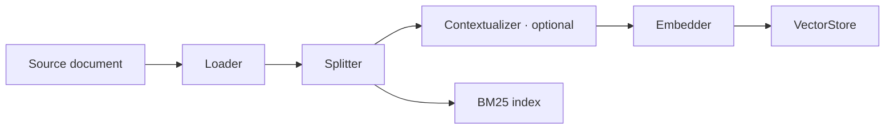
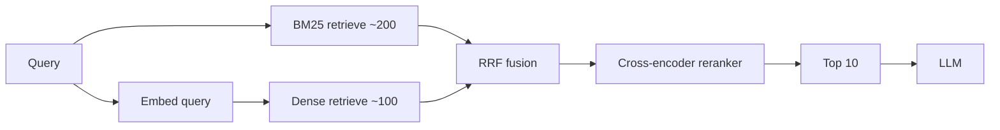
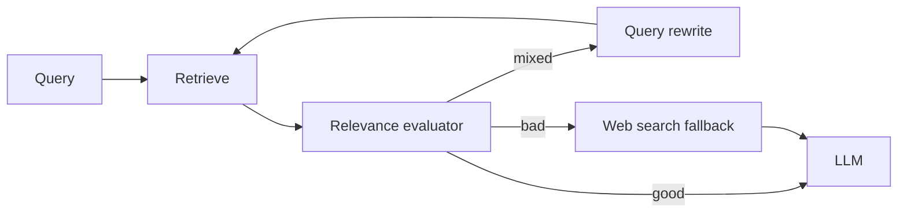
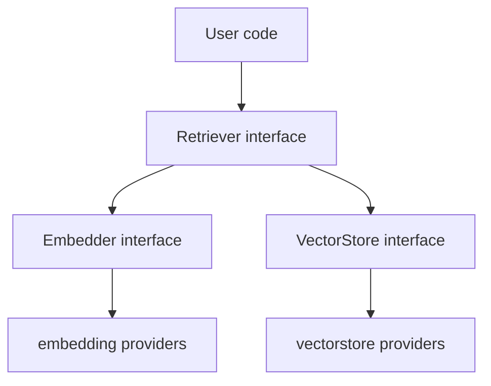

# DOC-10: RAG Pipeline

**Audience:** Anyone building a retrieval-augmented agent.
**Prerequisites:** [03 — Extensibility Patterns](./03-extensibility-patterns.md).
**Related:** [09 — Memory Architecture](./09-memory-architecture.md), [`patterns/registry-factory.md`](../patterns/registry-factory.md).

## Overview

Beluga's RAG pipeline has two halves: **ingestion** (turn documents into indexed chunks) and **retrieval** (find relevant chunks for a query). The default is **hybrid search** — BM25 + dense vectors fused with Reciprocal Rank Fusion — because it outperforms either alone on almost every benchmark.

## Ingestion



Four registered components:

- **Loader** — reads from the source (PDF, HTML, markdown, S3, etc.) and emits `Document`s.
- **Splitter** — divides documents into chunks (token count, sentence boundaries, semantic splits).
- **Contextualizer** (optional) — prepends each chunk with a brief context summary (anthropic's "contextual retrieval" trick: "This chunk is from section X about Y: <chunk>"). Happens at ingestion time so it's embedded.
- **Embedder** — turns chunks into vectors.
- **VectorStore + BM25 index** — two parallel indexes on the same chunks.

## Retrieval



1. **BM25** returns ~200 candidates on keyword match.
2. **Dense retrieval** returns ~100 candidates on vector similarity.
3. **RRF (Reciprocal Rank Fusion)** combines the two rankings. Given a document's rank in each list, its fused score is `sum(1 / (k + rank_i))` with `k = 60`. Simple, effective, no tuning required.
4. **Cross-encoder reranker** re-scores the top ~300 candidates with a model that jointly evaluates query+doc (higher quality, slower). Takes the top 10.
5. **LLM** consumes the top 10 as context.

## Why hybrid beats either alone

- **Vector search** understands semantics but misses exact terms (acronyms, product names, code).
- **BM25** excels at exact match but has no concept of synonymy.
- **RRF** fuses them without requiring you to tune weights — the fusion is rank-based, not score-based, so the two retrievers don't need to be calibrated.

In practice, hybrid retrieval lifts top-K recall by 10–20 percentage points on most benchmarks over either alone.

## CRAG — Corrective Retrieval



CRAG adds a retrieval evaluator that scores results against the query. If the score is below a threshold, it rewrites the query (try a different phrasing) or falls back to web search. Implemented as a registered `Retriever` strategy — swap it in with a one-line config change.

Other pluggable strategies:
- **HyDE** — generate a hypothetical answer, embed *that*, retrieve similar chunks.
- **Adaptive RAG** — choose between no retrieval / single-pass / multi-pass based on query difficulty.
- **Parent-document retrieval** — retrieve small chunks for precision, return their parent documents for context.

Each registers via `rag.RegisterRetriever("crag", crag.NewFactory())`.

## Advanced retriever strategies

Beyond the standard strategies, three specialised retrievers are available in `rag/retriever/`. Each implements `retriever.Retriever` and registers in `init()` under its own name. Use `NewXxx()` directly — the registry entries exist for discovery, not for construction from generic config.

### ColBERT — late-interaction retrieval

**Package:** `rag/retriever/colbert` ([`retriever.go:19-153`](../../rag/retriever/colbert/retriever.go), [`scorer.go:11-27`](../../rag/retriever/colbert/scorer.go))

The default hybrid retriever produces a **single vector per document** at indexing time and a **single vector per query** at retrieval time, then ranks by cosine similarity. ColBERT decomposes both into **per-token embeddings**, keeping all token vectors separately. At retrieval time, for every query token the scorer finds the maximum cosine similarity across all document token vectors (MaxSim). These per-query-token maximums are summed into the final relevance score. This "late interaction" allows richer term-level matching without the quadratic cost of full cross-encoder attention.

**When to use:**
- Queries with complex multi-term requirements where a single average vector loses nuance.
- Precision-sensitive domains (legal, medical, code) where exact term semantics matter.
- You have a ColBERT-compatible index (or start with `colbert.InMemoryIndex` for development).

**Differs from hybrid:** does not use BM25 at all. Ranking is purely MaxSim over dense per-token vectors. You provide a `ColBERTIndex` (persistent or `InMemoryIndex`) and a `MultiVectorEmbedder`; the retriever handles the rest.

```go
import (
    "context"

    "github.com/lookatitude/beluga-ai/rag/retriever/colbert"
)

idx := colbert.NewInMemoryIndex()
// Pre-index documents: idx.Add(ctx, docID, tokenVecs)

ret, err := colbert.NewColBERTRetriever(
    colbert.WithEmbedder(myMultiVecEmbedder),
    colbert.WithIndex(idx),
    colbert.WithTopK(10),
)
if err != nil {
    return err
}
docs, err := ret.Retrieve(context.Background(), "What are the side effects of ibuprofen?")
if err != nil {
    return err
}
```

### RAPTOR — hierarchical tree retrieval

**Package:** `rag/retriever/raptor` ([`retriever.go:24-170`](../../rag/retriever/raptor/retriever.go), [`builder.go:14-207`](../../rag/retriever/raptor/builder.go), [`types.go:1-69`](../../rag/retriever/raptor/types.go))

RAPTOR (Recursive Abstractive Processing and Tree-Organized Retrieval) builds a multi-level tree over the document corpus at **indexing time**. Leaf nodes hold original chunks. The `TreeBuilder` then:
1. Clusters leaves by embedding similarity (K-means++ by default via `KMeansClusterer`).
2. Summarises each cluster with an LLM `Summarizer`.
3. Embeds the summary as a new internal node at `Level+1`.
4. Repeats until fewer than `MinClusterSize` nodes remain at the current level.

At **retrieval time**, `RAPTORRetriever` flattens the tree — all nodes across all levels — into a single candidate pool and ranks by cosine similarity against the query embedding. High-level summary nodes answer broad questions; leaf nodes handle specific ones. The same query hits both, with relevance driving selection.

**When to use:**
- Long-document corpora where queries range from high-level ("summarise the project") to fine-grained ("what version was introduced in commit X").
- Multi-hop reasoning that benefits from both detail and abstraction in context.
- You can afford an offline build phase (cluster + summarise once, retrieve many times).

**Differs from hybrid:** retrieval is vector-only (cosine similarity), but the candidate space includes LLM-generated summary nodes at multiple abstraction levels. BM25 is not used.

```go
import (
    "context"

    "github.com/lookatitude/beluga-ai/rag/retriever/raptor"
)

// Build the tree once at ingestion time.
builder := raptor.NewTreeBuilder(
    raptor.WithEmbedder(myEmbedder),
    raptor.WithSummarizer(mySummarizer),
    raptor.WithMaxLevels(3),
)
tree, err := builder.Build(context.Background(), docs)
if err != nil {
    return err
}

// Retrieve at query time.
ret := raptor.NewRAPTORRetriever(
    raptor.WithTree(tree),
    raptor.WithRetrieverEmbedder(myEmbedder),
    raptor.WithRaptorTopK(10),
)
results, err := ret.Retrieve(context.Background(), "Give me a high-level overview of the architecture")
if err != nil {
    return err
}
```

The `raptor_level` and `raptor_node_id` metadata fields on returned `schema.Document` values indicate which tree level contributed each result.

### Structured — Text2SQL / Text2Cypher retrieval

**Package:** `rag/retriever/structured` ([`retriever.go:89-248`](../../rag/retriever/structured/retriever.go), [`generator.go:14-195`](../../rag/retriever/structured/generator.go), [`executor.go:11-89`](../../rag/retriever/structured/executor.go), [`types.go:1-73`](../../rag/retriever/structured/types.go))

For data that lives in relational databases or graph stores, vector similarity over embedded text is the wrong tool. `StructuredRetriever` takes a natural-language query, uses an LLM to translate it into SQL or Cypher against a known `SchemaInfo`, executes the query via a `QueryExecutor`, and returns rows as `schema.Document` values. An optional `ResultEvaluator` scores result quality; low scores trigger regeneration up to `maxRetries` times.

**Security by design:** the LLM prompt wraps the user question in `<question>...</question>` spotlighting delimiters to prevent prompt injection. The `ReadOnlyExecutor` wrapper rejects any query containing write keywords (DROP, DELETE, INSERT, UPDATE, ...) before touching the database — see [`executor.go:40-76`](../../rag/retriever/structured/executor.go).

**When to use:**
- Structured corpora: product catalogues, financial records, knowledge graphs, CRMs.
- Queries that are inherently aggregation or filter operations ("how many orders shipped last week?").
- Hybrid agents that combine structured lookup with unstructured document retrieval.

**Differs from hybrid:** no embeddings, no vector store, no BM25. The "retrieval" is SQL or Cypher execution. The result rows are serialised as JSON and returned as documents.

```go
import (
    "context"

    "github.com/lookatitude/beluga-ai/rag/retriever/structured"
)

schemaInfo := structured.SchemaInfo{
    Dialect: "sql",
    Tables: []structured.TableInfo{
        {
            Name:        "orders",
            Description: "customer purchase records",
            Columns: []structured.ColumnInfo{
                {Name: "id", Type: "INTEGER"},
                {Name: "customer_id", Type: "INTEGER"},
                {Name: "total", Type: "DECIMAL"},
                {Name: "shipped_at", Type: "TIMESTAMP"},
            },
        },
    },
}

generator := structured.NewLLMSQLGenerator(myLLM)
executor := structured.NewReadOnlyExecutor(myDBExecutor)

ret, err := structured.NewStructuredRetriever(
    structured.WithGenerator(generator),
    structured.WithExecutor(executor),
    structured.WithSchema(schemaInfo),
    structured.WithMaxRetries(3),
    structured.WithMinScore(0.6),
)
if err != nil {
    return err
}
docs, err := ret.Retrieve(context.Background(), "How many orders shipped last week?")
if err != nil {
    return err
}
```

## Component interaction



**`Retriever` is the consumer-facing interface**. Embedder and VectorStore are implementation details of a retriever. Your agent code calls `retriever.Retrieve(ctx, query)` and doesn't care whether it's BM25, vector, or a fusion of both.

The registry pattern applies at all three levels:

- `rag.NewRetriever("hybrid", cfg)` — the retrieval strategy.
- `embedding.New("openai", cfg)` — the embedding model.
- `vectorstore.New("pgvector", cfg)` — the vector index.

Each can be swapped independently.

## Loader providers

Eight loader providers ship under `rag/loader/providers/`. Each registers via `init()` and is available as `loader.New("name", cfg)`. Import the provider package for its side-effect:

| Provider | Registry name | What it loads | Config keys |
|---|---|---|---|
| Cloud storage | `cloudstorage` | S3 / GCS / Azure Blob via pre-signed URLs or access keys | `access_key`, `secret_key`, `region`, `timeout` |
| Confluence | `confluence` | Confluence pages via REST API | `base_url`, `api_key` |
| Docling | `docling` | PDF, DOCX, PPTX via self-hosted [Docling](https://github.com/docling-project/docling) server | `base_url` (default `http://localhost:5001`) |
| Firecrawl | `firecrawl` | Web pages crawled and converted to Markdown via [Firecrawl](https://firecrawl.dev) | `api_key`, `base_url` |
| Google Drive | `gdrive` | Google Drive files via Google APIs REST | `api_key` (OAuth token), `base_url` |
| GitHub | `github` | Repository files via GitHub REST API | `api_key` (PAT), `base_url`, `ref` (branch/tag) |
| Notion | `notion` | Notion pages via Notion API | `api_key` (integration token), `base_url` |
| Unstructured | `unstructured` | Any file format via [Unstructured.io](https://unstructured.io) API | `api_key`, `base_url` (default `https://api.unstructured.io`) |

Source: [`rag/loader/providers/*/`](../../rag/loader/providers/).

## Contextual retrieval

Anthropic's 2024 finding: prepending 50-100 tokens of context to each chunk *before* embedding lifts retrieval recall by 35% on average. The contextualizer is a cheap LLM call per chunk (happens once, at ingestion):

```
<chunk>
"net revenue grew 12% year over year."
</chunk>

After contextualizing:
"This chunk is from Acme Corp's Q2 2024 earnings report, section 'Financial Highlights': net revenue grew 12% year over year."
```

Expensive to run over a 1M-chunk corpus, but trivially parallelisable and only needs to happen once. Caches well.

## Why retrieval strategies are a registry

RAG is an active research area. New strategies appear monthly (CRAG, Self-RAG, Adaptive RAG, GraphRAG). Putting `Retriever` behind the same registry as everything else means you can ship a new strategy as a third-party package and agents pick it up with a one-line config change — no framework fork required.

## Common mistakes

- **Dense-only retrieval.** Unless you've measured that it beats hybrid on your corpus, use hybrid. The overhead of BM25 is negligible.
- **Chunking too aggressively.** Tiny chunks lose context. Try 500-800 tokens with 50-100 token overlap as a starting point.
- **Skipping the reranker.** On corpora larger than ~1000 docs, reranking the top 300 is the difference between top-10 accuracy of 60% and 85%.
- **Embedding at query time only.** The contextualizer runs at *ingestion* time — once per chunk, cached forever. Running it at query time is the wrong cost/performance profile.
- **Using `retriever.New("colbert", cfg)` directly.** The registry entry for ColBERT and RAPTOR exists for discovery (`retriever.List()`). Construction requires dependencies — a `ColBERTIndex`, `MultiVectorEmbedder`, or pre-built `Tree` — that cannot come from a generic `ProviderConfig`. Use `colbert.NewColBERTRetriever()` and `raptor.NewRAPTORRetriever()` directly. See [`colbert/retriever.go:13-16`](../../rag/retriever/colbert/retriever.go) and [`raptor/retriever.go:15-21`](../../rag/retriever/raptor/retriever.go).
- **Skipping `ReadOnlyExecutor` with `StructuredRetriever`.** LLMs occasionally generate write queries. Wrap any executor with `structured.NewReadOnlyExecutor()` to block DROP, DELETE, INSERT, and equivalent write keywords at the validation layer. See [`executor.go:40-76`](../../rag/retriever/structured/executor.go).
- **Building the RAPTOR tree at query time.** Tree construction (cluster + summarise) is an offline indexing operation. Build once with `TreeBuilder.Build()`, persist the `Tree`, and load it for retrieval. Rebuilding per query defeats the purpose.

## Related reading

- [09 — Memory Architecture](./09-memory-architecture.md) — archival memory uses this pipeline.
- [03 — Extensibility Patterns](./03-extensibility-patterns.md) — the registry pattern.
- [`patterns/provider-template.md`](../patterns/provider-template.md) — implementing a new embedder or vectorstore.
- [`docs/reference/providers.md`](../reference/providers.md) — embedding, vectorstore, and retriever provider catalog.
