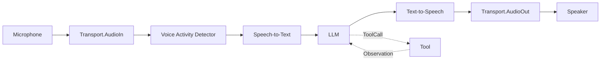
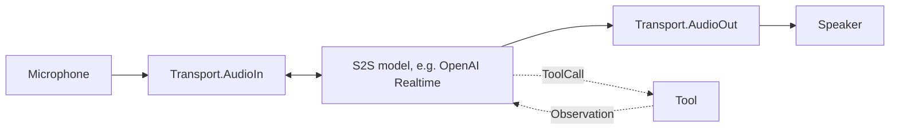
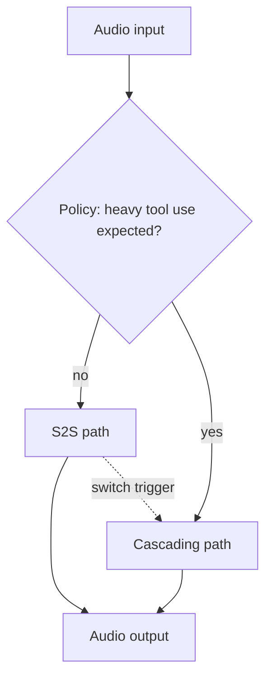
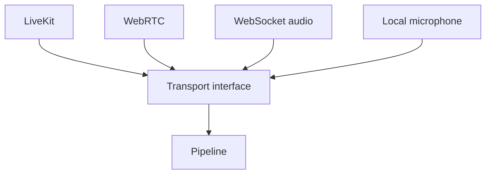

# DOC-11: Voice Pipeline

**Audience:** Anyone building a voice-enabled agent.
**Prerequisites:** [02 — Core Primitives](./02-core-primitives.md), [03 — Extensibility Patterns](./03-extensibility-patterns.md).
**Related:** [04 — Data Flow](./04-data-flow.md), [12 — Protocol Layer](./12-protocol-layer.md).

## Overview

Voice is the one place Beluga's streaming design pays off visibly: a voice agent is a pipeline of `FrameProcessor`s composed over an `iter.Seq2[Frame, error]` stream, where frames flow at audio rate. Three pipeline modes are supported: **cascading** (STT → LLM → TTS), **speech-to-speech** (a single bidirectional model like OpenAI Realtime or Gemini Live), and **hybrid** (switch between the two based on turn complexity).

**Status:** voice is a capability in development. Check `voice/` for the currently implemented frame processors and transports.

## Frame types

All audio/video data flows as typed `Frame`s:

```go
// voice/frame.go — conceptual
type FrameType int

const (
    FrameAudio    FrameType = iota // PCM, Opus, or codec-specific bytes
    FrameText                       // text fragment (STT partial/final, LLM chunk)
    FrameControl                    // start, stop, interrupt, barge-in
    FrameImage                      // video frame (for multimodal models)
)

type Frame struct {
    Type      FrameType
    Payload   []byte
    Timestamp time.Time
    Meta      map[string]any
}
```

## Cascading pipeline



Each stage is a `FrameProcessor` — a pure transformer over an `iter.Seq2[Frame, error]` stream:

```go
import (
    "context"
    "iter"
)

type FrameProcessor interface {
    // Process returns an output stream derived from the input stream.
    // Fatal errors are delivered by yielding (Frame{}, err) and ending.
    Process(ctx context.Context, in iter.Seq2[Frame, error]) iter.Seq2[Frame, error]
}
```

Most processors are built with the `FrameHandler` helper, which matches the shape of every existing STT/TTS/VAD body — 0, 1, or 2 frames out per input:

```go
type FrameHandler func(ctx context.Context, frame Frame) ([]Frame, error)

// FrameLoop turns a per-frame handler into a FrameProcessor.
func FrameLoop(handler FrameHandler) FrameProcessor
```

`Chain(p1, p2, p3)` composes stages by direct function application — each stage's output iterator becomes the next stage's input. There are **no intermediate channels and no goroutines per stage**; each `next()` pull cascades lazily from sink back to source, so backpressure is automatic. A fatal error at any stage yields through the second slot of the iterator and terminates the pipeline.

Consuming the composed stream at the transport boundary is a plain range loop:

```go
incoming := transport.Recv(ctx)
stream := voice.Chain(vad, stt, llm, tts).Process(ctx, incoming)

for frame, err := range stream {
    if err != nil {
        return err
    }
    if sendErr := transport.Send(ctx, frame); sendErr != nil {
        return sendErr
    }
}
```

No frame is ever dropped silently; if a processor returns a non-nil error, it propagates to the consumer and the stream ends.

Tool calls from the LLM interrupt the audio flow — the cascading pipeline routes the `ToolCall` event out of band, executes the tool, feeds back the observation, and resumes streaming TTS from where it left off.

## Speech-to-speech (S2S) pipeline



A single bidirectional model handles audio in, audio out, and tool calls. Lower latency than cascading (no STT/TTS round trips), more expensive per call. Providers: OpenAI Realtime, Gemini Live.

Tool calls are intercepted on the wire — when the provider returns a tool call event, Beluga pauses the audio stream, runs the tool, writes the observation back to the provider, and the audio flow resumes.

## Hybrid pipeline



Start in S2S (low latency). If the turn involves many tool calls or long reasoning, switch to the cascade (lower cost, better for tool-heavy workloads). The switch policy is a pluggable `FrameProcessor` you can configure.

## Transport layer



Transports expose `Recv` as an `iter.Seq2[Frame, error]` and `Send` as a per-frame method:

```go
type Transport interface {
    Recv(ctx context.Context) iter.Seq2[Frame, error]
    Send(ctx context.Context, frame Frame) error
    Close() error
}
```

Internally each provider (livekit, daily, pipecat, websocket) keeps a buffered `chan Frame` fed by its read loop and wraps it in an `iter.Seq2` closure that selects on the channel and `ctx.Done()` — the channel is an implementation detail, never part of the public API. Early dial failures are delivered as the first yielded pair `(Frame{}, err)` and end the stream.

Transports register in the usual way:

```go
import _ "github.com/lookatitude/beluga-ai/voice/transport/livekit"

tp, _ := voice.NewTransport("livekit", voice.Config{Room: "agent-123"})
```

Same registry pattern. You can add a custom transport (WebTransport, gRPC streaming, whatever) and the rest of the pipeline is unaffected.

## Why frame-based

- **Backpressure.** Lazy iterator composition means a slow sink pulls slowly and every upstream stage stalls proportionally — no buffer tuning, no dropped frames.
- **Composition.** Processors chain trivially — `Chain(vad, stt, llm, tts)` is one line and allocates no goroutines.
- **Cancellation.** `context.Context` propagates through every processor; stopping the pipeline is a plain range-break or ctx cancel.
- **Multimodal.** Frames are typed, so adding image frames for video models doesn't require a new pipeline.

### A note on fan-in processors

The voice pipeline is mostly linear, but `voice/s2s.AsFrameProcessor` fans two producers (an input-forwarding pump and an output-session pump) into a single consumer. Fan-in through iterators requires care: a single channel shared between two writers with `defer close()` on one of them trivially races under `-race`. The canonical fix, documented as C-005 in [`.wiki/corrections.md`](../../.wiki/corrections.md), is to split channels per writer and use the select-nil-channel trick to disable drained branches. If you write a new fan-in `FrameProcessor`, run its tests with `-race` and make each channel have exactly one writer.

## Common mistakes

- **Using cascading for latency-sensitive turn-taking.** The STT→TTS round trip is usually 500ms+. Use S2S if your use case is conversational.
- **S2S for tool-heavy workloads.** S2S providers bill per audio second; running a 30-second tool call with the audio connection open is wasteful. Hybrid is the answer.
- **Blocking in a `FrameProcessor`.** Every processor must respect `ctx.Done()`. A blocked processor stalls the whole pipeline.
- **Shared state between processors.** Processors communicate through frames. Shared mutable state causes races.
- **Pre-materialising the input iterator.** Context cancellation in a pure stream-transformer is observed at the `yield` boundary — if your processor buffers the full input before transforming, cancellation has nothing to watch. Keep transforms lazy.

## Related reading

- [02 — Core Primitives](./02-core-primitives.md) — `Stream` and channels.
- [04 — Data Flow](./04-data-flow.md) — tool call interception in a non-voice context.
- [12 — Protocol Layer](./12-protocol-layer.md) — how the voice pipeline plugs into the runner's protocol exposure.
