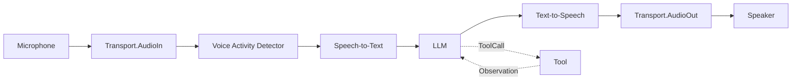
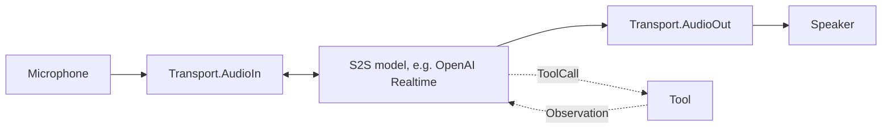
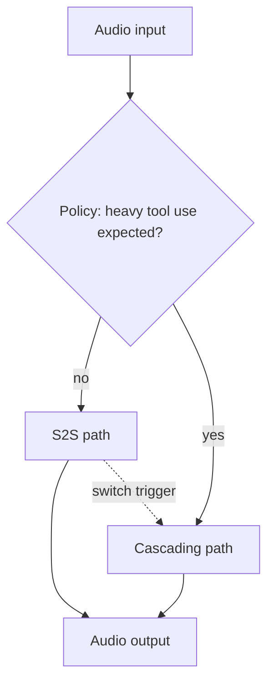
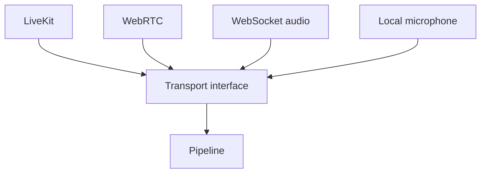

# DOC-11: Voice Pipeline

**Audience:** Anyone building a voice-enabled agent.
**Prerequisites:** [02 — Core Primitives](./02-core-primitives.md), [03 — Extensibility Patterns](./03-extensibility-patterns.md).
**Related:** [04 — Data Flow](./04-data-flow.md), [12 — Protocol Layer](./12-protocol-layer.md).

## Overview

Voice is the one place Beluga's streaming design pays off visibly: a voice agent is a pipeline of `FrameProcessor`s connected by Go channels, where frames flow at audio rate. Three pipeline modes are supported: **cascading** (STT → LLM → TTS), **speech-to-speech** (a single bidirectional model like OpenAI Realtime or Gemini Live), and **hybrid** (switch between the two based on turn complexity).

**Status:** voice is a capability in development. Check `voice/` for the currently implemented frame processors and transports.

## Frame types

All audio/video data flows as typed `Frame`s:

```go
// voice/frame.go — conceptual
type FrameType int

const (
    FrameAudio    FrameType = iota // PCM, Opus, or codec-specific bytes
    FrameText                       // text fragment (STT partial/final, LLM chunk)
    FrameControl                    // start, stop, interrupt, barge-in
    FrameImage                      // video frame (for multimodal models)
)

type Frame struct {
    Type      FrameType
    Payload   []byte
    Timestamp time.Time
    Meta      map[string]any
}
```

## Cascading pipeline



Each stage is a `FrameProcessor`:

```go
type FrameProcessor interface {
    Process(ctx context.Context, in <-chan Frame, out chan<- Frame) error
}
```

Stages are wired together with bounded channels. Backpressure propagates naturally — if TTS is slow, LLM slows down, and STT eventually stops reading new audio. No frame is ever dropped silently; if a processor can't keep up, the pipeline explicitly halts and signals the caller.

Tool calls from the LLM interrupt the audio flow — the cascading pipeline routes the `ToolCall` event out of band, executes the tool, feeds back the observation, and resumes streaming TTS from where it left off.

## Speech-to-speech (S2S) pipeline



A single bidirectional model handles audio in, audio out, and tool calls. Lower latency than cascading (no STT/TTS round trips), more expensive per call. Providers: OpenAI Realtime, Gemini Live.

Tool calls are intercepted on the wire — when the provider returns a tool call event, Beluga pauses the audio stream, runs the tool, writes the observation back to the provider, and the audio flow resumes.

## Hybrid pipeline



Start in S2S (low latency). If the turn involves many tool calls or long reasoning, switch to the cascade (lower cost, better for tool-heavy workloads). The switch policy is a pluggable `FrameProcessor` you can configure.

## Transport layer



Transports are registered:

```go
import _ "github.com/lookatitude/beluga-ai/voice/transport/livekit"

tp, _ := voice.NewTransport("livekit", voice.Config{Room: "agent-123"})
```

Same registry pattern. You can add a custom transport (WebTransport, gRPC streaming, whatever) and the rest of the pipeline is unaffected.

## Why frame-based

- **Backpressure.** Bounded channels between processors make slow stages visible immediately.
- **Composition.** Processors chain trivially — adding VAD to a pipeline is one line.
- **Cancellation.** `context.Context` propagates through every processor; stopping the pipeline is clean.
- **Multimodal.** Frames are typed, so adding image frames for video models doesn't require a new pipeline.

## Common mistakes

- **Using cascading for latency-sensitive turn-taking.** The STT→TTS round trip is usually 500ms+. Use S2S if your use case is conversational.
- **S2S for tool-heavy workloads.** S2S providers bill per audio second; running a 30-second tool call with the audio connection open is wasteful. Hybrid is the answer.
- **Blocking in a `FrameProcessor`.** Every processor must respect `ctx.Done()`. A blocked processor stalls the whole pipeline.
- **Shared state between processors.** Processors communicate through frames. Shared mutable state causes races.

## Related reading

- [02 — Core Primitives](./02-core-primitives.md) — `Stream` and channels.
- [04 — Data Flow](./04-data-flow.md) — tool call interception in a non-voice context.
- [12 — Protocol Layer](./12-protocol-layer.md) — how the voice pipeline plugs into the runner's protocol exposure.
