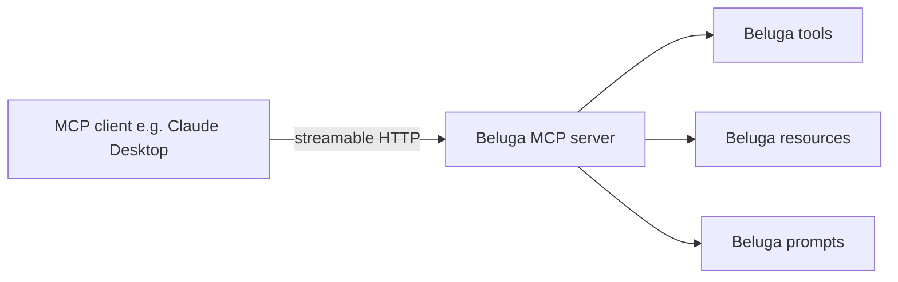

# DOC-12: Protocol Layer

**Audience:** Anyone exposing a Beluga agent to external callers or integrating remote agents.
**Prerequisites:** [08 — Runner and Lifecycle](./08-runner-and-lifecycle.md).
**Related:** [05 — Agent Anatomy](./05-agent-anatomy.md#the-a2a-agentcard), [17 — Deployment Modes](./17-deployment-modes.md).

## Overview

A Beluga agent can be exposed over multiple wire protocols simultaneously. The runner is the integration point: it owns the agent and routes incoming protocol traffic to `Agent.Stream`. The three most important protocols are **MCP** (tool/resource exposure), **A2A** (agent-to-agent discovery and delegation), and **REST/SSE** (plain HTTP with streaming).

## Protocol comparison

| Protocol | Purpose | Transport | Discovery | Use when |
|---|---|---|---|---|
| **MCP** | Expose tools/resources/prompts to an LLM client | Streamable HTTP | Client-side | You're building a tool server for Claude Desktop, Cursor, Zed, or another MCP client |
| **A2A** | Agent-to-agent delegation with capability cards | gRPC/HTTP + SSE | `/.well-known/agent.json` | You're connecting Beluga agents to other Beluga (or Google ADK) agents |
| **REST/SSE** | Generic HTTP with streaming | HTTP + SSE | Swagger/OpenAPI | You're exposing an agent to a web frontend or non-agent HTTP client |
| **gRPC** | Low-latency service-to-service | HTTP/2 | Protobuf definitions | You're inside a microservice mesh |
| **WebSocket** | Bidirectional streaming | WS | — | Voice, collaborative editing, anything needing full duplex |

## Model Context Protocol (MCP)



Beluga can expose its tools, resources, and prompts as an MCP server. Clients discover them via the standard `tools/list`, `resources/list`, `prompts/list` endpoints, and invoke them via `tools/call`.

```go
r := runtime.NewRunner(agent,
    runtime.WithMCPServer("/mcp",
        mcp.ExposeTools(toolRegistry),
        mcp.ExposeResources(docService),
        mcp.ExposePrompts(promptRegistry),
    ),
)
```

The inverse is also supported: Beluga can *consume* an external MCP server as if its tools were native. See [`patterns/provider-template.md`](../patterns/provider-template.md) for the `tool/mcp.go` consumer.

## Agent-to-Agent (A2A)

```mermaid
graph LR
  A[Agent A] -->|discover| Card[/.well-known/agent.json]
  Card -->|capabilities| A
  A -->|task submit| B[Agent B]
  B -->|streaming results via SSE| A
```

A2A is how Beluga agents find and delegate to each other across the network. Every agent exposes an `AgentCard` at `/.well-known/agent.json`:

```json
{
  "name": "acme-research-agent",
  "version": "2.1.0",
  "description": "Answers questions about Acme's product catalog",
  "capabilities": {
    "streaming": true,
    "multi_turn": true,
    "tools": ["search_catalog", "get_pricing"]
  },
  "endpoints": {
    "task": "/a2a/task",
    "events": "/a2a/events"
  }
}
```

A remote agent can be *imported* as a local tool. When agent A handoffs to agent B, the generated `transfer_to_agent_b` tool delegates via A2A under the hood.

Task lifecycle: `submitted → working → completed` (or `failed`). Events stream over SSE or gRPC.

## REST/SSE

The simplest exposure. A web frontend POSTs to `/api/chat` and receives a stream of Server-Sent Events:

```
event: data
data: {"type": "text", "content": "Hello! "}

event: data
data: {"type": "text", "content": "How can I help?"}

event: done
data: {}
```

This is the protocol for `curl`, browsers without WebSocket support, and quick-start integrations. It maps directly to `Agent.Stream` — each `Event` in the stream becomes one SSE event.

## Protocol gateway — one runner, many protocols

```mermaid
graph TD
  subgraph Runner[One Runner instance]
    A[Agent.Stream]
  end
  REST[/api/chat] --> A
  A2AEp[/a2a/task] --> A
  MCPEp[/mcp] --> A
  WS[/ws] --> A
  GRPC[gRPC service] --> A
```

A single `Runner.Serve` call can light up any combination of endpoints, all routing to the same `Agent.Stream`. You don't write protocol-specific code in your agent — you just declare which protocols the runner exposes.

```go
r := runtime.NewRunner(agent,
    runtime.WithRESTEndpoint("/api/chat"),
    runtime.WithA2A("/.well-known/agent.json"),
    runtime.WithMCPServer("/mcp"),
    runtime.WithWebSocketEndpoint("/ws"),
)
r.Serve(ctx, ":8080")
```

## Selecting a protocol

- **Exposing to a browser or external HTTP client** → REST/SSE.
- **Tool server for an MCP client (Claude Desktop, Cursor, Zed)** → MCP.
- **Multi-agent system where agents discover each other** → A2A.
- **Voice or bidirectional streaming** → WebSocket.
- **Inter-service inside a mesh, tight latency** → gRPC.

You don't have to pick one. Expose several in parallel.

## Common mistakes

- **Treating MCP as an agent protocol.** MCP is a *tool* protocol. It lets an LLM client find tools. It doesn't describe agents. Use A2A for agent-to-agent.
- **Custom protocol on top of `Agent.Stream`.** Every protocol Beluga ships already handles streaming, cancellation, and error propagation. Write a new protocol only if none fit — and even then, implement it as a registered server framework.
- **Mixing session state across protocols.** Session IDs are protocol-agnostic. If the same logical session goes through REST then A2A, use the same session ID, not a new one per protocol.
- **Hand-rolling `AgentCard` JSON.** Use `agent.Card()` — it stays in sync with your agent's actual configuration.

## Related reading

- [08 — Runner and Lifecycle](./08-runner-and-lifecycle.md) — the runner owns the protocol endpoints.
- [05 — Agent Anatomy](./05-agent-anatomy.md) — `AgentCard` lives on the agent.
- [17 — Deployment Modes](./17-deployment-modes.md) — how protocols vary across deployment modes.
