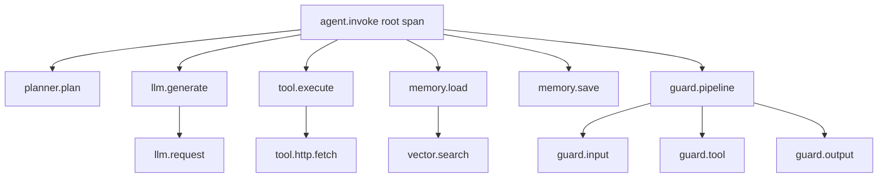
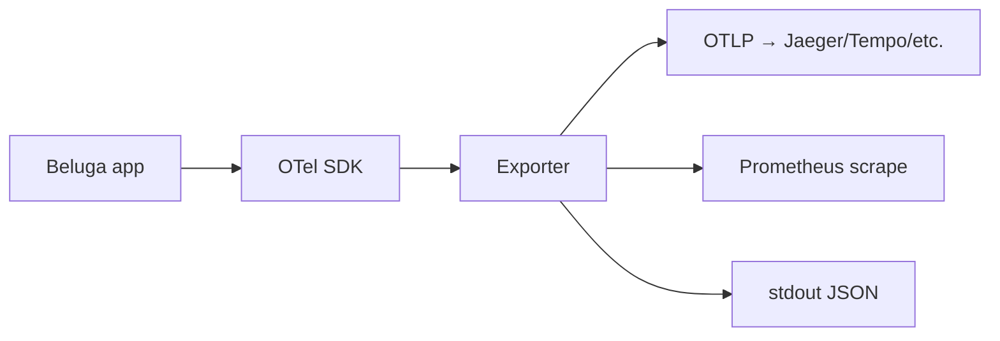
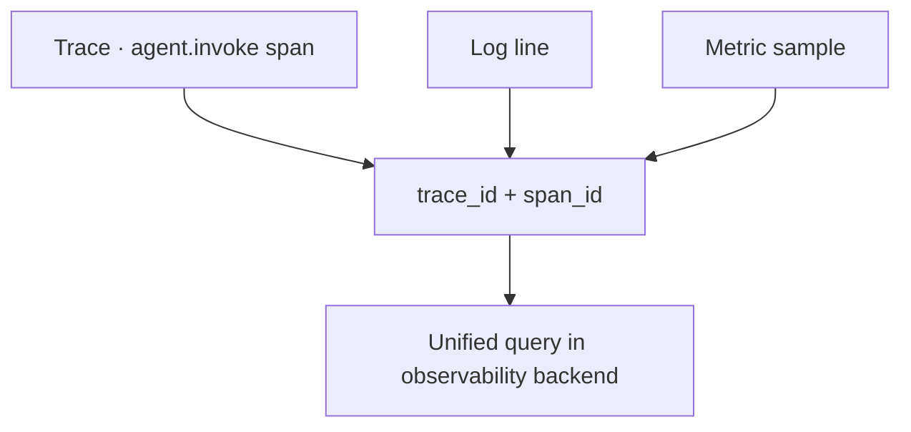
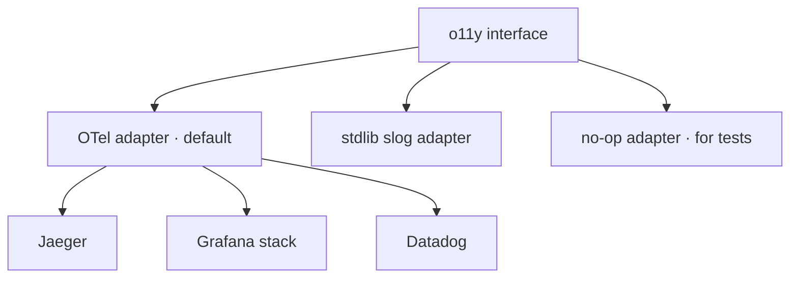

# DOC-14: Observability

**Audience:** Anyone operating Beluga or debugging production issues.
**Prerequisites:** [03 — Extensibility Patterns](./03-extensibility-patterns.md).
**Related:** [04 — Data Flow](./04-data-flow.md), [`.wiki/patterns/otel-instrumentation.md`](../../.wiki/patterns/otel-instrumentation.md).

## Overview

Beluga uses OpenTelemetry with the GenAI semantic conventions (v1.37+). Every package boundary opens a span. Every span attribute uses the `gen_ai.*` namespace so observability backends like Jaeger, Grafana Tempo, and Honeycomb render them natively. Metrics, logs, and traces correlate via trace/span IDs propagated through `context.Context`.

## Span hierarchy for a text chat turn



The root span is `agent.invoke` (or `runner.run` if the runner is the boundary). Every downstream call opens a child span. Errors propagate as span status `Error`; success is `Ok`.

## `gen_ai.*` attributes

Adapted from [`o11y/tracer.go:15-47`](../../.wiki/patterns/otel-instrumentation.md):

```go
const (
    AttrAgentName       = "gen_ai.agent.name"
    AttrOperationName   = "gen_ai.operation.name"
    AttrToolName        = "gen_ai.tool.name"
    AttrRequestModel    = "gen_ai.request.model"
    AttrResponseModel   = "gen_ai.response.model"
    AttrInputTokens     = "gen_ai.usage.input_tokens"
    AttrOutputTokens    = "gen_ai.usage.output_tokens"
    AttrSystem          = "gen_ai.system"
    AttrReasoningTokens = "gen_ai.usage.reasoning_tokens"
    AttrReasoningEffort = "gen_ai.request.reasoning_effort"
)
```

Every LLM call records:
- `gen_ai.system` — "openai", "anthropic", "bedrock", …
- `gen_ai.request.model` — "gpt-4o", "claude-opus-4-6", …
- `gen_ai.usage.input_tokens` / `gen_ai.usage.output_tokens` — for cost math downstream.
- `gen_ai.operation.name` — "chat", "embeddings", "completion".

Backends that understand GenAI conventions (recent versions of Datadog, Honeycomb, Grafana) render these as first-class cost and latency dashboards without manual setup.

## Metrics pipeline



Three export paths ship out of the box:

- **OTLP** — the canonical OpenTelemetry protocol. Works with Jaeger, Tempo, Honeycomb, Datadog, and essentially every modern backend.
- **Prometheus** — `/metrics` endpoint for scraping.
- **stdout JSON** — for local development and CI.

Six metric categories:

| Metric | Type | Labels | What it measures |
|---|---|---|---|
| `agent_turns_total` | counter | `agent`, `tenant`, `outcome` | Turn count |
| `agent_turn_duration_seconds` | histogram | `agent`, `tenant` | End-to-end latency |
| `llm_tokens_total` | counter | `provider`, `model`, `direction` | Token usage |
| `llm_cost_dollars_total` | counter | `provider`, `model`, `tenant` | Accumulated cost |
| `tool_invocations_total` | counter | `tool`, `outcome` | Tool usage and failure rate |
| `guard_decisions_total` | counter | `stage`, `decision` | Guard blocks/allows |

## Correlation across signals



Every log line includes `trace_id` and `span_id` (via `slog` wiring through `context.Context`). Every metric sample carries the same exemplars. You can click a slow turn in the latency histogram and navigate to its trace in one step.

## Structured logging

Beluga uses the standard library `log/slog`. A small adapter (`o11y/logger.go`) wires slog's handler to pull trace/span context from `ctx` automatically:

```go
slog.InfoContext(ctx, "tool executed",
    slog.String("tool", name),
    slog.Int("duration_ms", duration))
```

Fields common to every line:
- `trace_id`, `span_id` — for correlation.
- `tenant` — from `core.GetTenant(ctx)`.
- `session_id` — from `core.GetSession(ctx)`.

## Adapter architecture

Beluga's observability is behind a thin interface so you can swap the backend:



In tests, use the no-op adapter to avoid polluting your test output. In production, use the OTel adapter pointed at your backend of choice.

## Why GenAI semantic conventions

Before the GenAI conventions, every framework used its own attribute names: `llm.tokens.input`, `openai.prompt_tokens`, `model.usage.input`. Backends couldn't build dashboards that worked across frameworks. The GenAI conventions fix this — a dashboard built for OpenTelemetry LLM traces works on any framework that follows the spec.

Using the standard also means provider-specific features (reasoning tokens, cached tokens, tool counts) get dedicated attribute keys instead of each framework inventing its own.

## Common mistakes

- **Custom attribute names.** Use `gen_ai.*` — custom names are invisible to standard dashboards.
- **Forgetting `span.End()`.** Spans leak if not ended. Always `defer span.End()` right after `tracer.Start`.
- **Logging secrets in span attributes.** Attributes are exported and retained; strip them.
- **Missing `span.RecordError(err)` on failure.** The span status goes to Error but without the error message — debugging is harder than it needs to be.

## Related reading

- [15 — Resilience](./15-resilience.md) — metrics for retry and circuit breaker state.
- [`.wiki/patterns/otel-instrumentation.md`](../../.wiki/patterns/otel-instrumentation.md) — canonical code references.
- [04 — Data Flow](./04-data-flow.md) — which span fires at which point.
