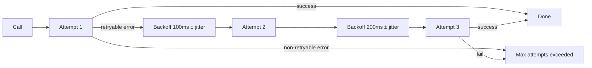
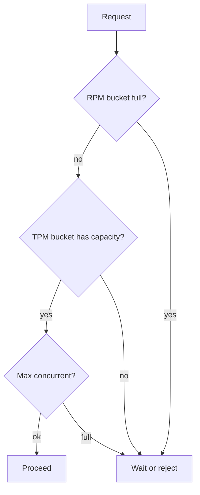
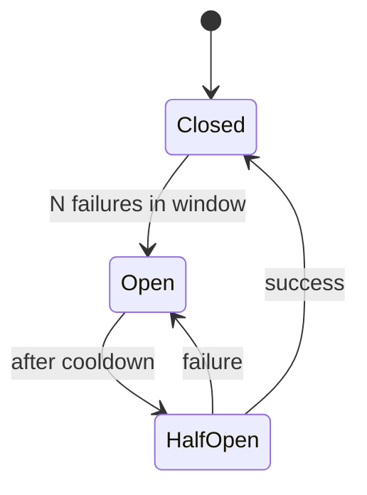
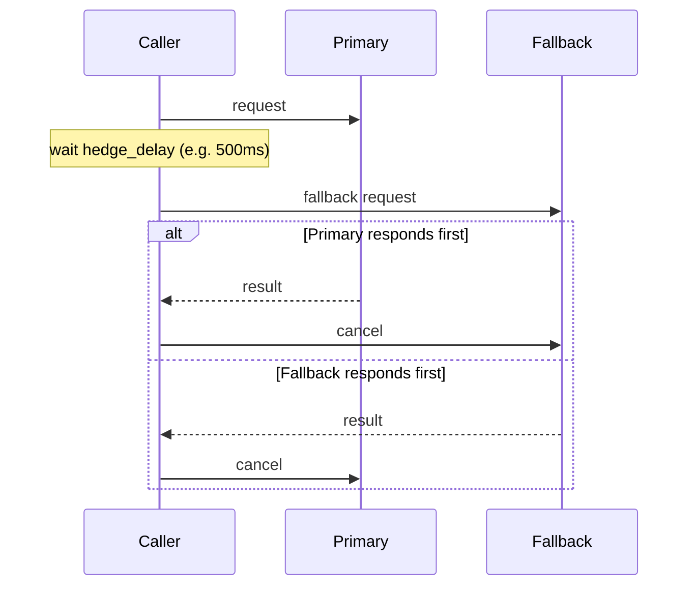

# DOC-15: Resilience Patterns

**Audience:** Anyone running Beluga against real LLM providers or unreliable tools.
**Prerequisites:** [03 — Extensibility Patterns](./03-extensibility-patterns.md).
**Related:** [14 — Observability](./14-observability.md), [`patterns/middleware-chain.md`](../patterns/middleware-chain.md).

## Overview

LLM providers rate limit. Networks fail. Tools time out. Beluga treats these as first-class concerns and ships four resilience primitives as middleware: **retry**, **rate limit**, **circuit breaker**, and **hedged requests**. All four compose via [`ApplyMiddleware`](./03-extensibility-patterns.md#ring-4--middleware).

## Retry



Retry middleware wraps any `Runnable` and retries on retryable errors. Retryability is determined by `core.IsRetryable(err)`: only `ErrRateLimit`, `ErrTimeout`, and `ErrProviderDown` are retryable (see [`.wiki/architecture/invariants.md#2`](../../.wiki/architecture/invariants.md)).

- **Exponential backoff** with jitter: `min(base * 2^attempt, max) * (1 + random jitter)`.
- **Context respected**: every iteration checks `ctx.Done()` before sleeping and before the next attempt.
- **Bounded**: default 3 attempts, configurable per call.

```go
wrapped := llm.ApplyMiddleware(model,
    llm.WithRetry(llm.RetryConfig{
        MaxAttempts: 3,
        BaseDelay:   100 * time.Millisecond,
        MaxDelay:    5 * time.Second,
        Jitter:      0.2,
    }),
)
```

**Invariant:** retry never retries `ErrAuth`, `ErrInvalidInput`, `ErrGuardBlocked`, or `ErrBudgetExhausted`. These are permanent; retrying wastes time and money.

## Rate limiting



Three buckets per provider:

- **RPM** — requests per minute.
- **TPM** — tokens per minute.
- **MaxConcurrent** — simultaneous in-flight calls.

Why three? Different providers gate on different things. Anthropic historically gates on TPM; Google gates on RPM; self-hosted often gates on concurrency. All three coexist because the rate limiter takes the tightest constraint.

```go
wrapped := llm.ApplyMiddleware(model,
    llm.WithRateLimit(llm.RateLimitConfig{
        RPM:           600,
        TPM:           150_000,
        MaxConcurrent: 20,
    }),
)
```

## Circuit breaker



Three states:

- **Closed** — normal operation, calls pass through.
- **Open** — too many recent failures, fail fast without calling the underlying service.
- **Half-Open** — cooldown elapsed; let one call through to probe. If it succeeds, close the circuit. If it fails, re-open.

Why circuit break instead of just retry? If the provider is down, retrying every request makes it worse (you pile work on a sick service). Circuit breaking says "don't even try for the next 30 seconds, the provider is visibly broken", freeing the caller to fail fast and maybe fall back to a different provider.

## Hedged requests



Used for tail-latency cutoff. If the primary request is still running at `hedge_delay`, fire a parallel fallback request. Whichever finishes first wins; the other is cancelled.

Best for tools like search or retrieval where the median is fast but the tail is long. Costs up to 2× the base rate for calls that exceed the hedge delay, but dramatically cuts P99 latency.

## Composition order matters

```go
wrapped := llm.ApplyMiddleware(model,
    llm.WithGuardrails(guards),   // outermost: see raw input
    llm.WithLogging(logger),
    llm.WithMetrics(),
    llm.WithCircuitBreaker(...),
    llm.WithRateLimit(...),
    llm.WithRetry(...),
    llm.WithHedge(...),           // innermost: wraps the actual call
)
```

Reading outside-in: guardrails inspect before anything happens; logging and metrics record; circuit breaker short-circuits if the service is down; rate limit gates; retry wraps individual attempts; hedge fires parallel attempts. This is the recommended order. See [03 — Extensibility Patterns](./03-extensibility-patterns.md#ring-4--middleware) for why outside-in.

## Observability of resilience

Every resilience middleware emits metrics and spans:

- `llm_retries_total{provider,model,outcome}` — retry counts.
- `rate_limit_wait_seconds` — histogram of wait times.
- `circuit_breaker_state{provider,state}` — current state gauge.
- `hedged_requests_won{provider,result}` — which side won the race.

Combined with distributed tracing ([DOC-14](./14-observability.md)), you can drill into any slow or failing turn and see exactly which resilience layer kicked in.

## Common mistakes

- **Unbounded retry loops.** Always set `MaxAttempts`. Infinite retries on a broken service is a DOS.
- **Retry for `ErrAuth`.** Auth failures won't fix themselves. `core.IsRetryable` returns false for a reason.
- **Tight retry loops without backoff.** Hammering a rate-limited provider with zero delay makes the rate limit worse.
- **Circuit breaker with too-short cooldown.** If the cooldown is 100ms, you're basically not circuit-breaking. Start at 30s and tune based on your provider's recovery behaviour.
- **Hedging non-idempotent calls.** Hedging makes two parallel calls. If the operation has side effects (create a record, send an email), both sides may land. Only hedge read operations.

## Related reading

- [14 — Observability](./14-observability.md) — metrics and traces emitted by resilience middleware.
- [03 — Extensibility Patterns](./03-extensibility-patterns.md) — the middleware pattern itself.
- [`patterns/error-handling.md`](../patterns/error-handling.md) — `core.IsRetryable` semantics.
