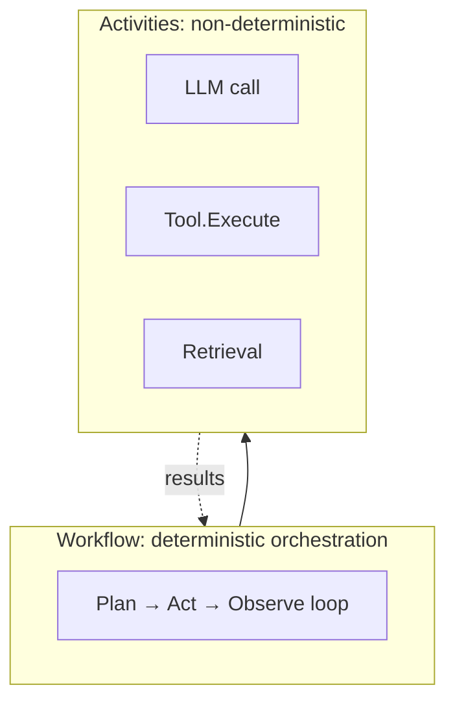
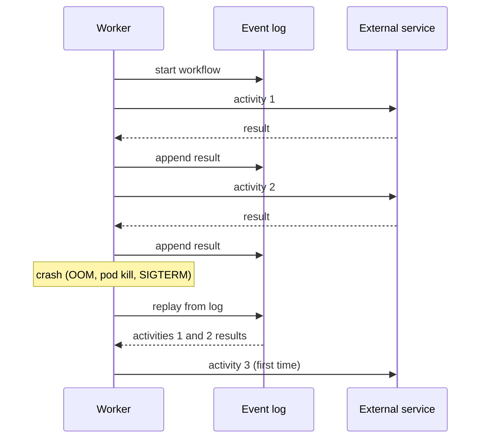
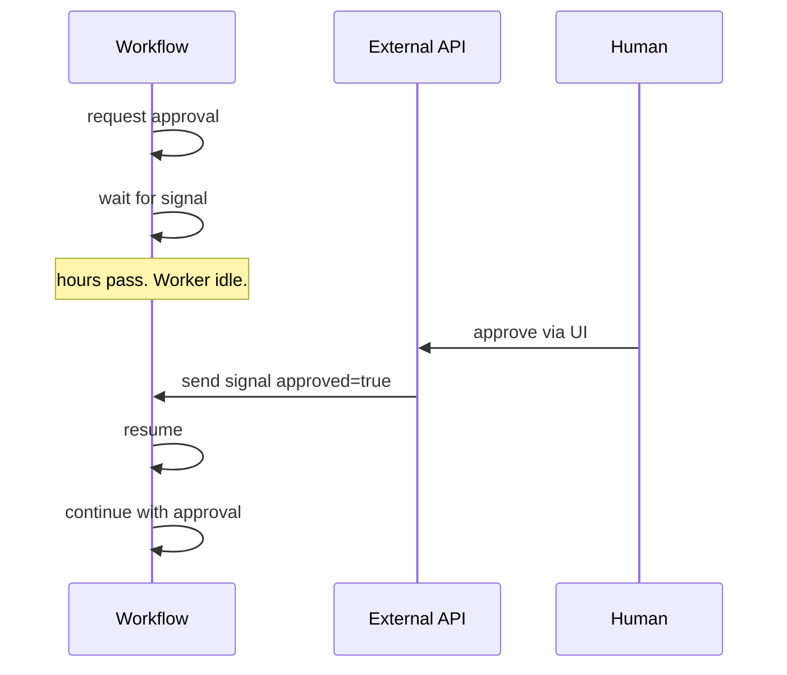
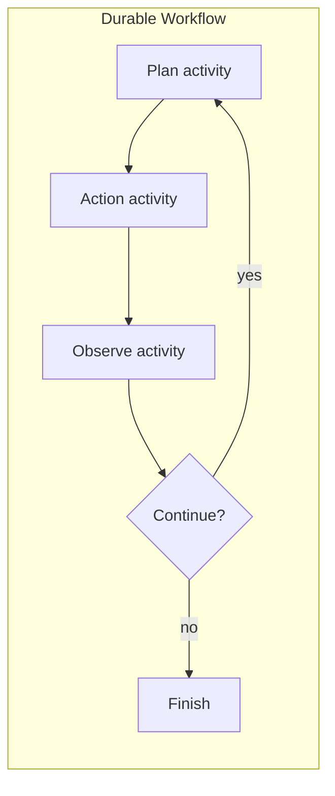

# DOC-16: Durable Workflows

**Audience:** Anyone running agents for tasks that take longer than a request lifetime.
**Prerequisites:** [04 — Data Flow](./04-data-flow.md), [06 — Reasoning Strategies](./06-reasoning-strategies.md).
**Related:** [17 — Deployment Modes](./17-deployment-modes.md), [Deploy on Temporal guide](../guides/deploy-temporal.md).

## Overview

Agents frequently run longer than a single HTTP request — a research task that takes an hour, a workflow that waits for human approval overnight, a multi-day pipeline. Durable workflows persist their state so a crash, redeploy, or machine failure doesn't lose progress. Beluga ships its own durable execution engine and also supports **Temporal** as a provider backend.

**Status:** the durable engine exists in `workflow/` with event logging and signal support. Temporal integration is available via a provider.

## Deterministic vs non-deterministic



The workflow is a **deterministic** program — given the same inputs and event log, it produces the same sequence of decisions. It's just orchestration: "call this activity, then that one, then based on the result, call a third".

The **activities** are the non-deterministic parts: LLM calls, tool invocations, network requests. Their results are recorded in the event log so a replay sees the same outcomes.

This split is what makes durable execution work: replaying the workflow replays the orchestration logic but reads activity results from the event log, so the replay produces the same state without re-calling external services.

## Crash recovery



On recovery, the worker replays the workflow from the start. For each already-completed activity, it reads the result from the event log instead of re-calling the service. When it reaches the first unfinished activity, it resumes from there.

This is how an agent can survive a 10-hour workflow with a mid-run crash.

## Signals — waiting for external events



A workflow can `await` a signal. The worker goes idle (no CPU, no memory beyond the event log) until the signal arrives — whether that's milliseconds or weeks later. When the signal comes in, the workflow resumes exactly where it left off.

This is the mechanism for human-in-the-loop: the workflow pauses, a notification goes to Slack/email, and when the human clicks approve, the API posts a signal that wakes the workflow.

## The agent loop as a workflow



The Plan → Act → Observe → Replan loop from [DOC-04](./04-data-flow.md) maps perfectly to a workflow: each step is an activity, the loop condition is deterministic logic, and the state (observations, iteration count, planner metadata) is persisted.

Wrapping an agent in a durable workflow is a one-line configuration change:

```go
r := runtime.NewRunner(agent,
    runtime.WithDurableExecution(
        workflow.NewEngine(workflow.WithBackend(temporalBackend)),
    ),
)
```

The same agent code works in both modes. In non-durable mode, the executor runs in-process; in durable mode, each activity is recorded to the event log.

## Built-in engine vs Temporal

Two backends are supported:

| Built-in engine | Temporal |
|---|---|
| In-process event log (SQLite, Postgres) | External Temporal cluster |
| Low ceremony — no extra infra | Production-grade, battle-tested |
| Simpler mental model | More features (versioning, schedules, SDK stability) |
| Good for dev, small deployments | Good for large-scale production |

Start with the built-in engine. Move to Temporal when you need its ecosystem (existing deployments, specific features) or when scale demands it. The agent code is unchanged — you swap the backend config.

## Event log schema

Each workflow run produces an append-only event log:

```
[
  { "type": "WorkflowStarted", "input": {...}, "ts": "..." },
  { "type": "ActivityScheduled", "name": "llm.plan", "args": {...}, "ts": "..." },
  { "type": "ActivityCompleted", "result": {...}, "ts": "..." },
  { "type": "ActivityScheduled", "name": "tool.http.fetch", ... },
  { "type": "ActivityFailed", "error": {...}, "ts": "..." },
  { "type": "ActivityCompleted", "result": {...}, "ts": "..." },
  { "type": "SignalReceived", "name": "approve", "payload": {...}, "ts": "..." },
  { "type": "WorkflowCompleted", "output": {...}, "ts": "..." }
]
```

Replay reads the log from the beginning and feeds activity results back to the workflow code at the points they were originally called.

## Determinism rules

For replay to work, the workflow code must be deterministic:

- **No wall-clock time** in workflow code. Use `workflow.Now(ctx)`, which the replay engine controls.
- **No direct network calls** in workflow code. Wrap them in activities.
- **No random numbers** without using `workflow.Random(ctx)`.
- **No goroutines** except via `workflow.Go(ctx, fn)`, which the engine tracks.

If you need non-determinism, put it in an activity.

## Common mistakes

- **Time-based branches in workflow code.** `if time.Now().Hour() > 12` is non-deterministic. Use `workflow.Now(ctx)`.
- **Mutating shared state in activities.** Activities should be self-contained. Shared mutable state introduces races during replay.
- **Not using signals for HITL.** Polling a database from the workflow is wasteful and breaks determinism. Use signals.
- **Huge payloads in the event log.** Pass references (IDs, S3 keys), not the full data. Keeps the log small and replay fast.

## Related reading

- [04 — Data Flow](./04-data-flow.md) — the agent loop maps to workflow activities.
- [17 — Deployment Modes](./17-deployment-modes.md) — Temporal as a deployment mode.
- [Deploy on Temporal guide](../guides/deploy-temporal.md) — concrete setup.
