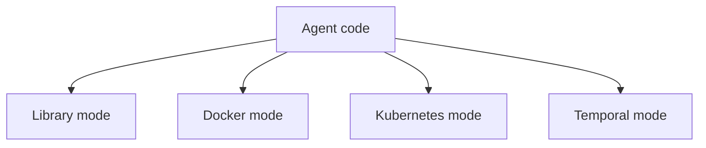
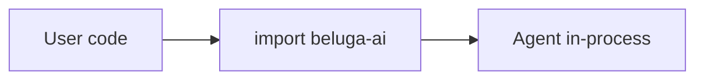
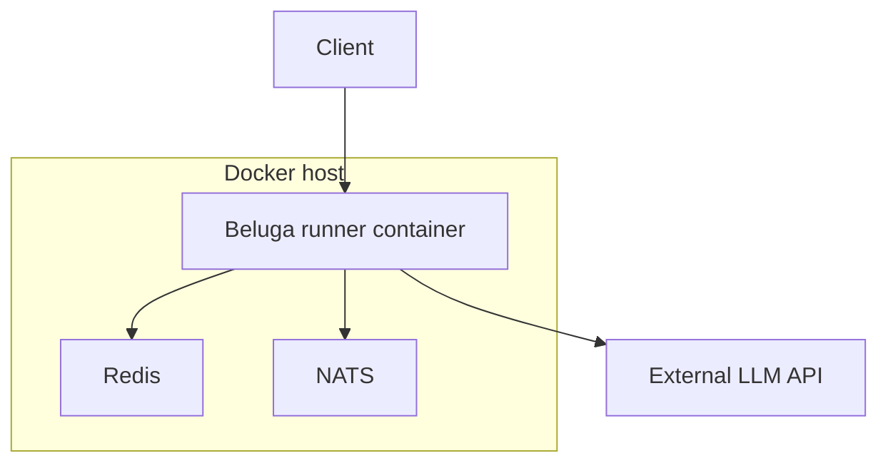
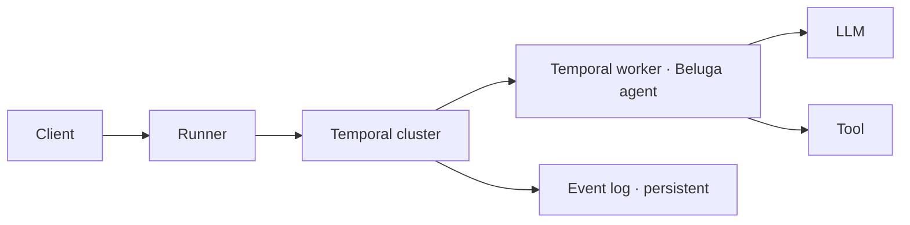
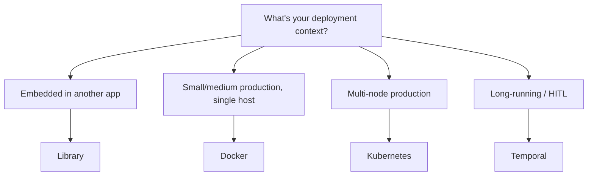

# DOC-17: Deployment Modes

**Audience:** Operators, platform engineers, and anyone choosing how to run Beluga.
**Prerequisites:** [08 — Runner and Lifecycle](./08-runner-and-lifecycle.md).
**Related:** [16 — Durable Workflows](./16-durable-workflows.md), [Deploy on Docker](../guides/deploy-docker.md), [Deploy on Kubernetes](../guides/deploy-kubernetes.md), [Deploy on Temporal](../guides/deploy-temporal.md).

## Overview

The same Beluga agent can be deployed four different ways without changing its code. The decision is a matter of operational requirements — scale, durability, integration with existing platforms — not of agent design.



## Mode comparison

| Mode | Infra needed | Durable? | Scale | Best for |
|---|---|---|---|---|
| **Library** | None (embedded) | No | Single process | CLIs, desktop apps, embedded |
| **Docker** | Docker Engine | Optional (persistent volumes) | Single host or small cluster | Small to medium production |
| **Kubernetes** | K8s cluster | Optional (PVs) + HPA | Multi-node, autoscaling | Mid-to-large production |
| **Temporal** | Temporal cluster | Yes | Depends on Temporal deployment | Long-running / HITL workflows |

## Library mode



Import Beluga as a Go library. Build and run an agent in the same process. No network, no runner, no session service (or an in-memory one).

```go
package main

import (
    "context"
    "github.com/lookatitude/beluga-ai/v2/agent"
    "github.com/lookatitude/beluga-ai/v2/llm"
    _ "github.com/lookatitude/beluga-ai/v2/llm/providers/openai"
)

func main() {
    model, _ := llm.New("openai", llm.Config{Model: "gpt-4o"})
    a := agent.NewLLMAgent(
        agent.WithPersona(agent.Persona{Role: "assistant"}),
        agent.WithLLM(model),
    )
    out, _ := a.Invoke(context.Background(), "Hello")
    println(out.(string))
}
```

Use when: you're building a CLI, a desktop app, an embedded tool, or a unit test. Simplest mode, zero infrastructure.

## Docker mode



Wrap a `Runner` in a container, add Redis for sessions and NATS for event bus, compose them. This is the typical "one-box production" setup.

Typical `docker-compose.yml`:

```yaml
services:
  agent:
    image: myorg/beluga-agent:v1
    environment:
      REDIS_URL: redis://redis:6379
      NATS_URL: nats://nats:4222
      OPENAI_API_KEY: ${OPENAI_API_KEY}
    ports: ["8080:8080"]
    depends_on: [redis, nats]
  redis:
    image: redis:7-alpine
  nats:
    image: nats:2-alpine
```

Use when: you want production-grade hosting without a Kubernetes cluster. Works well for single-tenant SaaS and internal tools.

See [Deploy on Docker guide](../guides/deploy-docker.md).

## Kubernetes mode

```mermaid
graph TD
  CR[Agent CRD] --> Op[Beluga Operator]
  Op --> Dep[Deployment]
  Op --> Svc[Service]
  Op --> HPA[HorizontalPodAutoscaler]
  Op --> NP[NetworkPolicy]
  Op --> SM[ServiceMonitor]
  Dep --> Pod1[Runner pod 1]
  Dep --> Pod2[Runner pod 2]
  Dep --> Pod3[Runner pod N]
  Pod1 --> Card[/.well-known/agent.json]
```

Define an `Agent` custom resource. The Beluga operator reconciles it into a Deployment, Service, HPA, NetworkPolicy, and ServiceMonitor. The AgentCard is served at `/.well-known/agent.json` on every pod.

```yaml
apiVersion: beluga.ai/v1
kind: Agent
metadata:
  name: research-assistant
spec:
  replicas: 3
  image: myorg/research-agent:v2.1.0
  llm:
    provider: openai
    model: gpt-4o
  memory:
    provider: redis
    url: redis://redis.default.svc:6379
  resources:
    requests: { cpu: 500m, memory: 1Gi }
    limits: { cpu: 2, memory: 4Gi }
  autoscale:
    min: 2
    max: 10
```

Reconcile loop: validate → resolve config references → build Deployment/Service/HPA/NetworkPolicy/ServiceMonitor → register the AgentCard.

Use when: you're running multi-tenant or high-volume production, you need autoscaling, you already have a Kubernetes platform.

See [Deploy on Kubernetes guide](../guides/deploy-kubernetes.md).

## Temporal mode



The Runner hands the agent loop off to a Temporal workflow. Each activity (LLM call, tool execute) is recorded in Temporal's event log. Crashes are recovered by replay.

Use when:
- Workflows run for minutes, hours, or days.
- You need human-in-the-loop (signals).
- You already run Temporal and want Beluga agents alongside other workflows.

See [DOC-16](./16-durable-workflows.md) and [Deploy on Temporal guide](../guides/deploy-temporal.md).

## Choosing a mode



These aren't mutually exclusive. A large deployment might run some agents in Kubernetes for general use and a subset in Temporal for long-running research tasks — same agent code, different runners in each case.

## What changes between modes

| Concern | Library | Docker | Kubernetes | Temporal |
|---|---|---|---|---|
| Runner | optional | yes | yes | yes |
| Session service | in-memory | redis/postgres | redis/postgres | Temporal state |
| Protocol endpoints | no | REST/SSE/WS | REST/SSE/A2A/MCP | internal |
| Durability | no | optional | optional | yes |
| Autoscaling | no | manual | HPA | Temporal worker scaling |
| Secrets | env vars | env/compose | K8s Secrets | K8s Secrets + Temporal config |

## What doesn't change

- The agent code.
- The tools, memory, planner, hooks.
- The guards.
- The reasoning strategy.
- The integration tests.

This is the payoff of keeping the Runner separate from the Agent — the decision about how to deploy is orthogonal to the decision about how the agent behaves.

## Common mistakes

- **Library mode in production.** Fine for CLIs. Disastrous for multi-user services (no session isolation, no rate limiting, no observability).
- **Kubernetes for a single-tenant internal tool.** Docker is simpler and cheaper if you don't need the features.
- **Temporal for short turns.** Temporal's overhead per activity is non-trivial. If turns finish in seconds, use the built-in engine or no durability at all.
- **Custom session services when Redis works.** Redis handles sessions for most deployments. Only roll your own if you have specific requirements.

## Related reading

- [08 — Runner and Lifecycle](./08-runner-and-lifecycle.md) — the Runner is the unit being deployed.
- [16 — Durable Workflows](./16-durable-workflows.md) — when to choose Temporal mode.
- [12 — Protocol Layer](./12-protocol-layer.md) — protocol exposure varies by mode.
