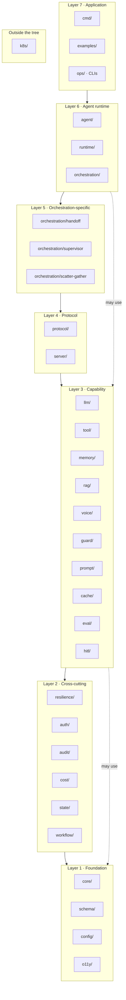
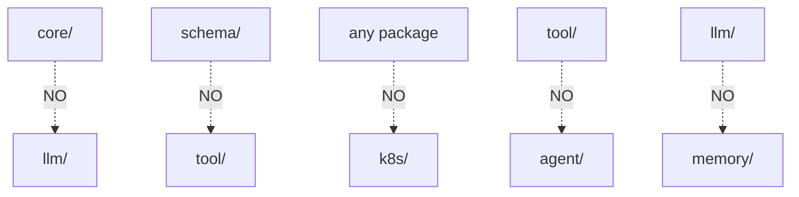

# DOC-18: Package Dependency Map

**Audience:** Contributors and architects enforcing the layering rule.
**Prerequisites:** [01 — Overview](./01-overview.md).
**Related:** [`.wiki/architecture/package-map.md`](../../.wiki/architecture/package-map.md), [`.wiki/architecture/invariants.md`](../../.wiki/architecture/invariants.md).

## Overview

Every Beluga package belongs to exactly one layer. Imports flow **downward only** — a package may import from layers below it, never above, never sideways across unrelated layers. This document makes the rule explicit and shows the full dependency graph.

## The layering rule

> A package in Layer N may import from any package in Layer 1 … N−1. It may not import from Layer N+1, N+2, …, or from unrelated packages in the same layer.

This is checked by `/arch-validate` (see [.claude/commands/arch-validate.md](../../.claude/commands/arch-validate.md)).

## Layer assignments



## Detailed dependencies by package

Use [`.wiki/architecture/package-map.md`](../../.wiki/architecture/package-map.md) as the live, scan-backed reference. The summary:

### Layer 1 — Foundation (`core`, `schema`, `config`, `o11y`)

**Rule:** zero external deps beyond stdlib + OpenTelemetry. No imports from above.

```
core     → stdlib, otel
schema   → stdlib
config   → stdlib
o11y     → stdlib, otel
```

### Layer 2 — Cross-cutting (`resilience`, `auth`, `audit`, `cost`, `state`, `workflow`)

May import: `core`, `schema`, `config`, `o11y`.
May NOT import: each other (in most cases), or anything in Layer 3+.

```
resilience → core, o11y
auth       → core, schema, o11y
audit      → core
cost       → core
state      → core, o11y
workflow   → core, schema, o11y, config
```

Note: `audit` and `cost` currently depend only on `core`. `state` depends on `core` and `o11y` (plus `internal/hookutil`).

### Layer 3 — Capability (`llm`, `tool`, `memory`, `rag`, `voice`, `guard`, `prompt`, `cache`, `eval`, `hitl`)

May import: Layers 1, 2. May also import provider SDKs inside their own `*/providers/` subdirectories.

```
llm        → core, schema, o11y, resilience, cache
tool       → core, schema, o11y
memory     → core, schema, o11y, rag (for archival)
rag        → core, schema, o11y
voice      → core, schema, o11y, llm, tool
guard      → core, schema, o11y, llm (for guard LLMs)
prompt     → o11y, schema
cache      → core, rag/embedding
eval       → core, schema, llm, tool, agent (⚠ violation — see below)
hitl       → core, o11y
```

**Layering violation — `eval` imports `agent`:** The `eval` package (Layer 3) imports `agent` (Layer 6), which is an upward dependency. The `eval` package also imports `llm` and `tool` (Layer 3 peers), which is acceptable for evaluation runners that need to invoke models and tools. However, the `agent` import violates the layering rule and should be refactored so that evaluation of agents is wired at Layer 6 or Layer 7, not inside `eval/` itself.

### Layer 4 — Protocol (`protocol`, `server`)

May import: Layers 1–3.

```
protocol → core, schema, o11y, tool, llm (for LLM-backed protocol ops)
server   → core, schema, o11y, protocol, runtime
```

### Layer 5 — Orchestration (`orchestration/*`)

May import: Layers 1–4 and `agent` (recursive composition).

```
orchestration → core, schema, o11y, agent
```

### Layer 6 — Agent runtime (`agent`, `runtime`)

May import: everything below.

```
agent   → core, schema, o11y, llm, tool, memory, guard, prompt, hitl
runtime → core, schema, o11y, agent, orchestration, server, auth, audit, cost
```

### Layer 7 — Application

Everything below. User code, CLIs, examples, operators.

### k8s/ — outside the tree

**The framework never imports `k8s/`.** K8s integration is an *overlay*: the operator imports `runtime/` to instantiate agents, and `runtime/` doesn't care whether it's being embedded in a kubelet or a CLI. See [DOC-17](./17-deployment-modes.md).

## Prohibited dependencies



A few specific prohibitions:

- **`core/` imports `llm/`** — this would turn the foundation into an LLM framework. `llm/` is a consumer of `core/`, not the reverse.
- **`schema/` imports anything above Layer 1** — `schema/` is wire types only.
- **Any package imports `k8s/`** — Kubernetes support is an overlay, not a dependency.
- **`tool/` imports `agent/`** — tools are invoked *by* agents; they must not import them.
- **Cross-capability imports in Layer 3** — `llm/` doesn't import `memory/`, `memory/` doesn't import `voice/`, etc. If you need cross-capability wiring, do it in Layer 6.

Run `/arch-validate all` to scan the current code for violations.

## Why this matters

- **Build times.** Downward-only imports keep the dependency graph a DAG, so incremental builds work.
- **Change blast radius.** A change in Layer 3 can only affect Layers 4, 5, 6, 7. It cannot break the foundation.
- **Testability.** Layer 1 has zero external deps, so its tests are fastest and most reliable.
- **Package extraction.** If you need to extract `core/` as a standalone library, it has no hidden dependencies.
- **Reasoning.** You can hold one layer in your head without thinking about the rest.

## Enforcement

- **Static:** `go vet ./...` catches many violations via import cycle detection.
- **Automated:** [`arch-validate`](../../.claude/commands/arch-validate.md) scans for disallowed imports per the rules above.
- **Review:** `reviewer-security` and `reviewer-qa` check imports in code review.
- **Runtime:** the dependency graph is emitted as a span attribute during startup (optional), so violations are visible in observability.

## Common mistakes

- **"Just this once" upward import.** These accumulate and the layering breaks. Refactor the caller instead — usually the code you're trying to import from should move up a layer.
- **Importing `k8s/` from `runtime/`.** The operator imports `runtime/`, not the reverse.
- **Creating a fifth Layer 1 package.** `core`, `schema`, `config`, `o11y` is the full set. New foundation primitives belong inside these four, not as a new package.
- **Bypassing the layering via interface contortions.** If `core/` needs to know about something in `llm/`, refactor the interface into `core/` and have `llm/` implement it. Don't import upward.

## Related reading

- [01 — Overview](./01-overview.md) — the 7-layer model at a higher level.
- [`.wiki/architecture/package-map.md`](../../.wiki/architecture/package-map.md) — live, scan-backed package details.
- [`.wiki/architecture/invariants.md`](../../.wiki/architecture/invariants.md) — the invariants list, including the layering rule.
