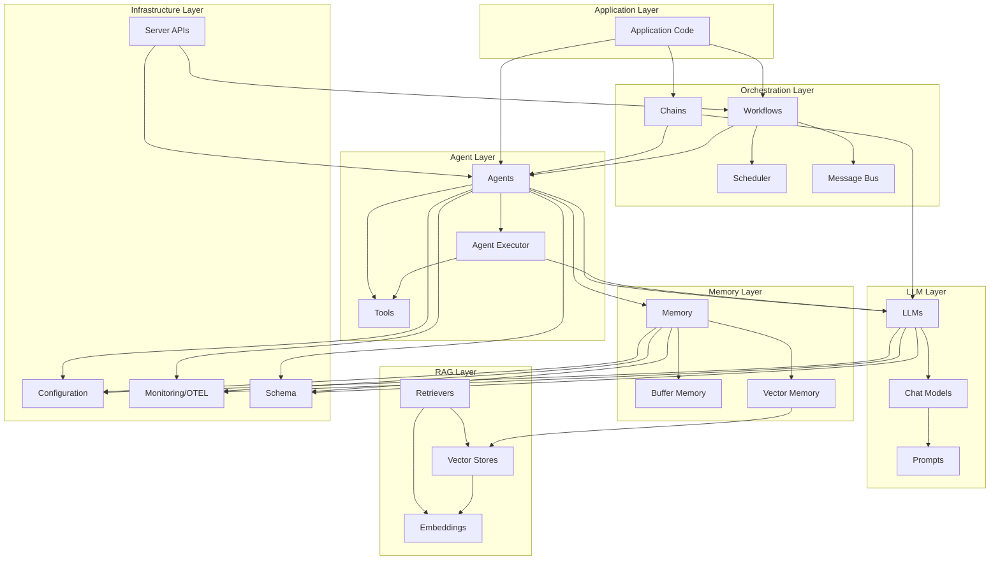
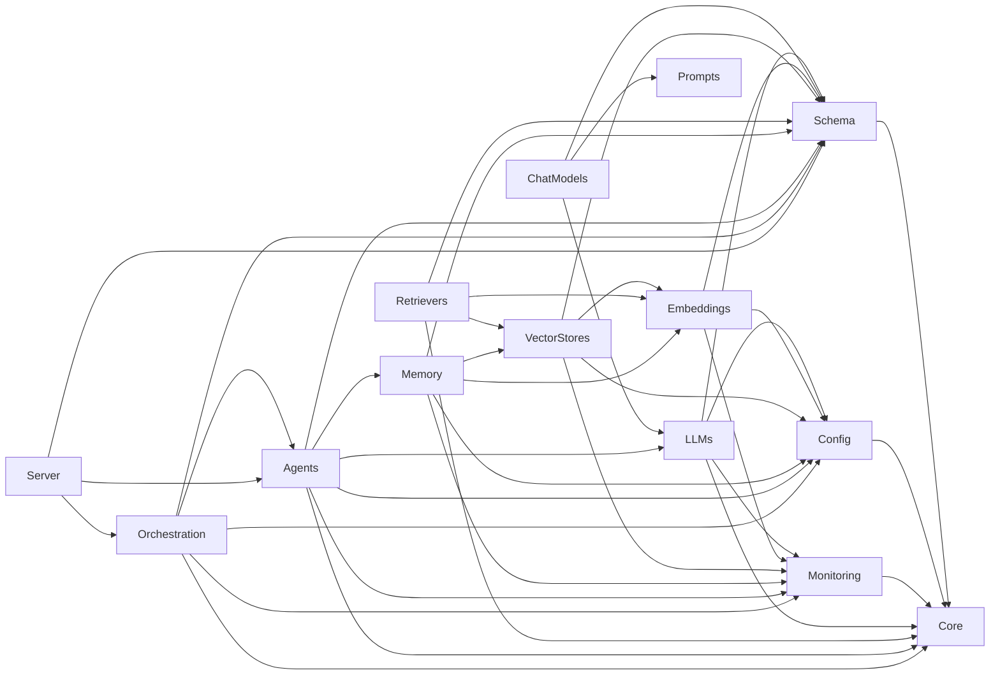

# Beluga AI Framework

This document outlines the refactored architecture of the Beluga AI Framework, detailing the module structure, design principles, and key changes implemented during the refactoring process. The primary goals of this refactoring were to improve modularity, extendibility, maintainability, and ease of use, adhering to Go best practices and modern design patterns such as ISP, DIP, SRP, and composition over inheritance.

## 1. Overview of Architectural Changes

The refactoring process involved a significant restructuring of the Beluga AI framework to promote a cleaner separation of concerns and a more intuitive developer experience. The core philosophy was to create a layered architecture with well-defined interfaces, making the framework more robust and adaptable to future requirements.

### 1.1 System Architecture Overview

The following diagram shows the high-level architecture of the Beluga AI Framework:



### 1.2 Package Dependency Graph

The following diagram shows how packages depend on each other:



Key changes include:
- **Modular Package Structure:** The `pkg` directory now houses clearly delineated modules for core functionalities, schema definitions, agents, orchestration, and utilities. This replaces a flatter or less organized structure, making it easier to locate and understand different parts of the framework.
- **Interface-Driven Design:** Emphasis has been placed on defining clear interfaces for key components like `Agent`, `Tool`, `Scheduler`, `MessageBus`, and `Workflow`. This promotes loose coupling and allows for easier substitution of implementations.
- **Composition over Inheritance:** The framework now favors composition for building complex functionalities, aligning with Go idioms. `BaseAgent`, `BaseTool`, and `BaseWorkflow` provide foundational structs that can be embedded, rather than relying on classical inheritance.
- **Dedicated Schema Package:** All core data structures and message types are now centralized in the `pkg/schema` package, providing a single source of truth for data exchange within the framework.
- **Clear Separation of Agent Components:** The `pkg/agents` directory is subdivided into `base` (for core agent interfaces and base implementations), `tools` (for tool definitions), `executor` (for agent execution logic), and `factory` (for agent creation).
- **Orchestration Layer:** The `pkg/orchestration` package introduces components like `Scheduler`, `MessageBus`, and `Workflow` to manage complex interactions and task sequences.
- **Utility and Core Packages:** Common utilities are placed in `pkg/core/utils`, and core model definitions (if any beyond schema) are in `pkg/core/model`.
- **Monitoring and Config Integration:** All packages integrate with `pkg/monitoring` for observability (tracing/metrics) and `pkg/config` for dynamic configuration loading/validation.
- **Server Exposure:** Components like agents and workflows can be exposed via `pkg/server` as MCP or REST APIs with streaming support.
- **Error Handling and Testing:** Custom error types with codes, consistent across packages, and comprehensive testing with mocks.

## 2. Module Structure and Responsibilities

The refactored `pkg` directory is organized as follows:

### `pkg/schema`
- **Purpose:** Defines all core data structures, message types, and interfaces for data representation used throughout the framework.
- **Key Files:**
  - `message.go`: Defines `Message` interface, various message types (AI, Human, System, Tool, Chat, Function), and `StoredMessage` for persistence.
  - `document.go`: Defines the `Document` struct for representing text data with metadata.
  - `history.go`: Defines the `ChatHistory` interface and a `BaseChatHistory` implementation for managing conversation histories.
  - *(Other schema files like `example.go` would be here if defined)*
- **Design Principles:** Centralized, clear, and consistent data definitions. Promotes type safety and ease of data exchange between modules.

### `pkg/core`
- **Purpose:** Contains fundamental utilities and core model definitions that are not specific to a single high-level module like agents or orchestration but are used across the framework.
- **Sub-packages:**
  - `utils/`: Houses common utility functions (e.g., `GenerateRandomString`, `ContainsString` in `utils.go`).
  - `model/`: Contains core data models or abstract representations central to the framework's operation (e.g., `ExampleInterface`, `ExampleModel` in `model.go` as placeholders for more specific core models).
- **Design Principles:** Provides reusable, foundational components. Keeps the root of `pkg` clean by grouping these lower-level elements.

### `pkg/agents`
- **Purpose:** Manages all aspects related to AI agents, including their definition, execution, tools, and creation.
- **Sub-packages:**
  - `base/`: Defines the core `Agent` interface and the `BaseAgent` struct (`base_agent.go`). `BaseAgent` provides common fields and methods that specific agent implementations can embed and extend. It now includes `Plan` and `Execute` methods to fulfill the `Agent` interface contract.
  - `tools/`: Defines the `Tool` interface and `BaseTool` struct (`tool.go`) for creating tools that agents can use. Also includes `ToolAgentAction` for representing an agent's decision to use a tool.
  - `executor/`: Contains the `AgentExecutor` (`executor.go`), which is responsible for running an agent's plan-execute cycle, managing interactions with tools, and handling intermediate steps.
  - `factory/`: Provides an `AgentFactory` (`factory.go` in `pkg/agents/factory/`) for creating agent instances. This promotes decoupling and allows for easier management of different agent types. *(Note: There was also a `pkg/agents/factory.go` at a higher level, which has been consolidated or clarified by the refactor to be within its own subdirectory for better organization if it's a distinct factory pattern implementation.)*
  - `adapter/`: (If present and refactored) Would contain adapters for integrating agents with different external systems or protocols.
  - `config/`: (If present and refactored) Would handle agent-specific configurations.
- **Design Principles:** Highly modular, interface-driven, and extendable. New agent types and tools can be added by implementing the defined interfaces.

### `pkg/orchestration`
- **Purpose:** Provides components for managing and coordinating complex sequences of tasks, workflows, and message-based communication between different parts of the framework or external services.
- **Sub-packages:**
  - `scheduler/`: Defines a `Scheduler` interface and an `InMemoryScheduler` implementation (`scheduler.go`) for scheduling and executing tasks at specific times or intervals.
  - `messagebus/`: Defines a `MessageBus` interface and an `InMemoryMessageBus` implementation (`messagebus.go`) for topic-based publish/subscribe messaging.
  - `workflow/`: Defines `Workflow` and `Task` interfaces, along with a `BaseWorkflow` implementation (`workflow.go`), for creating and executing multi-step workflows.
- **Design Principles:** Enables complex process management, asynchronous operations, and inter-component communication in a decoupled manner.

### `pkg/llms`
- **Purpose:** Handles interactions with Large Language Models (LLMs) and chat models.
- **Key Features:** Factory for providers (e.g., OpenAI, Anthropic), config validation, metrics for generations, tracing.
- **Design Principles:** Provider-agnostic with factories for extendability.

### `pkg/chatmodels`
- **Purpose:** Specialized for chat-based LLM interactions, composing with llms.
- **Key Features:** Message generation/streaming, tool binding, health checks.
- **Design Principles:** Compositional, with adapters for llms.

### `pkg/embeddings`
- **Purpose:** Manages text embeddings for vector stores.
- **Key Features:** Factory for providers (e.g., OpenAI, Ollama), config, metrics.
- **Design Principles:** Interface-driven for easy provider swaps.

### `pkg/prompts`
- **Purpose:** Handles prompt templating and management.
- **Key Features:** Template rendering, config for loading prompts.
- **Design Principles:** Flexible for dynamic prompts.

### `pkg/retrievers`
- **Purpose:** Information retrieval from data sources.
- **Key Features:** Composes with vectorstores/embeddings, metrics.
- **Design Principles:** Runnable for orchestration integration.

### `pkg/vectorstores`
- **Purpose:** Interfaces with vector databases.
- **Key Features:** Factory for stores (e.g., PGVector, InMemory), add/retrieve operations.
- **Design Principles:** Abstraction over backends.

### `pkg/memory`
- **Purpose:** Manages conversation memory for agents/llms.
- **Key Features:** Types like buffer/summary/vectorstore, config.
- **Design Principles:** Compositional histories.

### `pkg/monitoring`
- **Purpose:** Provides logging, tracing, metrics, health checks, safety/ethics.
- **Key Features:** OTEL integration, structured logging, ethical AI checks.
- **Design Principles:** Injectable into all packages for observability.

### `pkg/config`
- **Purpose:** Framework-wide configuration loading/validation.
- **Key Features:** Viper provider, env support, validation.
- **Design Principles:** Centralized config management.

### `pkg/server`
- **Purpose:** Exposes framework components as APIs (REST, MCP).
- **Key Features:** Streaming support, integration with agents/workflows.
- **Design Principles:** Modular servers.

### `pkg/ui`
- **Purpose:** (If present) Provides UI for monitoring/dashboard.
- **Design Principles:** Optional, integrates with monitoring.

## 3. Design Patterns and Principles Applied

- **Interface Segregation Principle (ISP):** Interfaces are small and focused (e.g., Agent, Tool).
- **Dependency Inversion Principle (DIP):** Depend on abstractions; use factories and options.
- **Single Responsibility Principle (SRP):** One responsibility per package/struct.
- **Composition over Inheritance:** Embed bases (e.g., BaseAgent) for reuse.
- **Factory Pattern:** Used for providers/factories across packages.
- **Modularity:** Clear package boundaries with iface/ subdirs.
- **Observability:** OTEL metrics/tracing in all packages.
- **Configuration:** Dynamic loading with validation.
- **Error Handling:** Custom errors with codes.
- **Extensibility:** Options patterns and interfaces for additions.

## 4. Key Code Changes and Refactoring Highlights

- **go.mod Module Name:** Ensured consistent imports.
- **Interface Compliance:** Bases implement interfaces with placeholders.
- **Import Path Corrections:** Aligned with structure.
- **Unused Import Removal:** Cleaned for compilation.
- **Directory Structure:** Logical subdirs (e.g., iface/, internal/, providers/).
- **Integration:** All use config, schema, monitoring.

## 5. How to Extend the Framework

### Adding a New Agent Type:
1. Define struct in pkg/agents/providers/myagent/.
2. Embed BaseAgent.
3. Implement Agent interface.
4. Register in factory.

### Adding a New LLM Provider:
1. Create pkg/llms/providers/myprovider/.
2. Implement LLM/ChatModel interfaces.
3. Add to factory in llms.go.
4. Update config for provider-specific settings.

### Adding a New Vector Store:
1. Create pkg/vectorstores/providers/myvectorstore/.
2. Implement VectorStore interface.
3. Add to factory in vectorstores.go.

## 6. Data Flow Diagrams

### 6.1 RAG Pipeline Data Flow

The following diagram shows how data flows through a complete RAG pipeline:
sequenceDiagram


    participant User
    participant App
    participant Retriever
    participant VectorStore
    participant Embedder
    participant LLM
    participant Memory
    
    User->>App: Query
    App->>Memory: Load Memory Variables
    Memory-->>App: Context
    
    App->>Retriever: Get Relevant Documents
    Retriever->>Embedder: Embed Query
    Embedder-->>Retriever: Query Embedding
    Retriever->>VectorStore: Similarity Search
    VectorStore-->>Retriever: Relevant Documents
    Retriever-->>App: Documents
    
    App->>App: Build Context (Memory + Documents)
    App->>LLM: Generate with Context
    LLM-->>App: Response
    
```
    App->>Memory: Save Context
    App-->>User: Final Answer

### 6.2 Agent Execution Flow

The following diagram shows how an agent executes a plan:
sequenceDiagram


    participant User
    participant Agent
    participant Planner
    participant Executor
    participant Tools
    participant LLM
    participant Memory
    
    User->>Agent: Input
    Agent->>Memory: Load Memory
    Memory-->>Agent: Context
    
    Agent->>Planner: Plan
    Planner->>LLM: Generate Plan
    LLM-->>Planner: Plan Steps
    Planner-->>Agent: Plan
    
    Agent->>Executor: Execute Plan
    loop For each step
        Executor->>Tools: Execute Tool
        Tools-->>Executor: Result
        Executor->>Memory: Update Context
    end
    Executor-->>Agent: Final Result
    
    Agent->>Memory: Save Context
    Agent-->>User: Output
```

### 6.3 Multi-Agent Coordination Flow

The following diagram shows how multiple agents coordinate:
sequenceDiagram


    participant Coordinator
    participant Agent1
    participant Agent2
    participant Agent3
    participant MessageBus
    participant Scheduler
    
```
    Coordinator->>Scheduler: Schedule Tasks
    Scheduler->>Agent1: Task 1
    Agent1->>MessageBus: Publish Result
    MessageBus->>Agent2: Notify
    Agent2->>Agent2: Process
    Agent2->>MessageBus: Publish Result
    MessageBus->>Agent3: Notify
    Agent3->>Agent3: Process
    Agent3-->>Coordinator: Final Result

## 7. Component Interaction Diagrams

### 7.1 Agent with Tools and Memory
graph TB


    Agent[Agent]
    LLM[LLM]
    Tools[Tools]
    Memory[Memory]
    Executor[Executor]
    
    Agent --> LLM
    Agent --> Tools
    Agent --> Memory
    Agent --> Executor
    
    Executor --> Tools
    Executor --> LLM
    Executor --> Memory
    
    Tools --> Tool1[Tool 1]
    Tools --> Tool2[Tool 2]
    Tools --> Tool3[Tool 3]
    
    Memory --> Buffer[Buffer Memory]
    Memory --> Vector[Vector Memory]
```

### 7.2 RAG System Components
graph TB


    Query[User Query]
    Retriever[Retriever]
    VectorStore[Vector Store]
    Embedder[Embedder]
    LLM[LLM]
    Response[Response]
    
```mermaid
    Query --> Retriever
    Retriever --> Embedder
    Retriever --> VectorStore
    VectorStore --> Embedder
    Retriever --> LLM
    LLM --> Response

    Documents[Documents] --> VectorStore
    VectorStore --> Embedder

## 8. Future Considerations and Potential Improvements

- **Comprehensive Testing:** Add unit/integration tests for all.
- **Error Handling:** Standardize further.
- **Configuration Management:** Add remote config support.
- **Dependency Injection:** Framework-wide DI.
- **Asynchronous Operations:** Enhance for production.
- **Context Propagation:** Ensure throughout.
- **Logging and Monitoring:** Integrate advanced tools.
