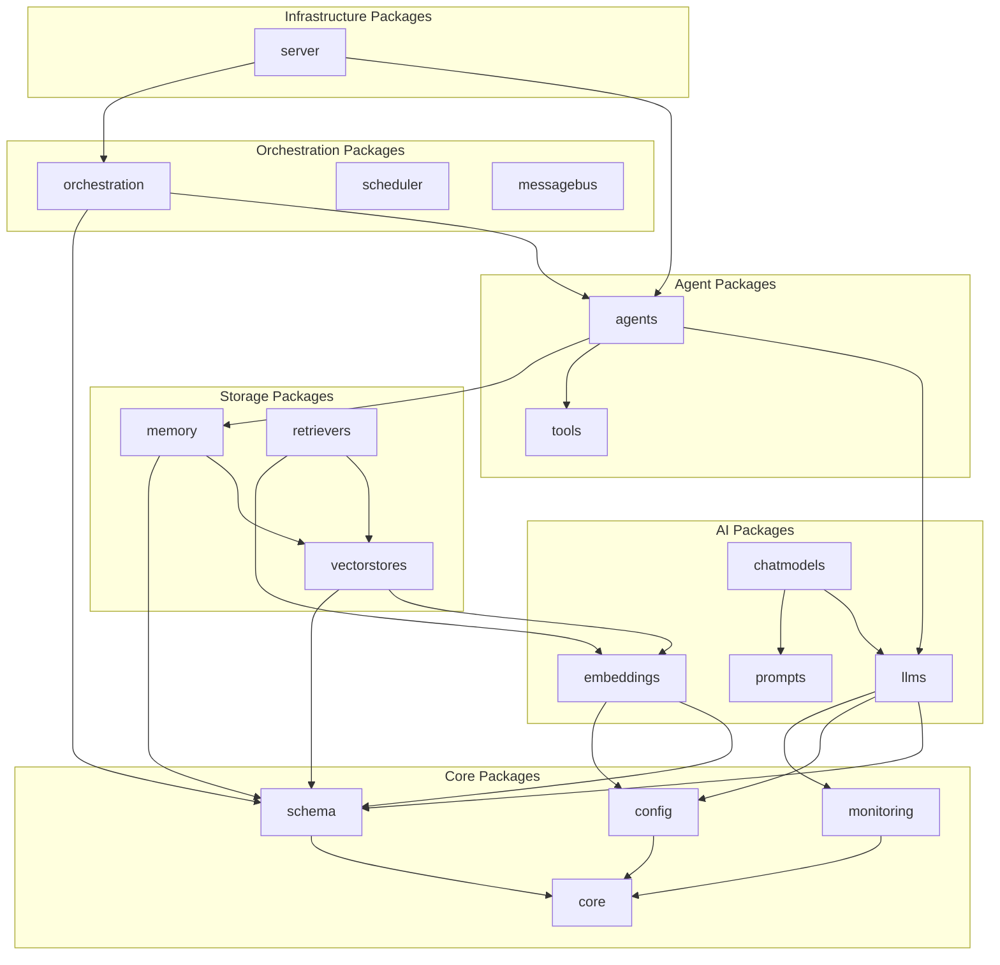
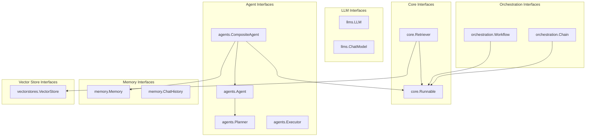
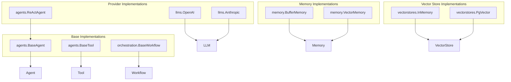
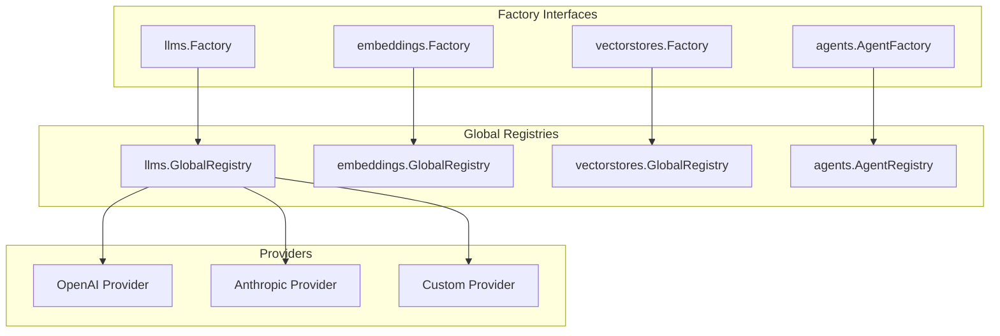

# Component Diagrams

This document provides detailed component diagrams for the Beluga AI Framework architecture.

## Package Structure

## Interface Hierarchy

## Implementation Relationships

## Factory Pattern Structure

## Related Documentation

- [Data Flows](./data-flows.md) - Data flow through the system
- [Sequence Diagrams](./sequences.md) - Interaction sequences
- [Architecture Overview](../architecture.md) - Complete architecture documentation
