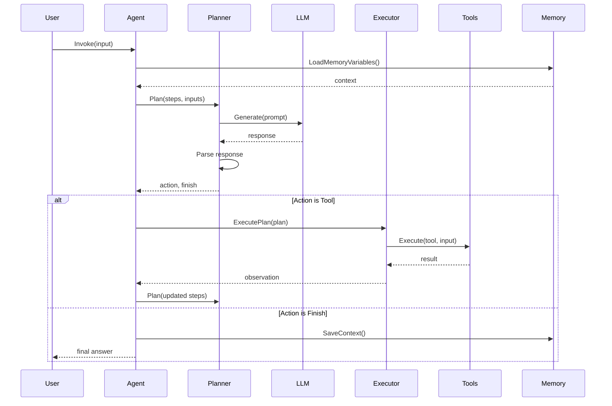
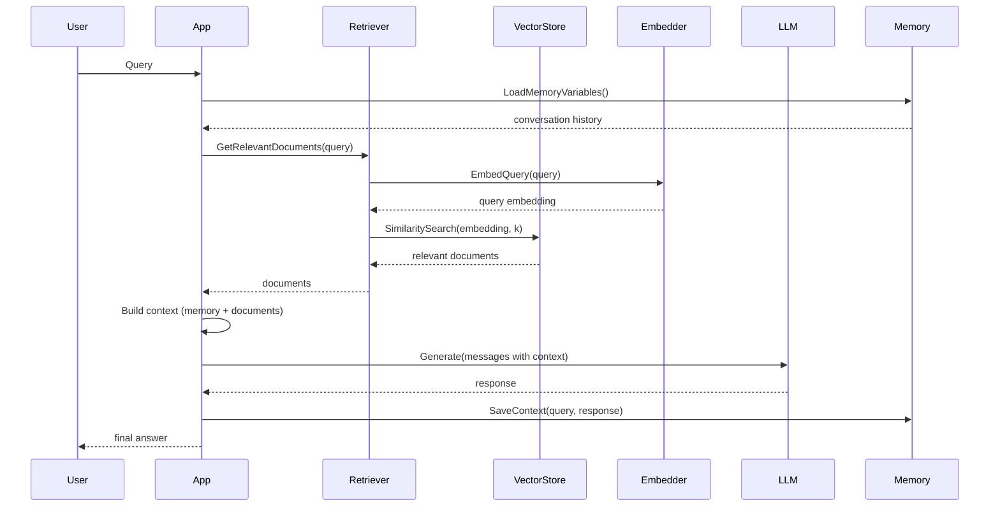
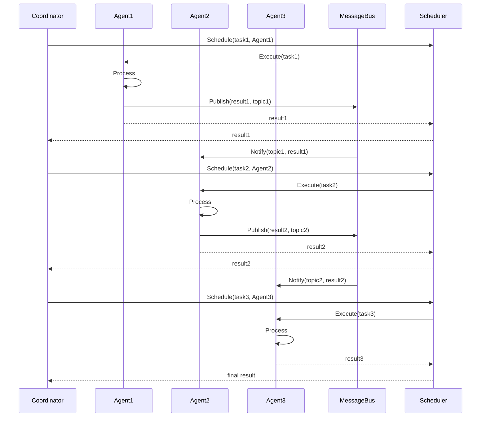
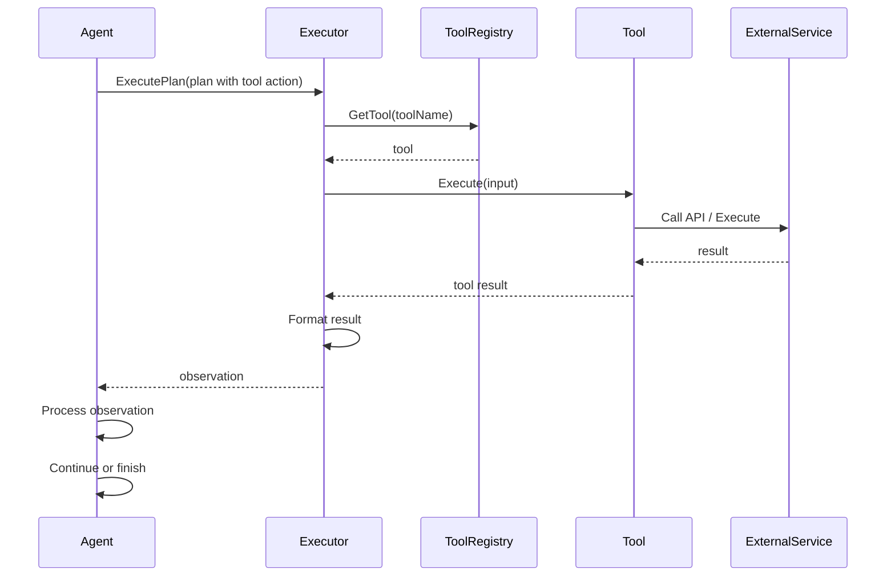
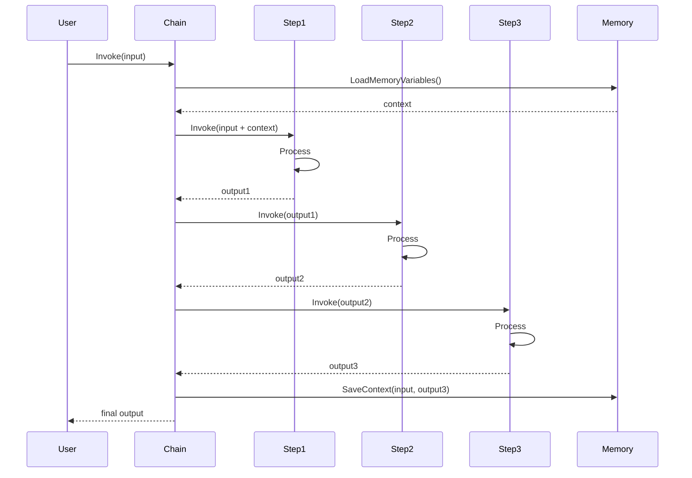
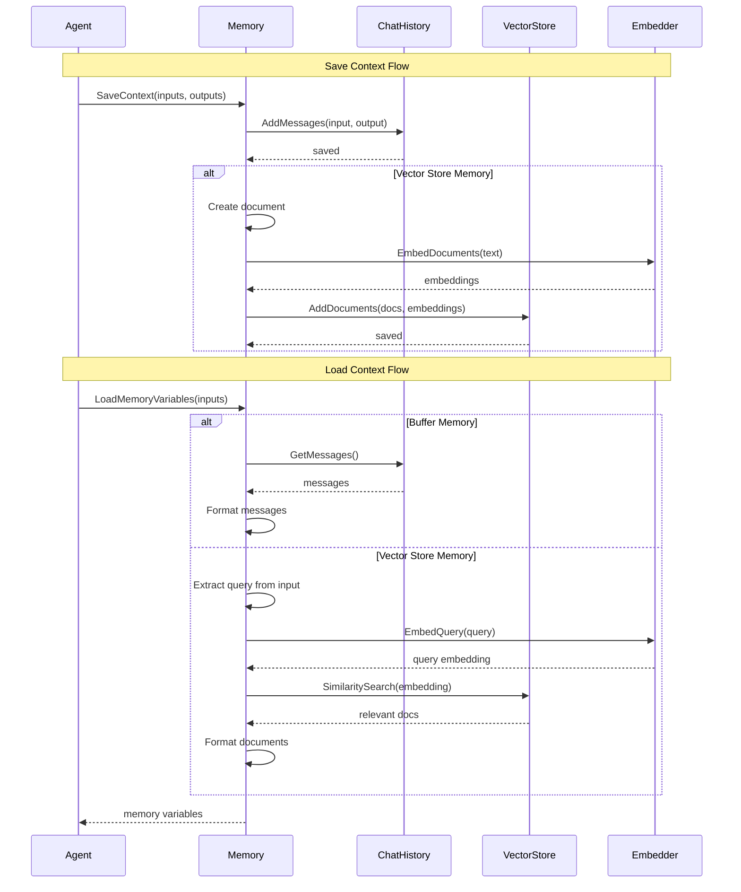

# Sequence Diagrams

This document provides sequence diagrams showing interactions between components in the Beluga AI Framework.

## Agent Planning and Execution

## RAG Pipeline Execution

## Multi-Agent Coordination

## Tool Execution Flow

## Chain Execution Flow

## Memory Save and Load Flow

## Related Documentation

- [Component Diagrams](./component-diagrams.md) - Component structure
- [Data Flows](./data-flows.md) - Data flow through system
- [Architecture Overview](../architecture.md) - Complete architecture
