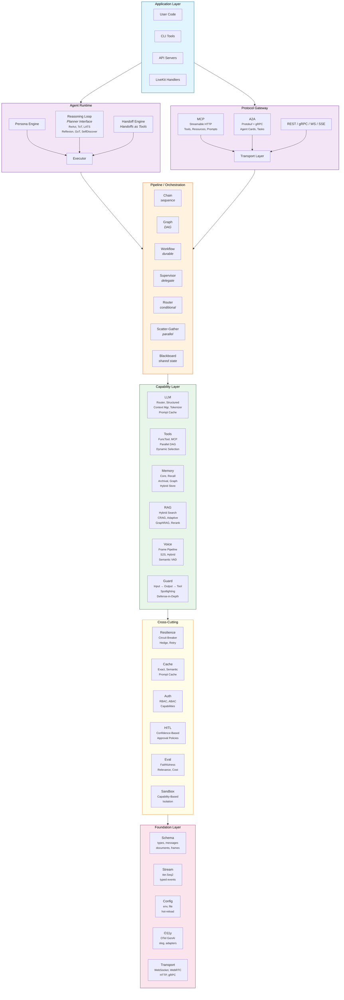
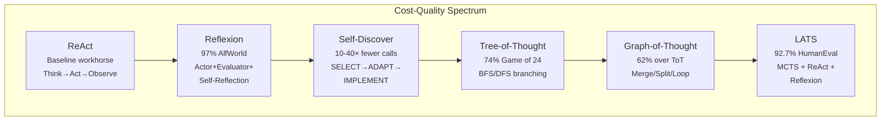
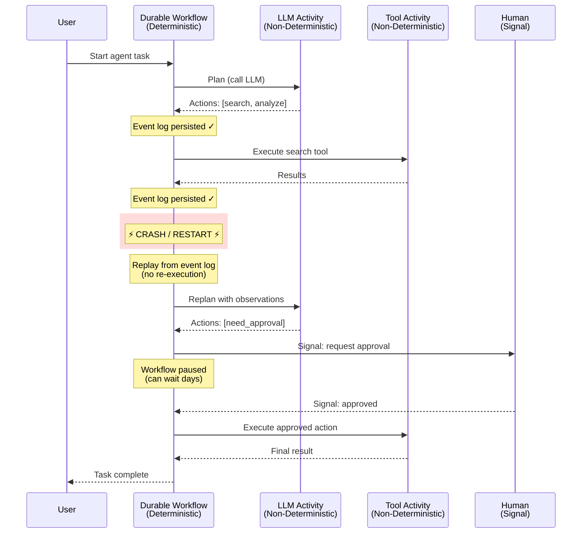

# Beluga AI v2 — Architecture & Concepts

## Executive Summary

Beluga AI v2 is a ground-up redesign of the Beluga AI framework for building agentic AI systems in Go. Informed by the latest advances in agentic AI — advanced reasoning strategies (LATS, Reflexion, Graph-of-Thought), multi-agent orchestration (A2A protocol, MCP, handoffs-as-tools), durable execution, frame-based voice pipelines, and hybrid RAG architectures — the redesign synthesises production patterns from Google ADK, OpenAI Agents SDK, LangGraph, ByteDance Eino, and LiveKit into a unified, Go-native framework.

The framework is a **host** — everything else is a **plugin**. Core defines contracts; providers, reasoning strategies, tools, and agent types are added from application code with zero framework changes required.

---

## 1. Design Principles

| # | Principle | Rationale |
|---|-----------|-----------|
| 1 | **Event-driven & streaming-first** | Every component produces typed event streams, not single responses. Request/response is a degenerate case. Backpressure and flow control are built into the stream abstraction. Uses Go 1.23+ `iter.Seq2[T, error]` as the primary streaming primitive. |
| 2 | **Composition over inheritance** | Small interfaces composed via embedding. No deep hierarchies. Middleware wraps interfaces; hooks intercept lifecycles. AOP-style callbacks (OnStart, OnEnd, OnError, OnStreamInput, OnStreamOutput) complement wrapping middleware for observability. |
| 3 | **Extensible by default** | Every package exposes extension interfaces, a registry, and lifecycle hooks. New providers, reasoning strategies, and agent types are added from application code — zero framework changes required. |
| 4 | **Protocol-native** | First-class MCP (Streamable HTTP for tool/resource/prompt access) and A2A (protobuf-first agent collaboration) support. Registry-based discovery for both. |
| 5 | **Modality-agnostic** | Text, audio, video, and structured data flow through the same pipeline abstractions via typed `ContentPart` unions. Voice pipelines use frame-based processing — atomic Frames (audio chunks, text, images, control signals) flow through linked FrameProcessors via Go channels. |
| 6 | **Minimal core, rich ecosystem** | Core defines contracts; providers are pluggable packages imported by the user. |
| 7 | **Observable by default** | OpenTelemetry GenAI semantic conventions (v1.37+) baked into every boundary — model spans (`gen_ai.operation.name`), agent spans (`gen_ai.agent.name`), tool spans (`gen_ai.tool.name`). LLM-specific observability (cost, token usage, prompt versioning) via adapter interface. |
| 8 | **Context-driven** | `context.Context` carries cancellation, tracing, session, tenant isolation, and auth throughout. |
| 9 | **Durability-ready** | Agent workflows can optionally be backed by our own durable execution engine to survive crashes, rate limits, and human-in-the-loop delays. Separates deterministic orchestration from non-deterministic activities (LLM calls, tool invocations). |
| 10 | **Production-hardened** | Circuit breakers, hedged requests, provider-aware rate limiting (RPM, TPM, concurrent), graceful shutdown, multi-tenancy, and capability-based agent sandboxing are first-class architectural concerns. |
| 11 | **Structured by default** | LLM outputs constrained to typed Go structs via JSON Schema generation, with automatic retry-on-parse-failure. Maps to OpenAI's constrained decoding, Anthropic's strict_tools, and Gemini's controlled generation. |
| 12 | **Defense-in-depth security** | Guard pipeline (input → output → tool) with Spotlighting for untrusted input isolation. Capability-based permissions with default-deny. Once an agent ingests untrusted input, it cannot trigger consequential actions without explicit authorization. |

---

## 2. High-Level Architecture



The architecture is organised in seven layers. Data flows downward through typed event streams; each layer only depends on the layers below it:

- **Application Layer** — User code, CLI tools, API servers, LiveKit handlers
- **Agent Runtime** — Persona engine, pluggable reasoning loop (Planner interface with 6+ strategies), executor, handoff engine (handoffs-as-tools)
- **Protocol Gateway** — MCP (Streamable HTTP: tools, resources, prompts), A2A (protobuf-first: agent cards, tasks), REST/gRPC/WebSocket/SSE
- **Pipeline / Orchestration** — Chain, Graph (DAG), Durable Workflow, Supervisor, Router, Scatter-Gather, Blackboard
- **Capability Layer** — LLM (router, structured, context manager, prompt cache), Tools (parallel DAG, MCP, dynamic selection), Memory (core/recall/archival/graph), RAG (hybrid search, CRAG, GraphRAG), Voice (frame pipeline, S2S, semantic VAD), Guard (input→output→tool pipeline)
- **Cross-Cutting** — Resilience, Cache, Auth, HITL (confidence-based), Evaluation, Sandbox
- **Foundation** — Schema types, Stream primitives (iter.Seq2), Config, Observability (OTel GenAI), Transport

---

## 3. Key Design Decisions

### 3.1 Event-Driven Streaming via iter.Seq2

**v1 problem**: Streaming was bolted on via `<-chan any`. Tool calling during streams was fragile. No backpressure.

**v2 approach**: Following Go 1.23+ idioms (used by Google Genkit Go 1.0), the primary streaming primitive is `iter.Seq2[T, error]` — Go's native range-over-func iterator. `Invoke()` is implemented as "stream, collect, return last." Tool calls arrive as events mid-stream. For consumers needing pull semantics, `iter.Pull()` provides stop/next control.

```go
// Streaming with range-over-func
stream := agent.Stream(ctx, "Research GPU pricing")
for event, err := range stream {
    if err != nil { break }
    switch event.Type {
    case schema.EventText:
        fmt.Print(event.Text())
    case schema.EventToolCall:
        fmt.Printf("Calling: %s\n", event.ToolCall.Name)
    case schema.EventHandoff:
        fmt.Printf("Transferring to: %s\n", event.TargetAgent)
    }
}
```

The stream abstraction includes **backpressure and flow control** via `BufferedStream[T]`. When a slow consumer (e.g., TTS) can't keep up with a fast producer (e.g., LLM), the buffer absorbs bursts. For graph orchestration, streams auto-concatenate, copy for fan-out, and merge for convergence (following ByteDance Eino's patterns).

```
User Audio ──► STT Stream ──► LLM Stream ──► [ToolCall Event] ──► Tool Execute ──► [ToolResult Event] ──► LLM continues ──► TTS Stream ──► Audio out
```

### 3.2 Agent Reasoning Patterns (Planner Interface)

The executor supports **pluggable reasoning strategies** via the `Planner` interface. Research shows a clear cost-quality spectrum — the framework ships six built-in strategies and supports user-defined custom planners.



**ReAct** (default): Think → Act → Observe → repeat or finish. Best for general-purpose tasks.

**Reflexion**: Three-model architecture (Actor, Evaluator, Self-Reflection). Agents store textual reflections on failures in an episodic memory buffer. Retry-with-enriched-context mirrors Go's error-handling philosophy. Best for quality-sensitive tasks.

**Self-Discover** (Google DeepMind): Two stages — SELECT relevant reasoning modules, ADAPT to task, IMPLEMENT as JSON structure. Most compute-efficient: 32% improvement over CoT with 10-40× fewer inference calls. Best for cost-sensitive deployments.

**Tree-of-Thought**: BFS/DFS exploration of reasoning paths, LLM self-evaluates each branch as "sure/maybe/impossible." Configurable `branch_factor` and `max_depth`. Tree expansion maps to goroutines with a shared priority queue. Best for combinatorial problems.

**Graph-of-Thought**: Extends ToT with merge, split, and loop operations over a directed graph of thoughts. Controller/Prompter/Parser/Scorer architecture. Best for tasks requiring non-linear reasoning.

**LATS** (Language Agent Tree Search): Highest-performing strategy. Unifies MCTS with ReAct and Reflexion via six operations — selection (UCT), expansion (N candidate actions), LLM evaluation, simulation, backpropagation, verbal reflection on failures. Parallel expansion of N actions maps to goroutines with channel-based collection. Best for complex reasoning tasks where quality justifies cost.

**Mixture of Agents (MoA)**: Organises multiple LLMs in layers, each receiving all outputs from the previous layer. Open-source-only MoA scored 65.1% on AlpacaEval 2.0 vs GPT-4 Omni's 57.5%. Model diversity > model quality. Go's goroutines make fan-out/aggregate trivial. Best for tasks where ensemble quality justifies multi-model cost.

**Custom**: Implement the `Planner` interface, register via `agent.RegisterPlanner()`. Supports domain-specific state machines, Constitutional AI self-critique, or any novel strategy.

```go
executor := agent.NewExecutor(
    agent.WithPlanner("react", agent.PlannerConfig{LLM: llm}),
    // OR: "reflexion", "self-discover", "tree-of-thought", "graph-of-thought", "lats", "moa"
    // OR: "your-custom-planner" (registered via agent.RegisterPlanner)
    agent.WithMaxIterations(15),
    agent.WithTimeout(2 * time.Minute),
    agent.WithHooks(myHooks),
)
```

### 3.3 Handoffs as Tools (OpenAI Pattern)

Agent-to-agent transfers are represented as tools, following the OpenAI Agents SDK pattern. For an agent named "Refund Agent," the framework auto-generates a `transfer_to_refund_agent` tool. When invoked, the framework injects "Transferred to {name}. Adopt persona immediately." as the tool result and switches the active agent.

```go
type Handoff struct {
    TargetAgent  string                              // agent ID to transfer to
    Description  string                              // when should LLM use this handoff
    InputFilter  func(HandoffInput) HandoffInput      // control what context flows
    OnHandoff    func(ctx context.Context) error       // side effects (logging, state)
    IsEnabled    func(ctx context.Context) bool        // conditional availability
}

// Agent with handoffs — handoffs appear as tools to the LLM
agent := agent.New(
    agent.WithPersona(triagePersona),
    agent.WithLLM(llm),
    agent.WithHandoffs(
        agent.HandoffTo(techAgent, "Transfer for technical issues"),
        agent.HandoffTo(billingAgent, "Transfer for billing questions"),
    ),
)
```

### 3.4 Five Orchestration Patterns

The framework implements five proven orchestration patterns, each addressing different multi-agent coordination needs.

**Supervisor**: Central agent decomposes tasks, delegates to specialists, validates outputs. Best for multi-domain workflows needing audit trails.

```go
supervisor := orchestration.NewSupervisor(
    orchestration.WithAgents(researcher, writer, reviewer),
    orchestration.WithLLM(routerLLM),
    orchestration.WithStrategy(orchestration.DelegateBySkill),
)
```

**Hierarchical**: Tree of supervisors managing sub-teams. Best for large organisations with departmental agent teams.

**Scatter-Gather**: Parallel distribution to multiple agents with result consolidation. Best for tasks requiring diverse perspectives (e.g., multi-source research).

```go
sg := orchestration.NewScatterGather(
    orchestration.WithWorkers(agent1, agent2, agent3),
    orchestration.WithAggregator(summaryAgent), // consolidates parallel results
    orchestration.WithTimeout(30 * time.Second),
)
```

**Router** (conditional dispatch): Classify input → route to specialist. LLM-based or rule-based classification.

**Blackboard**: Agents communicate solely through a shared blackboard with public and private spaces. A dedicated conflict-resolver agent handles contradictions. Best for dynamic capability discovery where agents don't know each other.

```go
bb := orchestration.NewBlackboard(
    orchestration.WithAgents(agent1, agent2, agent3),
    orchestration.WithResolver(conflictAgent),       // resolves contradictions
    orchestration.WithTermination(orchestration.Consensus), // stop when agents agree
)
```

### 3.5 Bidirectional Voice Pipeline (Frame-Based)

Voice pipelines use a **frame-based processing model** inspired by Pipecat. Atomic Frames (audio chunks, text fragments, images, control signals) flow through linked FrameProcessors via Go channels. Each processor is a goroutine implementing `Process(ctx, in <-chan Frame, out chan<- Frame)`.

```go
// Frame types
type FrameType string
const (
    FrameAudio   FrameType = "audio"     // raw PCM/opus audio chunk
    FrameText    FrameType = "text"      // text fragment
    FrameControl FrameType = "control"   // start/stop/interrupt/endofutterance
    FrameImage   FrameType = "image"     // video frame for multimodal
)

type Frame struct {
    Type      FrameType
    Data      []byte
    Metadata  map[string]any // sample_rate, encoding, language, etc.
}

type FrameProcessor interface {
    Process(ctx context.Context, in <-chan Frame, out chan<- Frame) error
}
```

Three composable pipeline modes:

**Cascading** (STT → LLM → TTS):
```go
pipe := voice.NewPipeline(
    voice.WithTransport(livekit.NewTransport(roomURL, token)),
    voice.WithVAD(silero.New(voice.VADConfig{
        Threshold:         0.5,
        MinSpeechDuration: 250 * time.Millisecond,
        MinSilenceDuration: 300 * time.Millisecond,
        SpeechPadding:     30 * time.Millisecond,
    })),
    voice.WithSTT(deepgram.New(cfg)),
    voice.WithLLM(openai.New(cfg)),
    voice.WithTTS(cartesia.New(cfg)),
)
pipe.Run(ctx)
```

**S2S** (native audio-in/audio-out via OpenAI Realtime, Gemini Live):
```go
session := voice.NewS2SSession(
    openai_realtime.New(cfg),   // WebRTC or WebSocket transport
    voice.WithTools(myTools),
    voice.WithSupervisor(supervisorLLM), // text-based supervisor for complex tool calls
)
```

**Hybrid** (S2S for conversation, cascade for tool-heavy turns):
```go
pipe := voice.NewHybridPipeline(
    voice.WithS2S(openai_realtime.New(cfg)),
    voice.WithCascade(stt, llm, tts),
    voice.WithSwitchPolicy(voice.OnToolOverload),
)
```

**Voice Activity Detection** includes both silence-based (Silero VAD: ~2MB model, <1ms per 30ms chunk on CPU, ONNX runtime) and **semantic turn detection** (a lightweight model analysing utterance completeness, reducing false interruptions).

**Target latency budget**: transport <50ms, VAD <1ms, STT <200ms, LLM TTFT <300ms, TTS TTFB <200ms, return transport <50ms = **<800ms end-to-end**.

### 3.6 LiveKit as Transport

LiveKit is treated as a **transport**, not a framework dependency. LiveKit's server is written in Go, and the Go server SDK provides WebRTC transport — but no agent pipeline logic. Beluga fills this gap with a Go-native frame-based pipeline that leverages LiveKit's transport.

```go
transport := livekit.NewTransport(roomURL, token)
pipe := voice.NewPipeline(
    voice.WithTransport(transport),
    voice.WithSTT(deepgram.New(cfg)),
    voice.WithLLM(openai.New(cfg)),
    voice.WithTTS(cartesia.New(cfg)),
)
pipe.Run(ctx)
```

### 3.7 MCP as First-Class Tool Source

MCP servers are discovered and wrapped as native `tool.Tool` instances. The framework implements the **Streamable HTTP** transport (March 2025 spec) — a single HTTP endpoint accepting POST for client→server, GET for server→client notifications, DELETE for session termination. Session management via `Mcp-Session-Id` header with `Last-Event-ID` for stream resumability.

MCP provides three primitives: **Tools** (executable functions), **Resources** (URI-addressable data), and **Prompts** (templated workflows). The June 2025 spec adds structured tool outputs, OAuth-based authorization, and elicitation (server-initiated user queries).

```go
// Manual connection
mcpTools, _ := tool.FromMCP(ctx, "npx @modelcontextprotocol/server-filesystem")

// Registry-based discovery
registry := tool.NewMCPRegistry("https://registry.modelcontextprotocol.io")
servers, _ := registry.Search(ctx, "file management")
mcpTools, _ := tool.FromMCP(ctx, servers[0].URL)

// MCP Resources — URI-addressable data
resources, _ := tool.ResourcesFromMCP(ctx, serverURL)

// MCP Prompts — templated workflows
prompts, _ := tool.PromptsFromMCP(ctx, serverURL)

agent := agent.New(
    agent.WithLLM(llm),
    agent.WithTools(append(myTools, mcpTools...)),
)
```

### 3.8 A2A for Multi-Agent Collaboration

A2A (Agent-to-Agent) protocol, now a Linux Foundation project with 150+ supporting organisations, uses a protobuf-first three-layer architecture:

1. **Protocol Buffer data model** (`a2a.proto`) — canonical types
2. **Abstract operations** — SendMessage, GetTask, CancelTask, SubscribeToTask
3. **Concrete bindings** — JSON-RPC 2.0, gRPC, HTTP+JSON

Core concepts: **Agent Cards** (JSON capability advertisements at well-known URLs, optionally signed), **Tasks** (lifecycle: submitted → working → completed/failed/canceled), **Messages** with typed Parts (text, files, data). `contextId` groups multi-turn interactions; `taskId` tracks individual tasks. Streaming via SSE; webhook-based push for long-running tasks.

```go
// Expose agent as A2A server (gRPC + JSON-RPC bindings)
a2aServer := a2a.NewServer(myAgent, a2a.WithPort(8080))
go a2aServer.Serve(ctx)

// Use remote agent as sub-agent
remoteAgent := a2a.NewRemoteAgent("https://agent.example.com/.well-known/agent.json")
supervisor := orchestration.NewSupervisor(
    orchestration.WithAgents(localAgent, remoteAgent),
    orchestration.WithStrategy(orchestration.DelegateBySkill),
)
```

### 3.9 Memory Architecture (MemGPT/Letta Three-Tier + Graph)

Following the MemGPT/Letta virtual memory model and Mem0's hybrid store pattern, memory is organised in four tiers:

| Tier | Implementation | Scope | What It Stores | Persistence |
|------|---------------|-------|----------------|-------------|
| **Core** (always in context) | `memory.Core` | Current session | Persona block (agent identity) + Human block (user info). Self-editable via tool calling. Character-limited. | Session |
| **Recall** (searchable history) | `memory.Recall` | Cross-session | Complete conversation history. Append-only log with full-text search. Not always in context — agent searches via `recall_search` tool. | Permanent |
| **Archival** (long-term knowledge) | `memory.Archival` backed by vector store + graph | Cross-session | Long-term knowledge base. Agent searches via `archival_search` tool. Backed by hybrid store (vector + graph + key-value). | Permanent |
| **Graph** (relational) | `memory.Graph` | Cross-session | Entity relationships via triplets. Conflict detection and resolution for knowledge evolution. | Permanent |

The **Hybrid Store** (inspired by Mem0) combines vector DB + graph DB + key-value store for 26% higher accuracy, 91% lower p95 latency, and 90% token savings versus full history retention.

```go
mem := memory.NewComposite(
    memory.WithCore(memory.NewCore(memory.CoreConfig{
        PersonaLimit: 2000,  // chars
        HumanLimit:   2000,  // chars
        SelfEditable: true,  // agent can update via tool
    })),
    memory.WithRecall(memory.NewRecall(store)),
    memory.WithArchival(memory.NewArchival(memory.ArchivalConfig{
        VectorStore: vectorstore,
        Embedder:    embedder,
        GraphStore:  graphStore, // optional
    })),
)

agent := agent.New(
    agent.WithMemory(mem),
    // Memory automatically adds recall_search, archival_search,
    // core_memory_update tools to the agent's tool set
)
```

### 3.10 Multimodal Content Model

Messages carry typed content parts, not just strings:

```go
type ContentPart interface {
    PartType() ContentType
}

type ContentType string
const (
    ContentText  ContentType = "text"
    ContentImage ContentType = "image"
    ContentAudio ContentType = "audio"
    ContentVideo ContentType = "video"
    ContentFile  ContentType = "file"
)
```

### 3.11 Structured Output / Schema Enforcement

LLM outputs constrained to typed Go structs. Uses server-side constrained decoding when available (OpenAI 100% compliance, Anthropic strict_tools, Gemini controlled generation), falls back to validate-and-retry on the client.

```go
type AnalysisResult struct {
    Summary    string   `json:"summary" description:"One-paragraph summary"`
    Sentiment  string   `json:"sentiment" enum:"positive,negative,neutral"`
    Confidence float64  `json:"confidence" minimum:"0" maximum:"1"`
    Topics     []string `json:"topics" description:"Key topics identified"`
}

structured := llm.NewStructured[AnalysisResult](model, llm.WithRetries(3))
result, err := structured.Generate(ctx, msgs) // result is typed AnalysisResult
```

### 3.12 LLM Gateway / Router Layer

A `Router` implements `ChatModel` and routes across multiple backends using pluggable strategies. Inspired by RouteLLM (ICLR 2025), which achieves 2× cost reduction without quality loss by learning routing from preference data.

```go
router := llm.NewRouter(
    llm.WithModels(openaiModel, anthropicModel, groqModel),
    llm.WithStrategy(llm.CostOptimized{QualityThreshold: 0.9}),
    llm.WithFallbacks(ollamaModel),
)
// Router implements ChatModel — use anywhere a model is expected
agent := agent.New(agent.WithLLM(router))
```

Built-in strategies: `RoundRobin`, `LowestLatency`, `CostOptimized`, `CapabilityBased`, `FailoverChain`, `LearnedRouter` (trains on preference data).

### 3.13 Context Window Management

Despite models advertising 1M+ token windows, research shows reliability drops at 65-70% capacity. A `ContextManager` fits messages within a token budget using pluggable strategies.

```go
contextMgr := llm.NewContextManager(
    llm.WithStrategy(llm.Adaptive{}),
    llm.WithTokenizer(tokenizer.New("openai/gpt-4o")),
    llm.WithBudget(128_000),
)
fittedMsgs, _ := contextMgr.Fit(ctx, messages, budget)
```

Strategies: `Truncate`, `Summarize` (LLM-powered rolling summarization), `Semantic` (embedding similarity to keep relevant turns), `Sliding` (last N turns verbatim), `Adaptive` (combines: 10 recent turns verbatim, replace older tool outputs with placeholders, rolling summarization for earlier history), `FactExtraction` (Mem0-style: 80-90% token savings vs full history).

### 3.14 Token Counting & Cost Estimation

```go
tokenizer := llm.NewTokenizer("openai/gpt-4o")
count := tokenizer.CountMessages(msgs)
estimatedCost := tokenizer.EstimateCost(count, model.PricingInfo())
```

### 3.15 Prompt Cache Optimization

Prompt caching saves up to 90% on cached tokens. The framework enforces optimal ordering for cache hit rates: **static content first** (system prompt → tool definitions → static documents → dynamic user content). The `PromptBuilder` ensures this ordering automatically.

```go
builder := prompt.NewBuilder(
    prompt.WithSystemPrompt(systemPrompt),       // slot 1: static
    prompt.WithToolDefinitions(tools),            // slot 2: semi-static
    prompt.WithStaticContext(documents),           // slot 3: semi-static
    prompt.WithCacheBreakpoint(),                  // explicit cache boundary
    prompt.WithDynamicContext(memoryMessages),      // slot 4: dynamic
    prompt.WithUserInput(userMsg),                 // slot 5: always changes
)
msgs := builder.Build()
```

### 3.16 Parallel Tool Execution (DAG)

Inspired by LLMCompiler (ICML 2024), the tool executor analyses tool call dependencies and executes independent tools in parallel. Achieves 1.8× latency speedup. Dynamic tool selection filters irrelevant tools before sending to the LLM, improving accuracy and efficiency.

```go
// Automatic parallel execution — framework analyses dependencies
agent := agent.New(
    agent.WithLLM(llm),
    agent.WithTools(tools),
    agent.WithToolExecution(agent.ParallelDAG{
        MaxConcurrency: 5,
        DependencyDetection: true, // analyse input/output deps
    }),
)

// Dynamic tool selection — only send relevant tools to LLM
agent := agent.New(
    agent.WithToolSelector(agent.RelevanceSelector{
        Embedder:  embedder,
        Threshold: 0.7,
        MaxTools:  10, // send at most 10 most relevant tools
    }),
)
```

### 3.17 Durable Workflow Execution

AI agent workflows are uniquely fragile: LLM rate limits (429), timeouts, provider outages, long-running operations (hours), and HITL pauses (days). Our own durable execution engine separates deterministic orchestration from non-deterministic activities (LLM calls, tool invocations). Every activity result is recorded in an append-only event log; on crash recovery, the workflow replays deterministic parts from history and resumes.



```go
// Simple (no durability)
result, _ := agent.Invoke(ctx, "Research competitor pricing")

// Durable — same agent, wrapped in workflow
handle, _ := workflow.Execute(ctx, workflow.Options{
    ID: "research-pricing-" + uuid.New().String(),
    RetryPolicy: workflow.RetryPolicy{
        MaxAttempts:    3,
        InitialBackoff: time.Second,
        BackoffFactor:  2.0,
    },
}, workflow.AgentLoopInput{
    Query: "Research competitor pricing",
    Agent: agent,
    MaxIterations: 20,
})
result, _ := handle.Result()
```

### 3.18 Human-in-the-Loop (Confidence-Based)

HITL uses configurable per-tool approval policies based on confidence and risk level:

| Risk Level | Auto-Approve Threshold | Examples |
|-----------|----------------------|----------|
| **Read-only** | >50% confidence | Web search, DB queries |
| **Data modification** | >90% confidence | File writes, API posts |
| **Financial/irreversible** | Never auto-approve | Payments, deletions |

```go
type ApprovalPolicy struct {
    ToolPattern     string          // glob pattern: "shell_*", "payment_*"
    RiskLevel       RiskLevel       // ReadOnly, DataModification, Irreversible
    AutoApproveAt   float64         // confidence threshold (0-1)
    Timeout         time.Duration   // how long to wait for human
    Notifiers       []Notifier      // Slack, email, webhook
}

hitl := hitl.NewManager(
    hitl.WithPolicies(
        hitl.Policy{ToolPattern: "web_search", RiskLevel: hitl.ReadOnly, AutoApproveAt: 0.5},
        hitl.Policy{ToolPattern: "file_write_*", RiskLevel: hitl.DataModification, AutoApproveAt: 0.9},
        hitl.Policy{ToolPattern: "payment_*", RiskLevel: hitl.Irreversible, AutoApproveAt: -1}, // never
    ),
    hitl.WithNotifier(slack.NewNotifier(webhookURL)),
)
```

Every human decision (approve/edit/reject) is logged for feedback loops — these become training data and threshold-tuning signals.

### 3.19 Guard Pipeline (Defense-in-Depth)

The guard system implements a three-stage pipeline — input guards (before LLM), output guards (after LLM), and tool guards (before tool execution). This follows the OWASP-recommended defense-in-depth pattern.

**Spotlighting** isolates untrusted input by marking it with delimiters so the LLM treats it as data, not instructions. Once an agent ingests untrusted input, it cannot trigger consequential actions without explicit authorization.

```go
type GuardPipeline struct {
    InputGuards  []Guard  // Before LLM: reject/alter user input, prompt injection detection
    OutputGuards []Guard  // After LLM: content moderation, PII redaction
    ToolGuards   []Guard  // Before tool: validate I/O, capability check
}

type Guard interface {
    Name() string
    Validate(ctx context.Context, content GuardInput) (GuardResult, error)
}

type GuardResult struct {
    Allowed   bool
    Reason    string
    Modified  string // optional: sanitised version of the content
}

// Usage
agent := agent.New(
    agent.WithGuards(guard.NewPipeline(
        guard.Input(
            guard.PromptInjectionDetector(),
            guard.Spotlighting{Delimiter: "<<<DATA>>>"},
        ),
        guard.Output(
            guard.ContentFilter{Threshold: 0.8},
            guard.PIIRedactor{Patterns: guard.DefaultPIIPatterns},
        ),
        guard.Tool(
            guard.CapabilityCheck{},          // verify agent has permission
            guard.InputValidator{},            // validate tool input against schema
        ),
    )),
)
```

### 3.20 Caching Layer (Semantic + Exact Match + Prompt Cache)

```go
cache := cache.New("redis", cache.Config{TTL: 1 * time.Hour})
model = llm.ApplyMiddleware(model, llm.WithCache(cache))
```

Three caching tiers: exact-match (hash of messages), semantic-similarity (embedding-based with configurable threshold), and provider-native prompt caching (Anthropic manual cache breakpoints, OpenAI automatic caching).

### 3.21 Resilience: Circuit Breakers, Hedged Requests, Adaptive Retry

```go
model = llm.ApplyMiddleware(model,
    resilience.WithCircuitBreaker(5, 30*time.Second),
    resilience.WithHedge(fallbackModel, 500*time.Millisecond),
    resilience.WithProviderLimits(resilience.ProviderLimits{
        RPM: 500, TPM: 200_000, MaxConcurrent: 50,
        CooldownOnRetry: 5 * time.Second,
    }),
)
```

### 3.22 Agent Sandboxing & Capability-Based Security

Agents operate with explicit, minimal permissions. Each tool/action requires an explicit capability grant. Default-deny for network access. Code execution tools run in isolated environments.

```go
type Capability string
const (
    CapToolExec      Capability = "tool:execute"
    CapMemoryRead    Capability = "memory:read"
    CapMemoryWrite   Capability = "memory:write"
    CapAgentDelegate Capability = "agent:delegate"
    CapNetworkAccess Capability = "network:access"
    CapFileRead      Capability = "file:read"
    CapFileWrite     Capability = "file:write"
    CapCodeExec      Capability = "code:execute"
)

agent := agent.New(
    agent.WithCapabilities(
        auth.Grant(auth.CapToolExec, "web_search", "calculator"),
        auth.Grant(auth.CapMemoryRead),
        auth.Deny(auth.CapCodeExec),  // explicit deny
    ),
    agent.WithSandbox(sandbox.Config{
        NetworkPolicy: sandbox.DenyAll,        // default deny
        AllowedHosts:  []string{"api.example.com"},
        MaxMemory:     256 * 1024 * 1024,       // 256MB
        Timeout:       30 * time.Second,
    }),
)
```

### 3.23 Multi-Tenancy

Tenant isolation built into `context.Context`, propagated through all packages.

```go
ctx = core.WithTenant(ctx, "customer-123")
// All downstream operations scoped to this tenant
```

### 3.24 Shared Agent State

Explicit, typed, persistent state with scoping and reactive Watch.

```go
store := state.New("redis", state.Config{})
store.Set(ctx, "research_progress", ProgressData{Phase: "extraction", Complete: 45})

changes, _ := store.Watch(ctx, "research_progress")
for change := range changes {
    // react to state updates
}
```

### 3.25 Prompt Management & Versioning

```go
mgr := prompt.NewManager("file", prompt.Config{Dir: "./prompts"})
msgs, _ := mgr.Render("research_agent", map[string]any{
    "domain": "semiconductor pricing",
    "depth":  "comprehensive",
})
```

### 3.26 Configuration Hot-Reload

```go
watcher := config.NewWatcher("file", config.WatchConfig{Path: "config.yaml"})
watcher.Watch(ctx, func(newCfg AppConfig) {
    // Hot-swap model parameters, guardrail thresholds, etc.
})
```

### 3.27 Graceful Shutdown & Lifecycle Management

```go
app := core.NewApp()
app.Register(voicePipeline, agentServer, mcpServer, a2aServer)
// On SIGTERM: stops all in reverse order, drains active sessions
app.Shutdown(ctx)
```

---

## 4. RAG Architecture

The RAG pipeline defaults to **hybrid search** combining dense vector search (semantic), BM25 sparse search (keyword precision), and optional graph traversal (multi-hop reasoning). Results are fused via Reciprocal Rank Fusion (RRF) with k=60. A three-stage pipeline — BM25 retrieves ~200 candidates, dense retrieval adds ~100, cross-encoder reranker selects top 10 — achieves best quality.

### 4.1 Advanced Retrieval Strategies

**Corrective RAG (CRAG)**: Retrieval evaluator scores document relevance on a -1 to 1 scale. Below configurable threshold triggers web search with query rewriting. Prevents low-quality retrieval from polluting LLM context.

**Adaptive RAG**: Query complexity classifier routes queries: no retrieval → single-step → multi-step. Avoids unnecessary retrieval for simple factual questions.

**SEAL-RAG**: Fixed-budget replacement policy — swaps low-utility passages rather than appending. Prevents context dilution. +3 to +13 percentage point accuracy improvement over standard RAG.

**HyDE** (Hypothetical Document Embedding): Generates a hypothetical answer, embeds it, and searches for similar real documents. Bridges the query-document semantic gap.

**GraphRAG**: Builds a knowledge graph from unstructured text via entity/relationship extraction, applies community detection. Local Search finds specific entities/neighborhoods; Global Search performs map-reduce across community summaries.

```go
// Default: hybrid search with reranking
retriever := retriever.NewHybrid(
    retriever.WithVector(vectorRetriever),
    retriever.WithBM25(bm25Retriever),
    retriever.WithFusion(retriever.RRF{K: 60}),
    retriever.WithReranker(reranker),
    retriever.WithTopK(10),
)

// Corrective RAG wrapper
retriever = retriever.WithCorrection(retriever, retriever.CRAGConfig{
    Evaluator:       evalLLM,
    RelevanceThreshold: 0.7,
    FallbackSearch:  webSearchTool,
})
```

### 4.2 Ingestion Enhancements

**Contextual Retrieval** (Anthropic): Prepends chunk-specific explanatory context before embedding ("This chunk is from ACME Corp's Q2 2023 SEC filing..."). 49% error reduction with BM25, 67% with reranking.

**Late Chunking** (Jina AI): Processes entire documents through transformer before chunking token embeddings, preserving cross-chunk context without additional training.

```go
// Contextual ingestion pipeline
pipeline := rag.NewIngestionPipeline(
    rag.WithLoader(loader),
    rag.WithSplitter(splitter.NewRecursive(1000, 200)),
    rag.WithContextualizer(rag.Contextualizer{LLM: contextLLM}), // adds per-chunk context
    rag.WithEmbedder(embedder),
    rag.WithVectorStore(store),
    rag.WithBM25Index(bm25Store), // parallel BM25 indexing
)
```

---

## 5. Observability

Every package boundary instrumented with OTel GenAI semantic conventions:

```go
ctx, span := o11y.StartSpan(ctx, "agent.invoke", o11y.Attrs{
    "gen_ai.agent.name":  a.ID(),
    "gen_ai.request.model": a.llm.ModelID(),
    "gen_ai.operation.name": "agent_invoke",
})
defer span.End()

// GenAI-specific metrics
o11y.TokenUsage(ctx, inputTokens, outputTokens)
o11y.OperationDuration(ctx, latencyMs)
o11y.Cost(ctx, estimatedCost)
```

Six metric categories tracked: latency (per-step and end-to-end), token usage, cost (per-request and cumulative), error rates, tool success rates, and quality scores.

---

## 6. Evaluation Framework

CI/CD-integrated quality gates for agents and RAG pipelines:

```go
runner := eval.NewRunner(
    eval.WithMetrics(
        metrics.Faithfulness{LLM: evalLLM},
        metrics.Relevance{LLM: evalLLM},
        metrics.Hallucination{},
        metrics.Latency{},
        metrics.Cost{},
    ),
    eval.WithDataset(testCases),
    eval.WithParallel(10),
)
report, _ := runner.Run(ctx)
// CI: assert report.Score("faithfulness") > 0.85
```

---

## 7. Extensibility Architecture

Every package follows the same four-component structure: Extension Interface, Registry + Factory, Lifecycle Hooks (AOP-style: OnStart, OnEnd, OnError, OnStreamInput, OnStreamOutput), Middleware Chains.

| Package | Extension Interface | Registry Key | Hooks Available |
|---------|-------------------|--------------|-----------------|
| `llm/` | `ChatModel` | `"openai"`, `"anthropic"`, ... | BeforeGenerate, AfterGenerate, OnStream, OnToolCall, OnError |
| `tool/` | `Tool` | Name-based (ToolRegistry) | BeforeExecute, AfterExecute, OnError |
| `agent/` | `Planner` | `"react"`, `"lats"`, ... | BeforePlan, AfterPlan, BeforeAct, AfterAct, OnIteration, OnFinish |
| `agent/` | `Agent` (BaseAgent) | Agent ID registry | OnStart, OnTool, OnHandoff, OnError, OnEnd |
| `memory/` | `Memory` | `"core"`, `"recall"`, ... | BeforeSave, AfterSave, BeforeLoad, AfterLoad |
| `rag/retriever/` | `Retriever` | `"hybrid"`, `"crag"`, ... | BeforeRetrieve, AfterRetrieve, OnRerank |
| `voice/` | `FrameProcessor` | Named processors | OnFrame, OnSpeechStart, OnSpeechEnd |
| `guard/` | `Guard` | `"injection"`, `"pii"`, ... | — |
| `workflow/` | `DurableExecutor` | `"default"`, ... | BeforeActivity, AfterActivity, OnSignal |
| `orchestration/` | `Node` | — | BeforeStep, AfterStep |

```go
// Provider registration pattern (uniform across all packages)
func init() {
    llm.Register("fireworks", func(cfg llm.ProviderConfig) (llm.ChatModel, error) {
        return NewFireworksModel(cfg), nil
    })
}
```

Design guarantees: zero framework changes for extensions, compile-time safety (Go interfaces), runtime discovery (`List()`), middleware composability (`func(T) T`), hook composability (`ComposeHooks()`), observable extensions (OTel events), testable extensions (mock implementations).

---

## 8. Error Handling

```go
type Error struct {
    Op      string
    Code    ErrorCode
    Message string
    Err     error
}

type ErrorCode string
const (
    ErrRateLimit    ErrorCode = "rate_limit"
    ErrAuth         ErrorCode = "auth_error"
    ErrTimeout      ErrorCode = "timeout"
    ErrInvalidInput ErrorCode = "invalid_input"
    ErrToolFailed   ErrorCode = "tool_failed"
    ErrProviderDown ErrorCode = "provider_unavailable"
    ErrGuardBlocked ErrorCode = "guard_blocked"
    ErrBudgetExhausted ErrorCode = "budget_exhausted"
)

func IsRetryable(err error) bool { ... }
```

---

## 9. Configuration

```go
type AppConfig struct {
    LLM    llm.ProviderConfig `yaml:"llm" validate:"required"`
    Memory memory.Config       `yaml:"memory"`
    Voice  voice.Config        `yaml:"voice"`
    Agent  agent.Config        `yaml:"agent"`
    O11y   o11y.Config         `yaml:"observability"`
}

cfg, err := config.Load[AppConfig]("config.yaml")
// Environment variables override (BELUGA_LLM_API_KEY, etc.)
// Hot-reload via config.Watch()
```

---

## 10. Data Flow Examples

### 10.1 Text Chat Agent

```
User Input
    │
    ▼
Guard.Input() → [injection check, spotlighting]
    │
    ▼
ContextManager.Fit() → [budget-managed messages]
    │
    ▼
Memory.Core() + Memory.Recall() → [context messages]
    │
    ▼
PromptBuilder.Build() → [cache-optimized message ordering]
    │
    ▼
LLM.Stream(messages)
    │
    ├── [TextChunk] → Guard.Output() → accumulate response
    ├── [ToolCall]  → Guard.Tool() → HITL.Check() → Tool.Execute() → [ToolResult] → feed back
    └── [Done]      → Memory.Save(input, response) → return to user
```

### 10.2 Voice Agent (Frame-Based Cascading)

```
Microphone → LiveKit Room → AudioTransport.AudioIn()
    │
    ▼
[AudioFrame] → VAD FrameProcessor (Silero + semantic turn detection)
    │
    ▼
[AudioFrame] → STT FrameProcessor → [TextFrame]
    │
    ▼
[TextFrame] → LLM FrameProcessor → [TextFrame + ToolCallFrame]
    │
    ├── [ToolCallFrame] → Tool Execute → feed result back
    └── [TextFrame] → TTS FrameProcessor → [AudioFrame]
                                              │
                                              ▼
                              AudioTransport.AudioOut() → LiveKit → Speaker
```

### 10.3 Multi-Agent with Handoffs

```
User: "I need help with my recent order"
    │
    ▼
TriageAgent (has handoffs as tools)
    │
    ├── LLM decides: use transfer_to_order_agent tool
    │       └── Context filtered via InputFilter
    │       └── "Transferred to OrderAgent. Adopt persona immediately."
    │
    ▼
OrderAgent (has handoffs to billing, shipping)
    │
    ├── LLM decides: issue is billing-related
    │       └── use transfer_to_billing_agent tool
    │
    ▼
BillingAgent (handles resolution)
```

### 10.4 Scatter-Gather Research

```
User: "Compare AWS and GCP GPU pricing"
    │
    ▼
Scatter-Gather Orchestrator
    │
    ├──parallel── ResearcherAgent("AWS GPU pricing")
    │                └── Tools: WebSearch, Calculator
    │
    ├──parallel── ResearcherAgent("GCP GPU pricing")
    │                └── Tools: WebSearch, Calculator
    │
    └── Aggregator (WriterAgent)
            └── Consolidates parallel results → formatted report
```

### 10.5 Durable Agent Workflow

```
User: "Research and create quarterly investor report"
    │
    ▼
Durable Workflow starts (event log persisted)
    │
    ├── Activity: LLM.Plan() → [research, extract, verify, write]
    │   Event log persisted ✓
    │
    ├── Activity: Tool.Execute("web_search") × 5 (parallel)
    │   Event log persisted ✓
    │
    ├── Activity: LLM.Extract(sources) → claims
    │   Event log persisted ✓
    │
    ├── Signal: Request human approval (confidence-based)
    │   Workflow paused (can wait hours/days)
    │   Human approves via API/Slack/email
    │
    ├── Activity: LLM.Finalize(approved_draft)
    │   Event log persisted ✓
    │
    └── Return: final report
```

---

## 11. Migration Path from v1

| v1 Package | v2 Package | Key Changes |
|-----------|-----------|-------------|
| `pkg/schema` | `schema/` | Add `ContentPart` for multimodal, `Frame` type for voice, `StreamEvent` type |
| `pkg/core` | `core/` | Replace `<-chan any` with `iter.Seq2[T, error]`, add backpressure, lifecycle, tenant |
| `pkg/llms` + `pkg/chatmodels` | `llm/` | Merge into single package, add middleware, router (learned routing), structured output, context manager (6 strategies), tokenizer, prompt cache ordering |
| `pkg/agents` | `agent/` | Add `Persona`, 7 pluggable planners (ReAct/Reflexion/Self-Discover/ToT/GoT/LATS/MoA), handoffs-as-tools, parallel tool DAG, dynamic tool selection |
| `pkg/memory` | `memory/` | Redesign to MemGPT 3-tier (core/recall/archival) + graph. Hybrid store (vector + graph + KV). Self-editable core memory via tools |
| `pkg/vectorstores` | `rag/vectorstore/` | Move under `rag/` umbrella |
| `pkg/embeddings` | `rag/embedding/` | Move under `rag/` umbrella |
| `pkg/retrievers` | `rag/retriever/` | Default to hybrid search (vector + BM25 + RRF). Add CRAG, Adaptive RAG, SEAL-RAG, HyDE, GraphRAG. Contextual retrieval ingestion |
| `pkg/orchestration` | `orchestration/` | Add 5 patterns: supervisor, hierarchical, scatter-gather, router, blackboard |
| `pkg/voice/*` | `voice/` | Redesign to frame-based processing. FrameProcessor interface. Semantic turn detection. Target <800ms E2E |
| `pkg/monitoring` | `o11y/` | OTel GenAI semantic conventions (gen_ai.* attributes). Adapter interface |
| `pkg/server` | `protocol/rest/` | Add MCP server (Streamable HTTP), A2A server (protobuf + gRPC) |
| `pkg/config` | `config/` | Generics-based `Load[T]()`, hot-reload |
| — (new) | `workflow/` | Own durable execution engine with event log, activities, signals |
| — (new) | `resilience/` | Circuit breaker, hedge, adaptive retry, provider-aware rate limiting |
| — (new) | `cache/` | Semantic + exact-match + prompt cache optimization |
| — (new) | `hitl/` | Confidence-based approval policies, notification dispatching |
| — (new) | `auth/` | Capability-based security, RBAC, ABAC |
| — (new) | `sandbox/` | Agent sandboxing with network policy, resource limits |
| — (new) | `eval/` | Evaluation framework with CI/CD quality gates |
| — (new) | `state/` | Shared agent state with reactive Watch |
| — (new) | `prompt/` | Prompt management, versioning, cache-optimized builder |
| — (new) | `guard/` | Three-stage guard pipeline, Spotlighting, prompt injection detection |
