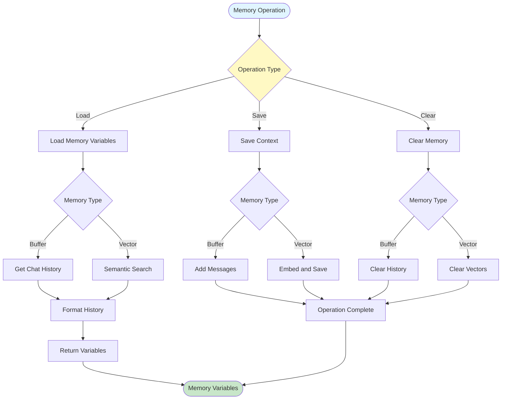

# Data Flows

This document describes how data flows through different components of the Beluga AI Framework.

## RAG Query Processing Flow

## Agent Execution Flow

## Memory Operations Flow

## Orchestration Workflow Flow

## Multi-Agent Coordination Flow

## Embedding Generation Flow

## Related Documentation

- [Component Diagrams](./component-diagrams.md) - Component structure
- [Sequence Diagrams](./sequences.md) - Interaction sequences
- [Architecture Overview](../../architecture.md) - Complete architecture
