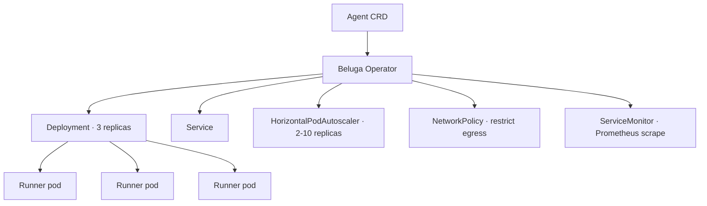

# Guide: Deploy on Kubernetes

**Time:** ~45 minutes
**You will deploy:** a Beluga agent as an `Agent` custom resource, reconciled by the Beluga operator into Deployment/Service/HPA/NetworkPolicy/ServiceMonitor.
**Prerequisites:** Kubernetes cluster (kind, minikube, or real), `kubectl`, [Deploy on Docker guide](./deploy-docker.md).

## What you'll deploy



**Status:** the Beluga operator is in development. This guide describes the target architecture; check `k8s/operator/` for the current state.

## Step 1 — install the operator

```bash
kubectl apply -f https://raw.githubusercontent.com/lookatitude/beluga-ai/main/k8s/operator/install.yaml
```

This creates the `Agent` CRD, the operator `Deployment`, and the RBAC it needs.

Verify:

```bash
kubectl get crd agents.beluga.ai
kubectl -n beluga-system get pods
```

## Step 2 — secrets

```bash
kubectl create secret generic openai --from-literal=api-key=$OPENAI_API_KEY
```

## Step 3 — the Agent CR

```yaml
# research-assistant.yaml
apiVersion: beluga.ai/v1
kind: Agent
metadata:
  name: research-assistant
spec:
  image: myorg/beluga-agent:v2.1.0
  replicas: 3

  llm:
    provider: openai
    model: gpt-4o
    apiKeyFrom:
      secretKeyRef:
        name: openai
        key: api-key

  memory:
    provider: redis
    url: redis://redis.default.svc:6379

  plugins:
    - audit
    - cost
    - tracing

  guards:
    input:
      - promptInjection
      - piiDetect
    output:
      - piiRedact
      - contentModeration
    tool:
      - capabilityCheck

  resources:
    requests:
      cpu: 500m
      memory: 1Gi
    limits:
      cpu: 2
      memory: 4Gi

  autoscale:
    min: 2
    max: 10
    cpuPercent: 75

  networkPolicy:
    allowEgressTo:
      - api.openai.com
      - redis.default.svc

  observability:
    otlpEndpoint: http://otel-collector.observability:4317
    prometheusServiceMonitor: true

  protocols:
    rest: /api/chat
    a2a: /.well-known/agent.json
    mcp: /mcp
```

Apply it:

```bash
kubectl apply -f research-assistant.yaml
```

## Step 4 — what the operator creates

```bash
kubectl get deployment research-assistant
kubectl get svc research-assistant
kubectl get hpa research-assistant
kubectl get networkpolicy research-assistant
kubectl get servicemonitor research-assistant  # only if Prometheus Operator is installed
```

The reconcile loop:

1. **Validate** the spec (image exists, secrets reachable, resources sane).
2. **Resolve references** (the redis URL resolves to a reachable service, the secret exists).
3. **Build** Deployment spec with env vars derived from the Agent spec.
4. **Create or update** Deployment, Service, HPA, NetworkPolicy, ServiceMonitor.
5. **Register** the AgentCard at `/.well-known/agent.json` on the Service.
6. **Update status** on the CR with conditions (Ready, Progressing, Degraded).

## Step 5 — verify

```bash
kubectl port-forward svc/research-assistant 8080:8080 &
curl -N http://localhost:8080/api/chat \
  -H 'Content-Type: application/json' \
  -d '{"message":"hello"}'
curl http://localhost:8080/.well-known/agent.json | jq
```

## Scaling

HPA adjusts replicas between 2 and 10 based on CPU. For custom metrics (e.g., queue depth), use the `HPA.spec.metrics` extension via a patch:

```yaml
apiVersion: autoscaling/v2
kind: HorizontalPodAutoscaler
metadata:
  name: research-assistant
spec:
  metrics:
    - type: External
      external:
        metric:
          name: redis_list_length
          selector:
            matchLabels:
              queue: research-pending
        target:
          type: Value
          value: "10"
```

## NetworkPolicy details

The operator generates a default-deny egress policy and explicitly allows only the hosts listed in `spec.networkPolicy.allowEgressTo`. This prevents compromised agents from exfiltrating data to arbitrary endpoints.

```yaml
# auto-generated
apiVersion: networking.k8s.io/v1
kind: NetworkPolicy
metadata:
  name: research-assistant
spec:
  podSelector:
    matchLabels:
      beluga.ai/agent: research-assistant
  egress:
    - to:
        - ipBlock:
            cidr: 0.0.0.0/0
            except: [169.254.0.0/16]  # block metadata service
      ports:
        - protocol: TCP
          port: 443
          # restricted by DNS policy in ambient mode or egress gateway
```

Combine with an egress gateway (Istio, Cilium) for hostname-level enforcement.

## Upgrades

Update `spec.image` and reapply. The operator performs a rolling update respecting `maxUnavailable` and `maxSurge`. Sessions in Redis survive because the session service is external.

## Observability

The operator configures:

- OTLP export to the collector endpoint.
- Prometheus ServiceMonitor scraping `/metrics` on each pod.
- Log forwarding (if your cluster has a log collector like Vector/Fluent Bit, it picks up the logs automatically).

See [DOC-14](../architecture/14-observability.md) for what metrics and traces are emitted.

## Common mistakes

- **Forgetting the NetworkPolicy.** Compromised agent + no egress policy = data exfiltration.
- **Leaving secrets in the CR spec.** Always use `apiKeyFrom.secretKeyRef`, never embed secrets in the Agent spec.
- **Under-sizing resources.** LLM calls are memory-heavy when streaming. Start at 1Gi requests.
- **No graceful shutdown time.** Set `terminationGracePeriodSeconds: 60` on the pod spec so the runner can drain.
- **Ignoring operator status.** `kubectl describe agent research-assistant` shows conditions and events. Read them when something's not working.

## Related

- [17 — Deployment Modes](../architecture/17-deployment-modes.md)
- [08 — Runner and Lifecycle](../architecture/08-runner-and-lifecycle.md) — graceful shutdown.
- [13 — Security Model](../architecture/13-security-model.md) — NetworkPolicy + guards.
- [Deploy on Docker](./deploy-docker.md) — simpler alternative.
