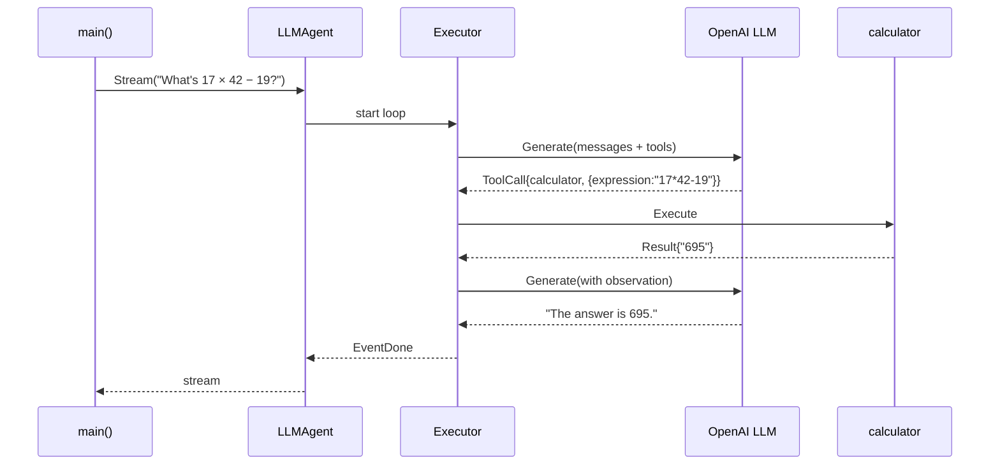

# Guide: Build Your First Agent

**Time:** ~5 minutes
**You will build:** a single-LLM agent that answers questions using a built-in calculator tool.
**Prerequisites:** Go 1.23+, an API key for an LLM provider (OpenAI, Anthropic, or any registered provider).

## What you'll learn

- Importing Beluga and a provider.
- Building an agent with functional options.
- Registering a simple tool.
- Streaming the response.

## Step 1 — initialise a Go module

```bash
mkdir first-agent && cd first-agent
go mod init example.com/first-agent
go get github.com/lookatitude/beluga-ai
```

## Step 2 — the main file

```go
// main.go
package main

import (
    "context"
    "fmt"
    "log"
    "os"

    "github.com/lookatitude/beluga-ai/agent"
    "github.com/lookatitude/beluga-ai/core"
    "github.com/lookatitude/beluga-ai/llm"
    "github.com/lookatitude/beluga-ai/tool"

    // Import for side effect — registers the provider in llm.registry
    _ "github.com/lookatitude/beluga-ai/llm/providers/openai"
)

func main() {
    ctx := context.Background()
    ctx = core.WithTenant(ctx, "default")

    // 1. Build the LLM
    model, err := llm.New("openai", llm.Config{
        "model":   "gpt-4o",
        "api_key": os.Getenv("OPENAI_API_KEY"),
    })
    if err != nil {
        log.Fatalf("llm.New: %v", err)
    }

    // 2. Build the agent
    a := agent.NewLLMAgent(
        agent.WithPersona(agent.Persona{
            Role:      "Math tutor",
            Goal:      "Solve arithmetic questions using the calculator tool",
            Backstory: "You never compute arithmetic in your head — always use the calculator.",
        }),
        agent.WithLLM(model),
        agent.WithTools(newCalculatorTool()),
    )

    // 3. Stream a response
    stream, err := a.Stream(ctx, "What's 17 times 42, minus 19?")
    if err != nil {
        log.Fatalf("agent.Stream: %v", err)
    }
    for _, ev := range stream.Range {
        if ev.Err != nil {
            log.Fatalf("stream error: %v", ev.Err)
        }
        if text, ok := ev.Payload.(string); ok {
            fmt.Print(text)
        }
    }
    fmt.Println()
}
```

## Step 3 — define the calculator tool

```go
// calculator.go
package main

import (
    "context"
    "fmt"

    "github.com/lookatitude/beluga-ai/core"
    "github.com/lookatitude/beluga-ai/tool"
)

func newCalculatorTool() tool.Tool {
    return &calculatorTool{}
}

type calculatorTool struct{}

func (c *calculatorTool) Name() string { return "calculator" }

func (c *calculatorTool) Description() string {
    return "Evaluates arithmetic expressions. Input: expression (string), e.g. '17 * 42 - 19'."
}

func (c *calculatorTool) InputSchema() map[string]any {
    return map[string]any{
        "type": "object",
        "properties": map[string]any{
            "expression": map[string]any{
                "type":        "string",
                "description": "an arithmetic expression",
            },
        },
        "required": []string{"expression"},
    }
}

func (c *calculatorTool) Execute(ctx context.Context, input map[string]any) (*tool.Result, error) {
    expr, ok := input["expression"].(string)
    if !ok {
        return nil, core.Errorf(core.ErrInvalidInput, "calculator: expression is required")
    }
    result, err := evaluate(expr) // use a tiny expression parser or govaluate
    if err != nil {
        return nil, core.Errorf(core.ErrToolFailed, "calculator: %w", err)
    }
    return tool.TextResult(fmt.Sprintf("%v", result)), nil
}

// evaluate is left as an exercise — use github.com/Knetic/govaluate
// or a tiny recursive-descent parser for +, -, *, /, parens.
func evaluate(expr string) (float64, error) {
    // ... implementation ...
    return 695, nil
}
```

## Step 4 — run it

```bash
export OPENAI_API_KEY=sk-...
go run .
```

Expected output:

```
I'll use the calculator to solve this step by step.
17 × 42 = 714
714 − 19 = 695
The answer is 695.
```

## What happened



1. You built an `LLMAgent` with functional options ([Functional Options](../patterns/functional-options.md)).
2. The OpenAI provider was registered during `init()` when you imported it ([Registry + Factory](../patterns/registry-factory.md)).
3. The planner (default: ReAct) decided to call the tool ([DOC-06](../architecture/06-reasoning-strategies.md)).
4. The executor dispatched the call, recorded the observation, and re-planned.
5. The second planner step returned `ActionFinish` with the response.

## What to do next

- Wrap the agent in a `runtime.NewRunner` to expose it via HTTP → see [DOC-08](../architecture/08-runner-and-lifecycle.md).
- Add memory so the agent remembers across turns → see [DOC-09](../architecture/09-memory-architecture.md).
- Add guards for production use → see [DOC-13](../architecture/13-security-model.md).
- Write a custom provider → [Custom Provider guide](./custom-provider.md).
- Deploy it → [Deploy on Docker guide](./deploy-docker.md).

## Common issues

- **`provider "openai" not found`** — you forgot the blank-import of the provider subpackage.
- **`core.Errorf: openai: context_length_exceeded`** — your messages exceed the model's token limit. Add `memory.ContextManager` or reduce the system prompt.
- **`ErrAuth` on the first call** — bad API key. Check `OPENAI_API_KEY`.
- **Agent loops forever** — the planner isn't reaching `ActionFinish`. Set a max iteration count or use Reflexion to detect non-progress.

## Related

- [Multi-agent team](./multi-agent-team.md) — next step after a single agent.
- [03 — Extensibility Patterns](../architecture/03-extensibility-patterns.md) — why this wired together the way it did.
- [05 — Agent Anatomy](../architecture/05-agent-anatomy.md) — what's inside an agent.
