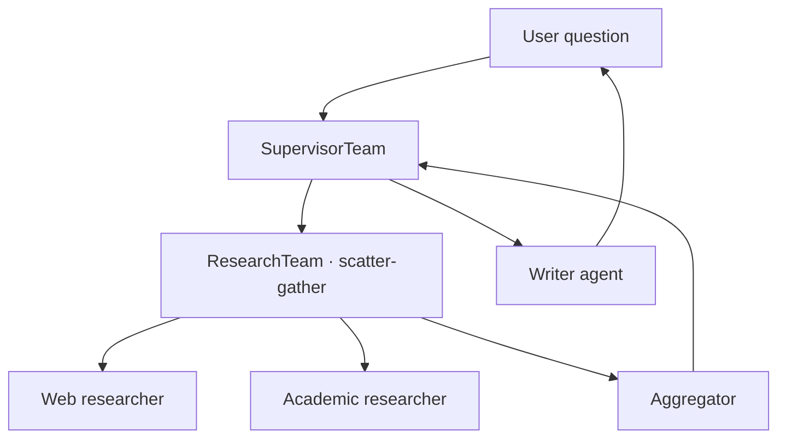

# Guide: Build a Multi-Agent Team

**Time:** ~20 minutes
**You will build:** a research team with a supervisor, two parallel researchers, and a writer.
**Prerequisites:** [First Agent guide](./first-agent.md), [Orchestration Patterns](../architecture/07-orchestration-patterns.md).

## What you'll build



## Step 1 — build the individual agents

```go
// main.go
package main

import (
    "context"

    "github.com/lookatitude/beluga-ai/v2/agent"
    "github.com/lookatitude/beluga-ai/v2/llm"
    "github.com/lookatitude/beluga-ai/v2/orchestration"
    "github.com/lookatitude/beluga-ai/v2/runtime"
    "github.com/lookatitude/beluga-ai/v2/tool"

    _ "github.com/lookatitude/beluga-ai/v2/llm/providers/openai"
    _ "github.com/lookatitude/beluga-ai/v2/tool/builtin/websearch"
    _ "github.com/lookatitude/beluga-ai/v2/tool/builtin/arxiv"
)

func main() {
    ctx := context.Background()
    model, _ := llm.New("openai", llm.Config{"model": "gpt-4o"})

    webSearcher := agent.NewLLMAgent(
        agent.WithPersona(agent.Persona{
            Role:      "Web researcher",
            Goal:      "Find recent web articles on a topic and summarise key findings",
            Backstory: "You favour primary sources and flag uncertainty explicitly",
        }),
        agent.WithLLM(model),
        agent.WithTools(tool.MustNew("web_search", nil)),
    )

    academicSearcher := agent.NewLLMAgent(
        agent.WithPersona(agent.Persona{
            Role:      "Academic researcher",
            Goal:      "Find relevant peer-reviewed papers and extract their conclusions",
            Backstory: "You cite papers precisely and distinguish claim from evidence",
        }),
        agent.WithLLM(model),
        agent.WithTools(tool.MustNew("arxiv_search", nil)),
    )

    aggregator := agent.NewLLMAgent(
        agent.WithPersona(agent.Persona{
            Role: "Research aggregator",
            Goal: "Combine web and academic findings into a single structured brief",
        }),
        agent.WithLLM(model),
    )

    writer := agent.NewLLMAgent(
        agent.WithPersona(agent.Persona{
            Role: "Technical writer",
            Goal: "Produce a 500-word summary in the user's voice",
        }),
        agent.WithLLM(model),
    )
```

## Step 2 — compose the research team (scatter-gather)

```go
    researchTeam, _ := orchestration.NewTeam("research-team",
        orchestration.WithPattern(orchestration.ScatterGather{}),
        orchestration.WithMembers(webSearcher, academicSearcher),
        orchestration.WithAggregator(aggregator),
    )
```

`researchTeam` is itself an `Agent` (it implements the same interface).

## Step 3 — compose the top-level team (supervisor)

```go
    mainTeam, _ := orchestration.NewTeam("main",
        orchestration.WithPattern(orchestration.Supervisor{}),
        orchestration.WithMembers(researchTeam, writer),
    )
```

`researchTeam` appears as a regular member of `mainTeam`. The supervisor doesn't know it's a sub-team — recursive composition ([DOC-07](../architecture/07-orchestration-patterns.md#recursive-composition)).

## Step 4 — host the team in a Runner

```go
    r := runtime.NewRunner(mainTeam,
        runtime.WithRESTEndpoint("/api/chat"),
        runtime.WithPlugin(runtime.AuditPlugin()),
        runtime.WithPlugin(runtime.CostPlugin()),
    )
    if err := r.Serve(ctx, ":8080"); err != nil {
        panic(err)
    }
}
```

## Step 5 — test it

```bash
curl -N http://localhost:8080/api/chat \
  -H 'Content-Type: application/json' \
  -d '{"message":"What are the latest advances in retrieval-augmented generation?"}'
```

Expected flow:
1. Supervisor parses the question and decides: "This needs research first, then writing."
2. Supervisor dispatches to `researchTeam`.
3. `researchTeam` scatter-gathers `webSearcher` and `academicSearcher` in parallel.
4. Each researcher streams tool calls and observations.
5. The aggregator combines their outputs into a structured brief.
6. `researchTeam` returns to the supervisor.
7. Supervisor dispatches to `writer` with the brief.
8. Writer produces the 500-word summary.
9. Response streams to the client via SSE.

## Refactoring to deeper composition

Later, you decide the web researcher itself needs a sub-team (a researcher + a fact-checker). Replace:

```go
webSearcher := agent.NewLLMAgent(...)
```

with:

```go
factChecker := agent.NewLLMAgent(...)
webSearcher := orchestration.MustNewTeam("web-team",
    orchestration.WithPattern(orchestration.Pipeline{}),
    orchestration.WithMembers(
        agent.NewLLMAgent(/* raw web searcher */),
        factChecker,
    ),
)
```

`researchTeam` is unchanged. It doesn't care that `webSearcher` went from a single agent to a sub-team. The `Agent` interface is uniform.

## Common mistakes

- **Forgetting the aggregator on scatter-gather.** Without one, you get N parallel responses and no combination. The aggregator is the reducer.
- **Not propagating context.** Make sure session/tenant/trace context flows to every sub-agent. `Runner` and `Team` do this automatically, but custom composition must preserve it.
- **Tight coupling between team members.** Members communicate through the pattern, not by directly importing each other's types.
- **Using scatter-gather when you needed a pipeline.** If the agents depend on each other's outputs, you want Pipeline, not Scatter-Gather.

## Related

- [07 — Orchestration Patterns](../architecture/07-orchestration-patterns.md) — all five patterns with trade-offs.
- [05 — Agent Anatomy](../architecture/05-agent-anatomy.md#teams-are-agents-recursive-composition) — why this recursion works.
- [08 — Runner and Lifecycle](../architecture/08-runner-and-lifecycle.md) — the Runner hosting the team.
