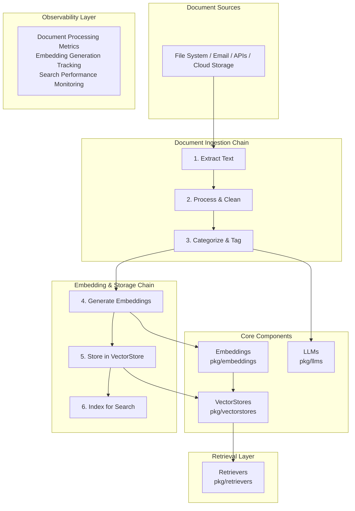

# Use Case 3: Intelligent Document Processing Pipeline

## Overview & Objectives

### Business Problem

Organizations process thousands of documents daily - contracts, invoices, reports, emails. Manual processing is slow, error-prone, and doesn't scale. Extracting structured information, categorizing documents, and making them searchable requires significant human effort.

### Solution Approach

This use case implements an intelligent document processing pipeline that:
- Ingests documents from multiple sources (files, APIs, email)
- Extracts text and metadata automatically
- Generates embeddings for semantic search
- Stores documents in vector databases
- Categorizes and tags documents using LLMs
- Provides search and retrieval capabilities

### Key Benefits

- **Automated Processing**: End-to-end document pipeline automation
- **Semantic Search**: Find documents by meaning, not just keywords
- **Intelligent Categorization**: AI-powered document classification
- **Scalable Architecture**: Process thousands of documents efficiently
- **Production-Ready**: Full observability and error handling

## Architecture Diagram



## Component Usage

### Beluga AI Packages Used

1. **pkg/vectorstores**
   - Store document embeddings
   - Perform similarity search
   - Support PgVector and Pinecone

2. **pkg/embeddings**
   - Generate embeddings for documents
   - Support OpenAI and Ollama

3. **pkg/retrievers**
   - Retrieve documents based on queries
   - Configurable retrieval strategies

4. **pkg/llms**
   - Categorize and tag documents
   - Extract structured information

5. **pkg/prompts**
   - Template-based categorization prompts
   - Information extraction templates

6. **pkg/orchestration**
   - Chain orchestration for processing pipeline
   - Sequential document processing

7. **pkg/monitoring**
   - Processing metrics
   - Performance tracking

8. **pkg/config**
   - Configuration management

## Implementation Guide

### Step 1: Document Structure

```go
type DocumentMetadata struct {
    Source      string            `json:"source"`
    Category    string            `json:"category"`
    Tags        []string          `json:"tags"`
    ProcessedAt time.Time         `json:"processed_at"`
    Custom      map[string]string `json:"custom"`
}

type ProcessedDocument struct {
    ID       string
    Content  string
    Metadata DocumentMetadata
    Embedding []float32
}
```

### Step 2: Create Processing Chain

```go
func createProcessingChain(ctx context.Context, cfg *config.Config) (orchestration.Chain, error) {
    // Initialize components
    embedder, err := embeddings.NewEmbedder(ctx, "openai",
        embeddings.WithAPIKey(cfg.GetString("embeddings.openai.api_key")),
        embeddings.WithModel("text-embedding-ada-002"),
    )
    if err != nil {
        return nil, err
    }

    vectorStore, err := vectorstores.NewVectorStore(ctx, "pgvector",
        vectorstores.WithEmbedder(embedder),
        vectorstores.WithProviderConfig("connection_string",
            cfg.GetString("vectorstore.postgres.connection_string")),
    )
    if err != nil {
        return nil, err
    }

    llm, err := llms.NewChatModel(ctx, "openai",
        llms.WithAPIKey(cfg.GetString("llm.openai.api_key")),
        llms.WithModel("gpt-4"),
    )
    if err != nil {
        return nil, err
    }

    // Create processing steps
    extractStep := &ExtractTextStep{}
    processStep := &ProcessTextStep{}
    categorizeStep := &CategorizeStep{llm: llm}
    embedStep := &EmbedStep{embedder: embedder}
    storeStep := &StoreStep{vectorStore: vectorStore}

    // Create chain
    chain, err := orchestration.NewChain(
        []core.Runnable{extractStep, processStep, categorizeStep, embedStep, storeStep},
        orchestration.WithChainName("document-processing"),
        orchestration.WithChainTimeout(300*time.Second),
    )
    return chain, nil
}
```

### Step 3: Implement Processing Steps

```go
// ExtractTextStep extracts text from documents
type ExtractTextStep struct{}

func (e *ExtractTextStep) Invoke(ctx context.Context, input any, opts ...core.Option) (any, error) {
    doc := input.(*ProcessedDocument)
    
    // Extract text based on document type
    text, err := extractText(doc.ID, doc.Metadata.Source)
    if err != nil {
        return nil, fmt.Errorf("text extraction failed: %w", err)
    }

    doc.Content = text
    return doc, nil
}

// ProcessTextStep cleans and normalizes text
type ProcessTextStep struct{}

func (p *ProcessTextStep) Invoke(ctx context.Context, input any, opts ...core.Option) (any, error) {
    doc := input.(*ProcessedDocument)
    
    // Clean and normalize
    doc.Content = cleanText(doc.Content)
    return doc, nil
}

// CategorizeStep uses LLM to categorize documents
type CategorizeStep struct {
    llm llms.ChatModel
}

func (c *CategorizeStep) Invoke(ctx context.Context, input any, opts ...core.Option) (any, error) {
    doc := input.(*ProcessedDocument)
    
    prompt := fmt.Sprintf(`Categorize this document and extract tags:
    
    Document content (first 1000 chars): %s
    
    Respond in JSON format:
    {
        "category": "invoice|contract|report|email|other",
        "tags": ["tag1", "tag2", ...]
    }`, truncate(doc.Content, 1000))

    messages := []schema.Message{
        schema.NewSystemMessage("You are a document categorization expert."),
        schema.NewHumanMessage(prompt),
    }

    response, err := c.llm.Generate(ctx, messages)
    if err != nil {
        return nil, err
    }

    // Parse JSON response
    var result struct {
        Category string   `json:"category"`
        Tags     []string `json:"tags"`
    }
    if err := json.Unmarshal([]byte(response.GetContent()), &result); err != nil {
        return nil, err
    }

    doc.Metadata.Category = result.Category
    doc.Metadata.Tags = result.Tags
    return doc, nil
}

// EmbedStep generates embeddings
type EmbedStep struct {
    embedder embeddings.Embedder
}

func (e *EmbedStep) Invoke(ctx context.Context, input any, opts ...core.Option) (any, error) {
    doc := input.(*ProcessedDocument)
    
    embedding, err := e.embedder.EmbedDocuments(ctx, []string{doc.Content})
    if err != nil {
        return nil, fmt.Errorf("embedding failed: %w", err)
    }

    doc.Embedding = embedding[0]
    return doc, nil
}

// StoreStep stores document in vector store
type StoreStep struct {
    vectorStore vectorstores.VectorStore
}

func (s *StoreStep) Invoke(ctx context.Context, input any, opts ...core.Option) (any, error) {
    doc := input.(*ProcessedDocument)
    
    schemaDoc := schema.NewDocument(doc.Content, map[string]string{
        "category": doc.Metadata.Category,
        "source":   doc.Metadata.Source,
        "tags":     strings.Join(doc.Metadata.Tags, ","),
    })

    ids, err := s.vectorStore.AddDocuments(ctx, []schema.Document{schemaDoc})
    if err != nil {
        return nil, fmt.Errorf("storage failed: %w", err)
    }

    doc.ID = ids[0]
    return doc, nil
}
```

### Step 4: Batch Processing

```go
func (p *DocumentProcessor) ProcessBatch(ctx context.Context, documents []*ProcessedDocument) error {
    batchSize := 50
    semaphore := make(chan struct{}, 10) // Limit concurrent processing

    for i := 0; i < len(documents); i += batchSize {
        end := i + batchSize
        if end > len(documents) {
            end = len(documents)
        }
        batch := documents[i:end]

        var wg sync.WaitGroup
        for _, doc := range batch {
            wg.Add(1)
            go func(d *ProcessedDocument) {
                defer wg.Done()
                semaphore <- struct{}{}
                defer func() { <-semaphore }()

                if err := p.processDocument(ctx, d); err != nil {
                    log.Printf("Failed to process document %s: %v", d.ID, err)
                }
            }(doc)
        }
        wg.Wait()
    }

    return nil
}

func (p *DocumentProcessor) processDocument(ctx context.Context, doc *ProcessedDocument) error {
    result, err := p.chain.Invoke(ctx, doc)
    if err != nil {
        return err
    }

    processedDoc := result.(*ProcessedDocument)
    log.Printf("Processed document %s: category=%s, tags=%v",
        processedDoc.ID, processedDoc.Metadata.Category, processedDoc.Metadata.Tags)
    return nil
}
```

## Workflow & Data Flow

### End-to-End Process Flow

1. **Document Ingestion**
   ```
   Raw Document → Extract Text → Clean Text
   ```

2. **Categorization**
   ```
   Clean Text → LLM Analysis → Category & Tags
   ```

3. **Embedding & Storage**
   ```
   Text → Generate Embedding → Store in VectorStore
   ```

4. **Search & Retrieval**
   ```
   Query → Generate Query Embedding → Similarity Search → Retrieve Documents
   ```

## Observability Setup

### Metrics to Monitor

- `documents_processed_total`: Total documents processed
- `document_processing_duration_seconds`: Processing time per document
- `document_categorization_accuracy`: Categorization accuracy
- `embedding_generation_duration_seconds`: Embedding generation time
- `vector_store_operations_total`: Vector store operations count
- `processing_errors_total`: Errors by type

## Configuration Examples

### Complete YAML Configuration

```yaml
# config.yaml
app:
  name: "document-processor"
  version: "1.0.0"

embeddings:
  provider: "openai"
  openai:
    api_key: "${OPENAI_API_KEY}"
    model: "text-embedding-ada-002"
    batch_size: 100

vectorstore:
  provider: "pgvector"
  postgres:
    connection_string: "${POSTGRES_CONNECTION_STRING}"
    table_name: "documents"
    search_k: 10

llm:
  provider: "openai"
  openai:
    api_key: "${OPENAI_API_KEY}"
    model: "gpt-4"
    temperature: 0.3

orchestration:
  chain:
    timeout: 300s
    max_retries: 3

processing:
  batch_size: 50
  max_concurrent: 10
  categories:
    - "invoice"
    - "contract"
    - "report"
    - "email"
    - "other"
```

## Deployment Considerations

### Production Requirements

- **Compute**: High CPU for embedding generation
- **Storage**: Large vector database capacity
- **Network**: Low latency to LLM APIs
- **Memory**: Sufficient RAM for batch processing

### Scaling Strategies

1. **Horizontal Scaling**: Multiple processing workers
2. **Batch Processing**: Process documents in batches
3. **Async Processing**: Queue-based document processing
4. **Caching**: Cache embeddings for duplicate documents

## Testing Strategy

### Unit Tests

```go
func TestCategorizeStep(t *testing.T) {
    mockLLM := &MockLLM{
        response: `{"category": "invoice", "tags": ["billing", "payment"]}`,
    }
    step := &CategorizeStep{llm: mockLLM}
    
    doc := &ProcessedDocument{Content: "Invoice #12345"}
    result, err := step.Invoke(context.Background(), doc)
    
    require.NoError(t, err)
    assert.Equal(t, "invoice", result.(*ProcessedDocument).Metadata.Category)
}
```

## Troubleshooting Guide

### Common Issues

1. **Text Extraction Failures**
   - Support more document formats
   - Improve OCR for scanned documents
   - Add format-specific extractors

2. **Categorization Errors**
   - Improve prompt templates
   - Add more training examples
   - Fine-tune categorization logic

3. **Embedding Generation Slow**
   - Use batch embedding API
   - Cache common embeddings
   - Use faster embedding models

## Conclusion

This Intelligent Document Processing Pipeline demonstrates Beluga AI's capabilities in building automated document processing systems. The architecture showcases:

- **End-to-End Automation**: Complete document processing pipeline
- **Intelligent Categorization**: AI-powered document classification
- **Semantic Search**: Vector-based document retrieval
- **Scalable Design**: Batch processing and concurrent execution

The system can be extended with:
- OCR for scanned documents
- Multi-language support
- Document versioning
- Advanced metadata extraction
- Document relationship mapping

