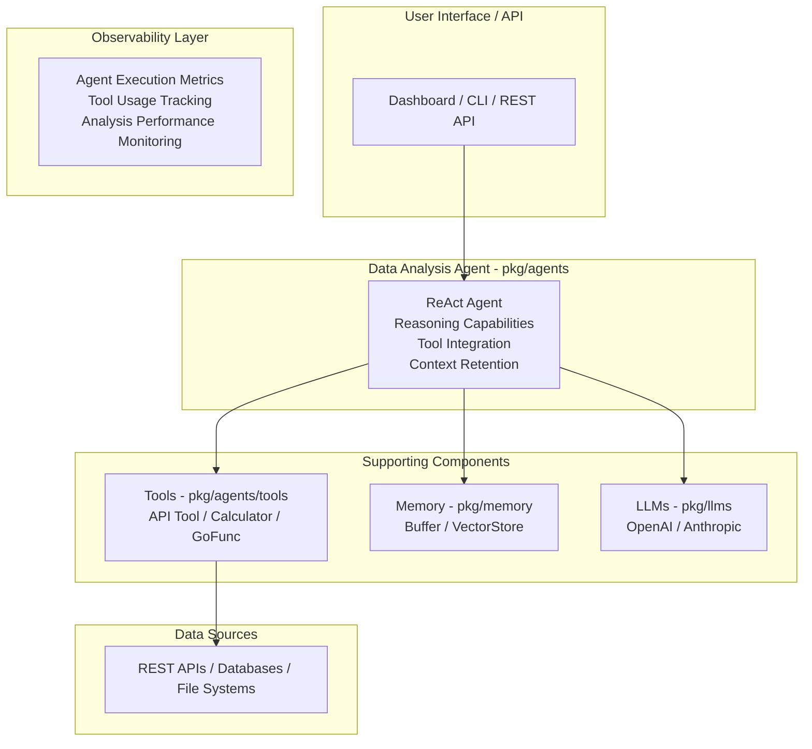

# Use Case 4: Real-Time Data Analysis Agent

## Overview & Objectives

### Business Problem

Businesses need to analyze data from multiple sources in real-time to make informed decisions. Manual data collection, analysis, and reporting is time-consuming and doesn't scale. Teams need automated agents that can fetch data, perform analysis, and generate insights on demand.

### Solution Approach

This use case implements an autonomous data analysis agent that:
- Fetches data from multiple APIs and databases
- Performs statistical analysis and calculations
- Generates insights using LLMs
- Creates reports and visualizations
- Maintains context across analysis sessions

### Key Benefits

- **Automated Data Collection**: Fetches data from multiple sources automatically
- **Intelligent Analysis**: Uses LLMs to generate insights from data
- **Tool Integration**: Uses tools for calculations, API calls, and data processing
- **Real-Time Processing**: Handles time-sensitive data analysis
- **Context Awareness**: Maintains conversation context for follow-up questions

## Architecture Diagram



## Component Usage

### Beluga AI Packages Used

1. **pkg/agents**
   - ReAct agent for autonomous data analysis
   - Agent executor for plan execution

2. **pkg/agents/tools**
   - API tool for data fetching
   - Calculator tool for statistical operations
   - GoFunc tool for custom data processing

3. **pkg/memory**
   - BufferMemory for analysis session context
   - VectorStoreMemory for past analysis retrieval

4. **pkg/llms**
   - Generate insights from data
   - Answer questions about analysis results

5. **pkg/orchestration**
   - Chain orchestration for analysis workflows

6. **pkg/monitoring**
   - Agent execution metrics
   - Tool performance tracking

7. **pkg/server**
   - REST API for agent interactions

## Implementation Guide

### Step 1: Create Analysis Agent

```go
func createAnalysisAgent(ctx context.Context, cfg *config.Config, tools tools.Registry) (agents.Agent, error) {
    llm, err := llms.NewChatModel(ctx, "openai",
        llms.WithAPIKey(cfg.GetString("llm.openai.api_key")),
        llms.WithModel("gpt-4"),
        llms.WithTemperature(0.7),
    )
    if err != nil {
        return nil, err
    }

    memory := memory.NewBufferMemory()

    agent, err := agents.NewReActAgent(
        agents.WithName("data-analysis-agent"),
        agents.WithDescription("Autonomous agent for data analysis and insight generation"),
        agents.WithLLM(llm),
        agents.WithMemory(memory),
        agents.WithTools(tools),
        agents.WithMaxIterations(15),
    )
    return agent, nil
}
```

### Step 2: Set Up Tools

```go
func setupAnalysisTools(cfg *config.Config) (tools.Registry, error) {
    registry := tools.NewInMemoryToolRegistry()

    // API tool for data fetching
    salesAPI := tools.NewAPITool(
        "sales_api",
        "Fetch sales data from CRM system",
        "https://api.sales.example.com",
        cfg.GetString("tools.sales_api.key"),
    )
    registry.RegisterTool(salesAPI)

    // Calculator tool for statistical operations
    calcTool, _ := tools.NewCalculatorTool()
    registry.RegisterTool(calcTool)

    // Custom data processing functions
    statsTool := tools.NewGoFunctionTool(
        "calculate_statistics",
        "Calculate mean, median, mode, standard deviation",
        `{"type": "object", "properties": {"data": {"type": "array", "items": {"type": "number"}}}}`,
        calculateStatistics,
    )
    registry.RegisterTool(statsTool)

    return registry, nil
}

func calculateStatistics(ctx context.Context, args map[string]any) (string, error) {
    data := args["data"].([]float64)
    
    mean := calculateMean(data)
    median := calculateMedian(data)
    stdDev := calculateStdDev(data)
    
    result := map[string]float64{
        "mean":      mean,
        "median":    median,
        "std_dev":   stdDev,
    }
    
    jsonResult, _ := json.Marshal(result)
    return string(jsonResult), nil
}
```

### Step 3: Agent Execution

```go
type AnalysisService struct {
    agent agents.Agent
}

func (s *AnalysisService) AnalyzeData(ctx context.Context, query string) (string, error) {
    task := fmt.Sprintf(`Analyze the following data request and provide insights:
    
    Request: %s
    
    Steps to follow:
    1. Fetch relevant data using available tools
    2. Perform statistical analysis
    3. Generate insights and recommendations
    4. Present findings in a clear format`, query)

    result, err := s.agent.Execute(ctx, map[string]any{
        "task": task,
    })
    if err != nil {
        return "", fmt.Errorf("analysis failed: %w", err)
    }

    return result.(string), nil
}
```

## Workflow & Data Flow

### End-to-End Process Flow

1. **Query Reception**
   ```
   User Query → Agent → Parse Request
   ```

2. **Data Collection**
   ```
   Agent → Use API Tool → Fetch Data from Sources
   ```

3. **Analysis**
   ```
   Raw Data → Use Calculator/Stats Tools → Process Data
   ```

4. **Insight Generation**
   ```
   Processed Data → LLM → Generate Insights
   ```

5. **Response**
   ```
   Insights → Format → Return to User
   ```

## Observability Setup

### Metrics to Monitor

- `analysis_queries_total`: Total analysis requests
- `analysis_duration_seconds`: Analysis processing time
- `tool_usage_total`: Tool usage by type
- `data_sources_accessed_total`: Data source access count
- `analysis_errors_total`: Errors by type

## Configuration Examples

### Complete YAML Configuration

```yaml
# config.yaml
app:
  name: "data-analysis-agent"
  version: "1.0.0"

agent:
  name: "data-analysis-agent"
  type: "react"
  max_iterations: 15
  llm:
    provider: "openai"
    model: "gpt-4"
    temperature: 0.7

tools:
  sales_api:
    endpoint: "https://api.sales.example.com"
    api_key: "${SALES_API_KEY}"
  analytics_api:
    endpoint: "https://api.analytics.example.com"
    api_key: "${ANALYTICS_API_KEY}"

memory:
  type: "buffer"
  buffer:
    return_messages: true

server:
  host: "0.0.0.0"
  port: 8080
```

## Deployment Considerations

### Production Requirements

- **Compute**: Sufficient CPU for data processing
- **Network**: Reliable connectivity to data sources
- **Memory**: RAM for large dataset processing
- **Storage**: For caching analysis results

## Testing Strategy

### Unit Tests

```go
func TestAnalysisAgent(t *testing.T) {
    agent := createTestAnalysisAgent(t)
    
    result, err := agent.Execute(context.Background(), map[string]any{
        "task": "Calculate average sales for last month",
    })
    
    require.NoError(t, err)
    assert.Contains(t, result.(string), "average")
}
```

## Troubleshooting Guide

### Common Issues

1. **Data Fetch Failures**
   - Implement retry logic
   - Add fallback data sources
   - Monitor API health

2. **Analysis Timeout**
   - Optimize tool calls
   - Reduce data volume
   - Increase timeout limits

## Conclusion

This Real-Time Data Analysis Agent demonstrates Beluga AI's capabilities in building autonomous data analysis systems. The architecture showcases:

- **Autonomous Operation**: Agent works independently with tools
- **Tool Integration**: Seamless integration with external data sources
- **Intelligent Analysis**: LLM-powered insight generation
- **Context Awareness**: Maintains conversation context

The system can be extended with:
- More data source integrations
- Advanced statistical analysis
- Visualization generation
- Scheduled analysis jobs
- Multi-agent collaboration

