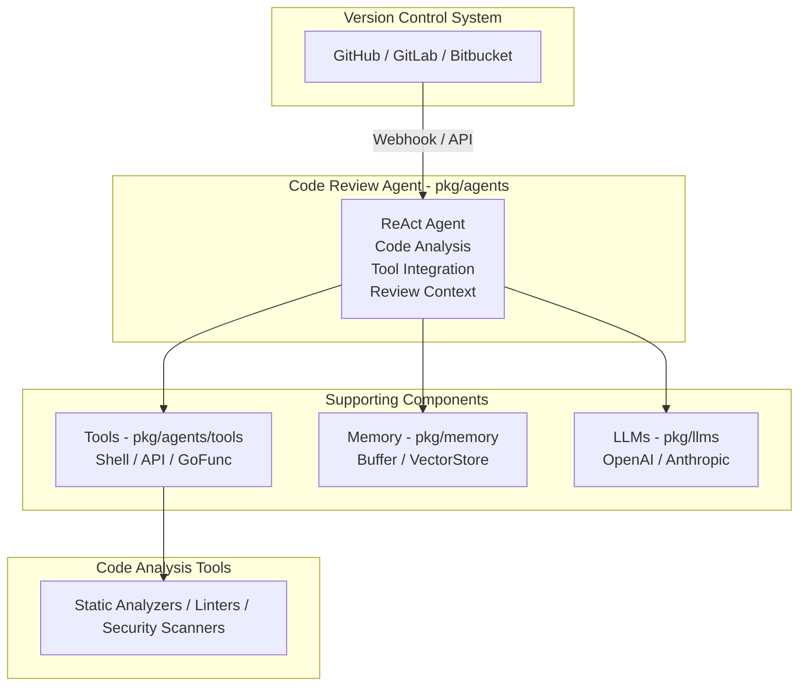

# Use Case 6: Automated Code Review and Analysis System

## Overview & Objectives

### Business Problem

Code reviews are time-consuming and require significant developer effort. Manual reviews can miss issues, be inconsistent, and don't scale with team growth. Teams need automated systems that can analyze code, identify issues, suggest improvements, and provide detailed feedback.

### Solution Approach

This use case implements an AI-powered code review system that:
- Analyzes code using agents with specialized tools
- Identifies bugs, security issues, and code smells
- Suggests improvements and best practices
- Integrates with version control systems
- Provides detailed review reports

### Key Benefits

- **Automated Reviews**: Continuous code analysis without human intervention
- **Comprehensive Analysis**: Identifies bugs, security issues, and style problems
- **Tool Integration**: Uses shell tools for code analysis and API tools for VCS integration
- **Scalable**: Handles multiple repositories and large codebases
- **Learning**: Improves over time with feedback

## Architecture Diagram



## Component Usage

### Beluga AI Packages Used

1. **pkg/agents**
   - ReAct agent for code analysis
   - Agent executor for review workflows

2. **pkg/agents/tools**
   - Shell tool for running code analysis commands
   - API tool for VCS integration
   - GoFunc tool for custom analysis functions

3. **pkg/memory**
   - BufferMemory for review context
   - VectorStoreMemory for past review retrieval

4. **pkg/llms**
   - Analyze code and generate review comments
   - Understand code patterns and suggest improvements

5. **pkg/orchestration**
   - Chain orchestration for review pipeline

6. **pkg/monitoring**
   - Review metrics
   - Performance tracking

7. **pkg/server**
   - REST API for review requests
   - Webhook handling

## Implementation Guide

### Step 1: Create Code Review Agent

```go
func createReviewAgent(ctx context.Context, cfg *config.Config, tools tools.Registry) (agents.Agent, error) {
    llm, err := llms.NewChatModel(ctx, "openai",
        llms.WithAPIKey(cfg.GetString("llm.openai.api_key")),
        llms.WithModel("gpt-4"),
        llms.WithTemperature(0.3), // Lower temperature for consistent analysis
    )
    if err != nil {
        return nil, err
    }

    memory := memory.NewBufferMemory()

    agent, err := agents.NewReActAgent(
        agents.WithName("code-review-agent"),
        agents.WithDescription("Analyzes code for bugs, security issues, and improvements"),
        agents.WithLLM(llm),
        agents.WithMemory(memory),
        agents.WithTools(tools),
        agents.WithMaxIterations(20),
    )
    return agent, nil
}
```

### Step 2: Set Up Analysis Tools

```go
func setupReviewTools(cfg *config.Config) (tools.Registry, error) {
    registry := tools.NewInMemoryToolRegistry()

    // Shell tool for running analysis commands
    shellTool, err := tools.NewShellTool(60 * time.Second)
    if err != nil {
        return nil, err
    }
    registry.RegisterTool(shellTool)

    // API tool for VCS integration
    githubAPI := tools.NewAPITool(
        "github_api",
        "Interact with GitHub API for code review",
        "https://api.github.com",
        cfg.GetString("tools.github.token"),
    )
    registry.RegisterTool(githubAPI)

    // Custom analysis functions
    analyzeTool := tools.NewGoFunctionTool(
        "analyze_code",
        "Perform static code analysis",
        `{"type": "object", "properties": {"file_path": {"type": "string"}, "language": {"type": "string"}}}`,
        analyzeCodeFile,
    )
    registry.RegisterTool(analyzeTool)

    return registry, nil
}

func analyzeCodeFile(ctx context.Context, args map[string]any) (string, error) {
    filePath := args["file_path"].(string)
    language := args["language"].(string)
    
    // Run appropriate static analyzer
    var cmd *exec.Cmd
    switch language {
    case "go":
        cmd = exec.CommandContext(ctx, "golangci-lint", "run", filePath)
    case "python":
        cmd = exec.CommandContext(ctx, "pylint", filePath)
    case "javascript":
        cmd = exec.CommandContext(ctx, "eslint", filePath)
    default:
        return "", fmt.Errorf("unsupported language: %s", language)
    }
    
    output, err := cmd.CombinedOutput()
    if err != nil {
        return string(output), err
    }
    
    return string(output), nil
}
```

### Step 3: Review Pipeline

```go
type ReviewService struct {
    agent agents.Agent
}

func (s *ReviewService) ReviewCode(ctx context.Context, repo string, prNumber int) (*ReviewReport, error) {
    task := fmt.Sprintf(`Review the code in pull request #%d of repository %s.
    
    Steps:
    1. Fetch the pull request code
    2. Analyze code for bugs, security issues, and code smells
    3. Check for best practices and style issues
    4. Generate detailed review comments
    5. Provide improvement suggestions`, prNumber, repo)

    result, err := s.agent.Execute(ctx, map[string]any{
        "task": task,
        "repo": repo,
        "pr_number": prNumber,
    })
    if err != nil {
        return nil, err
    }

    // Parse result into review report
    report := parseReviewResult(result)
    return report, nil
}
```

## Workflow & Data Flow

### End-to-End Process Flow

1. **Webhook Reception**
   ```
   PR Created → Webhook → Review Service
   ```

2. **Code Fetching**
   ```
   Agent → Use API Tool → Fetch PR Code
   ```

3. **Code Analysis**
   ```
   Code → Use Shell Tool → Run Static Analyzers
   ```

4. **LLM Analysis**
   ```
   Code + Analysis Results → LLM → Generate Review Comments
   ```

5. **Report Generation**
   ```
   Review Comments → Format → Post to PR
   ```

## Observability Setup

### Metrics to Monitor

- `code_reviews_total`: Total reviews performed
- `review_duration_seconds`: Review processing time
- `issues_found_total`: Issues found by type
- `tool_usage_total`: Tool usage by type
- `review_errors_total`: Errors by type

## Configuration Examples

### Complete YAML Configuration

```yaml
# config.yaml
app:
  name: "code-review-system"
  version: "1.0.0"

agent:
  name: "code-review-agent"
  type: "react"
  max_iterations: 20
  llm:
    provider: "openai"
    model: "gpt-4"
    temperature: 0.3

tools:
  github:
    token: "${GITHUB_TOKEN}"
    api_url: "https://api.github.com"
  
  analyzers:
    go: "golangci-lint"
    python: "pylint"
    javascript: "eslint"

memory:
  type: "buffer"
  buffer:
    return_messages: true

server:
  host: "0.0.0.0"
  port: 8080
  webhook_path: "/webhook/github"
```

## Deployment Considerations

### Production Requirements

- **Analysis Tools**: Static analyzers installed (golangci-lint, pylint, etc.)
- **VCS Access**: GitHub/GitLab API tokens
- **Compute**: Sufficient CPU for code analysis
- **Storage**: For review history and reports

## Testing Strategy

### Unit Tests

```go
func TestReviewAgent(t *testing.T) {
    agent := createTestReviewAgent(t)
    
    result, err := agent.Execute(context.Background(), map[string]any{
        "task": "Review this Go code for issues",
        "code": "package main\nfunc main() { var x int }",
    })
    
    require.NoError(t, err)
    assert.Contains(t, result.(string), "review")
}
```

## Troubleshooting Guide

### Common Issues

1. **Analysis Tool Failures**
   - Ensure tools are installed
   - Check tool permissions
   - Verify tool configurations

2. **VCS API Rate Limits**
   - Implement rate limiting
   - Use caching
   - Request higher rate limits

3. **Review Quality Issues**
   - Improve agent prompts
   - Add more analysis tools
   - Fine-tune LLM parameters

## Conclusion

This Automated Code Review System demonstrates Beluga AI's capabilities in building intelligent code analysis systems. The architecture showcases:

- **Tool Integration**: Seamless integration with code analysis tools
- **Intelligent Analysis**: LLM-powered code understanding
- **Automated Workflows**: End-to-end review automation
- **Scalable Design**: Handles multiple repositories

The system can be extended with:
- Custom analysis rules
- Learning from feedback
- Multi-language support
- Integration with CI/CD pipelines
- Team-specific review guidelines

