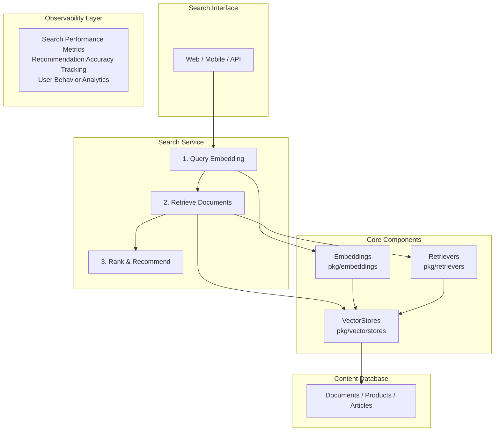

# Use Case 8: Semantic Search and Recommendation Engine

## Overview & Objectives

### Business Problem

Traditional keyword-based search fails to understand user intent and semantic relationships. Users struggle to find relevant content when they don't know exact keywords. Recommendation systems need to understand content meaning, not just metadata.

### Solution Approach

This use case implements a semantic search and recommendation engine that:
- Uses vector embeddings for semantic understanding
- Performs similarity search across large content collections
- Provides personalized recommendations based on user behavior
- Supports multiple content types (documents, products, articles)
- Delivers fast, accurate search results

### Key Benefits

- **Semantic Understanding**: Finds content by meaning, not keywords
- **Personalized Recommendations**: Tailored suggestions based on user preferences
- **High Performance**: Fast similarity search with vector databases
- **Scalable**: Handles millions of items efficiently
- **Multi-Modal**: Supports text, images, and structured data

## Architecture Diagram



## Component Usage

### Beluga AI Packages Used

1. **pkg/vectorstores**
   - Store content embeddings
   - Perform similarity search
   - Support PgVector and Pinecone

2. **pkg/embeddings**
   - Generate embeddings for queries and content
   - Support OpenAI and Ollama

3. **pkg/retrievers**
   - Retrieve relevant content
   - Configurable retrieval strategies

4. **pkg/llms**
   - Generate search query improvements
   - Understand user intent

5. **pkg/prompts**
   - Query enhancement templates
   - Recommendation prompts

6. **pkg/monitoring**
   - Search metrics
   - Performance tracking

7. **pkg/config**
   - Configuration management

## Implementation Guide

### Step 1: Content Indexing

```go
type SearchService struct {
    embedder    embeddings.Embedder
    vectorStore vectorstores.VectorStore
    retriever   retrievers.Retriever
}

func (s *SearchService) IndexContent(ctx context.Context, items []ContentItem) error {
    // Generate embeddings
    texts := make([]string, len(items))
    for i, item := range items {
        texts[i] = item.Text
    }
    
    embeddings, err := s.embedder.EmbedDocuments(ctx, texts)
    if err != nil {
        return err
    }
    
    // Create documents
    docs := make([]schema.Document, len(items))
    for i, item := range items {
        docs[i] = schema.NewDocument(item.Text, map[string]string{
            "id":       item.ID,
            "type":     item.Type,
            "category": item.Category,
        })
    }
    
    // Store in vector store
    _, err = s.vectorStore.AddDocuments(ctx, docs)
    return err
}
```

### Step 2: Semantic Search

```go
func (s *SearchService) Search(ctx context.Context, query string, k int) ([]SearchResult, error) {
    // Generate query embedding
    queryEmbedding, err := s.embedder.EmbedQuery(ctx, query)
    if err != nil {
        return nil, err
    }
    
    // Retrieve relevant documents
    docs, err := s.retriever.GetRelevantDocuments(ctx, query,
        retrievers.WithK(k),
        retrievers.WithScoreThreshold(0.7),
    )
    if err != nil {
        return nil, err
    }
    
    // Convert to search results
    results := make([]SearchResult, len(docs))
    for i, doc := range docs {
        results[i] = SearchResult{
            ID:      doc.Metadata["id"],
            Content: doc.GetContent(),
            Score:   calculateScore(doc),
        }
    }
    
    return results, nil
}
```

### Step 3: Recommendations

```go
func (s *SearchService) GetRecommendations(ctx context.Context, userID string, itemID string) ([]Recommendation, error) {
    // Get user's interaction history
    history := getUserHistory(userID)
    
    // Find similar items
    itemDoc, _ := s.vectorStore.GetDocument(ctx, itemID)
    similar, _, err := s.vectorStore.SimilaritySearch(ctx, itemDoc.GetEmbedding(), 10)
    if err != nil {
        return nil, err
    }
    
    // Filter by user preferences
    recommendations := filterByPreferences(similar, history)
    
    return recommendations, nil
}
```

## Workflow & Data Flow

### End-to-End Process Flow

1. **Content Indexing**
   ```
   Content → Generate Embedding → Store in VectorStore
   ```

2. **Query Processing**
   ```
   User Query → Generate Query Embedding → Similarity Search
   ```

3. **Result Ranking**
   ```
   Search Results → Score & Rank → Return Top K
   ```

4. **Recommendations**
   ```
   User History + Item → Find Similar → Filter & Rank
   ```

## Observability Setup

### Metrics to Monitor

- `search_queries_total`: Total search queries
- `search_duration_seconds`: Search latency
- `search_results_count`: Results returned per query
- `recommendation_clicks_total`: Recommendation engagement
- `embedding_generation_duration_seconds`: Embedding time

## Configuration Examples

### Complete YAML Configuration

```yaml
# config.yaml
app:
  name: "semantic-search"
  version: "1.0.0"

embeddings:
  provider: "openai"
  openai:
    api_key: "${OPENAI_API_KEY}"
    model: "text-embedding-ada-002"
    batch_size: 100

vectorstore:
  provider: "pgvector"
  postgres:
    connection_string: "${POSTGRES_CONNECTION_STRING}"
    table_name: "content_embeddings"
    search_k: 20

retrievers:
  default_k: 10
  score_threshold: 0.7
  timeout: 30s

search:
  max_results: 20
  min_score: 0.7
  enable_reranking: true

recommendations:
  max_recommendations: 10
  similarity_threshold: 0.8
```

## Deployment Considerations

### Production Requirements

- **Vector Database**: High-performance vector store (PgVector or Pinecone)
- **Compute**: CPU for embedding generation
- **Storage**: Large capacity for content embeddings
- **Network**: Low latency for search queries

## Testing Strategy

### Unit Tests

```go
func TestSearchService(t *testing.T) {
    service := createTestSearchService(t)
    
    // Index content
    items := []ContentItem{
        {ID: "1", Text: "Machine learning basics"},
        {ID: "2", Text: "Deep learning advanced"},
    }
    err := service.IndexContent(context.Background(), items)
    require.NoError(t, err)
    
    // Search
    results, err := service.Search(context.Background(), "AI learning", 5)
    require.NoError(t, err)
    assert.Greater(t, len(results), 0)
}
```

## Troubleshooting Guide

### Common Issues

1. **Low Search Quality**
   - Improve embedding models
   - Adjust score thresholds
   - Increase K value

2. **Slow Search Performance**
   - Optimize vector store indexes
   - Use faster embedding models
   - Implement caching

3. **Poor Recommendations**
   - Improve similarity thresholds
   - Add more user interaction data
   - Use hybrid recommendation approaches

## Conclusion

This Semantic Search and Recommendation Engine demonstrates Beluga AI's capabilities in building intelligent search systems. The architecture showcases:

- **Semantic Understanding**: Vector-based similarity search
- **High Performance**: Fast retrieval with vector databases
- **Personalization**: User-based recommendations
- **Scalability**: Handles large content collections

The system can be extended with:
- Multi-modal search (text + images)
- Real-time indexing
- Advanced ranking algorithms
- A/B testing for recommendations
- User feedback learning

