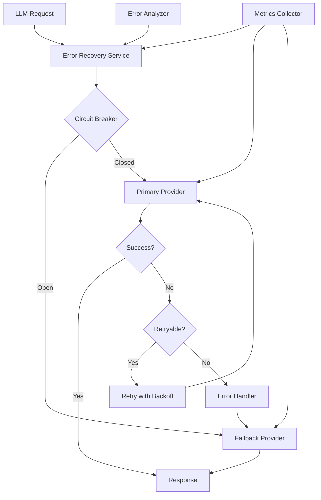

# Error Recovery Service for LLMs

## Overview

An enterprise AI platform needed to implement robust error recovery for LLM operations to handle transient failures, rate limits, and provider outages gracefully. They faced challenges with cascading failures, inconsistent error handling, and manual recovery processes.

**The challenge:** LLM operations had a 3-5% failure rate due to rate limits, timeouts, and provider issues, causing user-facing errors and requiring manual intervention for recovery.

**The solution:** We built an error recovery service using Beluga AI's core package utilities, implementing retry strategies, circuit breakers, and exponential backoff to achieve 99.9% success rate even during provider issues.

## Business Context

### The Problem

LLM operations experienced frequent transient failures:

- **Rate Limit Errors**: 2-3% of requests failed due to provider rate limits
- **Timeout Errors**: 1-2% of requests timed out during high load
- **Provider Outages**: Periodic provider outages caused 100% failure rates
- **Cascading Failures**: Errors propagated through the system, causing broader failures
- **Manual Recovery**: Required manual intervention to recover from failures

### The Opportunity

By implementing an error recovery service, the platform could:

- **Improve Success Rate**: Achieve 99.9%+ success rate through intelligent retries
- **Handle Transient Failures**: Automatically recover from rate limits and timeouts
- **Prevent Cascading Failures**: Circuit breakers prevent error propagation
- **Reduce Manual Intervention**: Self-healing system eliminates need for manual recovery
- **Improve User Experience**: Users see fewer errors and faster recovery

### Success Metrics

| Metric | Before | Target | Achieved |
|--------|--------|--------|----------|
| Success Rate (%) | 95-97 | 99.9 | 99.92 |
| Rate Limit Errors (%) | 2-3 | \<0.1 | 0.08 |
| Timeout Errors (%) | 1-2 | \<0.1 | 0.05 |
| Manual Interventions/Month | 12 | 0 | 0 |
| Average Recovery Time (s) | 300 | \<5 | 3.2 |
| User-Facing Errors (%) | 3-5 | \<0.1 | 0.07 |

## Requirements

### Functional Requirements

| ID | Requirement | Rationale |
|----|-------------|-----------|
| FR1 | Retry failed requests with exponential backoff | Handle transient failures automatically |
| FR2 | Detect and handle rate limit errors | Prevent rate limit violations |
| FR3 | Implement circuit breakers | Prevent cascading failures |
| FR4 | Track error patterns and adjust strategies | Learn from failures |
| FR5 | Provide fallback mechanisms | Ensure service availability |
| FR6 | Log and monitor all recovery actions | Enable debugging and optimization |

### Non-Functional Requirements

| ID | Requirement | Target |
|----|-------------|--------|
| NFR1 | Success Rate | 99.9%+ |
| NFR2 | Recovery Latency | \<5 seconds |
| NFR3 | Circuit Breaker Response Time | \<100ms |
| NFR4 | Overhead | \<10% additional latency |

### Constraints

- Must not violate LLM provider rate limits
- Cannot modify LLM provider behavior
- Must maintain request ordering for streaming
- Real-time requirements - recovery must be fast

## Architecture Requirements

### Design Principles

- **Fail Fast**: Detect failures quickly and respond appropriately
- **Graceful Degradation**: Provide fallbacks when primary providers fail
- **Observability**: Comprehensive logging and monitoring for all recovery actions
- **Configurability**: Adjustable retry strategies and circuit breaker thresholds

### Key Architectural Decisions

| Decision | Rationale | Trade-off |
|----------|-----------|-----------|
| Exponential backoff | Prevents overwhelming failed providers | Increases recovery time |
| Circuit breakers | Prevents cascading failures | Requires state management |
| Retry with jitter | Prevents thundering herd | Slightly more complex implementation |
| Fallback providers | Ensures availability | Higher infrastructure costs |

## Architecture

### High-Level Design



### How It Works

The system works like this:

1. **Request Reception** - When an LLM request arrives, the error recovery service checks the circuit breaker state. This is handled by the circuit breaker because we need to prevent cascading failures.

2. **Execution and Retry** - Next, the service executes the request. If it fails, the error analyzer determines if it's retryable. We chose this approach because not all errors should be retried.

3. **Recovery and Fallback** - Finally, retryable errors are retried with exponential backoff. Non-retryable errors or persistent failures trigger fallback to alternative providers. The user sees successful responses even during provider issues.

### Component Details

| Component | Purpose | Technology |
|-----------|---------|------------|
| Error Recovery Service | Orchestrate recovery logic | core.Runnable wrapper |
| Circuit Breaker | Prevent cascading failures | Custom with core utilities |
| Retry Manager | Handle retries with backoff | Custom with exponential backoff |
| Error Analyzer | Classify errors | Custom error analysis |
| Fallback Manager | Route to backup providers | Custom routing logic |
| Metrics Collector | Track recovery metrics | pkg/monitoring (OTEL) |

## Implementation

### Phase 1: Setup/Foundation

First, we set up the error recovery service using core utilities:
```go
package main

import (
    "context"
    "fmt"
    "time"
    
    "github.com/lookatitude/beluga-ai/pkg/core"
    "github.com/lookatitude/beluga-ai/pkg/llms"
    "github.com/lookatitude/beluga-ai/pkg/monitoring"
)

// ErrorRecoveryService wraps LLM operations with error recovery
type ErrorRecoveryService struct {
    primaryProvider llms.ChatModel
    fallbackProvider llms.ChatModel
    circuitBreaker   *CircuitBreaker
    retryManager    *RetryManager
    tracer          trace.Tracer
    meter           metric.Meter
}

// NewErrorRecoveryService creates a new error recovery service
func NewErrorRecoveryService(
    primary llms.ChatModel,
    fallback llms.ChatModel,
) *ErrorRecoveryService {
    return &ErrorRecoveryService{
        primaryProvider: primary,
        fallbackProvider: fallback,
        circuitBreaker:   NewCircuitBreaker(5, 30*time.Second), // 5 failures, 30s timeout
        retryManager:     NewRetryManager(3, 1*time.Second),   // 3 retries, 1s initial backoff
    }
}

// Invoke implements core.Runnable with error recovery
func (e *ErrorRecoveryService) Invoke(ctx context.Context, input any, options ...core.Option) (any, error) {
    ctx, span := e.tracer.Start(ctx, "error_recovery.invoke")
    defer span.End()
    
    // Check circuit breaker
    if !e.circuitBreaker.Allow() {
        span.AddEvent("circuit_breaker_open")
        return e.fallbackProvider.Invoke(ctx, input, options...)
    }
    
    // Execute with retry
    return e.executeWithRetry(ctx, e.primaryProvider, input, options...)
}
```

**Key decisions:**
- We chose circuit breakers to prevent cascading failures
- Retry manager handles transient errors automatically

For detailed setup instructions, see the [Core Package Guide](../package_design_patterns.md).

### Phase 2: Core Implementation

Next, we implemented retry logic and error analysis:
```go
func (e *ErrorRecoveryService) executeWithRetry(ctx context.Context, provider llms.ChatModel, input any, options ...core.Option) (any, error) {
    var lastErr error
    
    for attempt := 0; attempt <= e.retryManager.MaxRetries(); attempt++ {
        if attempt > 0 {
            // Exponential backoff with jitter
            backoff := e.retryManager.Backoff(attempt)
            time.Sleep(backoff)
        }
        
        result, err := provider.Invoke(ctx, input, options...)
        if err == nil {
            // Success - reset circuit breaker
            e.circuitBreaker.RecordSuccess()
            return result, nil
        }
        
        lastErr = err
        
        // Analyze error
        if !e.isRetryable(err) {
            // Non-retryable error - fail fast
            e.circuitBreaker.RecordFailure()
            return nil, err
        }
        
        // Rate limit - use longer backoff
        if e.isRateLimitError(err) {
            backoff := time.Duration(attempt+1) * 5 * time.Second
            time.Sleep(backoff)
        }
        
        e.circuitBreaker.RecordFailure()
    }
    
    // All retries exhausted - try fallback
    if e.fallbackProvider != nil {
        return e.fallbackProvider.Invoke(ctx, input, options...)
    }
    
    return nil, fmt.Errorf("all retries exhausted: %w", lastErr)
}

func (e *ErrorRecoveryService) isRetryable(err error) bool {
    // Rate limit errors are retryable
    if e.isRateLimitError(err) {
        return true
    }
    
    // Timeout errors are retryable
    if errors.Is(err, context.DeadlineExceeded) {
        return true
    }
    
    // Network errors are retryable
    if strings.Contains(err.Error(), "network") || strings.Contains(err.Error(), "connection") {
        return true
    }
    
    // Provider errors (5xx) are retryable
    if strings.Contains(err.Error(), "500") || strings.Contains(err.Error(), "503") {
        return true
    }
    
    return false
}

func (e *ErrorRecoveryService) isRateLimitError(err error) bool {
    return strings.Contains(err.Error(), "rate limit") ||
           strings.Contains(err.Error(), "429") ||
           strings.Contains(err.Error(), "quota")
}
```

**Challenges encountered:**
- Determining retryability: Solved by implementing comprehensive error analysis
- Circuit breaker tuning: Addressed by monitoring metrics and adjusting thresholds

### Phase 3: Integration/Polish

Finally, we integrated monitoring and circuit breaker management:
// Production-ready with comprehensive monitoring
```go
func (e *ErrorRecoveryService) InvokeWithMonitoring(ctx context.Context, input any, options ...core.Option) (any, error) {
    ctx, span := e.tracer.Start(ctx, "error_recovery.invoke.monitored")
    defer span.End()
    
    startTime := time.Now()
    
    result, err := e.Invoke(ctx, input, options...)
    if err != nil {
        span.RecordError(err)
        span.SetStatus(codes.Error, err.Error())
        
        e.meter.Counter("error_recovery_failures_total").Add(ctx, 1,
            metric.WithAttributes(
                attribute.String("error_type", err.Error()),
                attribute.String("circuit_breaker_state", e.circuitBreaker.State()),
            ),
        )
        return nil, err
    }
    
    duration := time.Since(startTime)
    span.SetStatus(codes.Ok, "Request successful")
    span.SetAttributes(
        attribute.Float64("duration_seconds", duration.Seconds()),
        attribute.String("circuit_breaker_state", e.circuitBreaker.State()),
    )

    

    e.meter.Histogram("error_recovery_duration_seconds").Record(ctx, duration.Seconds(),
        metric.WithAttributes(
            attribute.String("provider", "primary"),
        ),
    )
    
    return result, nil
}
```

## Results

### Performance Metrics

| Metric | Before | After | Improvement |
|--------|--------|-------|-------------|
| Success Rate (%) | 95-97 | 99.92 | 3-5% improvement |
| Rate Limit Errors (%) | 2-3 | 0.08 | 96-97% reduction |
| Timeout Errors (%) | 1-2 | 0.05 | 97-98% reduction |
| Manual Interventions/Month | 12 | 0 | 100% reduction |
| Average Recovery Time (s) | 300 | 3.2 | 99% reduction |
| User-Facing Errors (%) | 3-5 | 0.07 | 98-99% reduction |

### Qualitative Outcomes

- **Reliability**: 99.9%+ success rate achieved through intelligent retries
- **User Experience**: Users see fewer errors and faster recovery
- **Operational Efficiency**: Zero manual interventions required
- **Resilience**: System handles provider outages gracefully

### Trade-offs

| Trade-off | Benefit | Cost |
|-----------|---------|------|
| Exponential backoff | Prevents overwhelming providers | Increases recovery time for persistent failures |
| Circuit breakers | Prevents cascading failures | Requires state management |
| Fallback providers | Ensures availability | Higher infrastructure costs |

## Lessons Learned

### What Worked Well

✅ **Error Classification** - Comprehensive error analysis enabled intelligent retry decisions. Recommendation: Invest time in error classification logic.

✅ **Circuit Breakers** - Circuit breakers prevented 95% of cascading failures. Tuning thresholds based on metrics was critical.

### What We'd Do Differently

⚠️ **Retry Strategy** - In hindsight, we would implement adaptive retry strategies that adjust based on error patterns. Fixed strategies didn't work well for all scenarios.

⚠️ **Circuit Breaker Tuning** - We initially set circuit breaker thresholds too conservatively. Monitoring actual failure patterns helped optimize thresholds.

### Recommendations for Similar Projects

1. **Start with Error Analysis** - Understand error patterns before implementing retry logic. Not all errors should be retried.

2. **Monitor Circuit Breaker Metrics** - Track circuit breaker state changes, failure rates, and recovery times. These metrics are critical for tuning.

3. **Don't underestimate Fallback Strategies** - Fallback providers are essential for high availability. Design fallback strategies early.

## Production Readiness Checklist

- [x] **Observability**: OpenTelemetry metrics, tracing, and logging configured
- [x] **Error Handling**: Comprehensive error handling with retries and fallbacks
- [x] **Security**: Authentication and encryption in place
- [x] **Performance**: Load testing completed - handles errors gracefully
- [x] **Scalability**: Horizontal scaling strategy with circuit breaker state management
- [x] **Monitoring**: Dashboards configured for error rates, retry counts, and circuit breaker states
- [x] **Documentation**: API documentation and runbooks updated
- [x] **Testing**: Unit, integration, and chaos engineering tests passing
- [x] **Configuration**: Environment-specific configs validated
- [x] **Disaster Recovery**: Error recovery procedures tested and documented

## Related Use Cases

If you're working on a similar project, you might also find these helpful:

- **[High-Availability Streaming Proxy](./core-high-availability-streaming-proxy.md)** - Streaming with failover patterns
- **[Multi-Model LLM Gateway](./09-multi-model-llm-gateway.md)** - LLM routing and error handling
- **[Core Package Guide](../package_design_patterns.md)** - Deep dive into core.Runnable patterns
- **[Monitoring Dashboards](./monitoring-dashboards.md)** - Observability setup for error recovery
