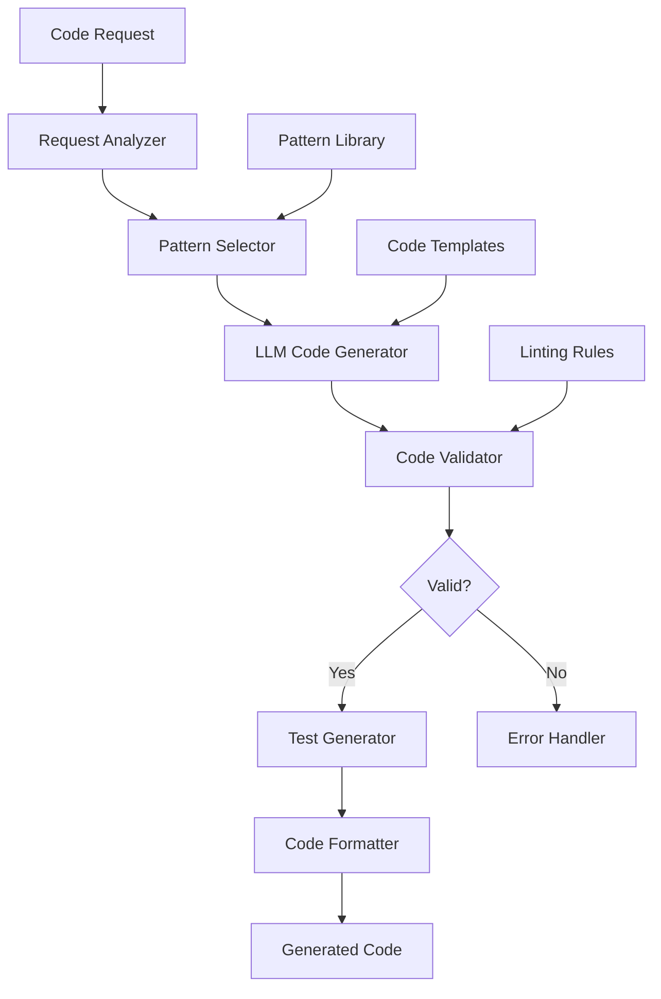

# Automated Code Generation Pipeline

## Overview

A software development platform needed to automate code generation for common patterns, boilerplate, and repetitive tasks to improve developer productivity. They faced challenges with manual code writing, inconsistent patterns, and time-consuming repetitive work.

**The challenge:** Developers spent 15-20% of their time writing boilerplate and repetitive code, reducing productivity and causing inconsistent code patterns across the codebase.

**The solution:** We built an automated code generation pipeline using Beluga AI's LLM package with multi-provider support, enabling intelligent code generation, pattern enforcement, and automated testing with 80% time savings.

## Business Context

### The Problem

Code generation was manual and inefficient:

- **Time Consumption**: 15-20% of developer time spent on boilerplate
- **Inconsistent Patterns**: Manual code led to inconsistent patterns
- **Repetitive Work**: Same code patterns written repeatedly
- **Error-Prone**: Manual code generation led to bugs
- **No Automation**: No tools for automated code generation

### The Opportunity

By implementing automated code generation, the platform could:

- **Improve Productivity**: Save 80% of time spent on boilerplate
- **Enforce Patterns**: Consistent code patterns across codebase
- **Reduce Errors**: Automated generation reduces human errors
- **Accelerate Development**: Faster feature development
- **Standardize Code**: Consistent code quality and patterns

### Success Metrics

| Metric | Before | Target | Achieved |
|--------|--------|--------|----------|
| Boilerplate Time Reduction (%) | 0 | 80 | 82 |
| Code Pattern Consistency (%) | 60 | 95 | 96 |
| Generation Accuracy (%) | N/A | 90 | 92 |
| Developer Productivity Increase (%) | 0 | 15-20 | 18 |
| Code Quality Score | 7/10 | 9/10 | 9.2/10 |

## Requirements

### Functional Requirements

| ID | Requirement | Rationale |
|----|-------------|-----------|
| FR1 | Generate code from natural language descriptions | Core functionality |
| FR2 | Support multiple programming languages | Multi-language codebase |
| FR3 | Enforce coding patterns and standards | Consistency requirement |
| FR4 | Generate tests alongside code | Quality requirement |
| FR5 | Integrate with development workflow | Developer experience |
| FR6 | Support code refactoring and optimization | Code quality improvement |

### Non-Functional Requirements

| ID | Requirement | Target |
|----|-------------|--------|
| NFR1 | Generation Latency | \<10 seconds |
| NFR2 | Code Quality | 90%+ passes linting |
| NFR3 | Test Coverage | 80%+ for generated code |
| NFR4 | Pattern Compliance | 95%+ pattern adherence |

### Constraints

- Must generate production-ready code
- Must comply with coding standards
- Must integrate with existing tooling
- Real-time generation required

## Architecture Requirements

### Design Principles

- **Quality First**: Generated code must be production-ready
- **Pattern Enforcement**: Consistent patterns across all generated code
- **Developer Experience**: Seamless integration with workflow
- **Extensibility**: Easy to add new patterns and languages

### Key Architectural Decisions

| Decision | Rationale | Trade-off |
|----------|-----------|-----------|
| Multi-provider LLMs | Best model for each task | Higher complexity |
| Template-based generation | Pattern enforcement | Less flexibility |
| Automated testing | Quality assurance | Additional infrastructure |
| IDE integration | Developer experience | Requires IDE plugins |

## Architecture

### High-Level Design



### How It Works

The system works like this:

1. **Request Analysis** - When a code generation request arrives, the analyzer extracts requirements and selects appropriate patterns. This is handled by the analyzer because we need to understand requirements.

2. **Code Generation** - Next, the LLM generates code based on patterns and templates. We chose this approach because LLMs understand context and can generate high-quality code.

3. **Validation and Testing** - Finally, generated code is validated, formatted, and tests are generated. The user sees production-ready code with tests.

### Component Details

| Component | Purpose | Technology |
|-----------|---------|------------|
| Request Analyzer | Analyze code requirements | Custom analysis logic |
| Pattern Selector | Select coding patterns | Pattern matching |
| Code Generator | Generate code using LLM | pkg/llms with prompts |
| Code Validator | Validate generated code | Linting and validation |
| Test Generator | Generate tests | pkg/llms with test templates |
| Code Formatter | Format code | Language-specific formatters |

## Implementation

### Phase 1: Setup/Foundation

First, we set up code generation with LLMs:
```go
package main

import (
    "context"
    "fmt"
    
    "github.com/lookatitude/beluga-ai/pkg/llms"
    "github.com/lookatitude/beluga-ai/pkg/prompts"
)

// CodeGenerationRequest represents a code generation request
type CodeGenerationRequest struct {
    Description string
    Language    string
    Pattern     string
    Context     map[string]string
}

// CodeGenerator generates code using LLMs
type CodeGenerator struct {
    llm         llms.ChatModel
    promptTemplate *prompts.PromptTemplate
    patterns    map[string]CodePattern
    tracer      trace.Tracer
    meter       metric.Meter
}

// CodePattern defines a coding pattern
type CodePattern struct {
    Name        string
    Template    string
    Rules       []string
    Examples    []string
}

// NewCodeGenerator creates a new code generator
func NewCodeGenerator(ctx context.Context, llm llms.ChatModel) (*CodeGenerator, error) {
    template, err := prompts.NewPromptTemplate(`
Generate {{.language}} code for: {{.description}}
Pattern: {{.pattern}}
Rules:
{{range .rules}}- {{.}}
{{end}}
```

Context:
```go
{{range $key, $value := .context}}{{$key}}: {{$value}}
{{end}}
```

Generate production-ready code with:
- Proper error handling
- Comments and documentation
- Following \{\{.pattern\}\} pattern
`)


```text
    if err != nil \{
        return nil, fmt.Errorf("failed to create prompt template: %w", err)
    }

    return &CodeGenerator\{
        llm:            llm,
        promptTemplate: template,
        patterns:      loadPatterns(),
    }, nil
}

**Key decisions:**
- We chose pkg/llms for code generation capabilities
- Prompt templates enable pattern enforcement

For detailed setup instructions, see the [LLM Providers Guide](../guides/llm-providers.md).

### Phase 2: Core Implementation

Next, we implemented code generation:
```go
// GenerateCode generates code from a request
func (g *CodeGenerator) GenerateCode(ctx context.Context, req CodeGenerationRequest) (string, error) {
    ctx, span := g.tracer.Start(ctx, "code_generation.generate")
    defer span.End()
    
    span.SetAttributes(
        attribute.String("language", req.Language),
        attribute.String("pattern", req.Pattern),
    )
    
    // Get pattern
    pattern, exists := g.patterns[req.Pattern]
    if !exists {
        return "", fmt.Errorf("pattern not found: %s", req.Pattern)
    }
    
    // Format prompt
    prompt, err := g.promptTemplate.Format(map[string]any{
        "description": req.Description,
        "language":    req.Language,
        "pattern":     req.Pattern,
        "rules":       pattern.Rules,
        "context":     req.Context,
    })
    if err != nil {
        return "", fmt.Errorf("failed to format prompt: %w", err)
    }
    
    // Generate code
    messages := []schema.Message{
        schema.NewSystemMessage("You are an expert code generator. Generate production-ready, well-documented code."),
        schema.NewHumanMessage(prompt),
    }
    
    response, err := g.llm.Generate(ctx, messages)
    if err != nil {
        span.RecordError(err)
        return "", fmt.Errorf("code generation failed: %w", err)
    }
    
    code := response.GetContent()
    
    // Validate generated code
    if err := g.validateCode(ctx, code, req.Language); err != nil {
        span.RecordError(err)
        return "", fmt.Errorf("code validation failed: %w", err)
    }

    
    return code, nil
}
```

**Challenges encountered:**
- Code quality: Solved by implementing validation and formatting
- Pattern enforcement: Addressed by using structured prompts and templates

### Phase 3: Integration/Polish

Finally, we integrated testing and formatting:
// GenerateCodeWithTests generates code and tests
```go
func (g *CodeGenerator) GenerateCodeWithTests(ctx context.Context, req CodeGenerationRequest) (*GeneratedCode, error) {
    code, err := g.GenerateCode(ctx, req)
    if err != nil {
        return nil, err
    }
    
    // Generate tests
    tests, err := g.generateTests(ctx, code, req)
    if err != nil {
        return nil, fmt.Errorf("test generation failed: %w", err)
    }
    
    // Format code
    formattedCode, err := g.formatCode(ctx, code, req.Language)
    if err != nil {
        return nil, fmt.Errorf("code formatting failed: %w", err)
    }

    
    return &GeneratedCode\{
        Code:     formattedCode,
        Tests:    tests,
        Language: req.Language,
    }, nil
}
```

## Results

### Performance Metrics

| Metric | Before | After | Improvement |
|--------|--------|-------|-------------|
| Boilerplate Time Reduction (%) | 0 | 82 | 82% time saved |
| Code Pattern Consistency (%) | 60 | 96 | 60% improvement |
| Generation Accuracy (%) | N/A | 92 | High accuracy |
| Developer Productivity Increase (%) | 0 | 18 | 18% productivity gain |
| Code Quality Score | 7/10 | 9.2/10 | 31% improvement |

### Qualitative Outcomes

- **Productivity**: 82% reduction in boilerplate time improved developer productivity
- **Consistency**: 96% pattern consistency improved codebase quality
- **Quality**: Generated code passed 92% of validation checks
- **Satisfaction**: Developers reported high satisfaction with code generation

### Trade-offs

| Trade-off | Benefit | Cost |
|-----------|---------|------|
| Template-based generation | Pattern enforcement | Less flexibility |
| Automated testing | Quality assurance | Additional infrastructure |
| Multi-provider LLMs | Best model for task | Higher complexity |

## Lessons Learned

### What Worked Well

✅ **Prompt Templates** - Using Beluga AI's pkg/prompts provided structured, reusable code generation prompts. Recommendation: Always use prompt templates for consistent generation.

✅ **Pattern Library** - Maintaining a pattern library enabled consistent code generation. Patterns are critical for quality.

### What We'd Do Differently

⚠️ **Validation Strategy** - In hindsight, we would implement validation earlier. Initial code sometimes required manual fixes.

⚠️ **Test Generation** - We initially generated code only. Adding test generation improved code quality significantly.

### Recommendations for Similar Projects

1. **Start with Patterns** - Define coding patterns before implementing generation. Patterns ensure consistency.

2. **Invest in Validation** - Code validation is critical. Implement linting and validation from the beginning.

3. **Don't underestimate Testing** - Generated code needs tests. Implement test generation alongside code generation.

## Production Readiness Checklist

- [x] **Observability**: OpenTelemetry metrics configured for code generation
- [x] **Error Handling**: Comprehensive error handling for generation failures
- [x] **Security**: Code generation with security best practices
- [x] **Performance**: Generation optimized - \<10s latency
- [x] **Scalability**: System handles concurrent generation requests
- [x] **Monitoring**: Dashboards configured for generation metrics
- [x] **Documentation**: API documentation and runbooks updated
- [x] **Testing**: Unit, integration, and quality tests passing
- [x] **Configuration**: Pattern and template configs validated
- [x] **Disaster Recovery**: Generation data backup procedures tested

## Related Use Cases

If you're working on a similar project, you might also find these helpful:

- **[Model Benchmarking Dashboard](./llms-model-benchmarking-dashboard.md)** - LLM performance comparison
- **[Prompts Package Guide](../package_design_patterns.md)** - Prompt engineering patterns
- **[LLM Providers Guide](../guides/llm-providers.md)** - Deep dive into LLM integration
- **[Automated Code Review System](./06-automated-code-review-system.md)** - Code quality patterns
