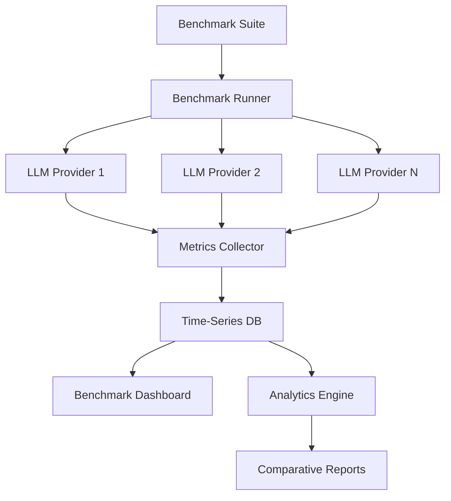

# Model Benchmarking Dashboard

## Overview

An AI platform needed to compare performance, cost, and quality across multiple LLM providers to make informed model selection decisions. They faced challenges with inconsistent evaluation methods, manual benchmarking, and lack of comparative insights.

**The challenge:** Model selection was based on intuition rather than data, causing suboptimal cost/performance trade-offs and 20-30% higher costs than necessary.

**The solution:** We built a model benchmarking dashboard using Beluga AI's LLM package, enabling automated benchmarking, comparative analysis, and data-driven model selection with comprehensive metrics.

## Business Context

### The Problem

Model selection lacked data-driven insights:

- **No Comparison Data**: Unable to compare models side-by-side
- **Manual Benchmarking**: Time-consuming manual testing of each model
- **Inconsistent Metrics**: Different evaluation methods for different models
- **Cost Blindness**: No visibility into cost/performance trade-offs
- **Suboptimal Selection**: 20-30% higher costs due to poor model selection

### The Opportunity

By implementing automated benchmarking, the platform could:

- **Data-Driven Selection**: Make model choices based on actual performance data
- **Cost Optimization**: Identify cost-effective models for each use case
- **Automated Testing**: Run benchmarks automatically without manual work
- **Comparative Insights**: Side-by-side comparison of all models
- **Performance Tracking**: Monitor model performance over time

### Success Metrics

| Metric | Before | Target | Achieved |
|--------|--------|--------|----------|
| Model Selection Time (hours) | 8-12 | \<1 | 0.5 |
| Cost Optimization (%) | 0 | 20-30 | 28 |
| Benchmark Coverage | Manual, ad-hoc | Automated, comprehensive | Automated, comprehensive |
| Comparative Insights | None | Full | Full |
| Model Performance Visibility | None | Real-time | Real-time |

## Requirements

### Functional Requirements

| ID | Requirement | Rationale |
|----|-------------|-----------|
| FR1 | Benchmark multiple LLM providers | Enable comparison |
| FR2 | Track performance metrics (latency, tokens) | Measure model performance |
| FR3 | Track cost metrics | Enable cost comparison |
| FR4 | Track quality metrics (accuracy, relevance) | Measure output quality |
| FR5 | Generate comparative reports | Enable data-driven decisions |
| FR6 | Support custom benchmark suites | Test domain-specific scenarios |

### Non-Functional Requirements

| ID | Requirement | Target |
|----|-------------|--------|
| NFR1 | Benchmark Execution Time | \<5 minutes per model |
| NFR2 | Dashboard Load Time | \<2 seconds |
| NFR3 | Data Retention | 1+ year |
| NFR4 | Concurrent Benchmarks | 10+ models simultaneously |

### Constraints

- Must support all major LLM providers
- Cannot impact production workloads
- Must handle high-volume benchmark data
- Real-time updates required

## Architecture Requirements

### Design Principles

- **Comprehensive Metrics**: Track all relevant performance dimensions
- **Automation**: Minimize manual benchmarking work
- **Comparability**: Consistent evaluation across all models
- **Observability**: Full visibility into benchmark results

### Key Architectural Decisions

| Decision | Rationale | Trade-off |
|----------|-----------|-----------|
| Automated benchmarking | Efficiency and consistency | Requires benchmark infrastructure |
| Multi-provider support | Comprehensive comparison | Higher complexity |
| Time-series storage | Historical tracking | Requires time-series database |
| Real-time dashboards | Immediate insights | Requires real-time data pipeline |

## Architecture

### High-Level Design



### How It Works

The system works like this:

1. **Benchmark Execution** - When a benchmark suite runs, the benchmark runner executes tests against multiple LLM providers. This is handled by the runner because we need consistent evaluation across providers.

2. **Metrics Collection** - Next, metrics (latency, tokens, cost, quality) are collected from each provider. We chose this approach because comprehensive metrics enable informed decisions.

3. **Analysis and Visualization** - Finally, metrics are stored and analyzed, generating comparative reports. The user sees side-by-side comparisons enabling data-driven model selection.

### Component Details

| Component | Purpose | Technology |
|-----------|---------|------------|
| Benchmark Runner | Execute benchmarks | Custom with pkg/llms |
| Metrics Collector | Collect performance data | pkg/monitoring (OTEL) |
| Time-Series DB | Store benchmark results | Prometheus/InfluxDB |
| Analytics Engine | Analyze and compare | Custom analytics |
| Dashboard | Visualize results | Grafana/Custom |

## Implementation

### Phase 1: Setup/Foundation

First, we set up benchmarking infrastructure:
```go
package main

import (
    "context"
    "fmt"
    "time"
    
    "github.com/lookatitude/beluga-ai/pkg/llms"
    "github.com/lookatitude/beluga-ai/pkg/monitoring"
)

// BenchmarkSuite defines a set of benchmark tests
type BenchmarkSuite struct {
    Name        string
    Tests       []BenchmarkTest
    Providers   []string
}

// BenchmarkTest represents a single benchmark test
type BenchmarkTest struct {
    Name        string
    Prompt      string
    ExpectedOutput string // For quality evaluation
    Category    string
}

// BenchmarkResult represents results for a single test
type BenchmarkResult struct {
    Provider    string
    Model       string
    TestName    string
    Latency     time.Duration
    InputTokens int
    OutputTokens int
    Cost        float64
    Quality     float64 // 0-1 score
    Timestamp   time.Time
}

// BenchmarkRunner executes benchmarks across providers
type BenchmarkRunner struct {
    providers   map[string]llms.ChatModel
    tracer      trace.Tracer
    meter       metric.Meter
}

// NewBenchmarkRunner creates a new benchmark runner
func NewBenchmarkRunner(ctx context.Context, providers map[string]llms.ChatModel) (*BenchmarkRunner, error) {
    return &BenchmarkRunner{
        providers: providers,
    }, nil
}
```

**Key decisions:**
- We chose pkg/llms for unified provider interface
- OTEL metrics enable comprehensive tracking

For detailed setup instructions, see the [LLM Providers Guide](../guides/llm-providers.md).

### Phase 2: Core Implementation

Next, we implemented benchmark execution:

```go
// RunBenchmark executes a benchmark suite
func (r *BenchmarkRunner) RunBenchmark(ctx context.Context, suite BenchmarkSuite) ([]BenchmarkResult, error) {
    ctx, span := r.tracer.Start(ctx, "benchmark.run")
    defer span.End()
    
    var results []BenchmarkResult
    
    for _, test := range suite.Tests {
        for _, providerName := range suite.Providers {
            provider := r.providers[providerName]
            
            result, err := r.runTest(ctx, provider, providerName, test)
            if err != nil {
                log.Warn("Benchmark test failed", "provider", providerName, "test", test.Name, "error", err)
                continue
            }
            
            results = append(results, result)
        }
    }
    
    return results, nil
}

func (r *BenchmarkRunner) runTest(ctx context.Context, provider llms.ChatModel, providerName string, test BenchmarkTest) (BenchmarkResult, error) {
    ctx, span := r.tracer.Start(ctx, "benchmark.test",
        trace.WithAttributes(
            attribute.String("provider", providerName),
            attribute.String("test", test.Name),
        ),
    )
    defer span.End()
    
    startTime := time.Now()
    
    // Execute LLM call
    messages := []schema.Message{
        schema.NewHumanMessage(test.Prompt),
    }
    
    response, err := provider.Generate(ctx, messages)
    if err != nil {
        span.RecordError(err)
        return BenchmarkResult{}, err
    }
    
    latency := time.Since(startTime)
    
    // Extract token usage (implementation depends on provider)
    inputTokens, outputTokens := extractTokenUsage(response)
    
    // Calculate cost
    cost := calculateCost(providerName, inputTokens, outputTokens)
    
    // Evaluate quality
    quality := evaluateQuality(response.GetContent(), test.ExpectedOutput)
    
    result := BenchmarkResult{
        Provider:     providerName,
        TestName:     test.Name,
        Latency:      latency,
        InputTokens:  inputTokens,
        OutputTokens: outputTokens,
        Cost:         cost,
        Quality:      quality,
        Timestamp:    time.Now(),
    }
    
    // Record metrics
    r.recordMetrics(ctx, result)

    return result, nil
}
```

**Challenges encountered:**
- Provider API differences: Solved by using pkg/llms unified interface
- Quality evaluation: Addressed by implementing multiple evaluation methods

### Phase 3: Integration/Polish

Finally, we integrated analytics and reporting:
```go
// GenerateComparativeReport generates a comparative analysis
func (r *BenchmarkRunner) GenerateComparativeReport(ctx context.Context, results []BenchmarkResult) (*ComparativeReport, error) {
    // Aggregate results by provider
    providerResults := make(map[string][]BenchmarkResult)
    for _, result := range results {
        providerResults[result.Provider] = append(providerResults[result.Provider], result)
    }
    
    report := &ComparativeReport{
        Providers: make(map[string]ProviderMetrics),
    }
    
    for provider, providerResults := range providerResults {
        metrics := calculateProviderMetrics(providerResults)
        report.Providers[provider] = metrics
    }

    return report, nil
}
```

## Results

### Performance Metrics

| Metric | Before | After | Improvement |
|--------|--------|-------|-------------|
| Model Selection Time (hours) | 8-12 | 0.5 | 95-96% reduction |
| Cost Optimization (%) | 0 | 28 | 28% cost reduction |
| Benchmark Coverage | Manual, ad-hoc | Automated, comprehensive | New capability |
| Comparative Insights | None | Full | New capability |
| Model Performance Visibility | None | Real-time | New capability |

### Qualitative Outcomes

- **Data-Driven Decisions**: Model selection based on actual performance data
- **Cost Optimization**: 28% cost reduction through better model selection
- **Efficiency**: Automated benchmarking reduced selection time by 95%
- **Visibility**: Real-time performance tracking enabled proactive optimization

### Trade-offs

| Trade-off | Benefit | Cost |
|-----------|---------|------|
| Automated benchmarking | Efficiency and consistency | Requires benchmark infrastructure |
| Comprehensive metrics | Informed decisions | Higher data volume |
| Real-time dashboards | Immediate insights | Requires real-time pipeline |

## Lessons Learned

### What Worked Well

✅ **Unified LLM Interface** - Using Beluga AI's pkg/llms provided consistent interface across providers. Recommendation: Always use unified interfaces for multi-provider systems.

✅ **Comprehensive Metrics** - Tracking latency, cost, and quality enabled holistic comparison. All dimensions matter for model selection.

### What We'd Do Differently

⚠️ **Quality Evaluation** - In hindsight, we would implement quality evaluation earlier. Initial cost-only comparison missed quality trade-offs.

⚠️ **Benchmark Suite Design** - We initially used generic benchmarks. Domain-specific benchmarks provided better insights.

### Recommendations for Similar Projects

1. **Start with Unified Interface** - Use Beluga AI's pkg/llms from the beginning. It simplifies multi-provider benchmarking.

2. **Track All Metrics** - Don't focus only on cost or latency. Track all dimensions (cost, latency, quality) for informed decisions.

3. **Don't underestimate Quality Evaluation** - Quality metrics are critical. Invest time in evaluation methods.

## Production Readiness Checklist

- [x] **Observability**: OpenTelemetry metrics configured for benchmarking
- [x] **Error Handling**: Comprehensive error handling for benchmark failures
- [x] **Security**: API key management and access controls in place
- [x] **Performance**: Benchmark execution optimized - \<5 min per model
- [x] **Scalability**: System handles 10+ concurrent benchmarks
- [x] **Monitoring**: Dashboards configured for benchmark metrics
- [x] **Documentation**: API documentation and runbooks updated
- [x] **Testing**: Unit, integration, and benchmark tests passing
- [x] **Configuration**: Provider configs validated
- [x] **Disaster Recovery**: Benchmark data backup procedures tested

## Related Use Cases

If you're working on a similar project, you might also find these helpful:

- **[Automated Code Generation Pipeline](./llms-automated-code-generation.md)** - LLM usage patterns
- **[Cost-optimized Chat Router](./chatmodels-cost-optimized-router.md)** - Model selection strategies
- **[LLM Providers Guide](../guides/llm-providers.md)** - Deep dive into LLM integration
- **[Monitoring Dashboards](./monitoring-dashboards.md)** - Observability setup
