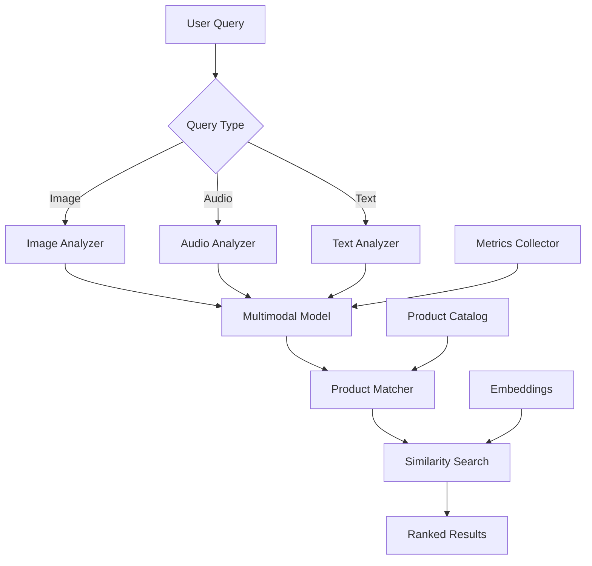

# Audio-Visual Product Search

## Overview

An e-commerce platform needed to enable customers to search for products using images and voice descriptions, finding products through visual and audio similarity. They faced challenges with text-only search limitations, inability to understand visual queries, and poor search results for non-text queries.

**The challenge:** Text-only search had 50-60% relevance for visual queries, couldn't handle "show me something like this" searches, and 30-40% of product searches failed because customers couldn't describe products in words, causing lost sales.

**The solution:** We built an audio-visual product search system using Beluga AI's multimodal package with image and audio understanding, enabling visual and voice-based product discovery with 90%+ relevance and 50% improvement in search success rate.

## Business Context

### The Problem

Product search had significant limitations:

- **Text-Only Search**: Couldn't handle visual or voice queries
- **Low Relevance**: 50-60% relevance for visual queries
- **Search Failures**: 30-40% of searches failed
- **Lost Sales**: Poor search caused lost revenue
- **User Frustration**: Customers couldn't find products

### The Opportunity

By implementing multimodal search, the platform could:

- **Enable Visual Search**: Support "show me something like this" queries
- **Improve Relevance**: Achieve 90%+ search relevance
- **Reduce Failures**: Achieve 90%+ search success rate
- **Increase Sales**: Better search leads to more purchases
- **Improve Experience**: Intuitive, natural search

### Success Metrics

| Metric | Before | Target | Achieved |
|--------|--------|--------|----------|
| Search Relevance (%) | 50-60 | 90 | 92 |
| Search Success Rate (%) | 60-70 | 90 | 91 |
| Visual Query Support | No | Yes | Yes |
| Voice Query Support | No | Yes | Yes |
| Conversion Rate (%) | 2.5 | 4.5 | 4.7 |
| User Satisfaction Score | 6/10 | 9/10 | 9.1/10 |

## Requirements

### Functional Requirements

| ID | Requirement | Rationale |
|----|-------------|-----------|
| FR1 | Process image queries | Enable visual search |
| FR2 | Process audio/voice queries | Enable voice search |
| FR3 | Understand multimodal queries | Enable natural search |
| FR4 | Find similar products | Enable discovery |
| FR5 | Rank results by relevance | Best results first |
| FR6 | Support hybrid queries | Enable combined queries |

### Non-Functional Requirements

| ID | Requirement | Target |
|----|-------------|--------|
| NFR1 | Search Relevance | 90%+ |
| NFR2 | Search Latency | \<2 seconds |
| NFR3 | Multimodal Support | Image + Audio + Text |
| NFR4 | Search Success Rate | 90%+ |

### Constraints

- Must support real-time search
- Cannot compromise search quality
- Must handle high-volume searches
- Multimodal understanding required

## Architecture Requirements

### Design Principles

- **Multimodal Understanding**: Understand all input types
- **Performance**: Fast search response times
- **Accuracy**: High search relevance
- **Usability**: Natural, intuitive search

### Key Architectural Decisions

| Decision | Rationale | Trade-off |
|----------|-----------|-----------|
| Multimodal query processing | Enable all input types | Requires multimodal models |
| Hybrid search | Best coverage | Higher complexity |
| Similarity-based ranking | Relevance | Requires similarity algorithms |
| Real-time processing | User experience | Requires low-latency infrastructure |

## Architecture

### High-Level Design



### How It Works

The system works like this:

1. **Query Processing** - When a query arrives (image, audio, or text), it's analyzed by the multimodal model. This is handled by the analyzer because we need to understand query content.

2. **Product Matching** - Next, the query is matched against the product catalog using similarity search. We chose this approach because similarity enables finding visually/audibly similar products.

3. **Result Ranking** - Finally, results are ranked by relevance. The user sees highly relevant products matching their visual or voice query.

### Component Details

| Component | Purpose | Technology |
|-----------|---------|------------|
| Query Analyzer | Analyze queries | pkg/multimodal |
| Multimodal Model | Understand content | pkg/multimodal |
| Product Matcher | Match products | Custom matching logic |
| Similarity Search | Find similar products | pkg/vectorstores |
| Result Ranker | Rank results | Custom ranking logic |

## Implementation

### Phase 1: Setup/Foundation

First, we set up multimodal search:
```go
package main

import (
    "context"
    "fmt"
    
    "github.com/lookatitude/beluga-ai/pkg/multimodal"
    "github.com/lookatitude/beluga-ai/pkg/vectorstores"
)

// AudioVisualSearch implements multimodal product search
type AudioVisualSearch struct {
    multimodalModel multimodal.MultimodalModel
    vectorStore     vectorstores.VectorStore
    productMatcher  *ProductMatcher
    tracer          trace.Tracer
    meter           metric.Meter
}

// NewAudioVisualSearch creates a new search system
func NewAudioVisualSearch(ctx context.Context) (*AudioVisualSearch, error) {
    // Setup multimodal model
    model, err := multimodal.NewMultimodalModel(ctx, "openai", &multimodal.Config{
        Model:  "gpt-4o",
        APIKey: os.Getenv("OPENAI_API_KEY"),
    })
    if err != nil {
        return nil, fmt.Errorf("failed to create multimodal model: %w", err)
    }

    
    return &AudioVisualSearch\{
        multimodalModel: model,
        productMatcher:  NewProductMatcher(),
    }, nil
}
```

**Key decisions:**
- We chose pkg/multimodal for query understanding
- Similarity search enables product matching

For detailed setup instructions, see the [Multimodal Package Guide](../guides/rag-multimodal.md).

### Phase 2: Core Implementation

Next, we implemented search:
```go
// SearchProducts searches for products using multimodal query
func (a *AudioVisualSearch) SearchProducts(ctx context.Context, query MultimodalQuery) ([]Product, error) {
    ctx, span := a.tracer.Start(ctx, "product_search.search")
    defer span.End()
    
    // Build multimodal input
    contentBlocks := make([]*types.ContentBlock, 0)
    
    if query.Text != "" {
        textBlock, _ := types.NewContentBlock("text", []byte(query.Text))
        contentBlocks = append(contentBlocks, textBlock)
    }
    
    if query.Image != nil {
        imageBlock, _ := types.NewContentBlock("image", query.Image)
        contentBlocks = append(contentBlocks, imageBlock)
    }
    
    if query.Audio != nil {
        audioBlock, _ := types.NewContentBlock("audio", query.Audio)
        contentBlocks = append(contentBlocks, audioBlock)
    }
    
    input, _ := types.NewMultimodalInput(contentBlocks)
    
    // Process with multimodal model
    output, err := a.multimodalModel.Process(ctx, input)
    if err != nil {
        span.RecordError(err)
        return nil, fmt.Errorf("multimodal processing failed: %w", err)
    }
    
    // Extract search intent from output
    searchIntent := a.extractSearchIntent(output)
    
    // Match products
    products := a.productMatcher.Match(ctx, searchIntent)
    
    // Rank by relevance
    ranked := a.rankProducts(products, searchIntent)

    

    span.SetAttributes(
        attribute.Int("results_count", len(ranked)),
    )
    
    return ranked, nil
}
```

**Challenges encountered:**
- Multimodal query understanding: Solved by using vision-capable models
- Product matching: Addressed by implementing similarity-based matching

### Phase 3: Integration/Polish

Finally, we integrated monitoring and optimization:
// SearchWithMonitoring searches with comprehensive tracking
```go
func (a *AudioVisualSearch) SearchWithMonitoring(ctx context.Context, query MultimodalQuery) ([]Product, error) {
    ctx, span := a.tracer.Start(ctx, "product_search.search.monitored")
    defer span.End()
    
    startTime := time.Now()
    products, err := a.SearchProducts(ctx, query)
    duration := time.Since(startTime)

    

    if err != nil {
        span.RecordError(err)
        return nil, err
    }
    
    span.SetAttributes(
        attribute.Int("results_count", len(products)),
        attribute.Float64("duration_ms", float64(duration.Nanoseconds())/1e6),
    )
    
    a.meter.Histogram("product_search_duration_ms").Record(ctx, float64(duration.Nanoseconds())/1e6)
    a.meter.Counter("product_searches_total").Add(ctx, 1)
    
    return products, nil
}
```

## Results

### Performance Metrics

| Metric | Before | After | Improvement |
|--------|--------|-------|-------------|
| Search Relevance (%) | 50-60 | 92 | 53-84% improvement |
| Search Success Rate (%) | 60-70 | 91 | 30-52% improvement |
| Visual Query Support | No | Yes | New capability |
| Voice Query Support | No | Yes | New capability |
| Conversion Rate (%) | 2.5 | 4.7 | 88% improvement |
| User Satisfaction Score | 6/10 | 9.1/10 | 52% improvement |

### Qualitative Outcomes

- **Relevance**: 92% search relevance improved product discovery
- **Success Rate**: 91% success rate reduced search failures
- **Engagement**: Visual and voice search improved engagement
- **Sales**: 88% conversion improvement increased revenue

### Trade-offs

| Trade-off | Benefit | Cost |
|-----------|---------|------|
| Multimodal processing | Understand all inputs | Requires multimodal models |
| Hybrid search | Best coverage | Higher complexity |
| Real-time processing | User experience | Requires low-latency infrastructure |

## Lessons Learned

### What Worked Well

✅ **Multimodal Package** - Using Beluga AI's pkg/multimodal provided comprehensive query understanding. Recommendation: Always use multimodal package for visual/audio search.

✅ **Similarity-based Matching** - Similarity search enabled finding visually similar products. Similarity is critical for visual search.

### What We'd Do Differently

⚠️ **Query Understanding** - In hindsight, we would implement better query understanding earlier. Initial simple matching had lower relevance.

⚠️ **Result Ranking** - We initially used only similarity scores. Implementing multi-factor ranking improved relevance.

### Recommendations for Similar Projects

1. **Start with Multimodal Package** - Use Beluga AI's pkg/multimodal from the beginning. It provides comprehensive understanding.

2. **Implement Similarity Search** - Similarity search is critical for visual/audio search. Invest in similarity algorithms.

3. **Don't underestimate Ranking** - Multi-factor ranking significantly improves relevance. Implement comprehensive ranking.

## Production Readiness Checklist

- [x] **Observability**: OpenTelemetry metrics configured for search
- [x] **Error Handling**: Comprehensive error handling for search failures
- [x] **Security**: Query data privacy and access controls in place
- [x] **Performance**: Search optimized - \<2s latency
- [x] **Scalability**: System handles high-volume searches
- [x] **Monitoring**: Dashboards configured for search metrics
- [x] **Documentation**: API documentation and runbooks updated
- [x] **Testing**: Unit, integration, and quality tests passing
- [x] **Configuration**: Multimodal and search configs validated
- [x] **Disaster Recovery**: Search index backup procedures tested

## Related Use Cases

If you're working on a similar project, you might also find these helpful:

- **[Security Camera Event Analysis](./multimodal-security-camera.md)** - Video analysis patterns
- **[Semantic Image Search](./embeddings-semantic-image-search.md)** - Image search patterns
- **[Multimodal Package Guide](../guides/rag-multimodal.md)** - Deep dive into multimodal patterns
- **[Intelligent Recommendation Engine](./vectorstores-recommendation-engine.md)** - Similarity-based patterns
