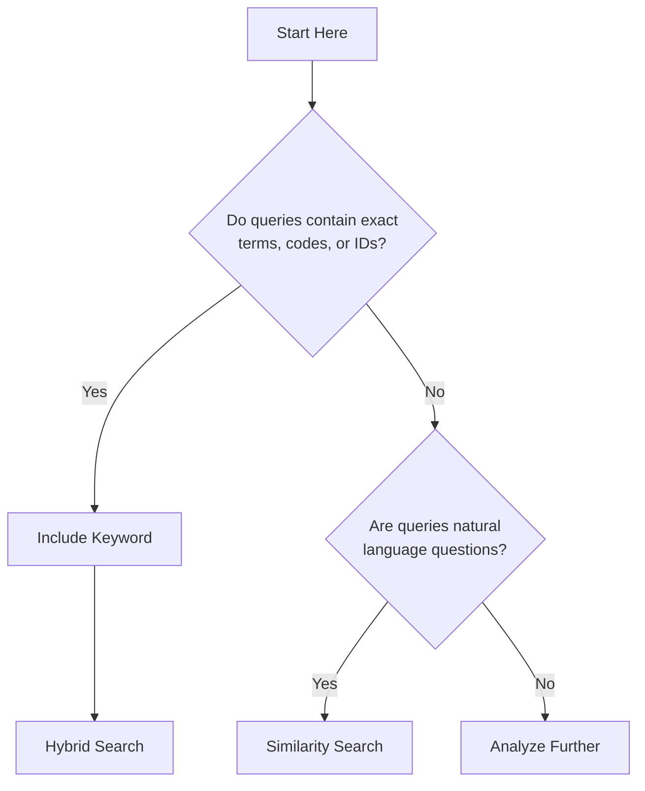
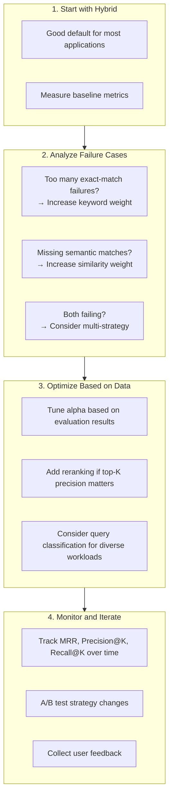

# RAG Strategies: Choosing the Right Approach for Your Use Case

> **A practical comparison of RAG strategies to help you select the best approach for your application.**

## Overview

You've decided to build a RAG (Retrieval-Augmented Generation) system, but you're faced with choices: Should you use similarity search or keyword search? Hybrid? What about reranking? This guide compares different RAG strategies, explains when each excels, and helps you make informed decisions for your specific use case.

We'll cover:
- Similarity-only RAG for semantic understanding
- Keyword-only RAG for precision and technical content
- Hybrid RAG for the best of both worlds
- Advanced strategies with reranking and multi-index approaches

## Business Context

### Why Strategy Matters

The choice of retrieval strategy significantly impacts your system's effectiveness:

| Metric | Impact of Strategy |
|--------|-------------------|
| **Accuracy** | Wrong strategy → wrong documents → wrong answers |
| **Latency** | Complex strategies add processing time |
| **Cost** | Embedding calls cost money; choose wisely |
| **User satisfaction** | Users trust systems that consistently find relevant content |

### Common Pain Points

1. **"It doesn't find the right documents"** → Usually a strategy mismatch
2. **"It's too slow"** → Overly complex strategy for the use case
3. **"It works sometimes but not always"** → Lack of fallback strategies
4. **"Technical queries fail"** → Over-reliance on semantic search

## Strategy Comparison

### Strategy Overview

| Strategy | Best For | Latency | Complexity | When to Use |
|----------|----------|---------|------------|-------------|
| **Similarity** | Semantic understanding, Q&A | Medium | Low | Natural language queries |
| **Keyword** | Technical content, exact terms | Low | Low | Code, IDs, acronyms |
| **Hybrid** | General purpose | Medium-High | Medium | Most applications |
| **Multi-strategy** | Complex domains | High | High | Enterprise search |
| **With Reranking** | Precision-critical | High | High | Top-N accuracy matters |

### Decision Framework



## Strategy 1: Similarity-Only RAG

### When to Use

- Natural language questions ("What is X?", "How do I Y?")
- Semantic understanding is more important than exact matches
- Documents use varied vocabulary for the same concepts
- Multi-lingual or cross-lingual search

### Architecture

```go
// Similarity-only RAG pipeline
func (r *RAGPipeline) SimilarityRAG(ctx context.Context, query string) (*Response, error) {
    // 1. Generate query embedding
    queryEmbedding, err := r.embedder.Embed(ctx, query)
    if err != nil {
        return nil, fmt.Errorf("embedding failed: %w", err)
    }
    
    // 2. Search vector store
    docs, err := r.vectorStore.SimilaritySearch(ctx, queryEmbedding, r.topK)
    if err != nil {
        return nil, fmt.Errorf("search failed: %w", err)
    }
    
    // 3. Build context from retrieved documents
    context := r.buildContext(docs)
    
    // 4. Generate response
    return r.llm.Generate(ctx, query, context)
}
```

### Pros and Cons

| Pros | Cons |
|------|------|
| Semantic understanding | Misses exact term matches |
| Handles synonyms | Requires embedding computation |
| Works across languages | Can't handle acronyms/codes |
| Good for Q&A | Less interpretable |

### Example Use Cases

1. **Customer support Q&A**: "My order hasn't arrived" → finds "delayed shipping" docs
2. **Documentation search**: "How to configure logging" → finds setup guides
3. **Knowledge base**: Concept-based retrieval across domains

## Strategy 2: Keyword-Only RAG

### When to Use

- Technical documentation with specific terminology
- Code search and error messages
- Product IDs, order numbers, or other identifiers
- When exact matching is critical

### Architecture

```go
// Keyword-only RAG pipeline
func (r *RAGPipeline) KeywordRAG(ctx context.Context, query string) (*Response, error) {
    // 1. Search keyword index (BM25, Elasticsearch, etc.)
    docs, err := r.keywordStore.Search(ctx, query, r.topK)
    if err != nil {
        return nil, fmt.Errorf("search failed: %w", err)
    }
    
    // 2. Filter by minimum score
    filteredDocs := filterByScore(docs, r.minScore)
    
    // 3. Build context
    context := r.buildContext(filteredDocs)
    
    // 4. Generate response
    return r.llm.Generate(ctx, query, context)
}
```

### Pros and Cons

| Pros | Cons |
|------|------|
| Fast (no embedding needed) | No semantic understanding |
| Exact term matching | Misses synonyms |
| Good for codes/IDs | Language-dependent |
| Interpretable results | Vocabulary mismatch issues |

### Example Use Cases

1. **Error lookup**: "ERR_CONNECTION_REFUSED" → finds exact error docs
2. **Code search**: "func NewClient" → finds function definition
3. **Order tracking**: "ORD-12345" → finds specific order

## Strategy 3: Hybrid RAG

### When to Use

- General-purpose applications
- Mixed query types (natural language + technical)
- When you can't predict user behavior
- As a sensible default

### Architecture

```go
// Hybrid RAG with RRF fusion
func (r *RAGPipeline) HybridRAG(ctx context.Context, query string) (*Response, error) {
    // Run both searches in parallel
    var wg sync.WaitGroup
    var simDocs, kwDocs []Document
    
    wg.Add(2)
    go func() {
        defer wg.Done()
        embedding, _ := r.embedder.Embed(ctx, query)
        simDocs, _ = r.vectorStore.SimilaritySearch(ctx, embedding, r.topK)
    }()
    go func() {
        defer wg.Done()
        kwDocs, _ = r.keywordStore.Search(ctx, query, r.topK)
    }()
    wg.Wait()
    
    // Fuse results using Reciprocal Rank Fusion
    fusedDocs := r.rrfFusion(simDocs, kwDocs)
    
    // Build context and generate
    context := r.buildContext(fusedDocs[:r.topK])
    return r.llm.Generate(ctx, query, context)
}

// Reciprocal Rank Fusion merges ranked lists
func (r *RAGPipeline) rrfFusion(lists ...[]Document) []Document {
    const k = 60 // RRF constant
    
    scores := make(map[string]float64)
    docs := make(map[string]Document)
    
    for _, list := range lists {
        for rank, doc := range list {
            scores[doc.ID] += 1.0 / float64(k + rank + 1)
            docs[doc.ID] = doc
        }
    }
    
    // Sort by fused score
    result := make([]Document, 0, len(docs))
    for id, doc := range docs {
        doc.Score = scores[id]
        result = append(result, doc)
    }
    sort.Slice(result, func(i, j int) bool {
        return result[i].Score > result[j].Score
    })
    
    return result
}
```

### Tuning Alpha (Similarity Weight)

```go
// Alpha = 0.5: Balanced (default)
// Alpha = 0.7: More weight on semantic similarity
// Alpha = 0.3: More weight on keyword matching

type HybridConfig struct {
    Alpha float64 // Weight for similarity (0.0 to 1.0)
}

func (r *RAGPipeline) WeightedHybrid(simDocs, kwDocs []Document, alpha float64) []Document {
    // Combine with weighted scoring
    scores := make(map[string]float64)
    
    for i, doc := range simDocs {
        scores[doc.ID] += alpha * (1.0 / float64(i + 1))
    }
    for i, doc := range kwDocs {
        scores[doc.ID] += (1 - alpha) * (1.0 / float64(i + 1))
    }
    
    // ... sort and return
}
```

### Pros and Cons

| Pros | Cons |
|------|------|
| Best of both worlds | Higher latency |
| Robust to query types | More complex |
| Good default choice | Harder to debug |
| Handles edge cases | Requires tuning alpha |

## Strategy 4: Multi-Strategy RAG

### When to Use

- Complex enterprise applications
- When query types are diverse and predictable
- Maximum accuracy required
- Resources available for complexity

### Architecture

```go
// Multi-strategy RAG with query classification
func (r *RAGPipeline) MultiStrategyRAG(ctx context.Context, query string) (*Response, error) {
    // 1. Classify query type
    queryType := r.classifyQuery(query)
    
    // 2. Select strategy based on type
    var docs []Document
    var err error
    
    switch queryType {
    case QueryTypeDefinition:
        // Use similarity for "What is X?" queries
        docs, err = r.similaritySearch(ctx, query)
        
    case QueryTypeCode:
        // Use keyword for code queries
        docs, err = r.keywordSearch(ctx, query)
        
    case QueryTypeTroubleshooting:
        // Use hybrid with reranking for troubleshooting
        docs, err = r.hybridWithRerank(ctx, query)
        
    default:
        // Default to hybrid
        docs, err = r.hybridSearch(ctx, query)
    }
    
    if err != nil {
        // Fallback to hybrid on error
        docs, err = r.hybridSearch(ctx, query)
    }
    
    // 3. Generate response
    context := r.buildContext(docs)
    return r.llm.Generate(ctx, query, context)
}

// Query classification using patterns or LLM
func (r *RAGPipeline) classifyQuery(query string) QueryType {
    q := strings.ToLower(query)
    
    if strings.HasPrefix(q, "what is ") || strings.HasPrefix(q, "define ") {
        return QueryTypeDefinition
    }
    if containsCode(q) || containsErrorCode(q) {
        return QueryTypeCode
    }
    if strings.Contains(q, "error") || strings.Contains(q, "failed") {
        return QueryTypeTroubleshooting
    }
    
    return QueryTypeGeneral
}
```

## Strategy 5: RAG with Reranking

### When to Use

- Precision at top positions is critical
- You can afford additional latency
- Initial retrieval is noisy
- Multi-stage retrieval pipelines

### Architecture

```go
// Two-stage retrieval with reranking
func (r *RAGPipeline) RerankingRAG(ctx context.Context, query string) (*Response, error) {
    // Stage 1: Retrieve more candidates than needed
    candidates, err := r.hybridSearch(ctx, query, r.topK * 3)
    if err != nil {
        return nil, err
    }
    
    // Stage 2: Rerank with cross-encoder
    reranked, err := r.reranker.Rerank(ctx, query, candidates)
    if err != nil {
        // Fall back to original ranking
        reranked = candidates
    }
    
    // Take top K after reranking
    docs := reranked[:min(r.topK, len(reranked))]
    
    // Generate response
    context := r.buildContext(docs)
    return r.llm.Generate(ctx, query, context)
}

// Reranker using cross-encoder model
type CrossEncoderReranker struct {
    model  CrossEncoder
    client *http.Client
}

func (r *CrossEncoderReranker) Rerank(
    ctx context.Context,
    query string,
    docs []Document,
) ([]Document, error) {
    // Score each (query, doc) pair
    scores := make([]float64, len(docs))
    
    for i, doc := range docs {
        score, err := r.model.Score(ctx, query, doc.Content)
        if err != nil {
            return nil, err
        }
        scores[i] = score
    }
    
    // Sort by reranked score
    type scored struct {
        doc   Document
        score float64
    }
    pairs := make([]scored, len(docs))
    for i := range docs {
        pairs[i] = scored{docs[i], scores[i]}
    }
    sort.Slice(pairs, func(i, j int) bool {
        return pairs[i].score > pairs[j].score
    })
    
    result := make([]Document, len(docs))
    for i, p := range pairs {
        result[i] = p.doc
        result[i].Score = p.score
    }
    
    return result, nil
}
```

### Pros and Cons

| Pros | Cons |
|------|------|
| Higher precision at top K | Significantly higher latency |
| Can rescue poor initial ranking | Expensive (model inference) |
| State-of-the-art accuracy | Complexity |
| Works with any base strategy | Additional model to maintain |

## Implementation Recommendations

### Choosing Your Strategy



### Production Configuration

```go
// Recommended production configuration
type RAGConfig struct {
    // Strategy selection
    Strategy          RetrievalStrategy `default:"hybrid"`
    HybridAlpha       float64           `default:"0.5"`
    
    // Retrieval settings
    TopK              int               `default:"10"`
    MinScore          float64           `default:"0.7"`
    
    // Multi-strategy settings
    EnableMultiStrategy bool            `default:"false"`
    ClassifyWithLLM     bool            `default:"false"`
    
    // Reranking settings
    EnableReranking   bool              `default:"false"`
    RerankTopK        int               `default:"30"` // Retrieve more for reranking
    RerankModel       string            `default:"cross-encoder/ms-marco-MiniLM-L-6-v2"`
    
    // Fallback settings
    EnableFallback    bool              `default:"true"`
    FallbackStrategy  RetrievalStrategy `default:"hybrid"`
    
    // Timeouts
    RetrievalTimeout  time.Duration     `default:"5s"`
    RerankTimeout     time.Duration     `default:"3s"`
}
```

## Results and Metrics

### Expected Performance by Strategy

| Strategy | MRR | P@5 | Latency (p95) | Use Case Fit |
|----------|-----|-----|---------------|--------------|
| Similarity | 0.65-0.80 | 0.60-0.75 | 100-300ms | Q&A, semantic |
| Keyword | 0.55-0.70 | 0.50-0.65 | 20-100ms | Technical, exact |
| Hybrid | 0.70-0.85 | 0.65-0.80 | 150-400ms | General purpose |
| Multi-strategy | 0.75-0.88 | 0.70-0.85 | 200-500ms | Complex domains |
| With Reranking | 0.80-0.92 | 0.75-0.90 | 400-1000ms | Precision-critical |

### Monitoring Dashboard

Key metrics to track:

```promql
# Strategy usage breakdown
sum by (strategy) (beluga_rag_retrievals_total)

# MRR by strategy
histogram_quantile(0.5, 
  sum by (strategy, le) (beluga_rag_mrr_bucket)
)

# Latency by strategy
histogram_quantile(0.95,
  sum by (strategy, le) (beluga_rag_latency_seconds_bucket)
)

# Fallback rate
sum(rate(beluga_rag_fallbacks_total[5m])) / 
sum(rate(beluga_rag_retrievals_total[5m]))
```

## Lessons Learned

### What Works

1. **Start simple, measure, then optimize**: Hybrid is a great default
2. **Query classification helps**: Different queries need different strategies
3. **Fallbacks are essential**: Systems must handle edge cases
4. **Monitoring matters**: You can't improve what you don't measure

### Common Mistakes

1. **Over-engineering early**: Don't add reranking until you need it
2. **Ignoring exact matches**: Technical users need keyword search
3. **Not tuning alpha**: Default 0.5 may not be optimal for your domain
4. **Skipping evaluation**: Build eval datasets early

### Performance Tips

1. **Cache embeddings**: Same queries get repeated
2. **Batch embedding calls**: Reduce API round-trips
3. **Set reasonable timeouts**: Fail fast on slow retrievals
4. **Use async where possible**: Don't block on parallel searches

## Related Resources

- **[Advanced Retrieval Guide](https://github.com/lookatitude/beluga-ai/tree/main/examples/vectorstores/advanced_retrieval/advanced_retrieval_guide.md)**: Implementation details
- **[RAG Evaluation Guide](https://github.com/lookatitude/beluga-ai/tree/main/examples/rag/evaluation/rag_evaluation_guide.md)**: Measuring quality
- **[Multimodal RAG Guide](../guides/rag-multimodal.md)**: RAG with images and video
- **[Observability Tracing](../guides/observability-tracing.md)**: Monitoring your pipeline
