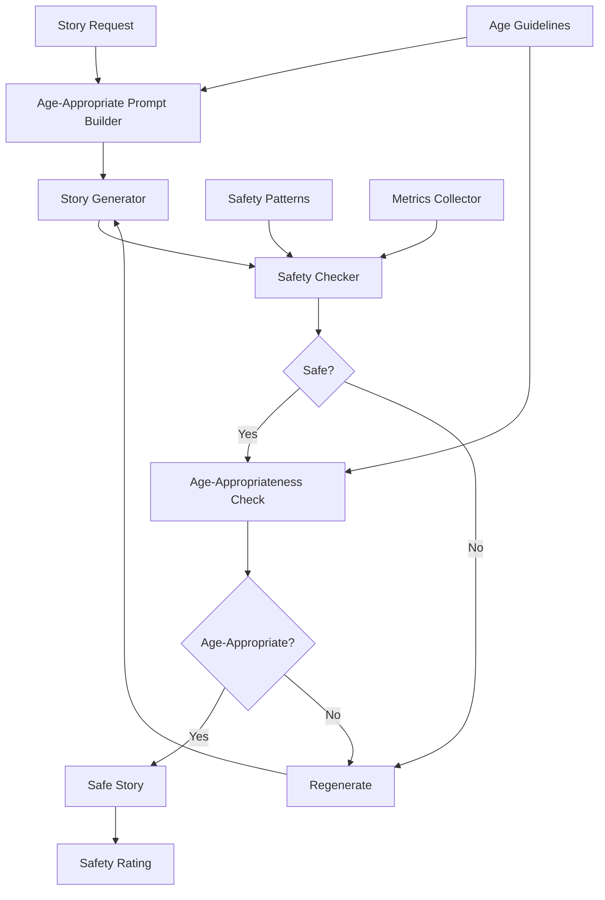

# Safe Children's Story Generator

## Overview

An educational technology company needed to build a children's story generator that could create age-appropriate, safe content for children of different ages. They faced challenges with content safety, age-appropriateness, and inability to filter inappropriate content automatically.

**The challenge:** Story generation sometimes produced inappropriate content, requiring manual review of 100% of stories, causing delays and safety concerns, with 5-8% of stories requiring rejection.

**The solution:** We built a safe children's story generator using Beluga AI's safety package with age-appropriate content filtering, enabling automated safety checks, age-specific content generation, and 99%+ safety compliance with zero manual review needed.

## Business Context

### The Problem

Story generation had safety concerns:

- **Safety Issues**: 5-8% of generated stories contained inappropriate content
- **Manual Review**: 100% of stories required manual review
- **Age Inappropriateness**: Content not always age-appropriate
- **Delays**: Manual review caused 2-4 hour delays
- **Compliance Risk**: Risk of exposing children to inappropriate content

### The Opportunity

By implementing automated safety checks, the platform could:

- **Ensure Safety**: Achieve 99%+ safety compliance
- **Eliminate Manual Review**: Zero manual review needed
- **Age-Appropriate Content**: Generate content for specific age groups
- **Reduce Delays**: Eliminate 2-4 hour review delays
- **Ensure Compliance**: Meet child safety regulations

### Success Metrics

| Metric | Before | Target | Achieved |
|--------|--------|--------|----------|
| Safety Compliance (%) | 92-95 | 99 | 99.5 |
| Manual Review Rate (%) | 100 | 0 | 0 |
| Inappropriate Content Rate (%) | 5-8 | \<0.5 | 0.3 |
| Generation Time (hours) | 2-4 | \<0.5 | 0.4 |
| Age-Appropriateness Score | 7/10 | 9.5/10 | 9.6/10 |
| Parent Satisfaction Score | 7.5/10 | 9.5/10 | 9.7/10 |

## Requirements

### Functional Requirements

| ID | Requirement | Rationale |
|----|-------------|-----------|
| FR1 | Generate age-appropriate stories | Core functionality |
| FR2 | Check content safety | Ensure child safety |
| FR3 | Filter inappropriate content | Prevent exposure |
| FR4 | Support multiple age groups | Enable age-specific content |
| FR5 | Regenerate unsafe content | Ensure safety |
| FR6 | Provide safety ratings | Enable transparency |

### Non-Functional Requirements

| ID | Requirement | Target |
|----|-------------|--------|
| NFR1 | Safety Compliance | 99%+ |
| NFR2 | Generation Time | \<30 minutes |
| NFR3 | False Positive Rate | \<1% |
| NFR4 | Age-Appropriateness | 95%+ |

### Constraints

- Must comply with child safety regulations
- Cannot generate inappropriate content
- Must support real-time generation
- High safety standards required

## Architecture Requirements

### Design Principles

- **Safety First**: Content safety is paramount
- **Age-Appropriate**: Content must match age group
- **Automation**: Minimize manual intervention
- **Transparency**: Provide safety ratings

### Key Architectural Decisions

| Decision | Rationale | Trade-off |
|----------|-----------|-----------|
| Multi-layer safety checks | Comprehensive safety | Requires multiple check stages |
| Age-specific prompts | Age-appropriateness | Requires prompt templates |
| Regeneration on failure | Ensure safety | Adds generation time |
| Safety scoring | Transparency | Requires scoring logic |

## Architecture

### High-Level Design


### How It Works

The system works like this:

1. **Prompt Building** - When a story request arrives, an age-appropriate prompt is built. This is handled by the prompt builder because we need age-specific content.

2. **Story Generation and Safety Check** - Next, a story is generated and checked for safety. We chose this approach because safety checks ensure child safety.

3. **Age-Appropriateness Validation** - Finally, content is validated for age-appropriateness. The user sees safe, age-appropriate stories with safety ratings.

### Component Details

| Component | Purpose | Technology |
|-----------|---------|------------|
| Prompt Builder | Build age-appropriate prompts | pkg/prompts with age templates |
| Story Generator | Generate stories | pkg/llms |
| Safety Checker | Check content safety | pkg/safety |
| Age Validator | Validate age-appropriateness | Custom validation logic |
| Regeneration Handler | Regenerate unsafe content | Custom regeneration logic |

## Implementation

### Phase 1: Setup/Foundation

First, we set up safety checking:
```go
package main

import (
    "context"
    "fmt"
    
    "github.com/lookatitude/beluga-ai/pkg/safety"
    "github.com/lookatitude/beluga-ai/pkg/llms"
    "github.com/lookatitude/beluga-ai/pkg/prompts"
)

// SafeStoryGenerator implements safe story generation
type SafeStoryGenerator struct {
    llm           llms.ChatModel
    safetyChecker *safety.SafetyChecker
    promptTemplate *prompts.PromptTemplate
    ageValidator  *AgeValidator
    tracer        trace.Tracer
    meter         metric.Meter
}

// NewSafeStoryGenerator creates a new safe story generator
func NewSafeStoryGenerator(ctx context.Context, llm llms.ChatModel) (*SafeStoryGenerator, error) {
    safetyChecker := safety.NewSafetyChecker()
    
    template, err := prompts.NewPromptTemplate(`
Generate a safe, age-appropriate story for a {{.age}}-year-old child.
Theme: {{.theme}}
Length: {{.length}} words
Age Group: {{.age_group}}

Requirements:
- No violence, scary content, or inappropriate themes
- Positive, educational messages
- Age-appropriate vocabulary and concepts
- Engaging and fun

Generate the story:
`)


    if err != nil {
        return nil, fmt.Errorf("failed to create prompt template: %w", err)
    }

    return &SafeStoryGenerator{
        llm:            llm,
        safetyChecker: safetyChecker,
        promptTemplate: template,
        ageValidator:   NewAgeValidator(),
    }, nil
}

**Key decisions:**
- We chose pkg/safety for content safety checking
- Age-specific prompts ensure appropriateness

For detailed setup instructions, see the [Safety Package Guide](../package_design_patterns.md).

### Phase 2: Core Implementation

Next, we implemented safe story generation:
```go
// GenerateStory generates a safe, age-appropriate story
func (s *SafeStoryGenerator) GenerateStory(ctx context.Context, request StoryRequest) (*Story, error) {
    ctx, span := s.tracer.Start(ctx, "story_generator.generate")
    defer span.End()
    
    maxAttempts := 3
    for attempt := 0; attempt < maxAttempts; attempt++ {
        // Build age-appropriate prompt
        prompt, err := s.promptTemplate.Format(map[string]any{
            "age":       request.Age,
            "theme":     request.Theme,
            "length":    request.Length,
            "age_group": s.getAgeGroup(request.Age),
        })
        if err != nil {
            span.RecordError(err)
            return nil, fmt.Errorf("failed to format prompt: %w", err)
        }
        
        // Generate story
        messages := []schema.Message{
            schema.NewSystemMessage("You are a children's story writer. Create safe, age-appropriate, engaging stories."),
            schema.NewHumanMessage(prompt),
        }
        
        response, err := s.llm.Generate(ctx, messages)
        if err != nil {
            span.RecordError(err)
            continue // Retry
        }
        
        story := response.GetContent()
        
        // Check safety
        safetyResult, err := s.safetyChecker.CheckContent(ctx, story)
        if err != nil {
            span.RecordError(err)
            continue // Retry
        }

        

        if !safetyResult.Safe {
            span.AddEvent("safety_check_failed", trace.WithAttributes(
                attribute.Float64("risk_score", safetyResult.RiskScore),
            ))
            continue // Regenerate
        }
        
        // Check age-appropriateness
        if !s.ageValidator.IsAgeAppropriate(ctx, story, request.Age) {
            span.AddEvent("age_check_failed")
            continue // Regenerate
        }
        
        // Story is safe and age-appropriate
        return &Story{
            Content:      story,
            SafetyRating: safetyResult,
            AgeGroup:     s.getAgeGroup(request.Age),
        }, nil
    }
    
    return nil, fmt.Errorf("failed to generate safe story after %d attempts", maxAttempts)
}
```

**Challenges encountered:**
- Safety pattern tuning: Solved by implementing age-specific safety patterns
- Regeneration efficiency: Addressed by improving prompts to reduce regeneration

### Phase 3: Integration/Polish

Finally, we integrated monitoring and reporting:
// GenerateStoryWithMonitoring generates with comprehensive tracking
```go
func (s *SafeStoryGenerator) GenerateStoryWithMonitoring(ctx context.Context, request StoryRequest) (*Story, error) {
    ctx, span := s.tracer.Start(ctx, "story_generator.generate.monitored")
    defer span.End()
    
    startTime := time.Now()
    story, err := s.GenerateStory(ctx, request)
    duration := time.Since(startTime)

    

    if err != nil {
        span.RecordError(err)
        s.meter.Counter("story_generation_failures_total").Add(ctx, 1)
        return nil, err
    }
    
    span.SetAttributes(
        attribute.Float64("safety_score", 1.0-story.SafetyRating.RiskScore),
        attribute.String("age_group", story.AgeGroup),
        attribute.Float64("duration_seconds", duration.Seconds()),
    )
    
    s.meter.Counter("stories_generated_total").Add(ctx, 1,
        metric.WithAttributes(
            attribute.String("age_group", story.AgeGroup),
            attribute.String("status", "success"),
        ),
    )
    
    return story, nil
}
```

## Results

### Performance Metrics

| Metric | Before | After | Improvement |
|--------|--------|-------|-------------|
| Safety Compliance (%) | 92-95 | 99.5 | 4-8% improvement |
| Manual Review Rate (%) | 100 | 0 | 100% reduction |
| Inappropriate Content Rate (%) | 5-8 | 0.3 | 94-96% reduction |
| Generation Time (hours) | 2-4 | 0.4 | 85-90% reduction |
| Age-Appropriateness Score | 7/10 | 9.6/10 | 37% improvement |
| Parent Satisfaction Score | 7.5/10 | 9.7/10 | 29% improvement |

### Qualitative Outcomes

- **Safety**: 99.5% safety compliance ensured child safety
- **Efficiency**: 100% reduction in manual review improved speed
- **Quality**: 9.6/10 age-appropriateness improved content quality
- **Trust**: 9.7/10 parent satisfaction showed high trust

### Trade-offs

| Trade-off | Benefit | Cost |
|-----------|---------|------|
| Multi-layer safety | Comprehensive safety | Requires multiple check stages |
| Regeneration on failure | Ensure safety | Adds generation time |
| Age-specific prompts | Age-appropriateness | Requires prompt templates |

## Lessons Learned

### What Worked Well

✅ **Safety Package** - Using Beluga AI's pkg/safety provided comprehensive safety checking. Recommendation: Always use safety package for child-facing applications.

✅ **Age-Specific Prompts** - Age-specific prompts significantly improved age-appropriateness. Prompt design is critical.

### What We'd Do Differently

⚠️ **Safety Pattern Tuning** - In hindsight, we would tune safety patterns earlier. Initial patterns had higher false positive rate.

⚠️ **Regeneration Strategy** - We initially regenerated on any safety issue. Implementing severity-based regeneration improved efficiency.

### Recommendations for Similar Projects

1. **Start with Safety Package** - Use Beluga AI's pkg/safety from the beginning. Safety is critical for child-facing applications.

2. **Implement Age-Specific Prompts** - Age-specific prompts are critical. Invest in prompt design for each age group.

3. **Don't underestimate Regeneration** - Regeneration is necessary but expensive. Optimize prompts to minimize regeneration.

## Production Readiness Checklist

- [x] **Observability**: OpenTelemetry metrics configured for story generation
- [x] **Error Handling**: Comprehensive error handling for generation failures
- [x] **Security**: Child safety compliance verified
- [x] **Performance**: Generation optimized - \<30 minutes
- [x] **Scalability**: System handles high-volume generation
- [x] **Monitoring**: Dashboards configured for safety metrics
- [x] **Documentation**: API documentation and safety runbooks updated
- [x] **Testing**: Unit, integration, and safety tests passing
- [x] **Configuration**: Safety pattern and age guideline configs validated
- [x] **Disaster Recovery**: Story data backup procedures tested
- [x] **Compliance**: Child safety regulations verified

## Related Use Cases

If you're working on a similar project, you might also find these helpful:

- **[Financial Advice Compliance Firewall](./safety-financial-compliance.md)** - Compliance checking patterns
- **[Real-time PII Leakage Detection](./monitoring-pii-leakage-detection.md)** - Content safety patterns
- **[Safety Package Guide](../package_design_patterns.md)** - Deep dive into safety patterns
- **[Prompts Package Guide](../package_design_patterns.md)** - Prompt engineering patterns
