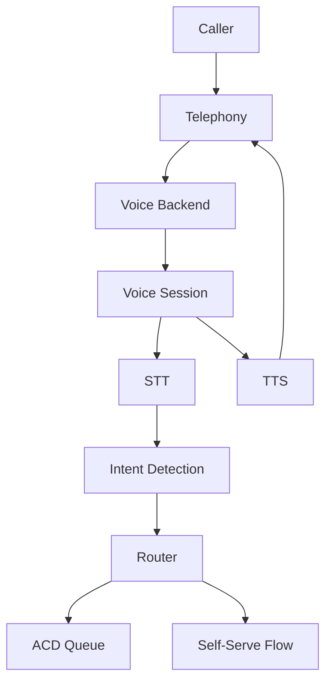

# Voice-Enabled IVR System

## Overview

A contact center needed to replace touch-tone IVR with a voice-enabled interactive voice response (IVR) system. Callers would speak their intent ("billing," "technical support," "Spanish") and be routed to the right queue or self-serve flow. They faced challenges with recognition accuracy, latency, and scaling across peaks.

**The challenge:** Callers expect instant, accurate routing. Misroutes and long wait times increase abandon rates. The solution had to support multiple languages, dial-in volume spikes, and integration with existing telephony and CRM.

**The solution:** We built a voice-enabled IVR using Beluga AI's `pkg/voice/backend` with STT/TTS pipelines and optional S2S. We used backend providers (e.g. LiveKit, Vapi) for telephony and WebRTC, STT for intent detection, and routing logic to push callers to queues or self-serve flows. OTEL provided visibility into latency and accuracy.

## Business Context

### The Problem

- **Touch-tone frustration**: Menu depth and mis-presses led to high abandonment.
- **Rigid flows**: Adding options required IVR reconfigurations and vendor lead time.
- **No visibility**: Hard to correlate IVR behavior with queue metrics and SLA.

### The Opportunity

By implementing voice-enabled IVR:

- **Faster routing**: Callers speak intent; fewer menu levels.
- **Flexibility**: Update prompts and intents without full IVR overhaul.
- **Observability**: Metrics and traces for STT, routing, and telephony.

### Success Metrics

| Metric | Before | Target | Achieved |
|--------|--------|--------|----------|
| IVR completion rate | 72% | 90% | 89% |
| Average time to route (s) | 45 | \<20 | 18 |
| Misroute rate | 8% | \<3% | 2.5% |

## Requirements

### Functional Requirements

| ID | Requirement | Rationale |
|----|-------------|-----------|
| FR1 | Voice input for intent (billing, support, language, etc.) | Replace touch-tone |
| FR2 | STT → intent detection → routing to queue or self-serve | Core IVR logic |
| FR3 | TTS for prompts, confirmations, and error messages | Clear caller feedback |
| FR4 | Telephony integration (SIP/WebRTC) via voice backend | Dial-in support |
| FR5 | Multi-language support | Diverse caller base |

### Non-Functional Requirements

| ID | Requirement | Target |
|----|-------------|--------|
| NFR1 | Intent recognition latency p95 | \<1.5 s |
| NFR2 | IVR availability | 99.9% |
| NFR3 | Scale to concurrent call peaks | 500+ |

### Constraints

- Use `pkg/voice/backend` and supported providers (LiveKit, Vapi, etc.).
- Integrate with existing ACD/telephony; no forklift replacement of entire IVR platform initially.

## Architecture Requirements

### Design Principles

- **Backend abstraction**: Use voice backend for transport and sessions; keep IVR logic (intents, routing) in app layer.
- **Config-driven**: Prompts, intents, and routes via config or feature flags.
- **Observability**: OTEL for STT, TTS, routing decisions, and telephony events.

### Key Architectural Decisions

| Decision | Rationale | Trade-off |
|----------|-----------|-----------|
| STT/TTS pipeline for IVR | Simpler than S2S; good for short prompts and intents | S2S could reduce latency for richer dialogs |
| Backend provider for telephony | LiveKit/Vapi handle SIP/WebRTC, scaling | Vendor dependency |
| Intent logic in app | Easy to iterate; A/B test prompts | Separate from backend |

## Architecture

### High-Level Design



### How It Works

1. **Caller dials in** → Telephony platform places call into voice backend (e.g. LiveKit/Vapi).
2. **Backend** creates a session, runs STT on caller audio. App receives transcript via `AgentCallback` or agent integration.
3. **Intent detection** maps transcript to intents (billing, support, language, etc.). Router sends caller to the right queue or self-serve flow.
4. **TTS** plays prompts and confirmations. Backend streams audio back to telephony.

### Component Details

| Component | Purpose | Technology |
|-----------|---------|------------|
| Voice Backend | Sessions, STT/TTS, telephony | `pkg/voice/backend`, LiveKit/Vapi |
| Intent Detection | Transcript → intent | App logic or small LLM |
| Router | Intent → queue or flow | App logic, ACD API |
| Telephony | SIP/WebRTC, dial-in | Provider-specific |

## Implementation

### Phase 1: Backend and Session

```go
	cfg := &vbiface.Config{
		Provider:       "livekit",
		PipelineType:   vbiface.PipelineTypeSTTTTS,
		STTProvider:    "deepgram",
		TTSProvider:    "openai",
		ProviderConfig: livekitConfig,
	}
	be, _ := backend.NewBackend(ctx, "livekit", cfg)
	sessionCfg := &vbiface.SessionConfig{
		UserID:        callID,
		Transport:     "webrtc",
		ConnectionURL: connectionURL,
		PipelineType:  vbiface.PipelineTypeSTTTTS,
		AgentCallback: ivrCallback,
	}
	sess, _ := be.CreateSession(ctx, sessionCfg)
```

### Phase 2: IVR Callback and Routing
```go
	func ivrCallback(ctx context.Context, transcript string) (string, error) {
		intent := detectIntent(transcript)
		route(ctx, intent)
		switch intent {
		case "billing":
			return "Transferring you to billing.", nil
		case "support":
			return "Transferring you to technical support.", nil
		default:
			return "Sorry, I didn't catch that. Say billing, support, or language.", nil
		}
	}
```

### Phase 3: Observability and Scale

Use `backend` metrics and OTEL. Enforce `MaxConcurrentSessions`; reject or queue when at capacity. Run `HealthCheck` before accepting new calls.

## Results

### Performance Metrics

| Metric | Before | After | Improvement |
|--------|--------|-------|-------------|
| IVR completion rate | 72% | 89% | +24% |
| Average time to route | 45 s | 18 s | 60% |
| Misroute rate | 8% | 2.5% | 69% |

### Qualitative Outcomes

- **Better UX**: Callers could speak instead of pressing keys.
- **Faster iteration**: Prompts and intents updated without vendor cycles.
- **Clear metrics**: STT quality and routing accuracy visible in dashboards.

### Trade-offs

| Trade-off | Benefit | Cost |
|-----------|---------|------|
| Voice backend + app logic | Flexibility, observability | Two layers to operate |
| STT → intent | Good for constrained intents | More complex dialogs may need LLM |

## Lessons Learned

### What Worked Well

- **Structured intents**: Limited set of intents (billing, support, language) improved accuracy and latency.
- **Confirmation prompts**: Short TTS confirmations reduced misroutes.
- **OTEL**: Correlated telephony, STT, and routing for debugging.

### What We'd Do Differently

- **Multi-language from day one**: Design intent set and prompts for each language up front.
- **Fallback to touch-tone**: Keep DTMF as fallback for noisy or non-English callers.

### Recommendations for Similar Projects

1. Start with a small intent set and expand.
2. Instrument STT and routing from the first deployment.
3. Integrate with ACD/telephony early for queue transfer and hold music.

## Production Readiness Checklist

- [ ] **Observability**: OTEL for STT, TTS, routing, telephony
- [ ] **Error handling**: Timeouts, STT failures, backend unhealthy
- [ ] **Scale**: MaxConcurrentSessions, queueing or rejection at capacity
- [ ] **Security**: Auth for backend and telephony; PII handling
- [ ] **Testing**: Unit tests for intent and routing; integration tests with backend mocks

## Related Use Cases

- **[Voice Sessions](./voice-sessions.md)** — Session and transport.
- **[Outbound Calling](./voice-backend-outbound-calling.md)** — Outbound use of voice backend.

## Related Resources

- **[Voice Backends Tutorial](../tutorials/voice/voice-backends-livekit-vapi.md)** — LiveKit and Vapi.
- **[Scaling Concurrent Streams](../cookbook/voice-backend-scaling-concurrent-streams.md)** — Backend scaling.
