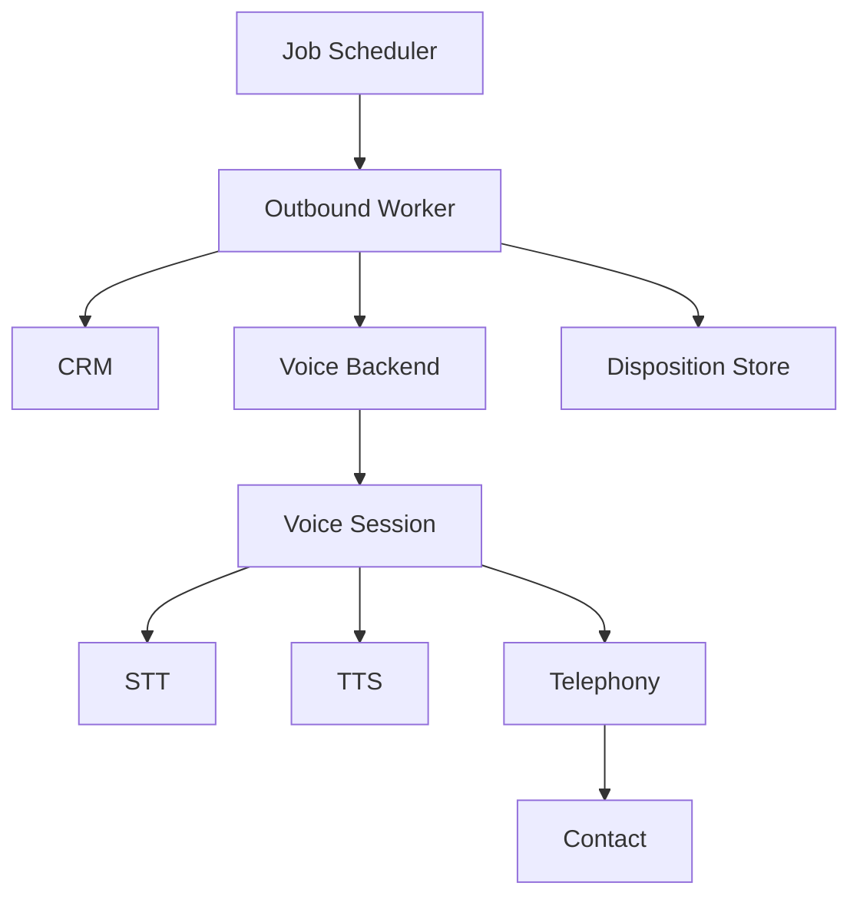

# Automated Outbound Calling with Voice Backend

## Overview

A sales-operations team needed to automate outbound calls for appointment reminders, consent verification, and simple surveys. Calls had to support STT/TTS or S2S, scale to thousands of daily outbound attempts, and integrate with CRM and telephony.

**The challenge:** Outbound systems must dial reliably, handle no-answer and busy, play prompts or conduct short conversations, and record outcomes. Low latency and clear audio were critical for consent and survey flows.

**The solution:** We implemented automated outbound calling using Beluga AI's `pkg/voice/backend` with STT/TTS or S2S pipelines. A job scheduler triggered outbound sessions per contact; the backend managed transport and audio. We used `CreateSession` with `SessionConfig`, `AgentCallback` or `AgentInstance` for logic, and provider-specific telephony hooks for dial-out and disposition.

## Business Context

### The Problem

- **Manual calls**: Reps spent time on reminders and simple verification; low throughput.
- **Inconsistent messaging**: Scripts varied by rep; compliance risk.
- **No audit trail**: Hard to prove consent or survey answers.

### The Opportunity

By automating outbound with a voice backend:

- **Scale**: Thousands of outbound attempts per day without proportional headcount.
- **Consistency**: Same prompts and logic for reminders, consent, and surveys.
- **Auditability**: Logs and optionally recordings for compliance.

### Success Metrics

| Metric | Before | Target | Achieved |
|--------|--------|--------|----------|
| Outbound calls per day | 200 | 2000 | 2100 |
| Connection rate | 65% | 75% | 76% |
| Completion rate (reminders) | 58% | 80% | 82% |

## Requirements

### Functional Requirements

| ID | Requirement | Rationale |
|----|-------------|-----------|
| FR1 | Initiate outbound call via telephony provider | Dial contact |
| FR2 | Play prompts (TTS) and optionally collect speech (STT) or use S2S | Reminders, consent, surveys |
| FR3 | Handle no-answer, busy, and failure | Disposition and retry logic |
| FR4 | Log outcomes and optionally record | Compliance and analytics |
| FR5 | Integrate with CRM (contact list, outcome write-back) | Operational workflow |

### Non-Functional Requirements

| ID | Requirement | Target |
|----|-------------|--------|
| NFR1 | Call setup latency | \<5 s |
| NFR2 | Concurrent outbound sessions | 100+ |
| NFR3 | Availability | 99.5% |

### Constraints

- Use `pkg/voice/backend` and supported providers.
- Telephony and dial-out semantics are provider-specific (e.g. LiveKit, Vapi, Twilio); use provider docs and hooks.

## Architecture Requirements

### Design Principles

- **Backend for sessions**: Voice backend owns real-time audio and transport; app owns contact list, scheduling, and disposition.
- **Idempotent outcomes**: Write outcome once per attempt; support retries.
- **Observability**: OTEL for session creation, STT/TTS/S2S, and telephony events.

### Key Architectural Decisions

| Decision | Rationale | Trade-off |
|----------|-----------|-----------|
| STT/TTS for short flows | Sufficient for reminders and yes/no consent | S2S could improve for longer dialogs |
| Job scheduler + backend | Clear separation; scale workers independently | Two systems to operate |
| Provider telephony hooks | Use vendor dial-out and events | Vendor lock-in for telephony |

## Architecture

### High-Level Design



### How It Works

1. **Scheduler** emits outbound jobs (e.g. reminder for contact X at time T). **Worker** loads contact, checks CRM, and initiates dial via provider.
2. **Backend** creates a session with `SessionConfig` (connection URL from provider for outbound). Session runs STT/TTS or S2S.
3. **AgentCallback** or **AgentInstance** implements reminder/consent/survey logic; prompts played via TTS, responses via STT or S2S.
4. On hang-up or timeout, worker writes **disposition** (completed, no-answer, busy, failed) to store and optionally CRM.

### Component Details

| Component | Purpose | Technology |
|-----------|---------|------------|
| Voice Backend | Sessions, STT/TTS/S2S, transport | `pkg/voice/backend` |
| Worker | Job consumption, CRM, disposition | App-specific |
| Telephony | Dial-out, signaling | Provider (LiveKit, Vapi, Twilio, etc.) |
| Disposition Store | Outcomes, retries | DB or CRM |

## Implementation

### Phase 1: Backend and Outbound Session

```go
	cfg := &vbiface.Config{
		Provider:             "vapi",
		PipelineType:         vbiface.PipelineTypeSTTTTS,
		STTProvider:          "deepgram",
		TTSProvider:          "openai",
		MaxConcurrentSessions: 100,
		ProviderConfig:       vapiConfig,
	}
	be, _ := backend.NewBackend(ctx, "vapi", cfg)
	sessionCfg := &vbiface.SessionConfig{
		UserID:        contactID,
		Transport:     "webrtc",
		ConnectionURL: outboundConnectionURL,
		PipelineType:  vbiface.PipelineTypeSTTTTS,
		AgentCallback: outboundCallback,
	}
	sess, err := be.CreateSession(ctx, sessionCfg)
```

### Phase 2: Outbound Callback
```go
	func outboundCallback(ctx context.Context, transcript string) (string, error) {
		// Reminder: play once, confirm, hang up.
		// Consent: play script, collect yes/no, record outcome.
		// Survey: play question, collect answer, next or end.
		return nextPrompt(transcript), nil
	}
```

### Phase 3: Disposition and Retries

On session end (or timeout), worker records disposition. Use retry policy for no-answer/busy (e.g. retry twice with backoff).

## Results

### Performance Metrics

| Metric | Before | After | Improvement |
|--------|--------|-------|-------------|
| Outbound calls/day | 200 | 2100 | 950% |
| Connection rate | 65% | 76% | +17% |
| Completion rate (reminders) | 58% | 82% | +41% |

### Qualitative Outcomes

- **Higher throughput**: Automation replaced most manual reminder and consent calls.
- **Consistent messaging**: Same prompts and logic across attempts.
- **Audit trail**: Logs and optional recordings for compliance.

### Trade-offs

| Trade-off | Benefit | Cost |
|-----------|---------|------|
| Provider telephony | Fast dial-out, global reach | Vendor dependency |
| Async workers | Scale and retry | Eventually consistent disposition |

## Lessons Learned

### What Worked Well

- **Short, scripted flows**: Reminders and consent worked better with narrow prompts and clear yes/no.
- **Disposition ASAP**: Writing outcome as soon as call ended simplified retries and reporting.
- **OTEL**: Correlated scheduler, worker, and backend for debugging.

### What We'd Do Differently

- **Predictive dialing**: Add pacing logic to respect agent capacity when blending inbound/outbound.
- **Multi-language**: Design prompts and STT for multiple languages from the start.

### Recommendations for Similar Projects

1. Start with one flow (e.g. reminders); add consent and surveys once stable.
2. Integrate disposition with CRM early for reporting and retries.
3. Use provider docs and hooks for dial-out, ring timeout, and hang-up.

## Production Readiness Checklist

- [ ] **Observability**: OTEL for backend, worker, telephony
- [ ] **Error handling**: Timeouts, no-answer, busy, provider errors
- [ ] **Scale**: MaxConcurrentSessions, worker scaling
- [ ] **Compliance**: Consent logging, recording retention, DNC
- [ ] **Testing**: Unit tests for callback logic; integration tests with mocks

## Related Use Cases

- **[Voice-Enabled IVR](./voice-backend-ivr.md)** — Inbound voice routing.
- **[Voice Sessions](./voice-sessions.md)** — Session architecture.

## Related Resources

- **[Voice Backends Tutorial](../tutorials/voice/voice-backends-livekit-vapi.md)** — LiveKit and Vapi.
- **[Scaling Concurrent Streams](../cookbook/voice-backend-scaling-concurrent-streams.md)** — Backend scaling.
