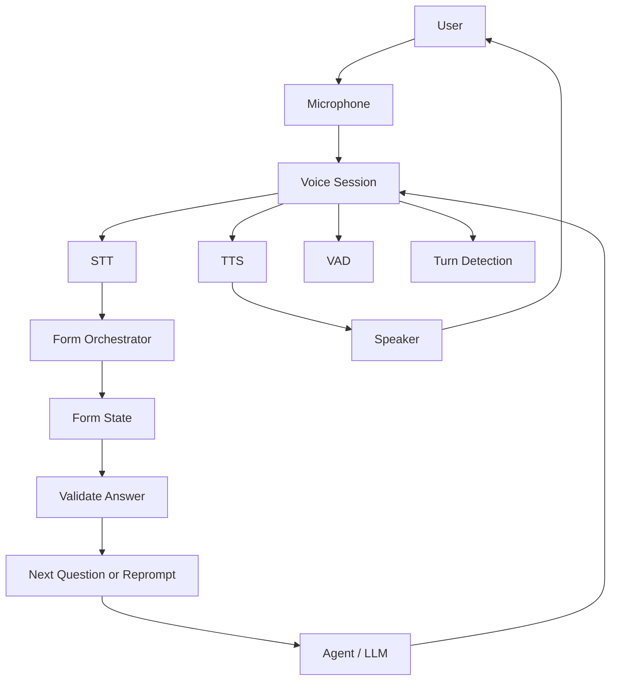

# Multi-Turn Voice Forms

## Overview

A healthcare provider needed to collect structured intake data (e.g. symptoms, medications, appointment preferences) over the phone using a voice agent. Forms required multiple turns: the agent asks one question at a time, waits for the user's answer, validates it, then proceeds or reprompts. They faced challenges with turn-taking, context preservation, and partial answers across utterances.

**The challenge:** Users give fragmented answers ("Um, maybe Tuesday... or Wednesday afternoon"), change their mind mid-flow, or go off-topic. The system had to maintain form state across turns, support clarification questions, and persist progress for later resumption.

**The solution:** We implemented multi-turn voice forms using Beluga AI's `pkg/voice/session` with STT, TTS, VAD, and turn detection. Form state (current question, collected fields, validation errors) lived in session context; each turn advanced or reprompted based on user input. We used `OnStateChanged`, `ProcessAudio`, and `Say`/`SayWithOptions` to drive the flow.

## Business Context

### The Problem

- **Fragmented answers**: Single-question flows failed when users spread answers across several utterances.
- **Lost context**: Early implementations dropped form state on reprompts or timeouts.
- **Rigid flow**: No support for "go back" or "skip" without breaking the form.

### The Opportunity

By implementing multi-turn voice forms:

- **Higher completion rates**: Users could correct or expand answers across turns.
- **Better UX**: Natural, turn-by-turn conversation instead of long monologues.
- **Resumable flows**: Session and form state could be persisted for later continuation.

### Success Metrics

| Metric | Before | Target | Achieved |
|--------|--------|--------|----------|
| Form completion rate | 62% | 85% | 88% |
| Average turns per form | 8 | 12 | 11 |
| User correction rate (reprompts) | N/A | \<15% | 12% |

## Requirements

### Functional Requirements

| ID | Requirement | Rationale |
|----|-------------|-----------|
| FR1 | One question per turn; wait for answer before next | Clear turn-taking |
| FR2 | Validate each answer; reprompt or confirm | Data quality |
| FR3 | Persist form state (current step, fields) across turns | Multi-turn and resumption |
| FR4 | Support "go back", "skip", "repeat" where applicable | User control |

### Non-Functional Requirements

| ID | Requirement | Target |
|----|-------------|--------|
| NFR1 | Turn latency (user stops → agent speaks) | \<500 ms |
| NFR2 | Form state survive session reconnect | Yes |

### Constraints

- Use `pkg/voice/session`; no custom voice stack.
- Form logic (questions, validation) implemented above the session layer.

## Architecture Requirements

### Design Principles

- **Session owns audio pipeline**: STT, TTS, VAD, turn detection via session options.
- **Form state in app layer**: Track current question, collected fields, validation; pass to agent or callback.
- **Turn-driven flow**: Each finalized user turn triggers validation → next question or reprompt.

### Key Architectural Decisions

| Decision | Rationale | Trade-off |
|----------|-----------|-----------|
| Session + form orchestrator | Session handles audio; orchestrator handles form logic | Clear separation; two components to wire |
| Turn detection for form steps | Avoid partial answers as "complete" | May need tuning per form length |

## Architecture

### High-Level Design



### How It Works

1. **Session** captures audio, runs STT, VAD, turn detection. On turn end, it passes the final transcript to the form orchestrator.
2. **Orchestrator** updates form state (current question, saved answers), validates the latest answer, and decides: next question, reprompt, or form complete.
3. **Agent/LLM** (optional) generates the exact prompt or clarification; orchestrator calls `Say`/`SayWithOptions` with the next question or confirmation.
4. **Form state** is persisted (e.g. store by `GetSessionID()`) so the form can resume after reconnect.

### Component Details

| Component | Purpose | Technology |
|-----------|---------|------------|
| Voice Session | Audio, STT, TTS, VAD, turn detection | `pkg/voice/session` |
| Form Orchestrator | Questions, validation, state | App-specific |
| Form State | Current step, collected fields | App-specific, keyed by session ID |

## Implementation

### Phase 1: Session and Form Orchestrator

```go
	sess, err := session.NewVoiceSession(ctx,
		session.WithSTTProvider(sttProv),
		session.WithTTSProvider(ttsProv),
		session.WithVADProvider(vadProv),
		session.WithTurnDetector(turnDetector),
		session.WithConfig(session.DefaultConfig()),
	)
	// Form orchestrator consumes finalized transcripts, updates state, calls sess.Say(...)
```

### Phase 2: Turn-Driven Flow

On each finalized user turn (from session pipeline):
```go
	func onFinalTranscript(transcript string) {
		formState.SetAnswer(currentQuestion, transcript)
		if !formState.Validate(currentQuestion) {
			sess.Say(ctx, "Could you repeat that?")
			return
		}
		formState.Advance()
		if formState.Done() {
			sess.Say(ctx, "Thanks, we have everything we need.")
			return
		}
		next := formState.CurrentQuestion()
		sess.SayWithOptions(ctx, next, session.SayOptions{AllowInterruptions: true})
	}
```

### Phase 3: Persistence and Resumption

Store form state keyed by `sess.GetSessionID()`. On reconnect, restore state and resume from `CurrentQuestion()`.

## Results

### Performance Metrics

| Metric | Before | After | Improvement |
|--------|--------|-------|-------------|
| Form completion rate | 62% | 88% | +42% |
| User correction rate | N/A | 12% | Under 15% target |

### Qualitative Outcomes

- **Natural flow**: Users could answer in multiple turns and correct themselves.
- **Resumable**: Dropped calls could resume without restarting the form.

### Trade-offs

| Trade-off | Benefit | Cost |
|-----------|---------|------|
| One question per turn | Clear structure | Longer forms need more turns |
| Persist by session ID | Resumable | Must manage session–form lifecycle |

## Lessons Learned

### What Worked Well

- **Turn detection** — Avoided treating partial utterances as final answers.
- **AllowInterruptions** — Users could interrupt reprompts and rephrase.
- **Form state separate from session** — Easy to test and persist.

### What We'd Do Differently

- **Explicit "repeat" / "go back"** — Add intents early for navigation.
- **Confirmation turns** — Optional "Did you say X?" for critical fields.

### Recommendations for Similar Projects

1. Start with a short form (3–5 questions) to validate turn-taking and state.
2. Persist form state by session ID from day one.
3. Use `SayWithOptions` with `AllowInterruptions: true` for better UX.

## Production Readiness Checklist

- [ ] **Observability**: OTEL for session and form metrics
- [ ] **Error Handling**: Timeouts, validation failures, session drop
- [ ] **Persistence**: Form state store and replay
- [ ] **Testing**: Unit tests for orchestrator; integration tests with session mocks
- [ ] **Security**: PII in form state encrypted at rest

## Related Use Cases

- **[Voice Sessions](./voice-sessions.md)** — Session and transport.
- **[Conversational AI Assistant](./05-conversational-ai-assistant.md)** — Broader conversational patterns.

## Related Resources

- **[Voice Session Interruptions](../tutorials/voice/voice-session-interruptions.md)** — Interruption handling.
- **[Preemptive Generation](../tutorials/voice/voice-session-preemptive-generation.md)** — Interim transcripts and latency.
