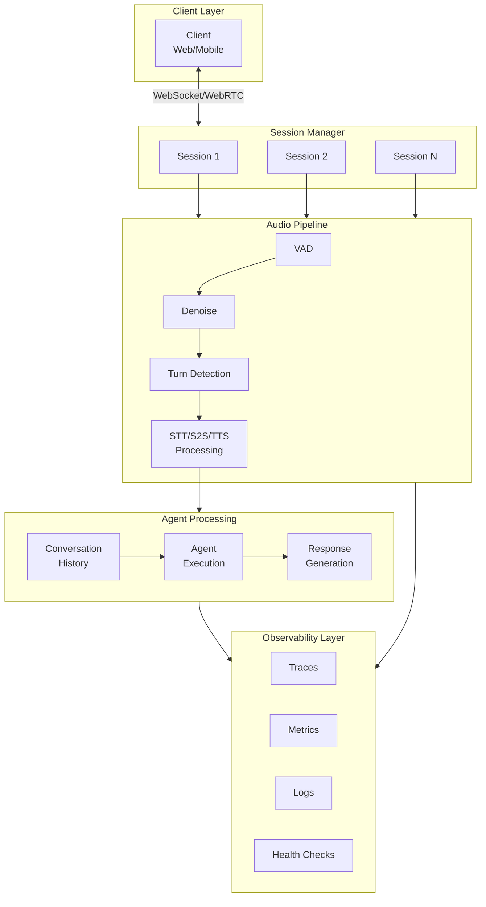

# Voice Sessions: Real-Time Audio Transport and Session Management

> **A practical guide to building production-ready voice agents with real-time audio transport and robust session management.**

## Overview

Imagine you're building a voice assistant that handles real-time phone calls or in-app voice interactions. Users expect natural, responsive conversations where latency is imperceptible and connections stay stable even on flaky networks. This use case walks you through implementing exactly that—a production voice session system that handles the complexity of real-time audio while providing a seamless user experience.

We'll build a system that:
- Transports audio in real-time via WebSocket or WebRTC
- Manages session state across reconnections
- Handles concurrent conversations efficiently
- Provides comprehensive observability for debugging and optimization

## Business Context

### The Problem

Voice agents have unique challenges compared to text-based AI:

1. **Latency sensitivity**: Users notice delays > 200ms; > 500ms feels broken
2. **Connection reliability**: Mobile networks drop, WiFi switches—sessions must survive
3. **Resource management**: Each voice session consumes significant resources
4. **State complexity**: Conversation context, audio buffers, and connection state must all be synchronized

### Why This Matters

A well-implemented voice session system delivers:

- **User satisfaction**: Responsive, natural conversations
- **Operational efficiency**: Automatic recovery from failures
- **Cost control**: Efficient resource usage and cleanup
- **Debugging capability**: Clear visibility into what's happening

## Requirements

### Functional Requirements

| Requirement | Description |
|-------------|-------------|
| **Real-time audio transport** | < 100ms end-to-end latency for audio delivery |
| **Session management** | Track active sessions with unique identifiers |
| **Reconnection handling** | Automatic reconnection with state preservation |
| **Concurrent sessions** | Support 100+ concurrent voice sessions per instance |
| **Graceful degradation** | Fallback to lower quality on poor connections |

### Non-Functional Requirements

| Requirement | Target |
|-------------|--------|
| **Availability** | 99.9% uptime for voice service |
| **Latency** | p95 < 150ms for audio round-trip |
| **Recovery time** | < 2s reconnection with state preservation |
| **Resource efficiency** | < 50MB memory per session |

## Architecture

### System Overview



### How It Works

1. **Client connects** via WebSocket or WebRTC with a session token
2. **Session Manager** creates or resumes a session, allocating resources
3. **Audio Pipeline** processes incoming audio (VAD → denoise → turn detection)
4. **Voice Provider** transcribes audio (STT) or processes end-to-end (S2S)
5. **Agent** processes the transcript and generates a response
6. **Response** is converted to audio (TTS) and streamed back to client
7. **Telemetry** is collected at every stage for monitoring and debugging

## Implementation

### Step 1: Define the Session Types

```go
package voicesession

import (
    "context"
    "sync"
    "time"

    "github.com/lookatitude/beluga-ai/pkg/voice/stt"
    "github.com/lookatitude/beluga-ai/pkg/voice/tts"
    "github.com/lookatitude/beluga-ai/pkg/voice/s2s"
    "github.com/lookatitude/beluga-ai/pkg/agents"
    "go.opentelemetry.io/otel"
    "go.opentelemetry.io/otel/attribute"
    "go.opentelemetry.io/otel/trace"
)

// SessionID is a unique identifier for a voice session.
type SessionID string

// SessionState represents the current state of a voice session.
type SessionState string

const (
    StateConnecting   SessionState = "connecting"
    StateConnected    SessionState = "connected"
    StateListening    SessionState = "listening"
    StateProcessing   SessionState = "processing"
    StateResponding   SessionState = "responding"
    StateReconnecting SessionState = "reconnecting"
    StateDisconnected SessionState = "disconnected"
    StateError        SessionState = "error"
)

// SessionConfig configures a voice session.
type SessionConfig struct {
    // Session identification
    SessionID    SessionID
    UserID       string
    
    // Transport configuration
    Transport    TransportType // "websocket" or "webrtc"
    
    // Voice mode
    Mode         VoiceMode // "stt_tts" or "s2s"
    
    // Timeouts
    IdleTimeout       time.Duration
    MaxDuration       time.Duration
    ReconnectTimeout  time.Duration
    
    // Reconnection
    MaxReconnectAttempts int
    ReconnectDelay       time.Duration
    
    // History
    EnableHistory     bool
    MaxHistoryTurns   int
}

type TransportType string

const (
    TransportWebSocket TransportType = "websocket"
    TransportWebRTC    TransportType = "webrtc"
)

type VoiceMode string

const (
    ModeSTTTTS VoiceMode = "stt_tts"
    ModeS2S    VoiceMode = "s2s"
)

// VoiceSession represents an active voice conversation.
type VoiceSession struct {
    config   SessionConfig
    state    SessionState
    stateMu  sync.RWMutex
    
    // Transport
    transport Transport
    
    // Voice processing
    sttProvider stt.Provider
    ttsProvider tts.Provider
    s2sProvider s2s.Provider
    pipeline    *AudioPipeline
    
    // Agent
    agent  agents.Agent
    
    // Conversation
    history []ConversationTurn
    
    // Events
    eventChan chan SessionEvent
    
    // Lifecycle
    ctx        context.Context
    cancel     context.CancelFunc
    startTime  time.Time
    lastActive time.Time
    
    // Metrics
    metrics *SessionMetrics
    tracer  trace.Tracer
}

// ConversationTurn represents one exchange in the conversation.
type ConversationTurn struct {
    TurnID      string
    UserAudio   []byte
    UserText    string
    AgentText   string
    AgentAudio  []byte
    StartTime   time.Time
    EndTime     time.Time
    Latency     time.Duration
}
```

### Step 2: Implement the Session Manager

```go
// SessionManager manages all active voice sessions.
type SessionManager struct {
    sessions   map[SessionID]*VoiceSession
    sessionsMu sync.RWMutex
    
    // Configuration
    config ManagerConfig
    
    // Providers (shared across sessions)
    sttRegistry *stt.Registry
    ttsRegistry *tts.Registry
    s2sRegistry *s2s.Registry
    
    // Metrics
    metrics *ManagerMetrics
    tracer  trace.Tracer
}

type ManagerConfig struct {
    MaxConcurrentSessions int
    DefaultIdleTimeout    time.Duration
    DefaultMaxDuration    time.Duration
    CleanupInterval       time.Duration
}

func NewSessionManager(config ManagerConfig) (*SessionManager, error) {
    metrics, err := newManagerMetrics()
    if err != nil {
        return nil, fmt.Errorf("failed to create metrics: %w", err)
    }
    
    return &SessionManager{
        sessions: make(map[SessionID]*VoiceSession),
        config:   config,
        metrics:  metrics,
        tracer:   otel.Tracer("beluga.voice.session_manager"),
    }, nil
}

// CreateSession creates a new voice session.
func (m *SessionManager) CreateSession(ctx context.Context, config SessionConfig) (*VoiceSession, error) {
    ctx, span := m.tracer.Start(ctx, "session_manager.CreateSession",
        trace.WithAttributes(
            attribute.String("session_id", string(config.SessionID)),
            attribute.String("user_id", config.UserID),
            attribute.String("mode", string(config.Mode)),
        ),
    )
    defer span.End()
    
    m.sessionsMu.Lock()
    defer m.sessionsMu.Unlock()
    
    // Check capacity
    if len(m.sessions) >= m.config.MaxConcurrentSessions {
        m.metrics.recordError(ctx, "capacity_exceeded")
        return nil, fmt.Errorf("max concurrent sessions reached: %d", m.config.MaxConcurrentSessions)
    }
    
    // Check for existing session
    if _, exists := m.sessions[config.SessionID]; exists {
        return nil, fmt.Errorf("session already exists: %s", config.SessionID)
    }
    
    // Create session context
    sessionCtx, cancel := context.WithTimeout(ctx, config.MaxDuration)
    
    session := &VoiceSession{
        config:     config,
        state:      StateConnecting,
        ctx:        sessionCtx,
        cancel:     cancel,
        startTime:  time.Now(),
        lastActive: time.Now(),
        eventChan:  make(chan SessionEvent, 100),
        history:    make([]ConversationTurn, 0),
        metrics:    newSessionMetrics(config.SessionID),
        tracer:     otel.Tracer("beluga.voice.session"),
    }
    
    // Initialize providers based on mode
    if err := session.initializeProviders(ctx, m); err != nil {
        cancel()
        return nil, fmt.Errorf("failed to initialize providers: %w", err)
    }
    
    // Store session
    m.sessions[config.SessionID] = session
    m.metrics.recordSessionCreated(ctx, config.Mode)
    
    span.SetAttributes(attribute.Bool("success", true))
    
    return session, nil
}

// GetSession retrieves an existing session.
func (m *SessionManager) GetSession(sessionID SessionID) (*VoiceSession, bool) {
    m.sessionsMu.RLock()
    defer m.sessionsMu.RUnlock()
    
    session, exists := m.sessions[sessionID]
    return session, exists
}

// ResumeSession resumes a disconnected session.
func (m *SessionManager) ResumeSession(ctx context.Context, sessionID SessionID, transport Transport) error {
    ctx, span := m.tracer.Start(ctx, "session_manager.ResumeSession",
        trace.WithAttributes(
            attribute.String("session_id", string(sessionID)),
        ),
    )
    defer span.End()
    
    session, exists := m.GetSession(sessionID)
    if !exists {
        return fmt.Errorf("session not found: %s", sessionID)
    }
    
    return session.Resume(ctx, transport)
}

// CloseSession terminates a session.
func (m *SessionManager) CloseSession(ctx context.Context, sessionID SessionID) error {
    m.sessionsMu.Lock()
    session, exists := m.sessions[sessionID]
    if exists {
        delete(m.sessions, sessionID)
    }
    m.sessionsMu.Unlock()
    
    if !exists {
        return nil // Already closed
    }
    
    m.metrics.recordSessionClosed(ctx, session.config.Mode, time.Since(session.startTime))
    
    return session.Close()
}

// CleanupIdleSessions removes sessions that have been idle too long.
func (m *SessionManager) CleanupIdleSessions(ctx context.Context) int {
    m.sessionsMu.Lock()
    defer m.sessionsMu.Unlock()
    
    now := time.Now()
    closed := 0
    
    for id, session := range m.sessions {
        idleTime := now.Sub(session.lastActive)
        if idleTime > session.config.IdleTimeout {
            delete(m.sessions, id)
            session.Close()
            closed++
        }
    }
    
    if closed > 0 {
        m.metrics.recordIdleCleanup(ctx, closed)
    }
    
    return closed
}
```

### Step 3: Implement Session Lifecycle

```go
// Start begins the voice session processing loop.
func (s *VoiceSession) Start(ctx context.Context) error {
    ctx, span := s.tracer.Start(ctx, "session.Start",
        trace.WithAttributes(
            attribute.String("session_id", string(s.config.SessionID)),
        ),
    )
    defer span.End()
    
    s.setState(StateConnected)
    s.emitEvent(EventSessionStarted, nil)
    
    // Start processing based on mode
    if s.config.Mode == ModeS2S {
        return s.runS2SLoop(ctx)
    }
    return s.runSTTTTSLoop(ctx)
}

// runSTTTTSLoop processes audio through STT → Agent → TTS pipeline.
func (s *VoiceSession) runSTTTTSLoop(ctx context.Context) error {
    audioIn := make(chan []byte, 100)
    turnsOut := make(chan *TurnEvent, 10)
    
    // Start audio pipeline
    go func() {
        if err := s.pipeline.ProcessAudioStream(ctx, audioIn, turnsOut); err != nil {
            s.handleError(err)
        }
    }()
    
    // Start transport receiving
    go func() {
        for {
            select {
            case <-ctx.Done():
                close(audioIn)
                return
            default:
                audio, err := s.transport.ReceiveAudio(ctx)
                if err != nil {
                    if isRecoverableError(err) {
                        s.handleReconnect(ctx)
                        continue
                    }
                    close(audioIn)
                    return
                }
                s.lastActive = time.Now()
                audioIn <- audio
            }
        }
    }()
    
    // Process completed turns
    for {
        select {
        case <-ctx.Done():
            return ctx.Err()
            
        case turn, ok := <-turnsOut:
            if !ok {
                return nil
            }
            
            if err := s.processTurn(ctx, turn); err != nil {
                s.handleError(err)
            }
        }
    }
}

// processTurn handles a complete user speech turn.
func (s *VoiceSession) processTurn(ctx context.Context, turn *TurnEvent) error {
    ctx, span := s.tracer.Start(ctx, "session.ProcessTurn",
        trace.WithAttributes(
            attribute.Float64("turn_duration_s", turn.Duration.Seconds()),
            attribute.Int("audio_size", len(turn.Audio)),
        ),
    )
    defer span.End()
    
    s.setState(StateProcessing)
    startTime := time.Now()
    
    // Step 1: Transcribe audio
    transcript, err := s.sttProvider.Transcribe(ctx, turn.Audio)
    if err != nil {
        span.RecordError(err)
        return fmt.Errorf("transcription failed: %w", err)
    }
    
    sttLatency := time.Since(startTime)
    s.metrics.recordSTTLatency(ctx, sttLatency)
    s.emitEvent(EventTranscription, &TranscriptionEvent{
        Text:    transcript,
        IsFinal: true,
    })
    
    // Step 2: Run agent
    agentStart := time.Now()
    response, err := s.agent.Run(ctx, transcript)
    if err != nil {
        span.RecordError(err)
        return fmt.Errorf("agent failed: %w", err)
    }
    
    agentLatency := time.Since(agentStart)
    s.metrics.recordAgentLatency(ctx, agentLatency)
    
    // Step 3: Generate speech
    s.setState(StateResponding)
    ttsStart := time.Now()
    
    audio, err := s.ttsProvider.GenerateSpeech(ctx, response.Content)
    if err != nil {
        span.RecordError(err)
        return fmt.Errorf("TTS failed: %w", err)
    }
    
    ttsLatency := time.Since(ttsStart)
    s.metrics.recordTTSLatency(ctx, ttsLatency)
    
    // Step 4: Send audio response
    if err := s.transport.SendAudio(ctx, audio); err != nil {
        span.RecordError(err)
        return fmt.Errorf("failed to send audio: %w", err)
    }
    
    // Record conversation turn
    totalLatency := time.Since(startTime)
    s.recordConversationTurn(turn, transcript, response.Content, audio, totalLatency)
    
    s.metrics.recordTurnComplete(ctx, totalLatency)
    span.SetAttributes(
        attribute.Float64("total_latency_s", totalLatency.Seconds()),
        attribute.Int("response_length", len(response.Content)),
    )
    
    s.setState(StateListening)
    
    return nil
}

// runS2SLoop processes audio end-to-end with S2S provider.
func (s *VoiceSession) runS2SLoop(ctx context.Context) error {
    stream, err := s.s2sProvider.StartStreaming(ctx, &s2s.ConversationContext{
        ConversationID: string(s.config.SessionID),
        SystemPrompt:   s.config.SystemPrompt,
    })
    if err != nil {
        return fmt.Errorf("failed to start S2S stream: %w", err)
    }
    defer stream.Close()
    
    // Forward audio from transport to S2S
    go func() {
        for {
            select {
            case <-ctx.Done():
                return
            default:
                audio, err := s.transport.ReceiveAudio(ctx)
                if err != nil {
                    return
                }
                s.lastActive = time.Now()
                stream.SendAudio(ctx, audio)
            }
        }
    }()
    
    // Forward audio from S2S to transport
    for chunk := range stream.ReceiveAudio() {
        if chunk.Error != nil {
            s.handleError(chunk.Error)
            continue
        }
        
        if err := s.transport.SendAudio(ctx, chunk.Audio); err != nil {
            s.handleError(err)
        }
    }
    
    return nil
}
```

### Step 4: Implement Reconnection Handling

```go
// handleReconnect attempts to reconnect a dropped connection.
func (s *VoiceSession) handleReconnect(ctx context.Context) error {
    ctx, span := s.tracer.Start(ctx, "session.Reconnect",
        trace.WithAttributes(
            attribute.String("session_id", string(s.config.SessionID)),
        ),
    )
    defer span.End()
    
    s.setState(StateReconnecting)
    s.emitEvent(EventReconnecting, nil)
    
    var lastErr error
    for attempt := 1; attempt <= s.config.MaxReconnectAttempts; attempt++ {
        span.AddEvent("reconnect_attempt",
            trace.WithAttributes(attribute.Int("attempt", attempt)),
        )
        
        s.emitEvent(EventReconnecting, &ReconnectEvent{Attempt: attempt})
        
        // Exponential backoff
        delay := s.config.ReconnectDelay * time.Duration(1<<uint(attempt-1))
        if delay > 10*time.Second {
            delay = 10 * time.Second
        }
        
        select {
        case <-ctx.Done():
            return ctx.Err()
        case <-time.After(delay):
        }
        
        // Attempt reconnection
        if err := s.transport.Reconnect(ctx); err != nil {
            lastErr = err
            s.metrics.recordReconnectAttempt(ctx, attempt, false)
            continue
        }
        
        // Success!
        s.setState(StateConnected)
        s.emitEvent(EventReconnected, nil)
        s.metrics.recordReconnectAttempt(ctx, attempt, true)
        
        span.SetAttributes(
            attribute.Bool("success", true),
            attribute.Int("attempts_needed", attempt),
        )
        
        return nil
    }
    
    // All attempts failed
    s.setState(StateError)
    s.metrics.recordReconnectFailed(ctx)
    
    return fmt.Errorf("reconnection failed after %d attempts: %w",
        s.config.MaxReconnectAttempts, lastErr)
}

// Resume reconnects with a new transport.
func (s *VoiceSession) Resume(ctx context.Context, transport Transport) error {
    s.stateMu.Lock()
    defer s.stateMu.Unlock()
    
    if s.state != StateReconnecting && s.state != StateDisconnected {
        return fmt.Errorf("cannot resume session in state: %s", s.state)
    }
    
    s.transport = transport
    s.state = StateConnected
    s.lastActive = time.Now()
    
    s.emitEvent(EventReconnected, nil)
    
    return nil
}
```

### Step 5: Add Comprehensive Observability

```go
// SessionMetrics provides OTEL instrumentation for a single session.
type SessionMetrics struct {
    sessionID SessionID
    tracer    trace.Tracer
    meter     metric.Meter
    
    turnLatency      metric.Float64Histogram
    sttLatency       metric.Float64Histogram
    agentLatency     metric.Float64Histogram
    ttsLatency       metric.Float64Histogram
    turnsTotal       metric.Int64Counter
    reconnectAttempts metric.Int64Counter
    errors           metric.Int64Counter
}

func newSessionMetrics(sessionID SessionID) *SessionMetrics {
    meter := otel.Meter("beluga.voice.session")
    
    turnLatency, _ := meter.Float64Histogram(
        "beluga.voice.session.turn_latency_seconds",
        metric.WithDescription("End-to-end latency for voice turn"),
        metric.WithUnit("s"),
        metric.WithExplicitBucketBoundaries(0.2, 0.5, 1.0, 2.0, 5.0, 10.0),
    )
    
    sttLatency, _ := meter.Float64Histogram(
        "beluga.voice.session.stt_latency_seconds",
        metric.WithDescription("STT processing latency"),
        metric.WithUnit("s"),
    )
    
    agentLatency, _ := meter.Float64Histogram(
        "beluga.voice.session.agent_latency_seconds",
        metric.WithDescription("Agent processing latency"),
        metric.WithUnit("s"),
    )
    
    ttsLatency, _ := meter.Float64Histogram(
        "beluga.voice.session.tts_latency_seconds",
        metric.WithDescription("TTS generation latency"),
        metric.WithUnit("s"),
    )
    
    turnsTotal, _ := meter.Int64Counter(
        "beluga.voice.session.turns_total",
        metric.WithDescription("Total conversation turns"),
    )
    
    reconnectAttempts, _ := meter.Int64Counter(
        "beluga.voice.session.reconnect_attempts_total",
        metric.WithDescription("Reconnection attempts"),
    )
    
    errors, _ := meter.Int64Counter(
        "beluga.voice.session.errors_total",
        metric.WithDescription("Session errors by type"),
    )
    
    return &SessionMetrics{
        sessionID:         sessionID,
        tracer:            otel.Tracer("beluga.voice.session"),
        meter:             meter,
        turnLatency:       turnLatency,
        sttLatency:        sttLatency,
        agentLatency:      agentLatency,
        ttsLatency:        ttsLatency,
        turnsTotal:        turnsTotal,
        reconnectAttempts: reconnectAttempts,
        errors:            errors,
    }
}

func (m *SessionMetrics) recordTurnComplete(ctx context.Context, latency time.Duration) {
    attrs := metric.WithAttributes(
        attribute.String("session_id", string(m.sessionID)),
    )
    
    m.turnLatency.Record(ctx, latency.Seconds(), attrs)
    m.turnsTotal.Add(ctx, 1, attrs)
}

func (m *SessionMetrics) recordSTTLatency(ctx context.Context, latency time.Duration) {
    m.sttLatency.Record(ctx, latency.Seconds(),
        metric.WithAttributes(attribute.String("session_id", string(m.sessionID))),
    )
}

func (m *SessionMetrics) recordAgentLatency(ctx context.Context, latency time.Duration) {
    m.agentLatency.Record(ctx, latency.Seconds(),
        metric.WithAttributes(attribute.String("session_id", string(m.sessionID))),
    )
}

func (m *SessionMetrics) recordTTSLatency(ctx context.Context, latency time.Duration) {
    m.ttsLatency.Record(ctx, latency.Seconds(),
        metric.WithAttributes(attribute.String("session_id", string(m.sessionID))),
    )
}
```

## Results

### Expected Performance

| Metric | Target | Typical Result |
|--------|--------|----------------|
| End-to-end turn latency | < 2s | 1.2-1.8s |
| STT latency | < 500ms | 200-400ms |
| Agent latency | < 1s | 300-800ms |
| TTS latency | < 500ms | 150-300ms |
| Reconnection success rate | > 95% | 97-99% |
| Memory per session | < 50MB | 20-35MB |

### Monitoring Dashboard

Key metrics to monitor:

1. **Session health**: Active sessions, states, error rates
2. **Latency breakdown**: STT, agent, TTS, total turn latency
3. **Resource usage**: Memory, CPU, network per session
4. **Reliability**: Reconnection success rate, session duration

Example Grafana dashboard queries:

```promql
# Active sessions by state
sum by (state) (beluga_voice_sessions_active)

# Turn latency p95
histogram_quantile(0.95, 
  sum(rate(beluga_voice_session_turn_latency_seconds_bucket[5m])) by (le)
)

# Reconnection success rate
sum(rate(beluga_voice_session_reconnect_attempts_total{success="true"}[5m])) /
sum(rate(beluga_voice_session_reconnect_attempts_total[5m]))
```

## Lessons Learned

### What Worked Well

1. **Separation of transport and processing**: Made testing and debugging much easier
2. **Event-driven architecture**: Clear visibility into session lifecycle
3. **Comprehensive metrics**: Essential for identifying bottlenecks
4. **Automatic reconnection**: Users barely noticed network hiccups

### What We'd Do Differently

1. **Start with S2S**: If your use case allows, S2S is simpler and lower latency
2. **Buffer audio earlier**: We initially processed audio synchronously, causing stuttering
3. **Add circuit breakers**: Aggressive reconnection can worsen overload situations
4. **Test on poor networks**: Simulate packet loss and latency spikes early

### Performance Tips

1. **Use streaming TTS**: Don't wait for complete audio before sending
2. **Preload voice models**: Cold starts add significant latency
3. **Reuse sessions**: Session creation is expensive; reuse when possible
4. **Monitor memory**: Audio buffers can grow quickly; set hard limits

## Related Resources

- **[Voice Providers Guide](../guides/voice-providers.md)**: STT/TTS/S2S integration
- **[Advanced Voice Detection](https://github.com/lookatitude/beluga-ai/tree/main/examples/voice/advanced_detection/advanced_detection_guide.md)**: VAD and turn detection
- **[Voice Backends Cookbook](../cookbook/voice-backends.md)**: Configuration recipes
- **[Observability Tracing Guide](../guides/observability-tracing.md)**: Distributed tracing
- **[Monitoring Dashboards](./monitoring-dashboards.md)**: Prometheus and Grafana setup
