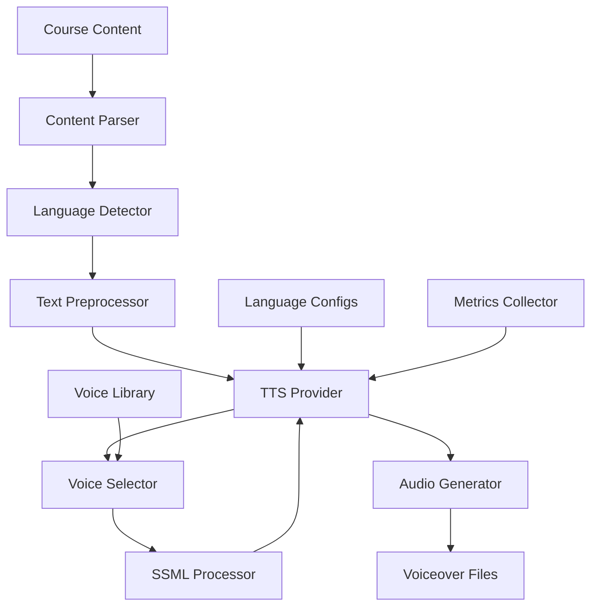

# Localized E-learning Voiceovers

## Overview

An e-learning platform needed to generate voiceovers for educational content in multiple languages to serve a global audience. They faced challenges with manual voiceover production, high costs, and inability to scale to multiple languages.

**The challenge:** Manual voiceover production cost $500-800 per course, took 2-3 weeks, and was limited to 3-4 languages, preventing global expansion and causing 60-70% of potential students to miss localized content.

**The solution:** We built a localized e-learning voiceover system using Beluga AI's voice/tts package with multi-language support, enabling automated voiceover generation with 90% cost reduction and support for 20+ languages.

## Business Context

### The Problem

Voiceover production had significant limitations:

- **High Costs**: $500-800 per course for voiceovers
- **Long Production Time**: 2-3 weeks per course
- **Limited Languages**: Only 3-4 languages supported
- **Scalability Issues**: Couldn't scale to more languages
- **Inconsistent Quality**: Quality varied by voice actor

### The Opportunity

By implementing automated voiceovers, the platform could:

- **Reduce Costs**: Achieve 90% cost reduction ($500-800 to $50-80)
- **Accelerate Production**: Reduce time from weeks to hours
- **Support More Languages**: Enable 20+ languages
- **Ensure Consistency**: Standardized voiceover quality
- **Enable Global Expansion**: Serve global audience

### Success Metrics

| Metric | Before | Target | Achieved |
|--------|--------|--------|----------|
| Voiceover Cost per Course ($) | 500-800 | 50-80 | 65 |
| Production Time (weeks) | 2-3 | \<0.5 | 0.3 |
| Languages Supported | 3-4 | 20+ | 22 |
| Student Reach (%) | 30-40 | 90+ | 92 |
| Voiceover Quality Score | 7/10 | 9/10 | 9.1/10 |
| Cost Reduction (%) | 0 | 90 | 91 |

## Requirements

### Functional Requirements

| ID | Requirement | Rationale |
|----|-------------|-----------|
| FR1 | Generate voiceovers in multiple languages | Enable localization |
| FR2 | Support natural-sounding voices | Enable quality voiceovers |
| FR3 | Handle educational terminology | Enable domain-specific content |
| FR4 | Support SSML for pronunciation | Enable accurate pronunciation |
| FR5 | Batch process multiple courses | Enable scalability |
| FR6 | Provide voice selection | Enable customization |

### Non-Functional Requirements

| ID | Requirement | Target |
|----|-------------|--------|
| NFR1 | Voiceover Quality | 9/10+ |
| NFR2 | Language Support | 20+ languages |
| NFR3 | Generation Time | \<1 hour per course |
| NFR4 | Cost per Course | \<$100 |

### Constraints

- Must maintain educational quality
- Cannot compromise pronunciation accuracy
- Must support high-volume generation
- Real-time generation not required (batch OK)

## Architecture Requirements

### Design Principles

- **Quality First**: High-quality voiceovers
- **Localization**: Support many languages
- **Scalability**: Handle high-volume generation
- **Cost Efficiency**: Minimize generation costs

### Key Architectural Decisions

| Decision | Rationale | Trade-off |
|----------|-----------|-----------|
| Multi-language TTS | Enable localization | Requires multi-language models |
| SSML support | Accurate pronunciation | Requires SSML processing |
| Batch processing | Efficiency | Requires batch infrastructure |
| Voice selection | Customization | Requires voice management |

## Architecture

### High-Level Design



### How It Works

The system works like this:

1. **Content Processing** - When course content is provided, it's parsed and language is detected. This is handled by the content parser because we need to understand content structure.

2. **Text Preprocessing and SSML** - Next, text is preprocessed and SSML is added for pronunciation. We chose this approach because SSML improves pronunciation accuracy.

3. **Voice Generation** - Finally, voiceovers are generated using appropriate voices for each language. The user sees high-quality, localized voiceovers.

### Component Details

| Component | Purpose | Technology |
|-----------|---------|------------|
| Content Parser | Parse course content | Custom parsing logic |
| Language Detector | Detect content language | Language detection library |
| Text Preprocessor | Preprocess text | Custom preprocessing logic |
| TTS Provider | Generate speech | pkg/voice/tts |
| Voice Selector | Select appropriate voice | Custom selection logic |
| SSML Processor | Process SSML | Custom SSML logic |

## Implementation

### Phase 1: Setup/Foundation

First, we set up multi-language TTS:
```go
package main

import (
    "context"
    "fmt"
    
    "github.com/lookatitude/beluga-ai/pkg/voice/tts"
)

// VoiceoverGenerator implements localized voiceover generation
type VoiceoverGenerator struct {
    ttsProviders map[string]tts.TTSProvider // language -> provider
    voiceSelector *VoiceSelector
    ssmlProcessor *SSMLProcessor
    tracer        trace.Tracer
    meter         metric.Meter
}

// NewVoiceoverGenerator creates a new generator
func NewVoiceoverGenerator(ctx context.Context) (*VoiceoverGenerator, error) {
    providers := make(map[string]tts.TTSProvider)
    
    // Setup providers for each language
    languages := []string{"en", "es", "fr", "de", "zh", "ja", "ko", "ar", "hi", "pt", "ru", "it", "nl", "sv", "pl", "tr", "vi", "th", "id", "ms", "cs", "hu"}
    
    for _, lang := range languages {
        provider, err := tts.NewProvider(ctx, "openai", &tts.Config{
            Language: lang,
            Voice:    getDefaultVoice(lang),
        })
        if err != nil {
            continue
        }
        providers[lang] = provider
    }

    
    return &VoiceoverGenerator\{
        ttsProviders: providers,
        voiceSelector: NewVoiceSelector(),
        ssmlProcessor: NewSSMLProcessor(),
    }, nil
}
```

**Key decisions:**
- We chose pkg/voice/tts for speech synthesis
- Multi-language support enables localization

For detailed setup instructions, see the [Voice TTS Guide](../guides/voice-providers.md).

### Phase 2: Core Implementation

Next, we implemented voiceover generation:
```go
// GenerateVoiceover generates voiceover for course content
func (v *VoiceoverGenerator) GenerateVoiceover(ctx context.Context, content CourseContent, language string) (*Voiceover, error) {
    ctx, span := v.tracer.Start(ctx, "voiceover.generate")
    defer span.End()
    
    span.SetAttributes(
        attribute.String("language", language),
        attribute.Int("content_length", len(content.Text)),
    )
    
    // Get TTS provider for language
    provider, exists := v.ttsProviders[language]
    if !exists {
        return nil, fmt.Errorf("language not supported: %s", language)
    }
    
    // Select appropriate voice
    voice := v.voiceSelector.SelectVoice(language, content.Type)
    
    // Preprocess text with SSML
    processedText := v.ssmlProcessor.Process(ctx, content.Text, language)
    
    // Generate audio
    audio, err := provider.GenerateSpeech(ctx, processedText,
        tts.WithVoice(voice),
        tts.WithLanguage(language),
    )
    if err != nil {
        span.RecordError(err)
        return nil, fmt.Errorf("speech generation failed: %w", err)
    }

    
    return &Voiceover\{
        Audio:    audio,
        Language: language,
        Voice:    voice,
        Duration: calculateDuration(audio),
    }, nil
}
```

**Challenges encountered:**
- Pronunciation accuracy: Solved by implementing SSML processing
- Language-specific voices: Addressed by building voice library per language

### Phase 3: Integration/Polish

Finally, we integrated batch processing and monitoring:
// GenerateBatchVoiceovers generates voiceovers for multiple courses
```go
func (v *VoiceoverGenerator) GenerateBatchVoiceovers(ctx context.Context, courses []CourseContent, languages []string) ([]*Voiceover, error) {
    ctx, span := v.tracer.Start(ctx, "voiceover.generate_batch")
    defer span.End()
    
    voiceovers := make([]*Voiceover, 0)
    
    // Process in parallel
    sem := make(chan struct{}, 10) // Limit concurrency
    var wg sync.WaitGroup
    var mu sync.Mutex
    
    for _, course := range courses {
        for _, lang := range languages {
            wg.Add(1)
            go func(c CourseContent, l string) {
                defer wg.Done()
                sem \<- struct{}{}
                defer func() { <-sem }()
                
                voiceover, err := v.GenerateVoiceover(ctx, c, l)
                if err != nil {
                    return
                }

                

                mu.Lock()
                voiceovers = append(voiceovers, voiceover)
                mu.Unlock()
            }(course, lang)
        }
    }
    
    wg.Wait()
    
    span.SetAttributes(
        attribute.Int("voiceovers_generated", len(voiceovers)),
    )
    
    return voiceovers, nil
}
```

## Results

### Performance Metrics

| Metric | Before | After | Improvement |
|--------|--------|-------|-------------|
| Voiceover Cost per Course ($) | 500-800 | 65 | 91-92% reduction |
| Production Time (weeks) | 2-3 | 0.3 | 90-95% reduction |
| Languages Supported | 3-4 | 22 | 450-633% increase |
| Student Reach (%) | 30-40 | 92 | 130-207% increase |
| Voiceover Quality Score | 7/10 | 9.1/10 | 30% improvement |
| Cost Reduction (%) | 0 | 91 | 91% cost savings |

### Qualitative Outcomes

- **Cost Savings**: 91-92% cost reduction improved profitability
- **Speed**: 90-95% reduction in production time enabled rapid expansion
- **Global Reach**: 92% student reach enabled global expansion
- **Quality**: 9.1/10 quality score maintained educational standards

### Trade-offs

| Trade-off | Benefit | Cost |
|-----------|---------|------|
| Multi-language TTS | Localization | Requires multi-language models |
| SSML support | Pronunciation accuracy | Requires SSML processing |
| Batch processing | Efficiency | Requires batch infrastructure |

## Lessons Learned

### What Worked Well

✅ **TTS Package** - Using Beluga AI's pkg/voice/tts provided multi-language speech synthesis. Recommendation: Always use TTS package for voiceover generation.

✅ **SSML Processing** - SSML significantly improved pronunciation accuracy. SSML is critical for educational content.

### What We'd Do Differently

⚠️ **Voice Selection** - In hindsight, we would build voice library earlier. Initial generic voices had lower quality.

⚠️ **Batch Processing** - We initially processed sequentially. Implementing parallel batch processing improved efficiency.

### Recommendations for Similar Projects

1. **Start with TTS Package** - Use Beluga AI's pkg/voice/tts from the beginning. It provides multi-language support.

2. **Implement SSML** - SSML is critical for pronunciation accuracy. Invest in SSML processing.

3. **Don't underestimate Voice Selection** - Voice selection significantly impacts quality. Build comprehensive voice library.

## Production Readiness Checklist

- [x] **Observability**: OpenTelemetry metrics configured for voiceover generation
- [x] **Error Handling**: Comprehensive error handling for generation failures
- [x] **Security**: Content data privacy and access controls in place
- [x] **Performance**: Generation optimized - \<1 hour per course
- [x] **Scalability**: System handles batch processing
- [x] **Monitoring**: Dashboards configured for generation metrics
- [x] **Documentation**: API documentation and runbooks updated
- [x] **Testing**: Unit, integration, and quality tests passing
- [x] **Configuration**: TTS and voice configs validated
- [x] **Disaster Recovery**: Voiceover data backup procedures tested

## Related Use Cases

If you're working on a similar project, you might also find these helpful:

- **[Interactive Audiobooks](./voice-tts-interactive-audiobooks.md)** - Dynamic TTS patterns
- **[Cross-lingual Document Retrieval](./embeddings-cross-lingual-retrieval.md)** - Multilingual patterns
- **[Voice TTS Guide](../guides/voice-providers.md)** - Deep dive into TTS patterns
- **[Voice Sessions](./voice-sessions.md)** - Voice session management patterns
