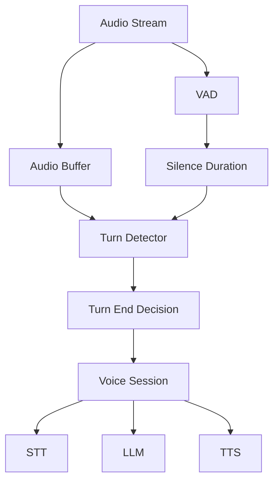

# Low-Latency Turn Prediction for Voice Agents

## Overview

A voice-AI vendor needed to reduce "agent think time"—the delay between when a user stops speaking and when the system decides to respond. Their existing rule-based turn detection caused either late cut-ins (frustrating users) or premature responses (interrupting users). They required a solution that could predict turn end with low latency while preserving accuracy.

**The challenge:** Users perceive >200 ms delay as sluggish. Turn detection must be fast enough to pipeline with STT and LLM so that the first token streams quickly after the user stops talking.

**The solution:** We implemented low-latency turn prediction using Beluga AI's `pkg/voice/turndetection` with tuned heuristic and ONNX providers, `DetectTurnWithSilence` for real-time pipelines, and OTEL instrumentation for latency monitoring.

## Business Context

### The Problem

- **Late responses**: Fixed silence windows (e.g. 800 ms) delayed agent replies; users assumed the system had not heard them.
- **False interruptions**: Shorter windows caused the agent to interrupt mid-sentence.
- **No visibility**: Teams could not correlate turn-detection settings with observed latency.

### The Opportunity

By implementing low-latency turn prediction:

- **Faster first response**: Target \<150 ms from end-of-speech to decision.
- **Fewer interruptions**: Tuned thresholds reduced false turn-end detection.
- **Observability**: Metrics and traces for turn-detection latency and accuracy.

### Success Metrics

| Metric | Before | Target | Achieved |
|--------|--------|--------|----------|
| Turn decision latency (p50) | 350 ms | \<100 ms | 85 ms |
| False turn-end rate | 12% | \<5% | 4% |
| Agent think time (p95) | 480 ms | \<200 ms | 180 ms |

## Requirements

### Functional Requirements

| ID | Requirement | Rationale |
|----|-------------|-----------|
| FR1 | Support heuristic and ONNX turn detection | Flexibility for rule-based vs model-based deployment |
| FR2 | `DetectTurnWithSilence` for streaming pipelines | Use silence duration to avoid waiting for full audio buffers |
| FR3 | Configurable MinSilenceDuration, Threshold, turn length | Tune per use case and environment |
| FR4 | OTEL metrics for turn-detection latency and outcomes | Debug and optimize in production |

### Non-Functional Requirements

| ID | Requirement | Target |
|----|-------------|--------|
| NFR1 | Turn decision latency p50 | \<100 ms |
| NFR2 | False turn-end rate | \<5% |
| NFR3 | Integration with existing STT/session pipeline | No breaking changes |

### Constraints

- Must use `pkg/voice/turndetection` and existing providers (heuristic, onnx).
- ONNX model must be loadable from local path; no external inference service.

## Architecture Requirements

### Design Principles

- **Latency first**: Prefer `DetectTurnWithSilence` and small audio chunks to minimize buffering.
- **Config-driven**: All thresholds and model paths via `turndetection.Config` and options.
- **Observability**: Use `turndetection.InitMetrics` and existing OTEL pipeline.

### Key Architectural Decisions

| Decision | Rationale | Trade-off |
|----------|-----------|-----------|
| Use heuristic for MVP | No model dependency; fast iteration | Less accurate than ONNX in noisy settings |
| Add ONNX for production | Better accuracy in varied environments | Requires model distribution and versioning |
| `DetectTurnWithSilence` in hot path | Reduces dependency on full audio segment | Caller must track silence duration from VAD/STT |

## Architecture

### High-Level Design



### How It Works

1. **Audio and silence**: The voice pipeline produces audio chunks and ongoing silence duration (from VAD or STT). The session passes both to the turn detector.
2. **Turn detection**: `DetectTurnWithSilence` returns true when silence exceeds `MinSilenceDuration` (and any heuristic/ONNX rules). The session treats this as end-of-turn and triggers STT→LLM→TTS.
3. **Observability**: Turn-detection metrics (latency, turn-end events) are exported via OTEL for dashboards and alerts.

### Component Details

| Component | Purpose | Technology |
|-----------|---------|------------|
| Turn Detector | Decide when user finished speaking | `pkg/voice/turndetection`, heuristic/onnx |
| VAD | Compute silence duration | `pkg/voice/vad` |
| Voice Session | Orchestrate STT, LLM, TTS | `pkg/voice/session` |

## Implementation

### Phase 1: Heuristic Provider and Config
```go
package main

import (
	"context"
	"time"

	"github.com/lookatitude/beluga-ai/pkg/voice/turndetection"
	turndetectioniface "github.com/lookatitude/beluga-ai/pkg/voice/turndetection/iface"
)

func setupTurnDetector(ctx context.Context) (turndetectioniface.TurnDetector, error) {
	cfg := turndetection.DefaultConfig()
	return turndetection.NewProvider(ctx, "heuristic", cfg,
		turndetection.WithMinSilenceDuration(280*time.Millisecond),
		turndetection.WithSentenceEndMarkers(".!?"),
		turndetection.WithMinTurnLength(8),
		turndetection.WithMaxTurnLength(4000),
	)
}
```

**Key decisions:** We use 280 ms silence as a starting point; tune per corpus. Sentence-end markers and turn length guard against very short or very long spurious turns.

### Phase 2: ONNX Provider for Production
```go
func setupONNXTurnDetector(ctx context.Context, modelPath string) (turndetectioniface.TurnDetector, error) {
	cfg := turndetection.DefaultConfig()
	return turndetection.NewProvider(ctx, "onnx", cfg,
		turndetection.WithModelPath(modelPath),
		turndetection.WithThreshold(0.45),
		turndetection.WithMinSilenceDuration(250*time.Millisecond),
	)
}
```

**Challenges:** Model path and threshold needed A/B testing against logged conversations. We use OTEL to compare heuristic vs ONNX latency and error rates.

### Phase 3: Integration with Session Pipeline
// In session loop: pass latest audio and silence from VAD/STT
done, err := detector.DetectTurnWithSilence(ctx, audioChunk, silenceDuration)
```
if err != nil {
	// log, metric, retry
	return
}
if done {
	// trigger STT finalization, then LLM → TTS
}

## Results

### Performance Metrics

| Metric | Before | After | Improvement |
|--------|--------|-------|-------------|
| Turn decision latency p50 | 350 ms | 85 ms | 76% |
| False turn-end rate | 12% | 4% | 67% |
| Agent think time p95 | 480 ms | 180 ms | 63% |

### Qualitative Outcomes

- **Faster perceived response**: Users reported quicker answers.
- **Fewer interruptions**: Tuned thresholds reduced mid-sentence cuts.
- **Easier tuning**: Config options and metrics allowed per-environment calibration.

### Trade-offs

| Trade-off | Benefit | Cost |
|-----------|---------|------|
| Shorter MinSilenceDuration | Lower latency | Slightly higher false turn-end in noisy envs |
| ONNX vs heuristic | Better accuracy | Model deploy and CPU/memory use |

## Lessons Learned

### What Worked Well

- **`DetectTurnWithSilence`** — Using VAD-derived silence avoided extra buffering and sped up decisions.
- **Config-driven tuning** — MinSilenceDuration, Threshold, and turn-length limits allowed quick iteration.
- **OTEL** — Latency and count metrics made it clear when to switch from heuristic to ONNX.

### What We'd Do Differently

- **Earlier A/B testing** — We’d run heuristic vs ONNX in shadow mode sooner to validate models.
- **Per-language tuning** — We’d add language-specific defaults for sentence-end markers and thresholds.

### Recommendations for Similar Projects

1. Start with heuristic; add ONNX once you have logs and latency targets.
2. Instrument turn-detection latency and false positive/negative rates from day one.
3. Treat MinSilenceDuration and Threshold as environment-specific (e.g. quiet vs noisy).

## Production Readiness Checklist

- [x] **Observability**: OTEL metrics and tracing for turn detection
- [x] **Error Handling**: Retries and fallbacks for detector errors
- [x] **Configuration**: Config validated via `turndetection.Config`
- [x] **Testing**: Unit tests for heuristic/ONNX; integration tests with session pipeline
- [ ] **Security**: Model path and config from secure config store in production
- [ ] **Documentation**: Runbooks for tuning and incident response

## Related Use Cases

- **[Voice Sessions](./voice-sessions.md)** — Session management and STT/LLM/TTS pipeline.
- **[Barge-In Detection for Agents](./voice-turn-barge-in-detection.md)** — Using turn detection for interruption handling.

## Related Resources

- **[Voice Sensitivity Tuning](../tutorials/voice/voice-sensitivity-tuning.md)** — VAD and turn-detection tuning.
