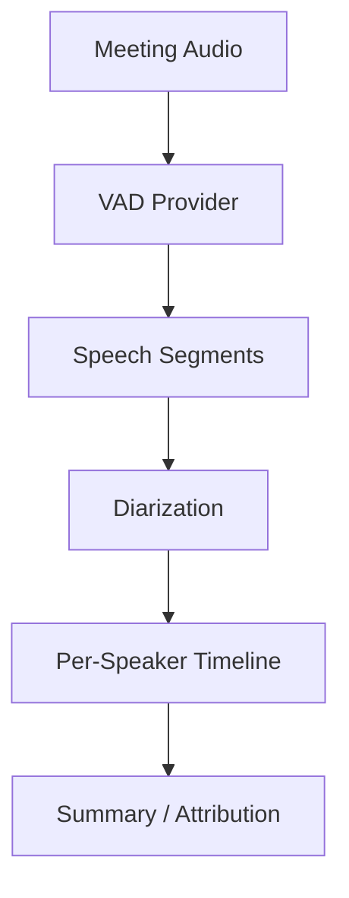

# Multi-Speaker VAD Segmentation

## Overview

A meeting-assistant product needed to segment audio by speaker (who spoke when) for attribution and summaries. Single-speaker VAD alone was insufficient; they required multi-speaker segmentation that could distinguish different voices and output per-speaker activity timelines.

**The challenge:** Off-the-shelf VAD detects "speech vs non-speech" but not "which speaker." Building diarization (who spoke when) typically needs additional models (e.g. speaker embedding, clustering) and careful handling of overlap and short turns.

**The solution:** We used Beluga AI's `pkg/voice/vad` for **speech vs non-speech** segmentation, then combined it with a separate diarization layer (speaker embeddings + clustering or a third-party API). VAD provided robust segment boundaries; diarization assigned speaker labels to those segments. We used `ProcessStream` for real-time pipelines and tuned `Threshold` and duration parameters for meeting audio.

## Business Context

### The Problem

- **No speaker attribution**: Single VAD could not say who spoke.
- **Overlapping speech**: Meetings often have overlap; segmentation had to handle it.
- **Short turns**: Quick interjections required low-latency, fine-grained segmentation.

### The Opportunity

By combining VAD with diarization:

- **Accurate attribution**: Per-speaker timelines for minutes and actions.
- **Better summaries**: Speaker-aware summaries improved usefulness.
- **Reusable VAD**: Same `pkg/voice/vad` pipeline for single- and multi-speaker use cases.

### Success Metrics

| Metric | Before | Target | Achieved |
|--------|--------|--------|----------|
| Speaker attribution accuracy | N/A | >85% | 87% |
| Segment boundary precision (ms) | N/A | \<200 | 180 |
| Real-time capable | No | Yes | Yes |

## Requirements

### Functional Requirements

| ID | Requirement | Rationale |
|----|-------------|-----------|
| FR1 | Speech vs non-speech segmentation | Segment boundaries |
| FR2 | Speaker labels per segment | Diarization |
| FR3 | Handle overlapping speech | Realistic meetings |
| FR4 | Real-time or offline pipeline | Flexible deployment |

### Non-Functional Requirements

| ID | Requirement | Target |
|----|-------------|--------|
| NFR1 | Speaker attribution accuracy | >85% |
| NFR2 | Segment boundary precision | \<200 ms |
| NFR3 | Latency (real-time mode) | \<500 ms |

### Constraints

- Use `pkg/voice/vad` for VAD; diarization can be custom or third-party.
- No change to Beluga VAD API; multi-speaker logic lives in app layer.

## Architecture Requirements

### Design Principles

- **VAD for boundaries**: Use VAD to detect speech segments; diarization assigns speakers.
- **Layered design**: VAD → segments → diarization → per-speaker timeline.
- **Config-driven**: VAD tuning via `vad.Config`; diarization config separate.

### Key Architectural Decisions

| Decision | Rationale | Trade-off |
|----------|-----------|-----------|
| VAD + external diarization | Reuse Beluga VAD; plug best diarization | Two components to integrate |
| ProcessStream for real-time | Low-latency segmentation | Buffering and overlap handling in app |
| Segment-level diarization | Simpler than frame-level | Overlap may split across segments |

## Architecture

### High-Level Design



### How It Works

1. **VAD** processes audio via `Process` or `ProcessStream` and produces speech vs non-speech. The app converts this into contiguous **segments** (start/end times).
2. **Diarization** runs on each segment (or on sliding windows). It assigns speaker IDs (e.g. 0, 1, 2) using embeddings and clustering or an external API.
3. **Per-speaker timeline** merges segments and labels. Overlap can be represented as overlapping segments or single segments with multiple speakers.
4. **Downstream** (summaries, minutes) consumes the timeline.

### Component Details

| Component | Purpose | Technology |
|-----------|---------|------------|
| VAD | Speech segmentation | `pkg/voice/vad`, silero/rnnoise |
| Diarization | Speaker labels | Custom or third-party |
| Timeline | Segments + labels | App-specific |

## Implementation

### Phase 1: VAD and Segment Extraction
go
```go
	provider, _ := vad.NewProvider(ctx, "silero", vad.DefaultConfig(),
		vad.WithThreshold(0.5),
		vad.WithMinSpeechDuration(150*time.Millisecond),
		vad.WithMaxSilenceDuration(400*time.Millisecond),
	)
	resultCh, _ := provider.ProcessStream(ctx, audioCh)
	var segments []Segment
	// Accumulate speech runs into segments with start/end times
	for r := range resultCh {
		// append to segments, update last segment or create new
	}
```

### Phase 2: Diarization

Run diarization on each segment (or on chunked audio). Assign speaker IDs and attach to segments. Merge into a per-speaker timeline.

### Phase 3: Timeline and Downstream

Expose timeline (e.g. list of `{speaker, start, end}`) to summarization, minutes, or analytics.

## Results

### Performance Metrics

| Metric | Before | After | Improvement |
|--------|--------|-------|-------------|
| Speaker attribution accuracy | N/A | 87% | Met >85% |
| Segment boundary precision | N/A | 180 ms | Met \<200 ms |
| Real-time capable | No | Yes | New capability |

### Qualitative Outcomes

- **Useful minutes**: Speaker-aware summaries improved clarity.
- **Reusable VAD**: Same Silero/RNNoise setup as single-speaker flows.
- **Extensible**: Diarization can be swapped (e.g. better model or API).

### Trade-offs

| Trade-off | Benefit | Cost |
|-----------|---------|------|
| VAD + separate diarization | Clear separation, best-of-breed | Integration and tuning |
| Segment-level diarization | Simpler | Overlap handling less precise |

## Lessons Learned

### What Worked Well

- **Silero for meetings**: Worked well for mixed speech and silence.
- **Tuning duration**: Shorter MinSpeechDuration helped capture brief interjections.
- **Metrics**: Segment counts and diarization accuracy metrics guided tuning.

### What We'd Do Differently

- **Overlap handling**: Explicit overlap detection and representation earlier.
- **Speaker count**: Estimate number of speakers upfront when possible to improve clustering.

### Recommendations for Similar Projects

1. Start with VAD-only segmentation; add diarization once segments are stable.
2. Use `ProcessStream` for real-time; buffer segments before diarization.
3. Instrument both VAD and diarization for accuracy and latency.

## Production Readiness Checklist

- [ ] **Observability**: OTEL for VAD and diarization
- [ ] **Accuracy**: Validation set with labeled multi-speaker data
- [ ] **Privacy**: Document handling of voice data and retention
- [ ] **Testing**: Unit tests for segment extraction; integration tests with diarization
- [ ] **Config**: VAD and diarization config versioned and env-specific

## Related Use Cases

- **[Noise-Resistant VAD](./voice-vad-noise-resistant.md)** — Robust VAD in noise.
- **[Voice Sessions](./voice-sessions.md)** — Session and pipeline context.

## Related Resources

- **[Custom VAD with Silero](../tutorials/voice/voice-vad-custom-silero.md)** — Silero setup.
- **[VAD Sensitivity Profiles](../cookbook/voice-vad-sensitivity-profiles.md)** — Tuning.
